# 编辑 PowerBI 应用

> 原文：<https://www.tutorialgateway.org/edit-power-bi-app/>

让我用一个实际的例子向您展示编辑 Power BI App 的分步方法。在我们开始编辑 Power BI 应用之前，让我向您展示我的 Power BI 工作区中的现有应用。为了编辑 Power BI 应用演示，我们使用了之前创建的示例工作区应用。

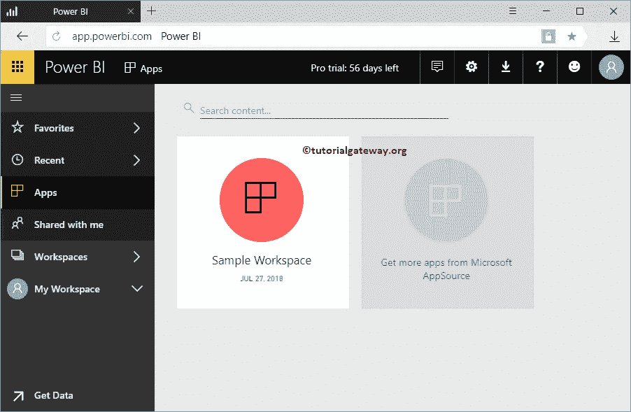

## 如何编辑 PowerBI 应用

请将鼠标悬停在您的应用上，然后单击编辑按钮。

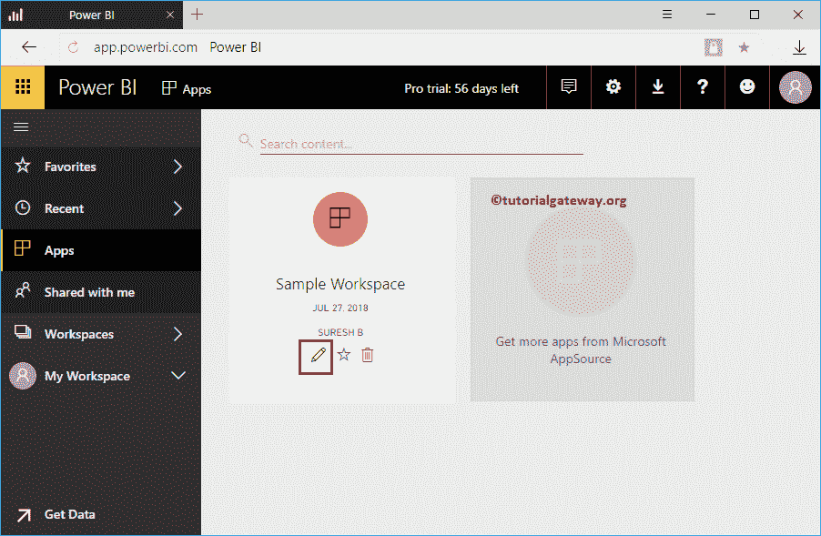

单击该按钮将打开以下窗口。单击仪表板编辑切片、报告等。建议大家参考[发布 App](https://www.tutorialgateway.org/publish-app-in-power-bi/) 文章，了解 [Power BI](https://www.tutorialgateway.org/power-bi-tutorial/) app 创作。

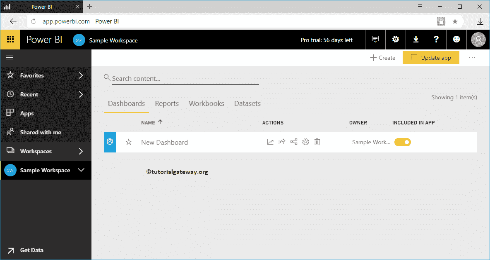

从下面的截图中，可以看到仪表盘。默认情况下，它显示网页预览。这意味着，无论您在这里做了什么更改，都适用于 web 预览。点击那个向下的小箭头，它就变成了电话预览。那么，让我来打电话预演。

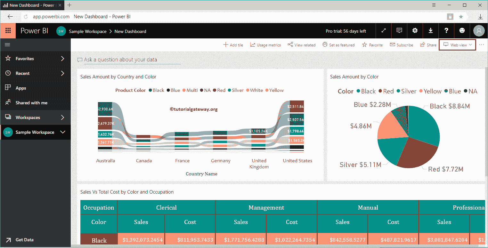

选择电话预览会弹出一个新窗口，点按“继续”。

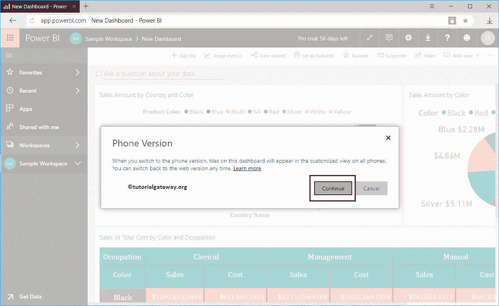

现在，您可以看到电话预览。您可以使用此窗口根据需要更改每个图块的大小和位置。

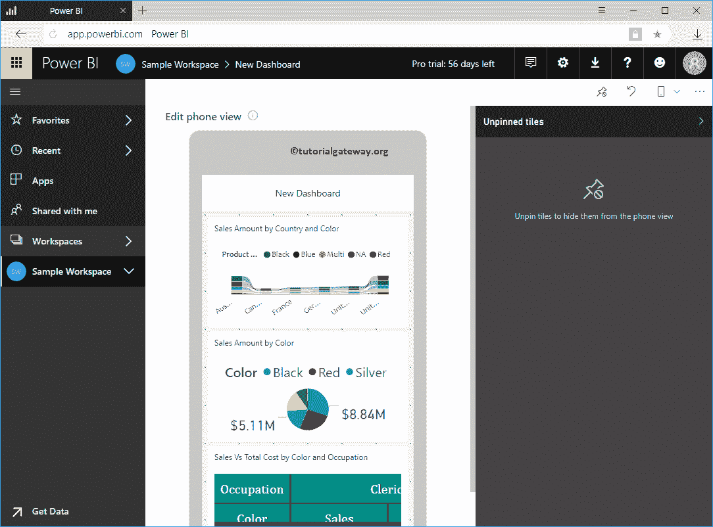

通过点按小的“隐藏切片”按钮，从仪表板中移除该切片，并将其放置在未固定的切片中。让我按下那个按钮

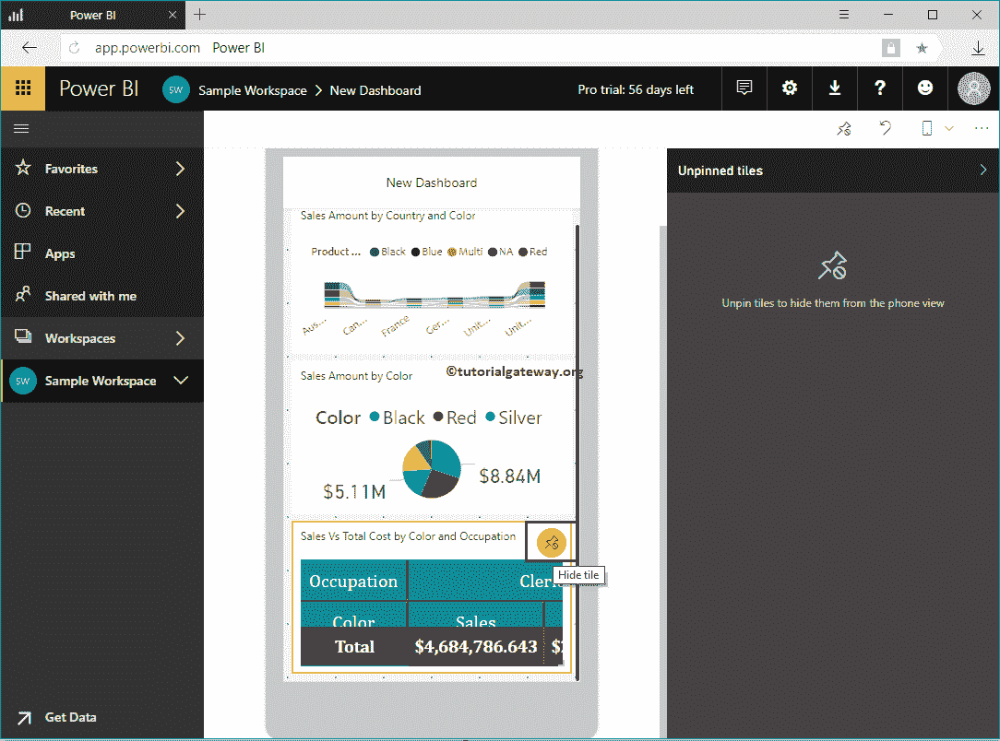

您可以看到该报告已从仪表板中删除。通过单击添加切片按钮，您可以将其放置在仪表板内。让我按下那个按钮

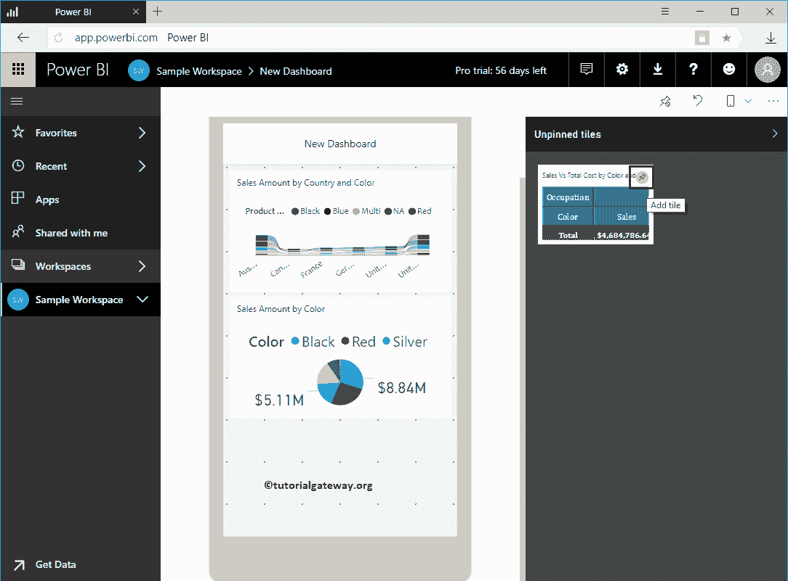

您可以看到没有未固定的图块。

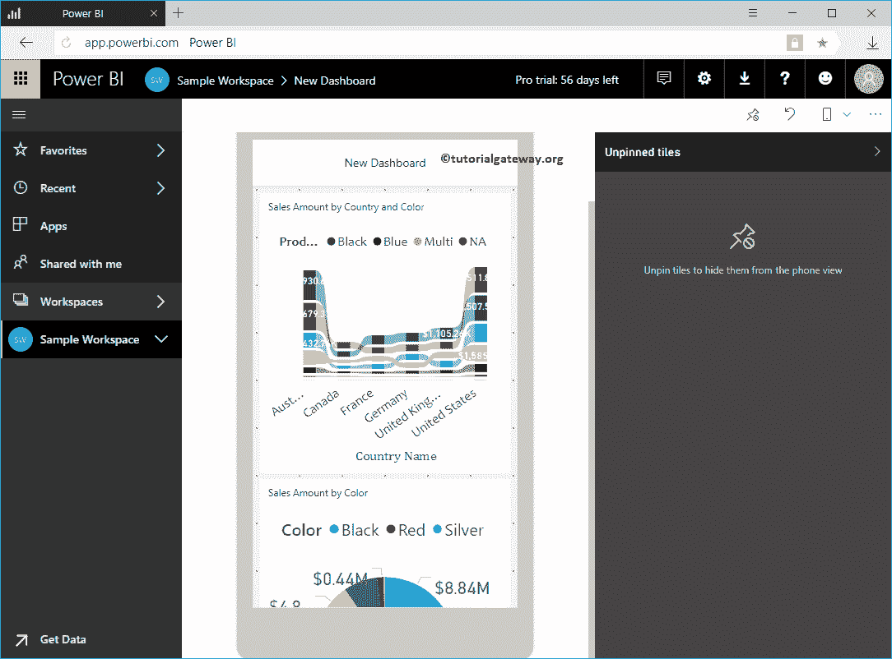

使用下面的按钮从仪表板中删除所有切片。

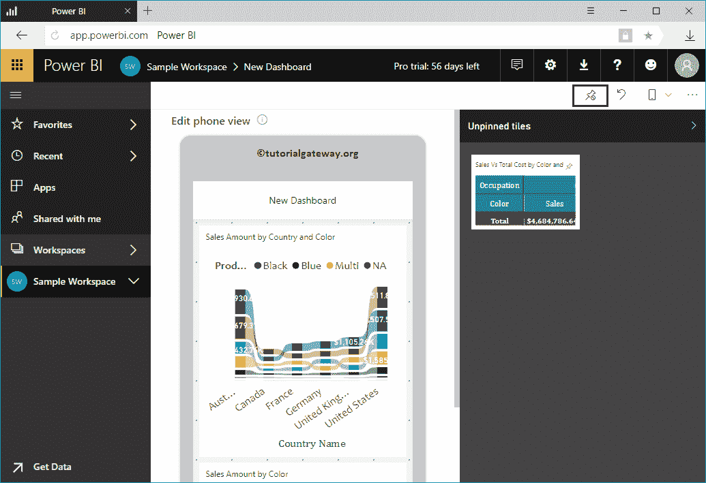

完成编辑 Power BI 应用后，单击更新应用按钮。记住，我们从电话视图中移除了[矩阵](https://www.tutorialgateway.org/create-a-matrix-in-power-bi/)。

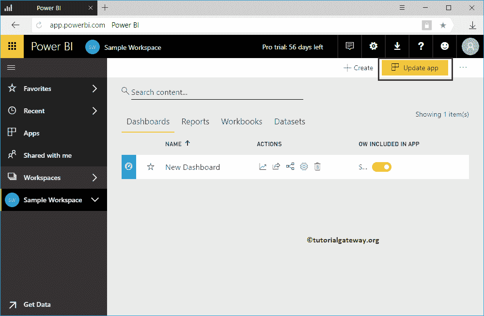

点击更新应用按钮，它会显示详细信息窗口。如果你愿意，你也可以更改这些设置，否则，点击更新应用。

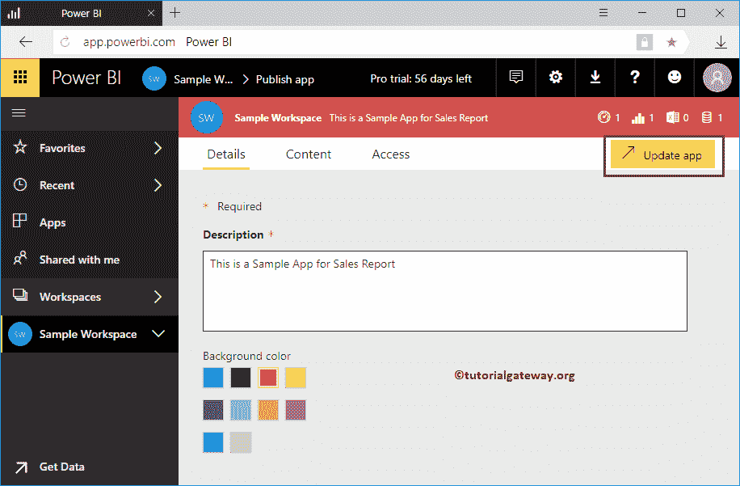

点击【更新】按钮

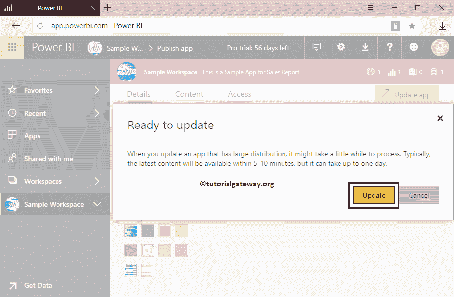

让我在 IOS

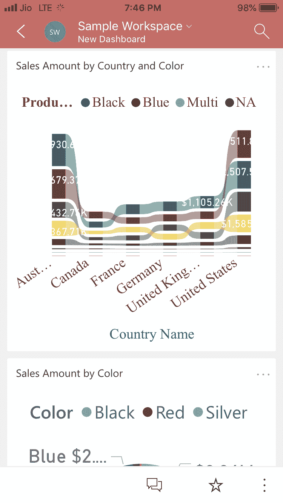

中打开 App

从下面的截图中，您可以看到电话视图中没有矩阵。

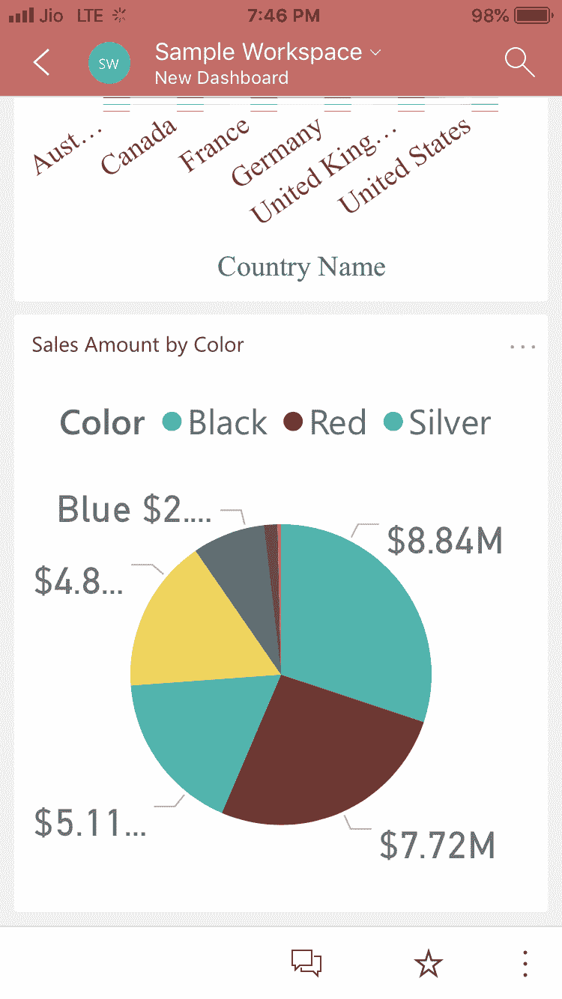