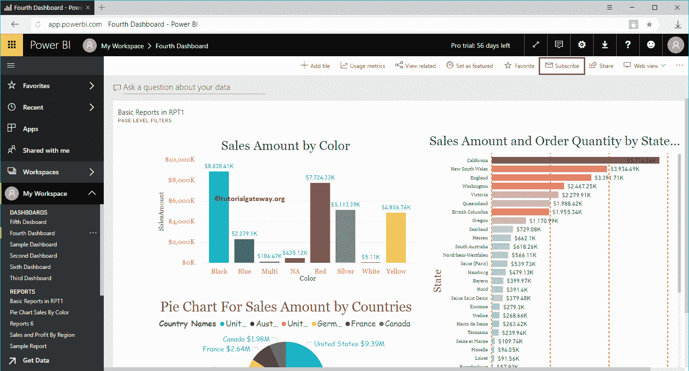

# 订阅智能商务仪表板

> 原文：<https://www.tutorialgateway.org/subscribe-power-bi-dashboard/>

在本节中，我们将通过一个实际示例向您展示订阅 Power BI 仪表板的分步方法。在我们开始 Power BI 仪表板的订阅过程之前，让我向您展示一下我的 Power BI 工作区中的现有仪表板。

要查看它们，请单击 Power BI 我的工作区，然后转到仪表板选项卡。从下面的截图可以看到，有六个仪表盘。在本订阅电源商业智能仪表板示例中，我们订阅了第四个仪表板。让我点击第四个仪表板，看看上面的视觉效果。

## 如何订阅智能仪表板

从下面的截图中，您可以看到这个仪表板上可用的视觉效果。要订阅仪表板，请单击右上角的订阅按钮。

单击订阅按钮打开订阅电子邮件窗口。

*   第一个文本框是[仪表盘](https://www.tutorialgateway.org/create-a-power-bi-dashboard/)名称
*   订阅:请提供订阅者电子邮件识别码。
*   主题:电子邮件主题
*   可选消息:您可以编写自定义消息

同时授予对此仪表板的访问权限:这允许订阅用户访问此 Power BI 仪表板。

让我添加纪梭电子邮件 id 作为订阅者。意思是[每当数据更新](https://www.tutorialgateway.org/power-bi-tutorial/)

[时，Power BI](https://www.tutorialgateway.org/power-bi-tutorial/) 会向 Kishore 发送一封电子邮件

从下面的截图可以观察到

的订阅设置

从下面的截图中可以看到，您可以在一个 Power BI 仪表板中添加多个订阅。

