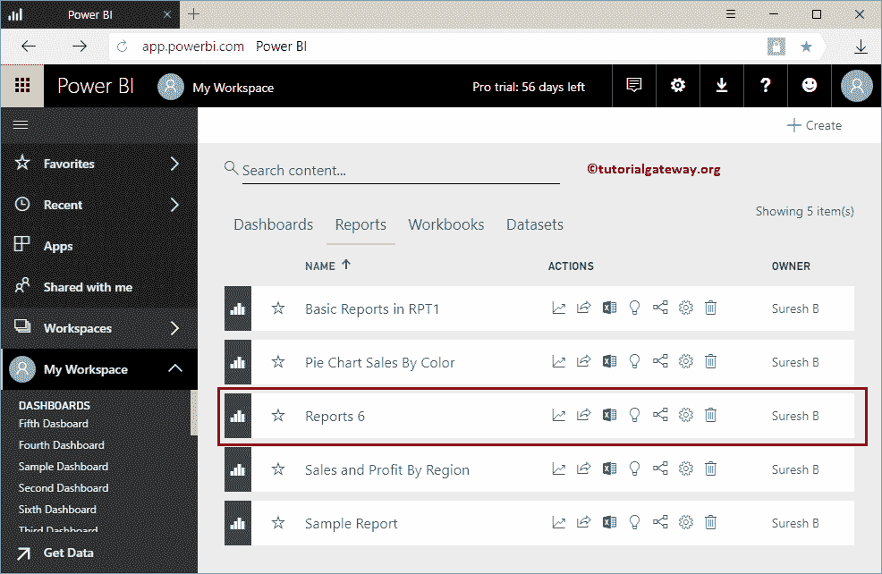
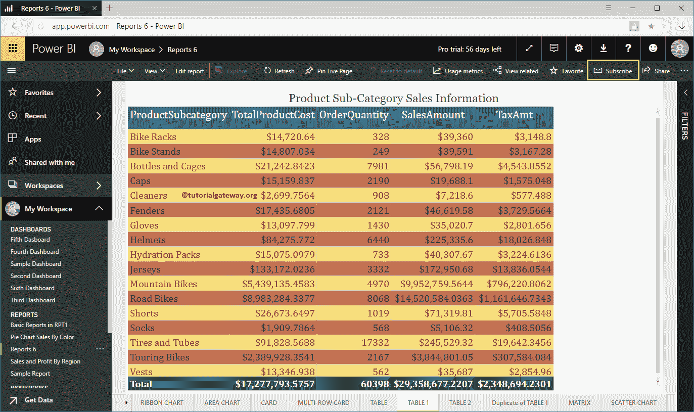
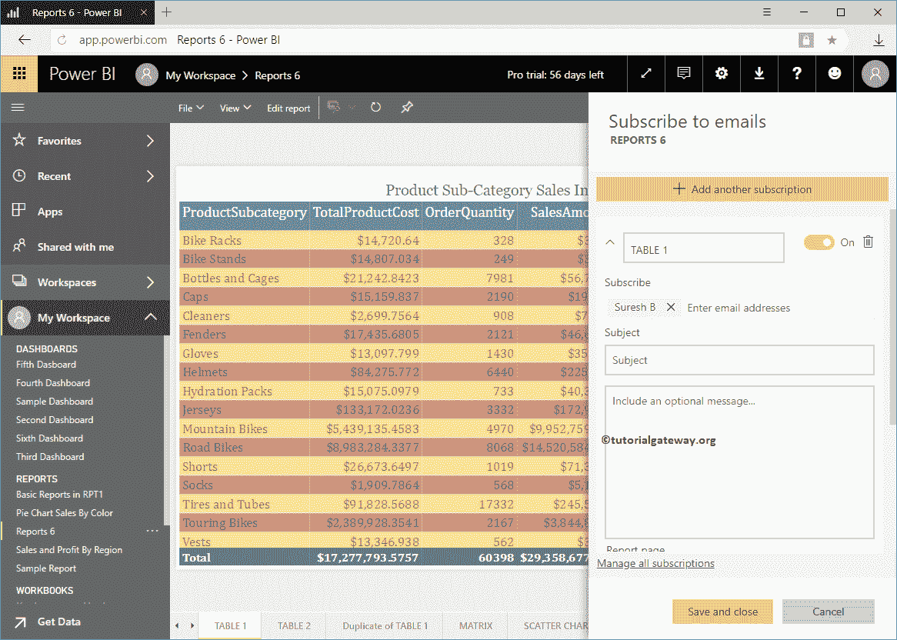
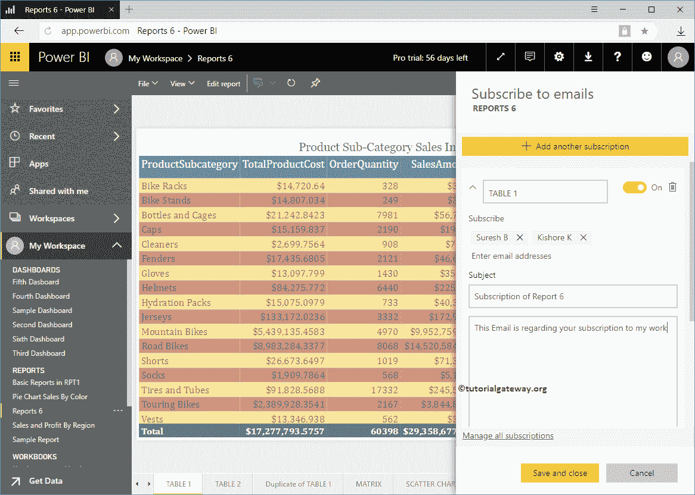
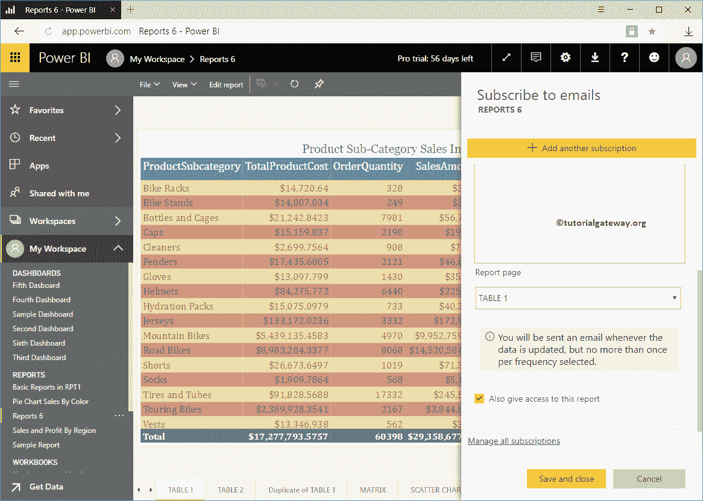
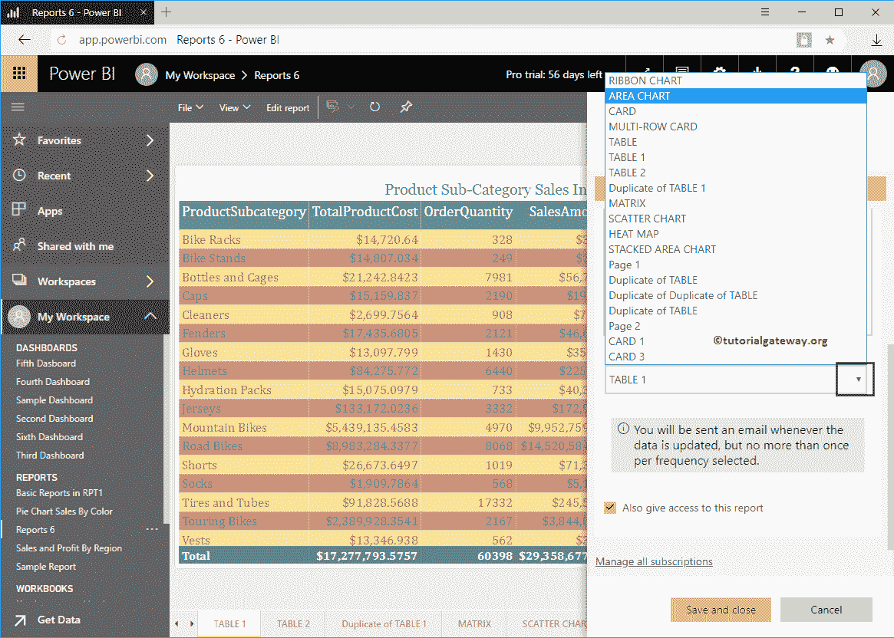
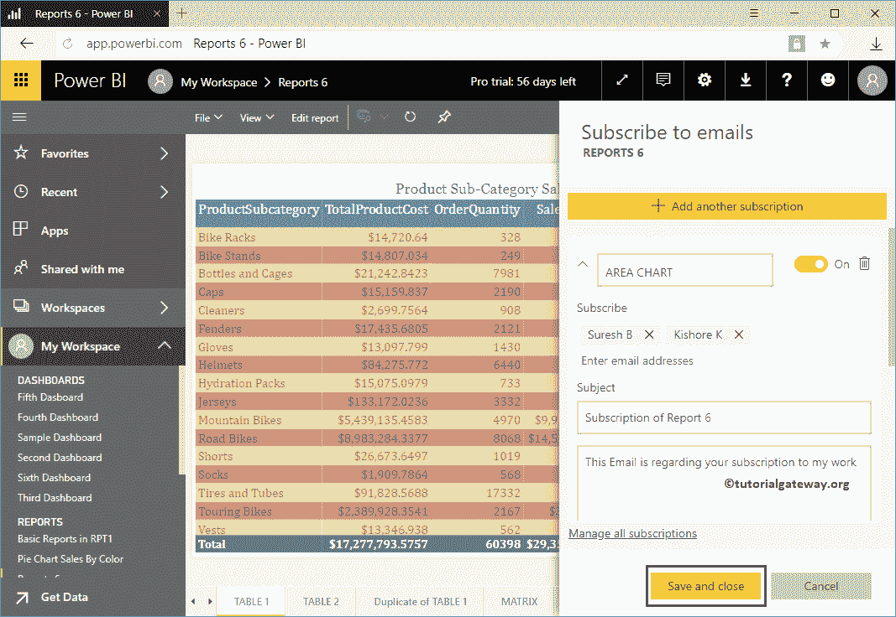
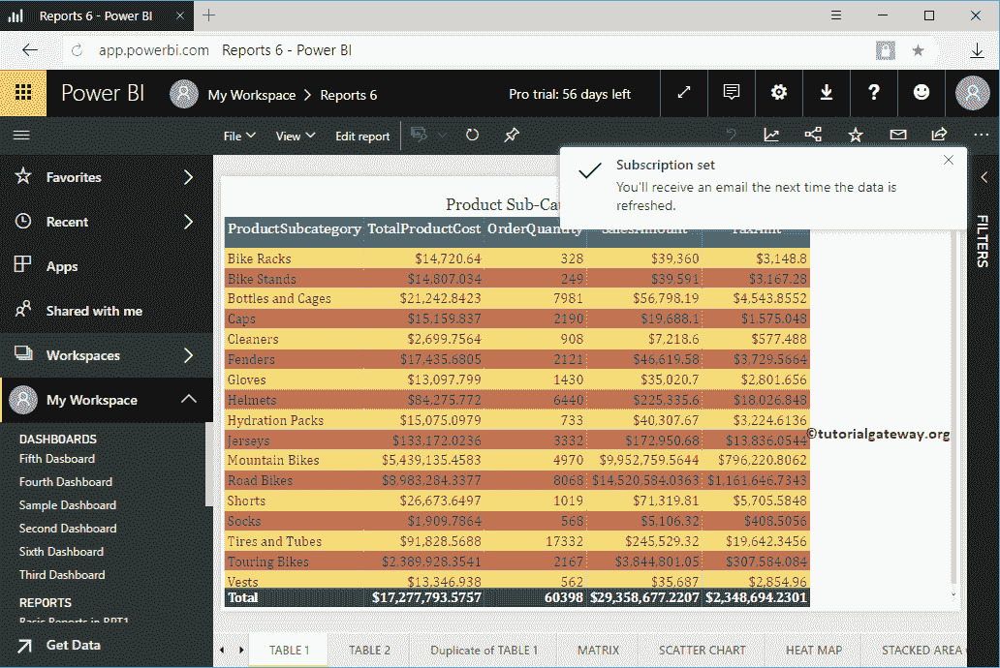

# 订阅电力商业智能报告

> 原文：<https://www.tutorialgateway.org/subscribe-power-bi-report/>

让我用一个实例向您展示订阅电力商业智能报告的过程。在我们开始 Power BI 电子邮件报告订阅流程之前，让我向您展示一下我的 Power BI 工作区中的现有报告。

要查看它们，请单击 Power BI 我的工作区，然后选择报告选项卡。从下面的截图可以看到，有五个报告。在本订阅电源商业智能报告示例中，我们订阅报告 6。让我点击报告 6 查看其中的页面。

## 如何订阅电力商业智能报告

从下面的截图可以看到，这个报告有很多页面。在本例中，我们从表 1 开始订阅。为了订阅电力商业智能报告(实际上是页面)，点击右上角的订阅按钮，如下所示。

单击“订阅”按钮将打开“高级商务智能”报告中的“订阅电子邮件”窗口。

*   第一个文本框是页面名称
*   订阅:请提供订阅者电子邮件识别码。
*   主题:电子邮件主题
*   可选消息:您可以编写自定义消息

让我添加纪梭电子邮件 id 作为页面订阅者。这意味着每当数据更新时，Power BI 都会向 Kishore 发送一封电子邮件。

同时授予对此仪表板的访问权限:这允许订阅用户访问此仪表板。

使用下拉框从该 [Power BI](https://www.tutorialgateway.org/power-bi-tutorial/) 报告中选择或更改页面。为了演示，我们选择了[区域图](https://www.tutorialgateway.org/area-chart-in-power-bi/)。

Power BI 会根据您选择的页面自动更改订阅名称。点击【保存并关闭】按钮

从下面的截图中，可以看到订阅集。希望您理解订阅力商业智能报告的概念。

