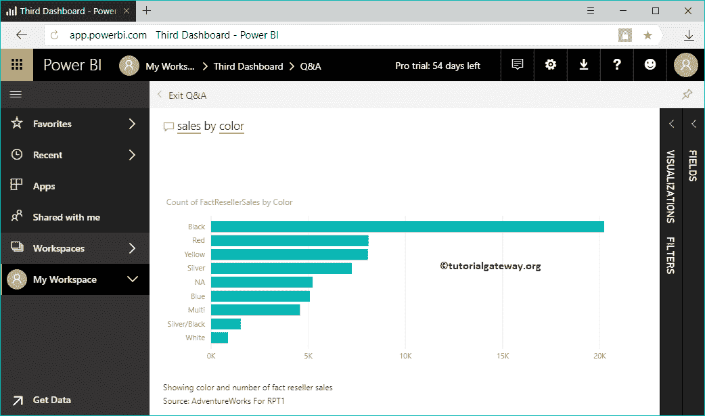

# 电力商业智能问答

> 原文：<https://www.tutorialgateway.org/power-bi-qa/>

Power BI 问答帮助您使用自然语言提出业务问题或数据分析。在这种情况下，我们用一个实际的例子向您展示了 Power BI 问答的用途。在我们开始深入问答之前，让我向您展示一下我的 Power BI 工作区中的现有仪表板。

要查看 Power BI 问答，请单击我的工作区，然后转到仪表板选项卡。从下面的截图中，可以看到有五个仪表盘。

在本例中，我们使用第三个仪表板来演示 Power BI 问答。请单击它来查看此仪表板上的报告。

## 电力商业智能问答

从下面的截图 [Power BI](https://www.tutorialgateway.org/power-bi-tutorial/) 可以看到一段文字问一个关于你数据的问题。这是我们可以用自然语言或标准语言写商业相关问题的地方。

单击该区域后，将显示以下窗口

1.  退出:使用此按钮退出此窗口。它会将你重定向到之前的[仪表盘](https://www.tutorialgateway.org/create-a-power-bi-dashboard/)。
2.  问一个关于数据的问题:你可以问任何与业务或数据相关的问题
3.  建议:这些建议基于数据显示，或者您可以预定义它们

请记住，我们从这个数据集设计了许多页面。这就是为什么它主要展示那些报告。就你而言，可能会有所不同。我的意思是它可能会显示更多的词，如城市、产品销售等。

### 电力商业智能问答示例 1

让我选择饼图

从下面的截图中，你可以看到我的报告中已经出现的[饼图](https://www.tutorialgateway.org/pie-chart-in-power-bi/)。

### 电力商业智能问答示例 2

除了预定义的场景，您还可以问自己的业务问题。请记住，智能感知足够快，可以提供建议，并显示最适合问题的视觉效果。如你所见，当我输入 S 时，它会显示所有与 S 匹配的可能性，并且还会绘制一张带有军事状态 S.

的表格

让我从事实互联网销售

中选择销售金额

我选择销售金额的那一刻，它正在显示总销售金额[卡片](https://www.tutorialgateway.org/create-a-card-in-power-bi/)。

让我按国家

询问销售情况

您可以看到按国家/地区显示销售额的条形图。

提示:您可以使用右上角的“锁定”按钮将[锁定到“仪表板”上。此外，您可以使用可视化、过滤器和字段选项卡来根据您的要求自定义此可视化。](https://www.tutorialgateway.org/pin-report-to-power-bi-dashboard/)

### 例 3

本次销售按颜色

### 电力商业智能问答示例 3

在 Power BI 问答中，通过单击带黄色下划线的术语，可以将其替换为另一个字段。让我选择销售，替换为产品总成本

现在你可以看到[条形图](https://www.tutorialgateway.org/power-bi-bar-chart/)按颜色显示产品总成本

您也可以尝试替换颜色术语。

### 电力商业智能问答示例 4

这次我们用一个常规问题。我的意思是，一个标准问题，它正在显示结果。

