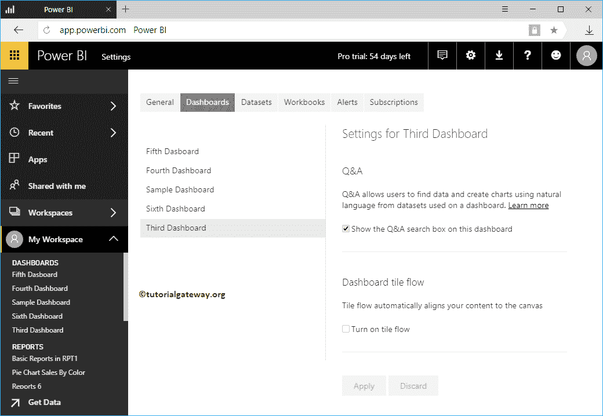

# 定制电力商业智能问答建议

> 原文：<https://www.tutorialgateway.org/customize-power-bi-qa-suggestions/>

默认情况下，Power BI 问答会对您的数据提出一些问题。但是，您可以根据自己的要求进行定制。我的意思是，你可以根据你的要求提出你自己的问题。让我用一个实际的例子向你展示如何定制 Power BI 问答建议。

提示:建议您参考 [Power BI](https://www.tutorialgateway.org/power-bi-tutorial/) 中的 [Q & A 简介](https://www.tutorialgateway.org/power-bi-qa/)一文到简介部分下。

在这个定制电源商务智能问答建议演示中，我们使用第三个仪表板。从下面的截图可以看到 Power BI

生成的问答建议列表

## 如何定制电力商务智能问答建议

在左侧导航窗格中，转到我的[工作区](https://www.tutorialgateway.org/create-power-bi-workspace/)下的第三个[仪表板](https://www.tutorialgateway.org/create-a-power-bi-dashboard/)，并单击…按钮。接下来，从上下文菜单中选择设置。

选择设置选项将打开以下窗口。

转到数据集选项卡，并选择所需的数据集。接下来，展开特色问答部分。

本节下的添加问题用于在此数据集上添加您的自定义问题。

单击添加问题链接后，它会提供一个文本框来编写您自己的问题。

出于定制电源商业智能问答建议演示的目的，我们添加了一个问题。完成后，单击应用按钮

让我再补充一个问题。

现在，当您打开第三个仪表板问答时，您可以看到我们之前添加的那两个问题。让我选择平均销售额

你可以看到，它正在展示一张[卡](https://www.tutorialgateway.org/create-a-card-in-power-bi/)，平均年销售额

