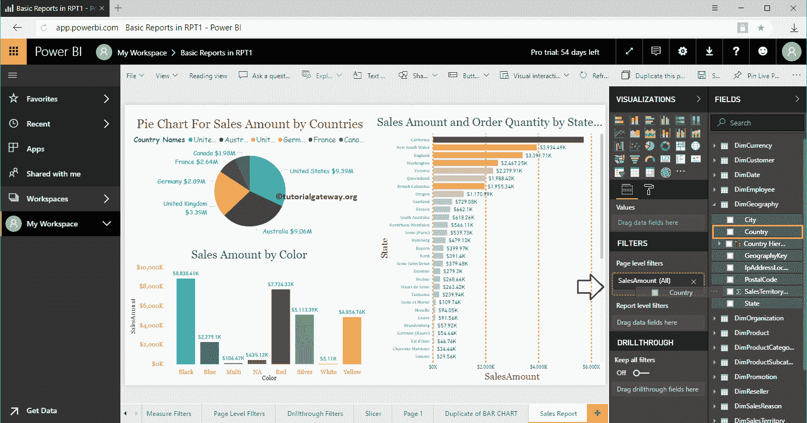

# 高级电力商业智能问答

> 原文：<https://www.tutorialgateway.org/power-bi-qa-advanced/>

在 Power BI 中，您可以使用完整的报告作为问答建议。我的意思是，你可以在问答建议列表下显示一个带有过滤器的完整报告。让我用一个实际的例子向你展示如何使用这些 Power BI 问答高级选项。在本次高级问答演示中，我们使用的是第二个仪表板。

提示:建议大家参考 [Q & A 介绍](https://www.tutorialgateway.org/power-bi-qa/)文章到介绍部分下，[定制 Q & A 建议](https://www.tutorialgateway.org/customize-power-bi-qa-suggestions/)文章添加自己的一套 [Power BI](https://www.tutorialgateway.org/power-bi-tutorial/) 问题。

## 高级电力商业智能问答

在本例中，我们使用 RPT1 中基本报告中的销售报告。建议大家参考[页面级过滤器](https://www.tutorialgateway.org/power-bi-page-level-filters/)了解本报告，[从桌面](https://www.tutorialgateway.org/publish-power-bi-desktop-reports/)发布报告了解数据集。

请转到我的工作区->报告选项卡，然后单击 RPT1 中的基本报告。单击此处将打开以下窗口。让我点击编辑报告按钮

接下来，我们将国家添加到页面级别过滤器。

我们选择了要求单一选择，然后选择美国作为默认值。

接下来，转到“页面设置”选项卡，并将您的问题添加到页面信息中。如你所见，我们增加了三个术语。意思是当我键入销售报告、收入报告或产品报告(这三个术语中的任何一个)时，它会将此报告称为

让我去第二个仪表板问答窗口。

当我键入销售报告时，它要求输入国家名称。让我选择澳大利亚。

您可以看到它显示了按澳大利亚过滤的完整报告。

让我来试试德国

