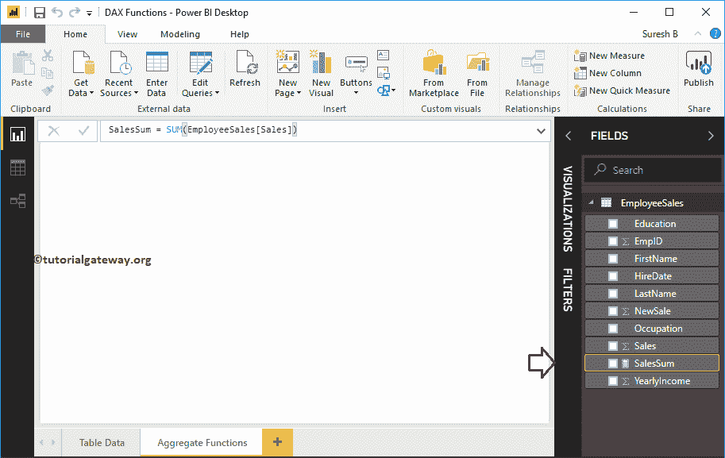
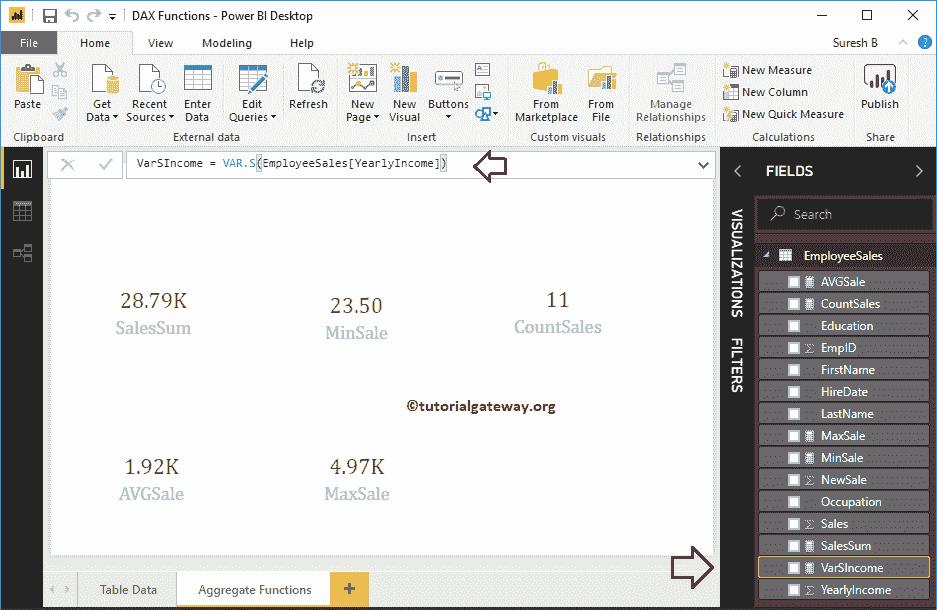

# PowerBI DAX 聚合函数

> 原文：<https://www.tutorialgateway.org/power-bi-dax-aggregate-functions/>

如何结合实例在PowerBI 中使用 DAX 聚合函数？。微软 Power BI DAX 提供了各种聚合函数，允许我们执行聚合，如计算总和、平均值、最小值、最大值等。

为了演示这些 Power BI DAX 聚合函数，我们将使用下面显示的数据。如你所见，这张表中有 15 条记录。


## PowerBI DAX 聚合函数

以下示例显示了 Power BI 中 DAX 聚合函数的列表

### PowerBI DAX 和函数

PowerBI DAX Sum 函数计算一列中记录的总和或总和。PowerBI DAX 和函数语法是

```
Measure Name = SUM(Expression or Column Name)
```

为了在 Power BI 中演示这些 DAX 聚合函数，我们必须使用 Measures。要[创建测量](https://www.tutorialgateway.org/create-calculated-measures-in-power-bi/)，请点击 [Power BI](https://www.tutorialgateway.org/power-bi-tutorial/) 主页选项卡或建模选项卡下的新测量选项。


我们将默认度量名称重命名为“销售额总和”。从下面的截图中可以看到，当我在打字时，Power BI IntelliSense 正在显示建议。

让我选择


的 Power BI DAX SUM 功能

出于 Power BI DAX 聚合函数演示的目的，我们将计算此表中


的销售额总和

通过单击回车键或任意键，将创建一个名为 SalesSum 的新度量。最后的代码是

```
SalesSum = SUM(EmployeeSales[Sales])
```



让我使用此度量创建一张卡片。请参考[创建卡片](https://www.tutorialgateway.org/create-a-card-in-power-bi/)和[格式化卡片](https://www.tutorialgateway.org/format-power-bi-card/)文章，了解创建和格式化卡片的步骤。


### PowerBI DAX 平均函数

PowerBI DAX 平均值函数用于计算一列中记录的平均值。PowerBI DAX 平均函数语法为

```
Measure Name = AVERAGE(Expression or Column Name)
```

从下面的截图中可以看到，我们创建了一个度量(名为 AVGSale)来计算 Sales 列的平均值。守则是

```
AVGSale = AVERAGE(EmployeeSales[Sales])
```


接下来，让我使用此平均度量创建一张卡片。

### 功率双指数最小函数

PowerBI DAX 最小值函数在一列中找到最小值。PowerBI DAX 最小函数的语法是

```
Measure Name = MIN(Expression or Column Name)
```

从下面的截图中可以看到，我们创建了一个度量(名为 MinSale)来查找“销售额”列中的最低销售额。守则是

```
MinSale = MIN(EmployeeSales[Sales])
```


接下来，让我使用这个最小度量创建一个卡片。

### PowerBI 最大功能

PowerBI DAX MAX 函数在一列中查找最大值。PowerBI DAX MAX 函数的语法是

```
Measure Name = MAX(Expression or Column Name)
```

这里，我们创建了一个度量(名为 MaxSale)来查找“销售额”列中的最大销售额。守则是

```
MaxSale = MAX(EmployeeSales[Sales])
```


### PowerBI 数据交换计数功能

Power BI DAX COUNT 函数计算一列中的记录数。PowerBI DAX 计数函数的语法是

```
Measure Name = COUNT(Expression or Column Name)
```

在这里，我们创建了一个度量(名为 CountSale)来计算“新销售额”列中的记录数。守则是

```
CountSales = COUNT(EmployeeSales[NewSale])
```


### 动力 BI DAX VAR。轴功能

DAX 风险值。s 函数查找完整记录的统计方差。电力商业指数。函数语法是

```
Measure Name = VAR.S(Expression or Column Name)
```

这里，我们创建了一个度量(名为 VarSIncome)来查找年收入列的统计方差。守则是

```
VarSIncome = VAR.S(EmployeeSales[YearlyIncome])
```



### 动力 BI DAX VAR。函数

电力商业指数。p 函数求所选记录或某些记录的统计方差。PowerBI 数据交换风险值的语法。功能是

```
Measure Name = VAR.P(Expression or Column Name)
```

在这里，我们创建了一个度量(名称为 VarSIncome)来查找年收入列的统计 P 方差。守则是

```
VarPIncome = VAR.P(EmployeeSales[YearlyIncome])
```


### 动力 BI DAX STDEV。函数

DAX STDEV。p 函数查找所选记录的标准偏差。Power BI DAX STDEV 的语法。功能是

```
Measure Name = STDEV.P(Expression or Column Name)
```

在这里，我们创建了一个度量(名为标准偏差)来查找年收入列的标准偏差。守则是

```
StdevPIncome = STDEV.P(EmployeeSales[YearlyIncome])
```


### 动力 BI DAX STDEV。轴功能

DAX STDEV。s 函数查找完整记录的标准偏差。Power BI DAX STDEV 的语法。功能是

```
Measure Name = STDEV.S(Expression or Column Name)
```

在这里，我们创建了度量(命名为标准偏差)来查找年收入列的标准偏差。守则是

```
StdevSIncome = STDEV.S(EmployeeSales[YearlyIncome])
```


让我为标准设备测量


创建一张新卡

### PowerBI DAX 最大功能示例 2

Power BI DAX MAX 函数也接受两个参数。您可以使用此函数来查找这两者之间的最大值。Power BI DAX MAX 函数语法为:

```
Measure Name = MAX(Expression1, Expression2)
```

在这里，我们创建了一个新的列(名为 MaxValue)来查找销售额和平均销售额之间的最大值。建议大家参考[创建栏目](https://www.tutorialgateway.org/create-calculated-columns-in-power-bi/)一文，了解创建栏目涉及的步骤。


### PowerBI DAX 最小函数示例 2

PowerBI DAX MIN 函数接受两个参数。使用此 PowerBI MIN 函数来查找两个数字之间的最小值。语法是:

```
Measure Name = MIN(Expression1, Expression2)
```

在这里，我们创建了一个新的列(名为 MinValue)来查找销售额和平均销售额之间的最小值。


让我将这两个最大值和最小值列添加到该表中。

