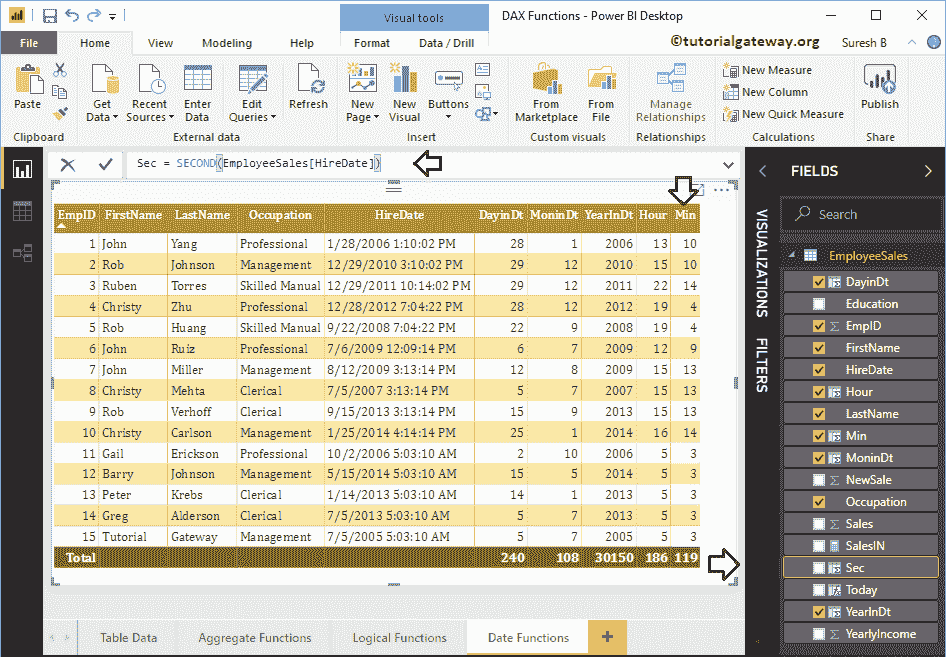
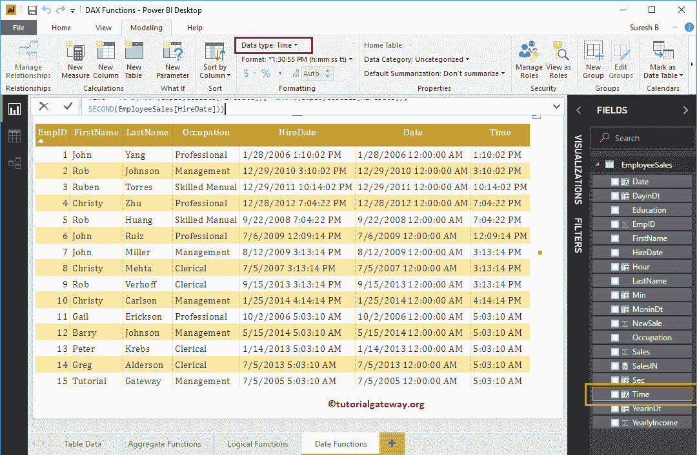

# PowerBI 数据功能

> 原文：<https://www.tutorialgateway.org/power-bi-dax-date-functions/>

如何结合实例使用 Power BI DAX 数据函数？。Microsoft Power BI DAX 提供了各种日期函数，如年、月、日、日历、日期、时间、datediff、now、today、utcnow、utctoday、datevalue、timevalue 等。

为了演示这些 Power BI DAX 日期函数，我们使用下面显示的数据。如你所见，这张表中有 15 条记录。


## PowerBI 数据功能

以下一系列示例显示了 Power BI 中 DAX 日期函数的列表

### 立即启用商业智能 DAX 功能

Power BI DAX Now 功能是 Power BI 日期功能之一，用于返回当前日期和时间。这款 Power BI DAX NOW 的语法是

```
NOW()
```

为了演示 [Power BI](https://www.tutorialgateway.org/power-bi-tutorial/) DAX NOW 函数，我们必须使用计算列。为了[创建一个列](https://www.tutorialgateway.org/create-calculated-columns-in-power-bi/)，请点击主页选项卡或建模选项卡下的新建列选项。


我们将默认列名重命名为“今天”。从下面的截图中可以看到，当我在打字的时候，Power BI 正在显示建议。


通过单击回车键或任意键，将创建一个新列。


让我将此列添加到我们之前创建的表中。请参考[创建表报告](https://www.tutorialgateway.org/create-a-table-in-power-bi/)一文，了解创建表


所涉及的步骤

从上面的截图可以看到，它显示了今天的日期和时间。

### PowerBI 每日功能

Power BI DAX DAY 函数从给定日期提取或返回日期。PowerBI 每日功能语法为

```
DAY(Date)
```

让我创建一个列，从“雇用日期”列返回日期

```
DayinDate = DAY(EmployeeSales[HireDate])
```


### PowerBI 月功能

Power BI DAX 月函数返回给定日期的月数。Power BI DAX 月函数语法为

```
MONTH(Date)
```

让我创建一个从雇用日期列返回月数的列

```
MonthinDate = MONTH(EmployeeSales[HireDate])
```

这里，我们将前一个函数(日函数)的结果添加到表中。


### PowerBI 年度功能

Power BI DAX YEAR 函数从给定日期提取或返回年数。这一“PowerBI 大年”的语法是:

```
YEAR(Date)
```

让我创建一个列来返回“从雇用日期算起的年份”列

```
YearInDt = YEAR(EmployeeSales[HireDate])
```


### 动力 BI DAX 小时功能

Power BI DAX HOUR 函数返回给定日期的小时数(24 小时格式)。Power BI DAX 小时函数语法为:

```
HOUR(DateTime)
```

让我创建一个列来返回“从雇佣开始的小时数”日期列

```
Hour = HOUR(EmployeeSales[HireDate])
```


### 动力 BI DAX 分钟功能

Power BI DAX MINUTE 函数返回分钟数。该 Power BI DAX MINUTE 的语法是:

```
MINUTE(DateTime)
```

让我创建一个列，从雇用日期列返回分钟数

```
Min = MINUTE(EmployeeSales[HireDate])
```


### 第二功能

Power BI DAX SECOND 函数返回秒数。这个 Power BI DAX SECOND 的语法是:

```
SECOND(DateTime)
```

让我创建一个列，从雇用日期列返回秒数

```
Sec = SECOND(EmployeeSales[HireDate])
```



让我将年、月、日、小时、分钟和秒的函数结果添加到表中。


### 今日功能

Power BI DAX Today 函数使用默认系统时间返回今天的日期。今天这款 Power BI DAX 的语法是:

```
TODAY()
```

让我创建一个列来显示今天的日期

```
Today 2 = TODAY()
```


让我比较一下 NOW()和 TODAY()。

从下面的截图中，可以看出他们两个是有时间差的。


### PowerBI 数据交换功能

Power BI DAX 日期功能可用于返回年、月和日的日期。Power BI DAX 日期函数语法为:

```
DATE(year, month, day)
```

让我创建一个单独的列来创建年、月和日的日期

```
Date = DATE(YEAR(EmployeeSales[HireDate]), MONTH(EmployeeSales[HireDate]),                  
          DAY(EmployeeSales[HireDate]))
```


### 功率双 DAX 时间函数

Power BI DAX 时间函数从指定的小时、分钟和秒返回时间。该 Power BI DAX 时间函数的语法为:

```
TIME(hour, minute, second)
```

让我创建一个列来创建小时、分钟和秒的时间

```
Time = TIME(HOUR(EmployeeSales[HireDate]), MINUTE(EmployeeSales[HireDate]),                           
             SECOND(EmployeeSales[HireDate]))
```


让我将 Power BI DAX 时间函数结果添加到表报告中。如果您发现输出是带有时间的默认日期，则将数据类型从日期/时间更改为时间。



### Power BI DAX 工作日函数

Power BI DAX Weekday 函数返回 1 到 7 之间的数字，其中 1 表示周日，7 表示周一。Power BI DAX Weekday 函数语法为:

```
WEEKDAY(Date, Number)
```

*   如果数字= 1，则从周日开始为 1
*   如果数字= 2，则从周一开始为 1
*   从周一开始，数字= 3 然后是 0

让我创建一个列来查找工作日号码

```
WeekDay = WEEKDAY(EmployeeSales[HireDate], 1)
```


你可以看到周数


### PowerBI DAX 周数功能

Power BI DAX WeekNum 函数返回周数(1 月第一周为 1)。这个 Power BI DAX Weeknum 函数的语法是:

```
WEEKNUM(Date, Number)
```

如果数字= 1，一周从周日开始，如果数字= 2，那么一周从周一开始。让我创建一个列来查找周数

```
WeekNum = WEEKNUM(EmployeeSales[HireDate], 1)
```


### 动力 BI DAX UTCNOW 功能

DAX UTCNOW 功能与 Power BI DAX NOW 功能相同。但是，它会返回日期和时间以及世界协调时。这个 Power BI DAX UTCNOW 函数的语法是:

```
UTCNOW()
```

让我创建一列来查找日期和时间以及世界协调时

```
UTCNow = UTCNOW()
```


### PowerBI DAX 世界协调时功能

Power BI DAX UTCTODAY 函数与 ODAY 函数相同。但是，它返回带有默认时间和世界协调时的日期。该 Power BI DAX UTCTODAY 的语法为:

```
UTCTODAY()
```

让我创建一个列来查找世界协调时的日期

```
UTCToday = UTCTODAY()
```


### 幂 BI DAX YEARFRAC 函数

Power BI DAX YEARFRAC 函数返回开始日期和结束日期之间的分数差。Power BI DAX YEARFRAC 的语法是:

```
YEARFRAC(Start_Date, End_Date)
```

让我找出雇佣日期和今天之间的确切年数差异

```
YearFrac = YEARFRAC(EmployeeSales[HireDate], NOW())
```


### 幂指数 EDATE 函数

幂 BI DAX EDATE 函数返回以前的日期或将来的日期。例如，策略到期日期通过添加 24 作为第二个参数，等等。这个 Power BI DAX EDATE 函数的语法是:

```
EDATE(Start_Date, Months)
```

让我添加 2 个月的雇佣日期

```
Edate = EDATE(EmployeeSales[HireDate], 2)
```


### 幂 BI DAX EOMONTH 函数

Power BI DAX EOMONTH 功能(EOMONTH 表示月末)显示一个月的最后一天。您可以使用第二个参数返回以前的日期或将来的日期。这个 Power BI DAX EDATE 的语法是:

```
EOMONTH(Start_Date, Months)
```

让我添加 3 个月的雇佣日期。下面的语句首先将三个月添加到雇佣日期，然后返回该月的最后一天。

```
Eomonth = EOMONTH(EmployeeSales[HireDate], 3)
```


### PowerBI 数据交换功能

Power BI DAX DATEDIFF 函数返回开始日期和结束日期之间的日期差。可以使用 Power BI DAX DATEDIFF 函数的第三个参数来选择差值。

Power BI DAX DATEDIFF 函数接受年、月、日、秒、分、小时、季度、周。例如，如果选择 MONTH，则 DateDiff 函数返回开始日期和结束日期之间的月差数。

这个 Power BI DAX DATEDIFF 函数的语法是:

```
DATEDIFF(Start_Date, End_Date, Difference_Value)
```

让我以年为单位检查“雇用日期”和“今天”之间的差异。

```
DateDiff = DATEDIFF(EmployeeSales[HireDate], NOW(), YEAR)
```


### 幂 BI DAX 日期值函数

DAX DATEVALUE 函数返回带有系统时间的日期。该 Power BI DAX 日期值的语法为:

```
DATEVALUE(Date)
```

让我从雇佣日期返回日期。

```
DtValue = DATEVALUE(EmployeeSales[HireDate])
```


### PowerBI DAX 时间值函数

Power BI DAX 定时器值函数返回系统默认日期的时间。Power BI DAX 时间值函数语法为:

```
TIMEVALUE(Date)
```

让我返回雇佣日期的时间值。请记住，1899 年 12 月 30 日是迄今为止生成的默认 Power BI。

```
TimeVal = TIMEVALUE(EmployeeSales[HireDate])
```


### PowerBI 日历功能

Power BI DAX CALENDAR 函数返回从开始日期到结束日期的日期表。Power BI DAX CALENDAR 函数的语法是:

```
CALENDAR(Start_Date, End_Date)
```

下面的 Power BI DAX CALENDAR 函数返回 2018 年 1 月 1 日至 2018 年 1 月 15 日的日期。建议大家参考[创建计算表](https://www.tutorialgateway.org/create-calculated-tables-in-power-bi/)一文，了解创建新表的过程。

```
Calender = CALENDAR(DATE(2018,1, 1), DATE(2018, 1, 15))
```


让我使用这个输出


创建一个表

### 动力 BI DAX 日历自动功能

DAX CALENDARAUTO 函数，使用数据模型日期返回连续日期。Power BI DAX CALENDARAUTO 的语法是:

```
CALENDARAUTO(year_end_month)
```

参数值是此 Power BI DAX CALENDARAUTO 函数的一个选项。它接受从 1 到 12 个月的数字，如果省略，它会将该值视为 12(默认值)

```
CalenderAutotable = CALENDARAUTO()
```


可以看到这个 Power BI 日期功能


的输出