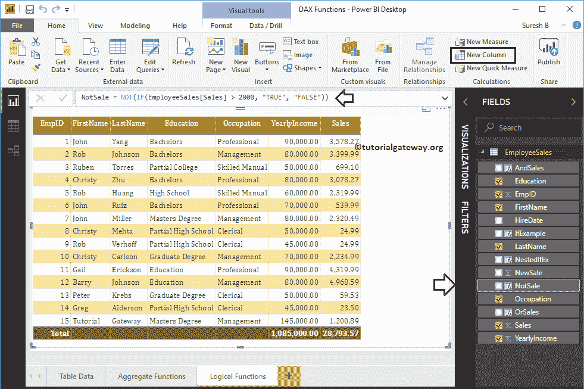
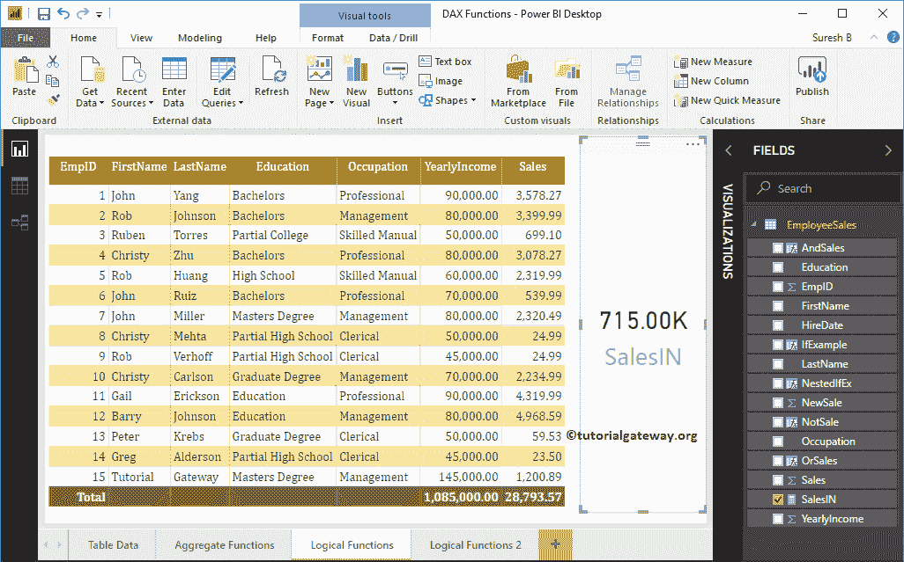

# PowerBI 逻辑功能

> 原文：<https://www.tutorialgateway.org/power-bi-dax-logical-functions/>

如何结合实例使用 Power BI DAX 逻辑函数？。微软 Power BI DAX 提供各种逻辑功能，如 IF 语句、AND、OR、NOT、IN、TRUE、FALSE、IFERROR、SWITCH 等。

为了演示这些 Power BI DAX 逻辑功能，我们使用下面显示的数据。如你所见，这张表中有 15 条记录。


## PowerBI 逻辑功能

以下一系列示例显示了 [Power BI](https://www.tutorialgateway.org/power-bi-tutorial/) 中 DAX 逻辑函数的列表。

### 功率双向放大中频功能

幂 BI DAX If 函数检查给定表达式是真还是假。幂 BI DAX If 函数的语法是

```
IF(Expression, True_Info, False_Info)
```

从上面的语法可以看出，这个 Power BI DAX IF 函数接受三个参数:第一个参数是布尔表达式(返回 true 或 false)。如果表达式结果为真，则第二个参数返回；否则，第三个参数将返回。

为了在 Power BI 中演示这些 DAX 逻辑函数，我们必须使用 computed。要[创建一个列](https://www.tutorialgateway.org/create-calculated-columns-in-power-bi/)，请点击主页选项卡或建模选项卡下的新建列选项。


我们将默认列名重命名为 IfExample。从下面的截图中可以看到，当我在打字的时候，Power BI IntelliSense 正在显示建议。

对于 Power BI DAX 逻辑功能演示目的，我们使用销售栏。


通过单击回车键或任意键，将创建一个新列。最后的代码是

```
IfExample = IF(EmployeeSales[Sales] > 3000, "Good", "Bad")
```

以上 Power BI DAX IF 函数检查每一列的销售金额是否大于 3000。如果为真，则该列返回“好”；否则，它返回“坏”。


让我将此列添加到我们之前创建的表中。请参考[创建表报告](https://www.tutorialgateway.org/create-a-table-in-power-bi/)一文，了解创建表


所涉及的步骤

### 幂 BI DAX 嵌套中频函数

在 Power BI 中，可以使用 DAX 嵌套 If 概念。我的意思是，一个 If 语句在另一个里面。下面的 Power BI DAX 嵌套 IF 函数检查每列的销售额是否小于 1000。如果为真，则该列返回非常差，否则，它进入嵌套 If

```
NestedIfEx = IF(EmployeeSales[Sales] < 1000, "Very Bad",                                           
                 IF(EmployeeSales[Sales] > 3000, "Good", "Average" ))
```


让我将这个嵌套列添加到这个表中。


### PowerBI DAX 和功能

幂 BI DAX AND 函数检查多个表达式。幂 BI DAX AND 函数的语法是

```
AND(Condition 1, Condition 2)
```

从上面的语法可以看出，Power BI DAX AND 函数接受两个参数:如果两个条件都为真，那么它返回真。否则，它返回 False。

让我创建一个列来检查每个列的销售额是否大于平均值，年收入是否大于 7 万。如果这两个条件都为真，则该列返回“良好作业”。否则，它会将坏作业返回到一个列中

```
AndSales = IF(AND(EmployeeSales[Sales] > AVERAGE(EmployeeSales[Sales]),                              
               EmployeeSales[YearlyIncome] >= 70000), "Good Job", "Bad Job")
```


### PowerBI 或功能

Power BI DAX OR 函数在英语中类似于非此即彼的 OR 语句，对于检查多个表达式非常有用。幂 BI DAX 或函数语法为

```
OR(Condition 1, Condition 2)
```

从上面的 Power BI DAX OR 函数语法可以看出:如果两个条件都为 False，那么返回 False；否则，它返回真。

让我创建一个列来检查销售额是小于平均值，还是年收入大于等于 90000。如果这两个条件都为假，那么函数返回做好事；否则，它会将监视列表返回到列中

```
OrSales = IF(OR(EmployeeSales[Sales] < AVERAGE(EmployeeSales[Sales]),                              
               EmployeeSales[YearlyIncome] >= 90000), "Watchlist", "Doing Good")
```


让我将“与函数”和“或函数”列添加到下表中。


### 电源双向 DAX 不工作

幂 BI DAX NOT 函数将真转换为假，将假转换为真。我的意思是，它返回相反的结果。幂 BI DAX 非函数的语法是

```
NOT(Condition)
```

如果销售额大于 2000，下面的语句返回 False 否则，它返回真。

```
NotSale = NOT(IF(EmployeeSales[Sales] > 2000, "TRUE", "FALSE")
```



让我把这个非功能栏添加到这个表


### 功能中的功率双向放大器

幂 BI DAX IN 函数将计算限制在指定的列。例如，您可以计算临时员工的销售额总和。Power BI DAX IN 函数的语法如下所示:

```
Column IN {field1, field2,...,fieldN}
```

以下语句计算学历为教育、学士或硕士学位的员工的销售额总和。记住，这是一个衡量标准

```
SalesIN =  CALCULATE(SUM(EmployeeSales[YearlyIncome]) , 
        'EmployeeSales'[Education] IN {"Education", "Bachelors", "Masters Degree"})
```


让我使用此度量创建一张卡片。请参考[创建卡片](https://www.tutorialgateway.org/create-a-card-in-power-bi/)和[格式化卡片](https://www.tutorialgateway.org/format-power-bi-card/)文章，了解创建和格式化卡片的步骤。



### 动力 BI DAX 真功能

幂 BI DAX 真函数返回逻辑真。如果销售额大于平均销售额，以下语句返回真；否则，它返回假

```
TRUESale = IF(EmployeeSales[Sales] > AVERAGE(EmployeeSales[Sales]), TRUE(), FALSE() )
```


### 幂 BI DAX 假函数

Power BI DAX FALSE 函数返回逻辑假。如果销售额小于 2500，下面的代码返回 False。否则，它返回真

```
FalseSale = IF(EmployeeSales[Sales] < 2500, FALSE(), TRUE() )
```


让我将真函数、假函数结果添加到表报告


### 幂 BI DAX IFERROR 函数

Power BI DAX IFERROR 函数对于处理算术溢出或任何其他错误非常有用。它只是执行计算并返回结果，如果有错误，则返回第二个参数中的值。

幂 BI DAX IFERROR 函数的语法是

```
IFERROR(Calculation, Value_If_Error_Occurs)
```

如果发生错误，下面的语句返回 100。事实上，所有的记录都会抛出一个错误，因为我们将它们划分为 0

```
ErrorSale = IFERROR(EmployeeSales[Sales]/0, 100)
```


让我将错误列结果添加到表报告


### 电源双向开关功能

Power BI DAX SWITCH 功能可帮助您返回多个选项。例如，Power BI DAX IF 函数返回真或假。但是，您可以使用此开关来切换多个结果。

PowerBI DAX 开关功能的语法如下所示:

```
SWITCH(Expression, Option 1, Result 1, Option 2, Result 2, ....., ElseResult)
```

如果雇佣月日期为 1，则下面的语句返回 1 月，2 表示 2 月，3 表示 3 月，4 表示 4 月，5 表示 5 月，12 表示 12 月，否则为未知。

```
SwitchMonth = SWITCH(MONTH(EmployeeSales[HireDate]), 1, "January", 2, "February", 3, "March", 4, "April", 5, "May", 
                 12, "December", "Unknown")
```


让我将此 Power BI DAX Switch 功能结果列添加到此表报告

