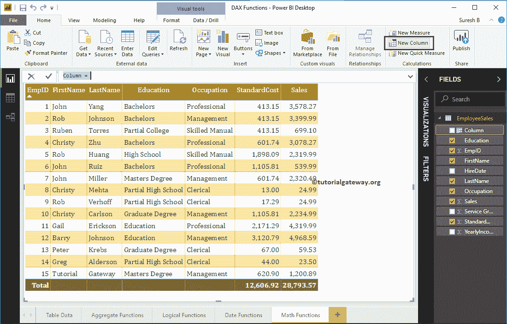

# PowerBI DAX 数学函数

> 原文：<https://www.tutorialgateway.org/power-bi-dax-math-functions/>

如何结合实例使用 Power BI DAX 数学函数？。微软 Power BI DAX 提供各种数学或数学函数，如天花板、地板、货币、INT、SQRT、Power、MOD、DIVIDE、ROUND、ROUNDUP、ROUNDDOWN、LCM、GCD 等。

为了演示 Power BI DAX 数学函数，我们将使用下面显示的数据。如你所见，这张表中有 15 条记录。


## PowerBI DAX 数学函数

以下一系列示例向您展示了 DAX 数学函数在 Power BI 中的使用

### PowerBI DAX `ceil`函数

Power BI 中的 DAX `ceil`函数返回最接近的值，该值大于或等于给定值。该 PowerBI 上限函数的语法为:

```
CEILING(Number, significance)
```

为了在 Power BI 中演示这些 DAX 数学函数，我们必须使用计算列。要[创建一列](https://www.tutorialgateway.org/create-calculated-columns-in-power-bi/)，请点击 [Power BI](https://www.tutorialgateway.org/power-bi-tutorial/) 主页选项卡或建模选项卡下的新建列选项。



从下面的截图中可以看到，我们将默认的列名重命名为 CEIL。以下语句查找最接近的大于或等于销售额的整数值

```
CEILING(EmployeeSales[Sales])
```


让我将这个天花板字段添加到我们之前创建的表中。请参考[创建表格报告](https://www.tutorialgateway.org/create-a-table-in-power-bi/)一文，了解创建表


的步骤

### 动力 BI DAX `floor`函数

Power BI DAX FLOOR 函数返回最接近的值，该值小于或等于给定值。这种 PowerBI DAX `floor`函数的语法是:

```
FLOOR(expression, significance)
```

此 PowerBI DAX 数学函数查找小于或等于销售额的最接近值

```
FLOOR(EmployeeSales[Sales], 1)
```


### PowerBI DAX 舍入函数

Power BI DAX ROUND 函数是将给定值舍入到最接近的值。该 PowerBI DAX 舍入函数的语法为:

```
ROUND(expression, significance)
```

它将销售额四舍五入到最接近的整数

```
ROUND = ROUND(EmployeeSales[Sales], 0)
```


### PowerBI DAX 货币函数

Power BI 中的 DAX CURRENCY 函数将值转换为货币数据类型。该 Power BI DAX 货币函数的语法为:

```
CURRENCY(expression)
```

它将销售值转换为货币数据类型

```
Money = CURRENCY(EmployeeSales[Sales])
```


### PowerBI DAX INT 函数

Power BI 中的 DAX INT 函数将给定值转换为整数数据类型。这个 PowerBI DAX INT 函数的语法是:

```
INT(expression)
```

Power BI DAX INT 函数将销售值转换为整数数据类型

```
INT = INT(EmployeeSales[Sales])
```


### 动力 BI DAX `sqrt`函数

PowerBI 中的 DAX `sqrt`函数返回给定数字的平方根。Power BI DAX `sqrt`函数的语法如下所示:

```
SQRT(expression)
```

它返回销售列值的平方根

```
SQRT = SQRT(EmployeeSales[Sales])
```


### PowerBI DAX 符号函数

PowerBI DAX SIGN 函数返回给定数字的符号。此函数返回 1 表示正值，-1 表示负值，0 表示零。该 Power BI DAX 符号函数的语法为:

```
SIGN(expression)
```

它返回服务等级列值的符号

```
SIGN = SIGN(EmployeeSales[Service Grade])
```


### PowerBI DAX 偶数函数

Power BI 中的 DAX EVEN 函数返回给定数字的最接近的偶数整数。这个 PowerBI DAX 偶数函数的语法是:

```
EVEN(expression)
```

以下语句返回服务等级列值中最接近的偶数整数

```
EVEN = EVEN(EmployeeSales[Service Grade])
```


### PowerBI DAX 奇数函数

PowerBI DAX ODD 函数返回给定数字的最近的奇数。这个 PowerBI DAX 奇数函数的语法是:

```
ODD(expression)
```

它返回服务等级列值中最接近的奇数

```
EVEN = EVEN(EmployeeSales[Service Grade])
```


### PowerBI DAX 事实函数

PowerBI DAX FACT 函数求给定数的阶乘。该 PowerBI DAX 事实函数的语法为:

```
FACT(number)
```

例如，阶乘 4 = 4 * 3 * 2 * 1 => 24

下面的语句返回年收入除以 1000 的阶乘

```
FACT = FACT(EmployeeSales[Yearly Income] / 1000)
```


### PowerBI DAX 功率函数

PowerBI DAX 幂函数求给定数的幂。该函数接受第二个参数来指定功率值。该 PowerBI DAX 功率函数的语法为:

```
POWER(expression, raise_number)
```

例如，幂(4，3) = 4。

下面的语句返回年收入除以 1000 的阶乘

```
POWER = POWER(EmployeeSales[Sales], 2)
```


### PowerBI DAX 除函数

Power BI 中的 DAX DIVIDE 函数将一个值除以另一个值。如果有错误或无法除，则返回 BLANK 值。该 PowerBI DAX 分频函数的语法为:

```
DIVIDE(numerator, denominator)
```

以下语句将销售列值除以 30

```
POWER = POWER(EmployeeSales[Sales], 2)
```


Power BI DAX DIVIDE 函数也接受第三个参数。使用此参数指定 BLANK 值的替代数字。

以下语句按等级列值划分销售列值。如果结果为空，则返回 9。

```
POWER = POWER(EmployeeSales[Sales], 2)
```


### 动力 BI DAX abs 系统函数

Power BI DAX ABS 函数返回绝对正值。该 PowerBI DAX abs 系统函数的语法为:

```
ABS(expression)
```

它从服务等级列值中返回绝对正值

```
ABS = ABS(EmployeeSales[Service Grade])
```


### 动力 BI DAX MOD 函数

Power BI 中的 DAX MOD 函数返回数除后的余数。该 Power BI DAX MOD 函数的语法为:

```
MOD(number, divisor)
```

例如 MOD(5，2) = 1。

下面的语句返回可被 `sqrt`函数结果整除的剩余销售额。

```
MOD = MOD(EmployeeSales[Sales], EmployeeSales[SQRT])
```


### PowerBI DAX 磁共振函数

DAX MROUND 函数返回一个舍入到指定倍数的数字。该 PowerBI DAX 磁共振函数的语法为:

```
MROUND(expression, multiple)
```

我们使用的语句是:

```
MROUND = MROUND(EmployeeSales[Sales], 0.05)
```


### PowerBI DAX 商函数

Power BI 中的 DAX 商数函数返回除法结果的整数部分。PowerBI DAX 商函数的语法是:

```
QUOTIENT(numerator, denominator)
```

以下语句返回销售额除以 Mod 函数结果的整数部分:

```
QUOTIENT = QUOTIENT(EmployeeSales[Sales], EmployeeSales[MOD])
```


### 动力 BI DAX 兰德函数

PowerBI DAX RAND 函数返回 0 到 1 之间的随机正数。Power BI DAX RAND 函数的语法是:

```
RAND()
```

让我创建一个新列来生成随机值

```
RAND = RAND()
```


### PowerBI DAX 随机区间函数

Power BI 中的 DAX RANDBETWEEN 函数返回用户指定的起始值和结束值之间的随机数。PowerBI DAX 随机区间函数的语法是:

```
RANDBETWEEN(start, end)
```

让我创建一个新列来生成 10 到 50 之间的随机值

```
RANDBET = RANDBETWEEN(10, 50)
```


### 幂指数 TRUNC 函数

PowerBI DAX TRUNC 函数通过移除小数将给定的数字截断为整数。Power BI DAX TRUNC 函数的语法是:

```
TRUNC(number, num_of_digits)
```

此 PowerBI DAX 数学函数截断销售列值

```
TRUNC = TRUNC(EmployeeSales[Sales], 1)
```


### 功率双向 DAX 舍入函数

Power BI DAX 舍入函数将给定的数字舍入到零。PowerBI DAX 舍入函数的语法是:

```
ROUNDDOWN(number, num_of_digits)
```

它将“销售”列的值向下舍入到 2 位数。

```
ROUNDDOWN = ROUNDDOWN(EmployeeSales[Sales], -2)
```


### 动力 BI DAX 综合函数

Power BI DAX 舍入函数将给定的数字从零向上舍入。PowerBI DAX 综合函数的语法是:

```
ROUNDUP(number, num_of_digits)
```

以下语句将“销售”列的值向上舍入到 2 位数(即大于原始值)。

```
ROUNDUP = ROUNDUP(EmployeeSales[Sales], -2)
```


### 动力 BI DAX LCM 函数

DAX LCM 函数从多个整数值中找到最小公约数或最低公约数。该 PowerBI DAX LCM 函数的语法为:

```
LCM(expression1, expression2,.....)
```

它从 SQRT 结果和 MOD 函数结果中返回最小公约数

```
LCM = LCM(EmployeeSales[SQRT], EmployeeSales[MOD])
```


### PowerBI DAX GCD 函数

PowerBI DAX GCD 函数从多个整数值中找出最大公约数。Power BI DAX GCD 函数语法为:

```
GCD(expression1, expression2,.....)
```

这个 PowerBI DAX 数学函数返回 `sqrt`函数结果和 MOD 结果的最大公约数

```
GCD = GCD(EmployeeSales[SQRT], EmployeeSales[MOD])
```

