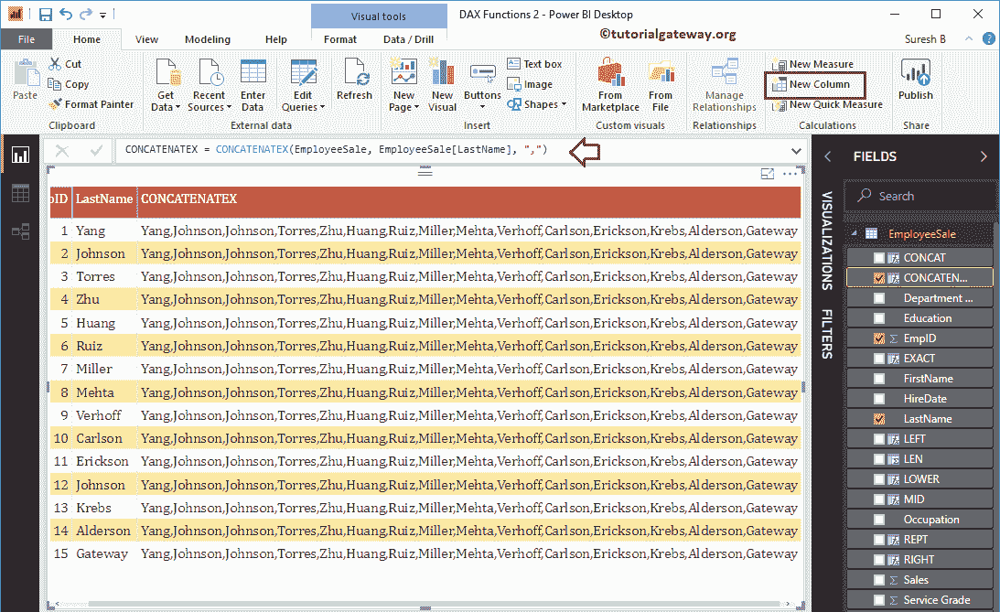

# 幂 BI DAX 字符串函数

> 原文：<https://www.tutorialgateway.org/power-bi-dax-string-functions/>

让我用例子向你展示如何使用 Power BI DAX 字符串函数。微软 Power BI DAX 提供各种字符串函数，如 LEN、LEFT、RIGHT、LOWER、UPPER、MID、replace、FORMAT、CONCATENATEX、CONCATENATEX、retp、UNICHAR、VALUES 等。

为了演示这些 Power BI DAX 字符串函数，我们将使用下面显示的数据。可以看到，这张 [Power BI](https://www.tutorialgateway.org/power-bi-tutorial/) 表上有 15 条记录。


## 幂 BI DAX 字符串函数

以下一系列示例向您展示了 Power BI 中 DAX 字符串函数的列表

### PowerBI DAX 透镜功能

DAX Now 函数返回给定字符串的长度。这个 Power BI DAX LEN 的语法是

```
LEN(string)
```

为了在 Power BI 中演示这些 DAX 字符串函数，我们必须使用计算列。要[创建一个列](https://www.tutorialgateway.org/create-calculated-columns-in-power-bi/)，请点击主页选项卡或建模选项卡下的新建列选项。


从下面的截图中可以看到，我们将默认的列名重命名为 LEN。以下语句在“部门名称”列中查找字符串的长度。

```
LEN = LEN(EmployeeSales[Department Name])
```

让我将这个 Power BI DAX LEN 列添加到我们之前创建的表中。请参考[创建表报告](https://www.tutorialgateway.org/create-a-table-in-power-bi/)一文，了解创建表


所涉及的步骤

### 动力 BI DAX 左功能

Power BI DAX LEFT 函数返回字符串中最左边的字符，直到指定的索引位置。幂 BI DAX 左函数语法是

```
LEFT(string, position)
```

下面的语句返回部门名称列中最左边的 8 个字符

```
LEFT = LEFT(EmployeeSales[Department Name], 8)
```


### 动力 BI DAX 右功能

Power BI DAX RIGHT 函数返回字符串中最右边的字符，直到指定的索引位置。幂 BI DAX 右函数的语法是

```
RIGHT(string, position)
```

它返回部门名称列中最右边的 6 个字符

```
RIGHT = RIGHT(EmployeeSales[Department Name], 6)
```


### 动力 BI DAX 下降功能

Power BI DAX LOWER 函数将给定的字符串转换为小写。幂 BI DAX 低函数的语法是

```
LOWER(string)
```

以下 Power BI DAX 下部函数将部门名称列转换为小写

```
LOWER = LOWER(EmployeeSales[Department Name])
```


### 动力 BI DAX 上部功能

Power BI DAX UPPER 函数将给定的字符串转换为大写。幂 BI DAX 上函数语法是

```
UPPER(string)
```

下面的 Power BI DAX 上部函数将部门名称列字符串转换为大写

```
UPPER = UPPER(EmployeeSales[Department Name])
```


### 动力 BI DAX MID 功能

Power BI DAX MID 函数从原始字符串中返回一个子字符串。Power BI DAX MID 函数的语法是

```
MID(string, starting_position, length)
```

这个 Power BI DAX MID 函数接受三个参数:

*   起始位置–子字符串从此位置开始
*   长度–子字符串的总长度。

它从“部门名称”列返回一个子字符串。子字符串从位置 4 开始，当字符串长度达到 7 时结束。

```
MID = MID(EmployeeSales[Department Name], 4, 7)
```


### PowerBI DAX 报告功能

Power BI DAX REPT 函数将字符串重复用户指定的次数。PowerBI DAX 报告函数的语法是:

```
REPT(string, no_of_times)
```

它重复 LastName 列中的数据两次。

```
REPT = REPT(EmployeeSales[LastName], 2)
```


### 动力 BI DAX 替代功能

Power BI DAX 替代函数将字符串重复用户指定的次数。该 Power BI DAX 替代函数的语法为:

```
SUBSTITUTE(string, old_string, new_string)
```

它将“部门名称”列值中的“软件”一词替换为“网站”

```
SUBSTITUTE = SUBSTITUTE(EmployeeSales[Department Name], "Software", "Web")
```


### 幂 BI DAX UNICHAR 函数

Power BI DAX UNICHAR 函数返回给定 ASCII 值的 Unicode 字符。Power BI DAX UNICHAR 函数语法是:

```
UNICHAR(number)
```

它返回年收入除以 2 的 Unicode 字符

```
UNICHAR = UNICHAR(EmployeeSales[Yearly Income] / 2)
```


### 幂 BI DAX 精确函数

DAX EXACT 函数比较两个字符串，如果它们完全相等，则返回 true 否则，它返回 false。该 Power BI DAX 精确函数的语法为:

```
EXACT(string1, string2)
```

以下 Power Bi DAX 精确语句将部门名称与部门名称最左边的 18 个字符进行比较

```
EXACT = EXACT(EmployeeSales[Department Name], LEFT(EmployeeSales[Department Name], 18))
```


### PowerBI DAX 连接功能

Power BI DAX CONCATENATE 函数用于连接两个字符串。该 Power BI DAX CONCATENATE 函数的语法如下:

```
CONCATENATE(string1, string2)
```

下面的 Power BI DAX CONCATENATE 函数连接名字和姓氏

```
CONCAT = CONCATENATE(EmployeeSales[FirstName], EmployeeSales[LastName])
```


### 幂 BI DAX 连接函数

DAX CONCATENATEX 函数是使用指定的分隔符连接一列中的所有行。这个 Power BI DAX CONCATENATEX 函数的语法是:

```
CONCATENATEX(tableName, ColumnName, Delimiter)
```

下面的 Power BI DAX 语句使用逗号分隔符连接姓氏列中的所有行。

```
CONCATENATEX = CONCATENATEX(EmployeeSales, EmployeeSales[LastName], ",")
```



### 动力 BI DAX 固定功能

Power BI DAX FIXED 函数用于将给定的数字舍入到指定的位数，并以文本数据类型返回。Power BI DAX 固定函数的语法是:

```
FIXED(number, decimals, comma)
```

下面的 Power BI DAX FIXED 函数将销售小数四舍五入到一位数，并且不允许使用逗号

```
FIXED = FIXED(EmployeeSales[Sales], 1, 1)
```


### PowerBI DAX 空白功能

Power BI DAX BLANK 函数用于返回空白。你也可以用这个来检查乌鸦是否有空格。该 Power BI DAX 空白函数的语法为:

```
BLANK()
```

在 [If 语句下](https://www.tutorialgateway.org/power-bi-dax-logical-functions/)在按服务等级划分销售额时检查是否有空白，如果为真，则空白被替换为 100。否则，它返回结果。

```
BLACNK = IF(DIVIDE(EmployeeSales[Sales], EmployeeSales[Service Grade]) = BLANK(), 
                100, DIVIDE(EmployeeSales[Sales], EmployeeSales[Service Grade]))
```


从下面的截图，可以看到结果。


### Power BI DAX UNICODE 函数

DAX UNICODE 函数返回字符串中第一个字符的 [ASCII 值](https://www.tutorialgateway.org/ascii-table/)。该 Power BI DAX UNICODE 函数的语法是:

```
UNICODE(string)
```

它返回姓氏列中第一个字符的 ASCII 值

```
CODE = UNICODE(EmployeeSales[LastName])
```


### 幂 BI DAX 组合评估函数

DAX COMBINEVALUES 函数使用指定的分隔符组合两个或多个字符串。该 Power BI DAX COMBINEVALUES 函数的语法为:

```
COMBINEVALUES(Delimiter, string1, string2,..)
```

以下语句使用逗号分隔符将“名字”、“姓氏”、“学历”列组合在一起。

```
CONCATENATEX = CONCATENATEX(EmployeeSales, EmployeeSales[LastName], ",")
```


### PowerBI数据交换格式功能

Power BI DAX FORMAT 函数将数字和日期格式化为预定义的格式。Power BI DAX 格式函数的语法是:

```
FORMAT(expression, format_type)
```

下面的 Power BI DAX FORMAT 函数将销售额格式化为货币类型

```
FORMAT = FORMAT(EmployeeSales[Sales], "Currency")
```


### 幂 BI DAX 值函数

DAX VALUE 函数将字符串数字转换为数字。幂 BI DAX 值函数的语法是:

```
VALUE(string)
```

以下语句将固定函数结果中的字符串数字转换为数字

```
VALUE = VALUE(EmployeeSales[FIXED])
```

