# PowerBI DAX 三角函数

> 原文：<https://www.tutorialgateway.org/power-bi-dax-trigonometric-functions/>

如何结合实例使用 PowerBI DAX 三角函数？。微软 Power BI DAX 提供了 EXP、COS、SIN、TAN、COSH、ACOS、ACOSH、ASIN、SINH、ASINH、ATAN、ATANH、LN、LOG、LOG10 等各种三角函数。

为了演示这些 PowerBI DAX 三角函数，我们将使用下面显示的数据。如你所见，这张表中有 15 条记录。

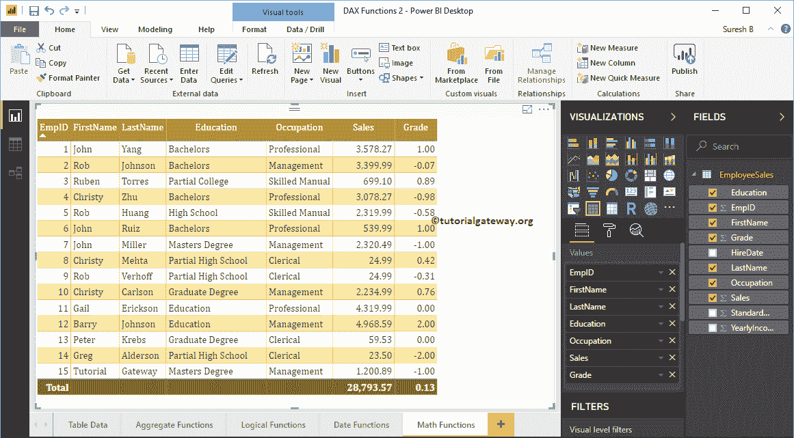

## PowerBI DAX 三角函数

以下一系列示例显示了[PowerBI](https://www.tutorialgateway.org/power-bi-tutorial/) 中 DAX 三角函数的列表

### 动力 BI DAX COS 函数

PowerBI DAX COS 函数返回余弦值。该 Power BI DAX COS 的语法如下所示:

```
COS(expression)
```

为了演示 PowerBI 中的这些 Dax 三角函数，我们必须使用计算列。要[创建一个列](https://www.tutorialgateway.org/create-calculated-columns-in-power-bi/)，请点击主页选项卡或建模选项卡下的新建列选项。

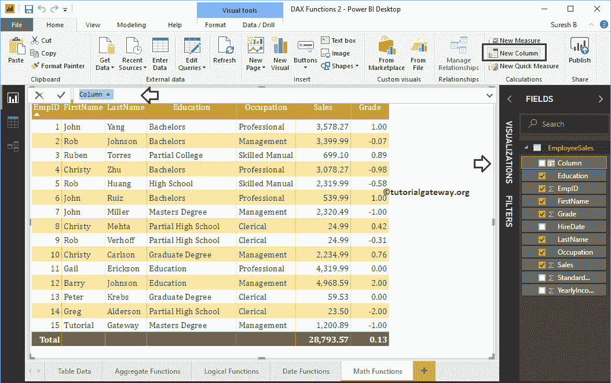

从下面的截图中可以看到，我们将默认的列名重命名为 COS。下面的 PowerBI DAX Cos 语句查找等级的余弦值

```
COS(EmployeeSales[Grade])
```

接下来，让我将这个 COS 列添加到我们之前创建的表中。请参考[创建表报告](https://www.tutorialgateway.org/create-a-table-in-power-bi/)一文，了解创建表

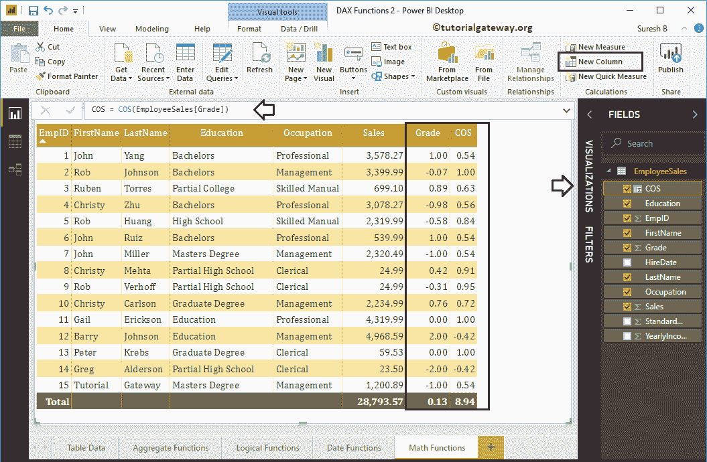

所涉及的步骤

### PowerBI DAX COSH 函数

Power BI 中的 DAX COSH 函数返回双曲余弦值。这个 PowerBI DAX COSH 函数的语法是

```
COSH(expression)
```

它返回坡度的双曲余弦值

```
COSH(EmployeeSales[Grade])
```

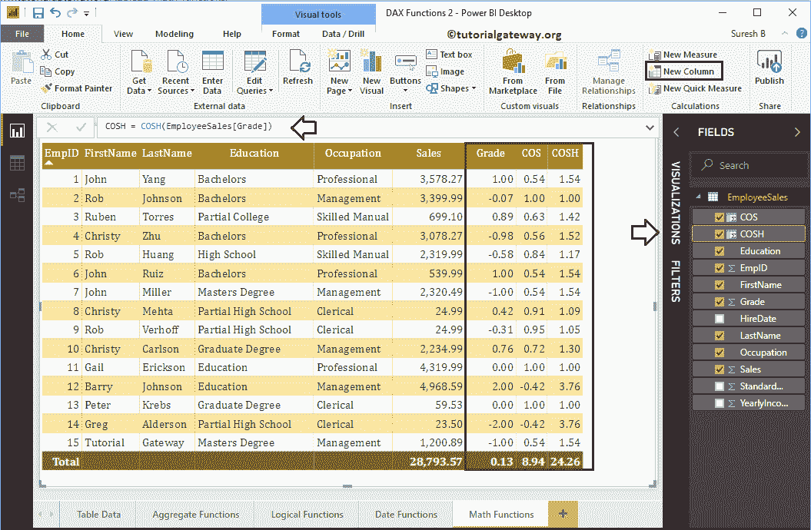

### PowerBI DAX ACOSH 函数

Power BI DAX ACOSH 函数返回反双曲余弦或双曲弧余弦值。该函数接受大于或等于 1 的任何实数值。Power BI DAX ACOSH 函数的语法是:

```
ACOSH(expression)
```

它返回坡度的反双曲余弦值

```
ACOSH(EmployeeSales[Sales])
```

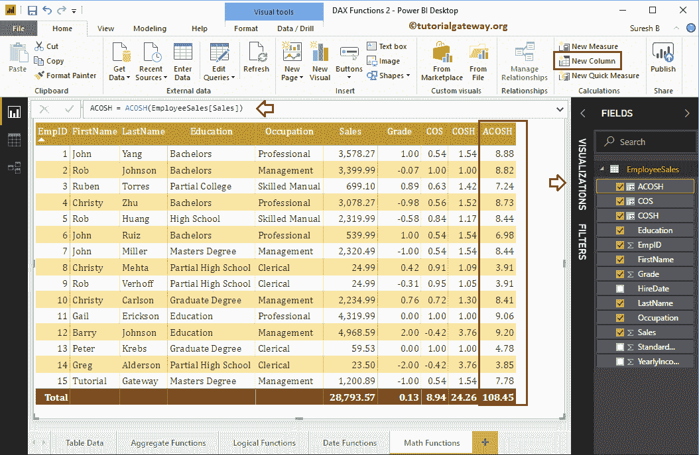

### 幂指数 ACOS 函数

PowerBI DAX ACOS 函数返回反余弦值或反余弦值。此函数接受-1 到 1 之间的值。Power BI DAX ACOS 函数的语法是:

```
ACOS(expression)
```

它返回 COS 结果的反余弦值

```
ACOS(EmployeeSales[COS])
```

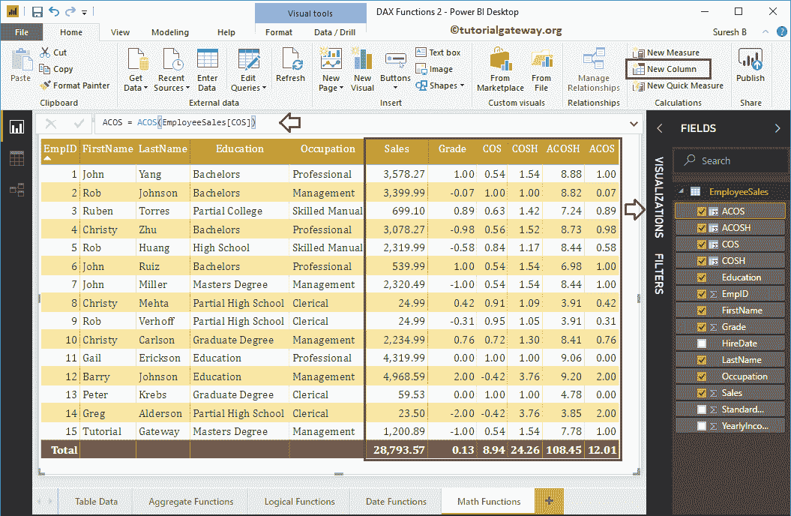

### PowerBI DAX 正弦函数

PowerBI 中的 DAX 正弦函数返回正弦值。PowerBI DAX 正弦函数语法

```
SIN(expression)
```

它返回“等级”列的正弦值

```
SIN(EmployeeSales[Grade])
```

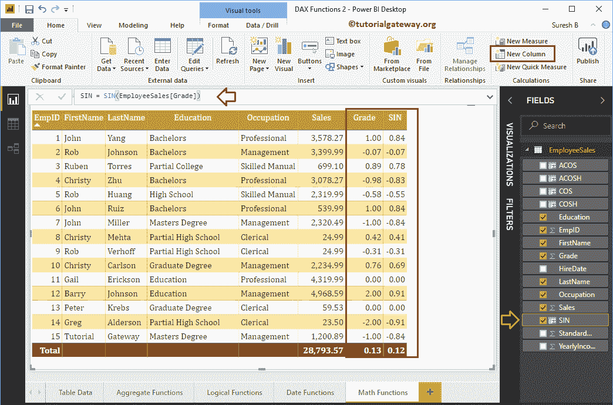

### PowerBI DAX 正弦函数

PowerBI 中的 DAX SINH 函数返回双曲正弦值。PowerBI DAX 正弦函数的语法是:

```
SINH(expression)
```

它返回坡度列的双曲正弦值

```
SINH(EmployeeSales[Grade])
```

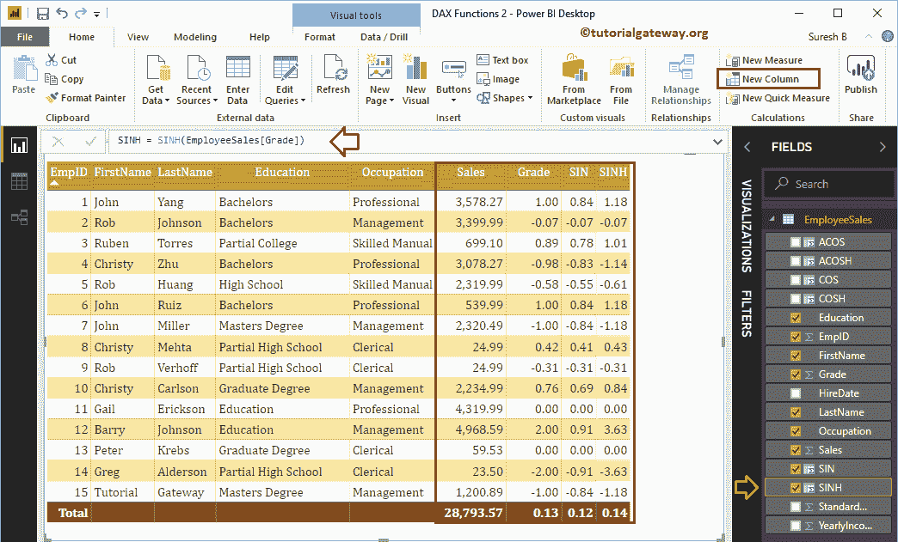

### PowerBI DAX ASINH 函数

Power BI 中的 DAX ASINH 函数返回反双曲正弦值或双曲圆弧正弦值。Power BI DAX ASINH 函数的语法是:

```
ASINH(expression)
```

它返回梯度列的反双曲正弦值

```
ASINH(EmployeeSales[Sales])
```

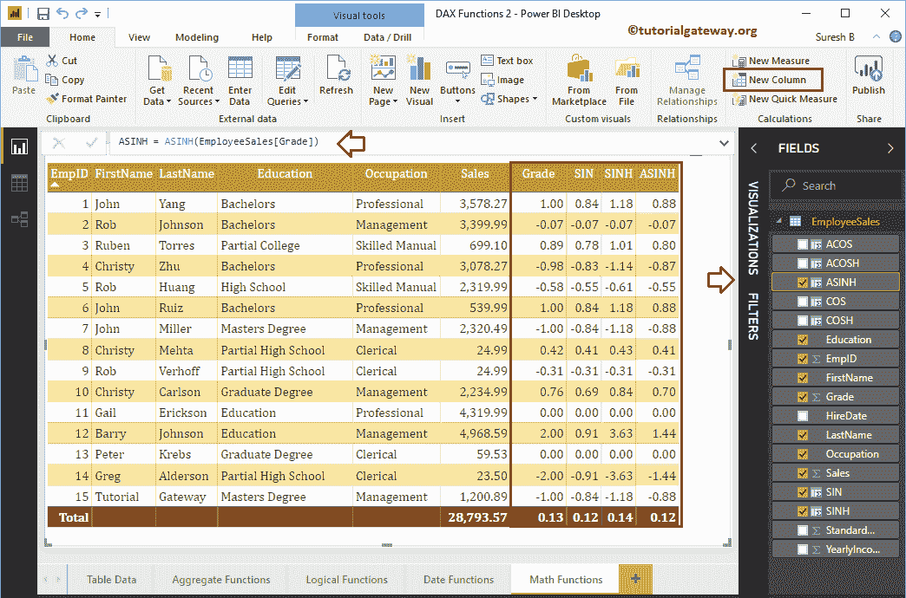

### 动力 BI DAX ASIN 函数

PowerBI DAX ASIN 函数返回反正弦值或反弦值。PowerBI DAX ASIN 函数的语法是:

```
ASIN(expression)
```

它返回正弦结果的反正弦值

```
ASIN(EmployeeSales[SIN])
```

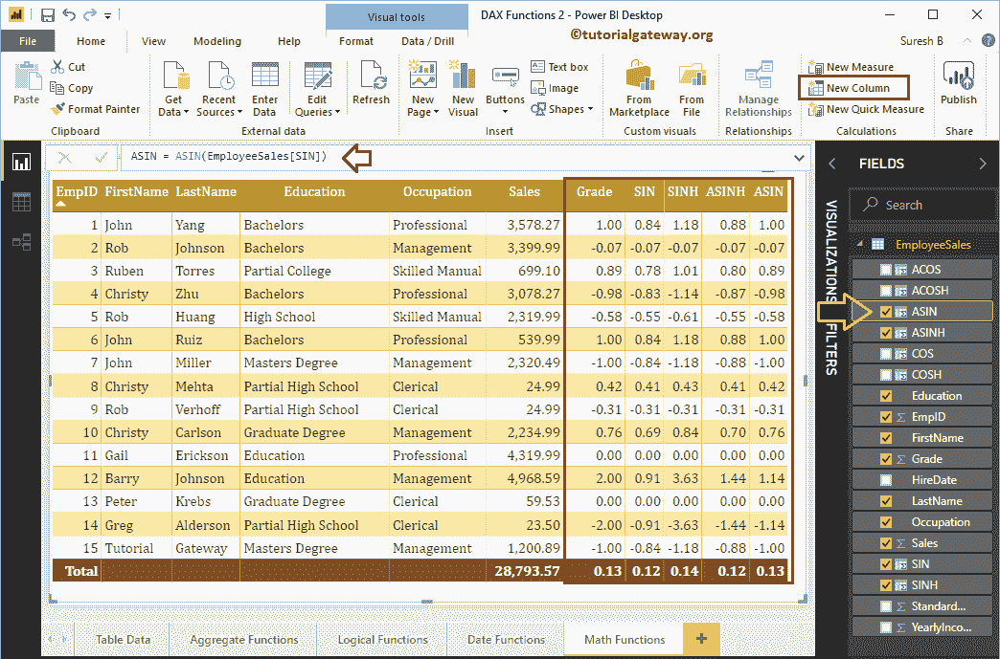

### 幂指数 ATAN 函数

PowerBI DAX ATAN 函数返回反正切值或反正切值。这个 PowerBI DAX ATAN 函数的语法是:

```
ATAN(expression)
```

它返回坡度列的反正切或反正切值。

```
ATAN(EmployeeSales[Grade])
```

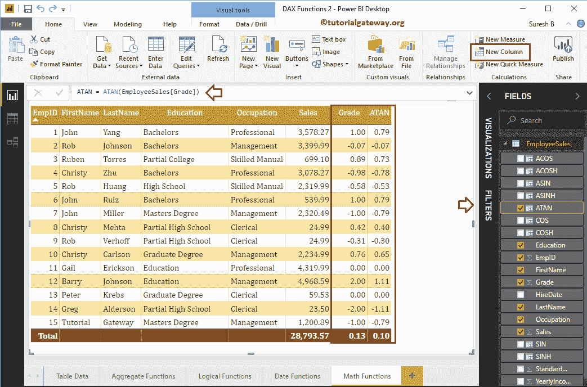

### 动力 BI DAX TAN 函数

PowerBI DAX TAN 函数返回正切值。PowerBI DAX TAN 函数语法为:

```
TAN(expression)
```

以下语句返回“销售额”列的正切值

```
TAN(EmployeeSales[Sales])
```

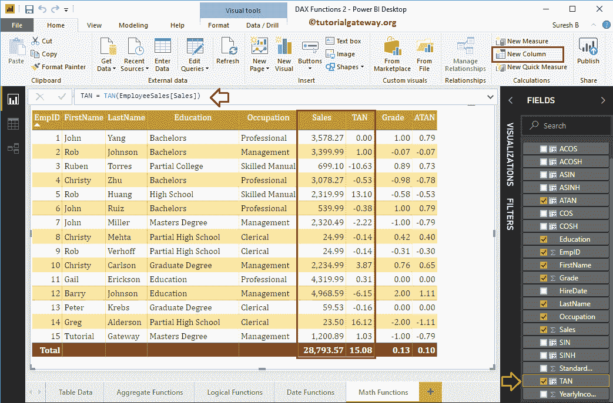

### PowerBI DAX TANH 函数

PowerBI DAX TANH 函数返回双曲正切值。该 PowerBI DAX TANH 函数的语法如下所示:

```
TANH(expression)
```

此 PowerBI DAX 三角函数返回坡度列的双曲正切值

```
TANH(EmployeeSales[Grade])
```

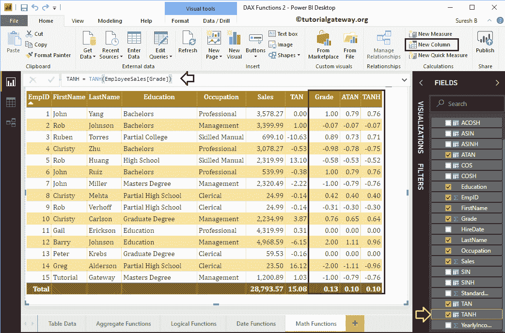

### 动力 BI DAX ATANH 函数

Power BI DAX ATANH 函数返回一个反双曲正切值或双曲反正切值。这个 PowerBI DAX ATANH 函数的语法是

```
ATANH(expression)
```

它返回 TANH 结果的双曲反正切值

```
ATANH(EmployeeSales[TANH])
```

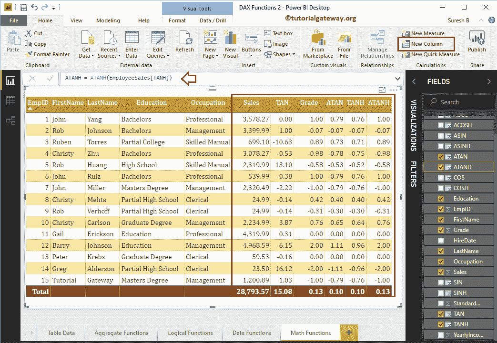

### PowerBI DAX PI 函数

PowerBI DAX PI 函数返回 PI 值，即 3.14。幂指数指数指数指数函数语法是

```
PI()
```

在下面的陈述中，我们将销售值除以 PI 值，即 3.14。您也可以使用除法函数来实现同样的效果。

```
PI = (EmployeeSales[Sales] / PI())
```


### PowerBI 扩展函数

PowerBI DAX EXP 函数返回给定数的幂。该 Power BI DAX EXP 函数的语法为:

```
EXP(expression)
```

下面的语句返回 e 的等级幂

```
EXP = EXP(EmployeeSales[Grade])
```

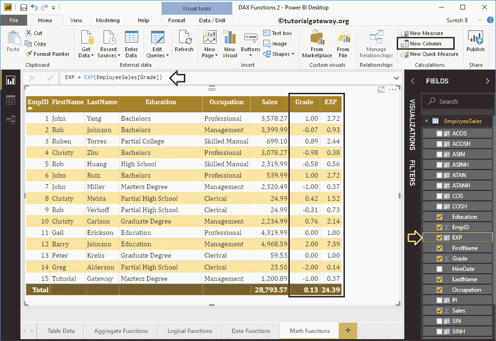

### 动力 BI DAX LN 函数

PowerBI DAX LN 函数返回给定数字的自然对数值。PowerBI DAX LN 函数的语法是:

```
LN(expression)
```

以下语句返回销售额的自然对数值

```
LN = LN(EmployeeSales[Sales])
```

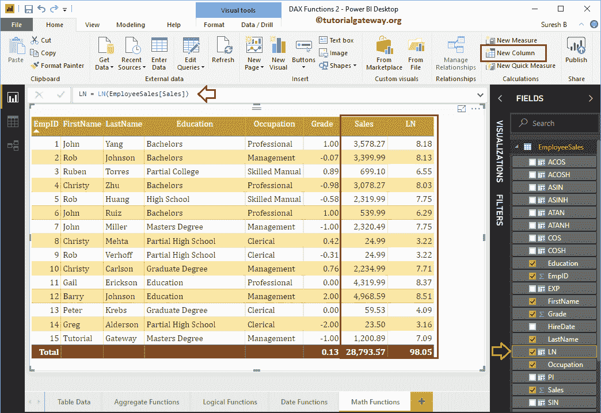

### PowerBI 日志函数

Power BI 中的 DAX LOG 函数返回给定数字的对数值。该函数接受第二个参数来指定基值。PowerBI 数据交换日志函数的语法是:

```
LOG(expression, base_value)
```

下面的 Power BI DAX 日志语句返回销售基数 2 的对数值。

```
LOG = LOG(EmployeeSales[Sales], 2)
```

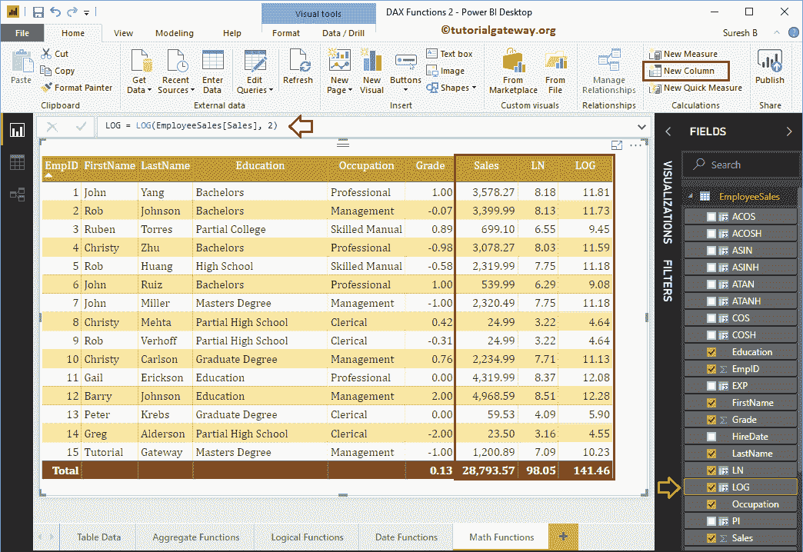

### 动力 BI DAX LOG10 函数

Power BI DAX LOG10 函数返回给定数字的基数 10 的对数值。这个 Power BI DAX LOG10 函数的基本语法是:

```
LOG10(expression)
```

下面的语句返回销售额基数 10 的对数值。

```
LOG10 = LOG10(EmployeeSales[Sales])
```


### PowerBI DAX 弧度函数

Power BI DAX RADIANS 函数将度数转换为弧度。PowerBI DAX 弧度函数语法是

```
RADIANS(expression)
```

以下语句将销售值转换为弧度。

```
RADIANS = RADIANS(EmployeeSales[Sales])
```


### PowerBI DAX 度函数

Power BI 中的 DAX DEVELOPES 函数将弧度转换为度数。PowerBI DAX 度函数语法为

```
DEGREES(expression)
```

下面的语句将弧度值转换为度数。

```
DEG = DEGREES(EmployeeSales[Sales])
```

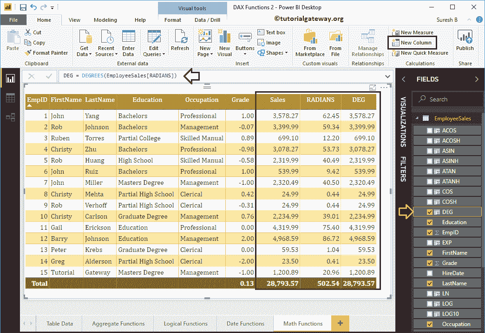