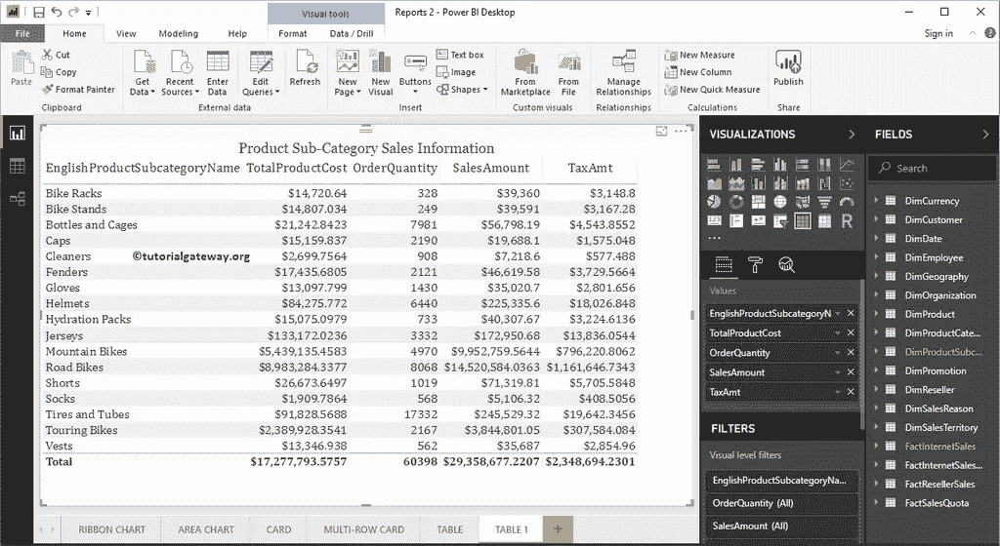
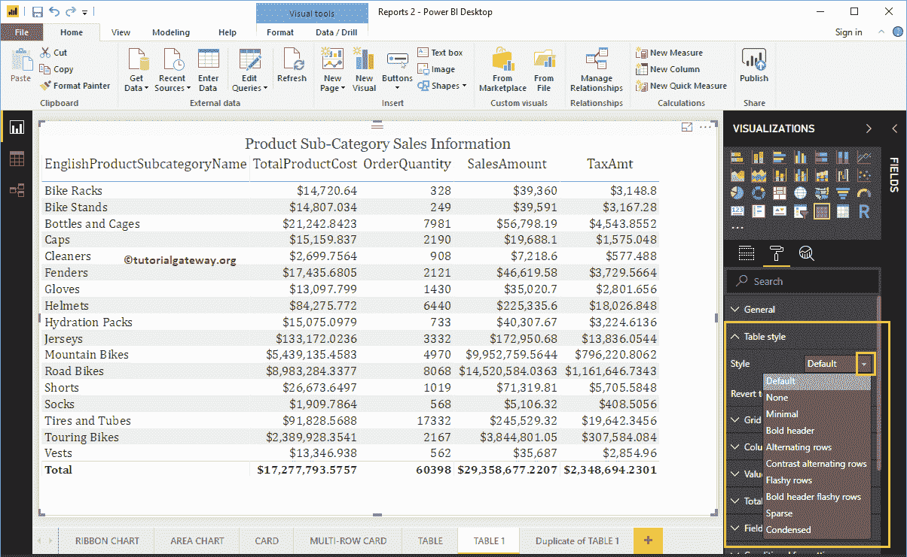
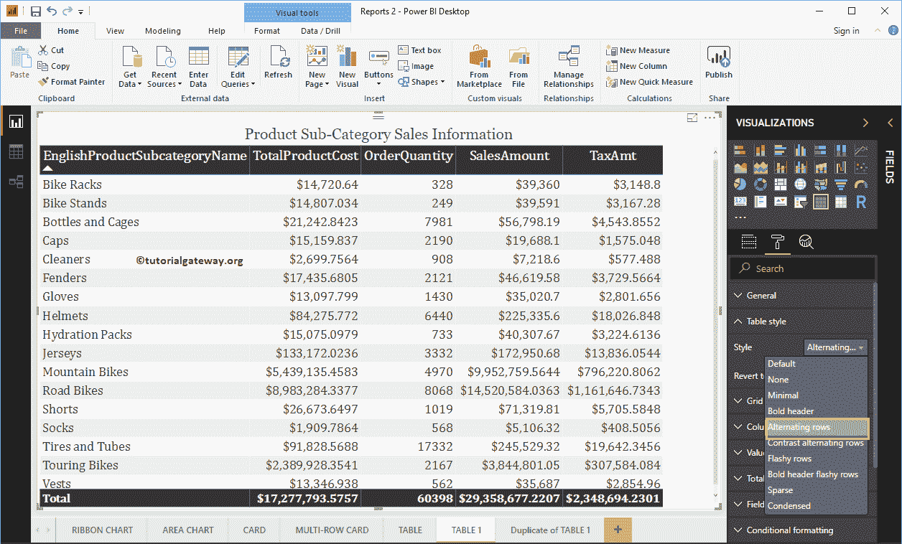
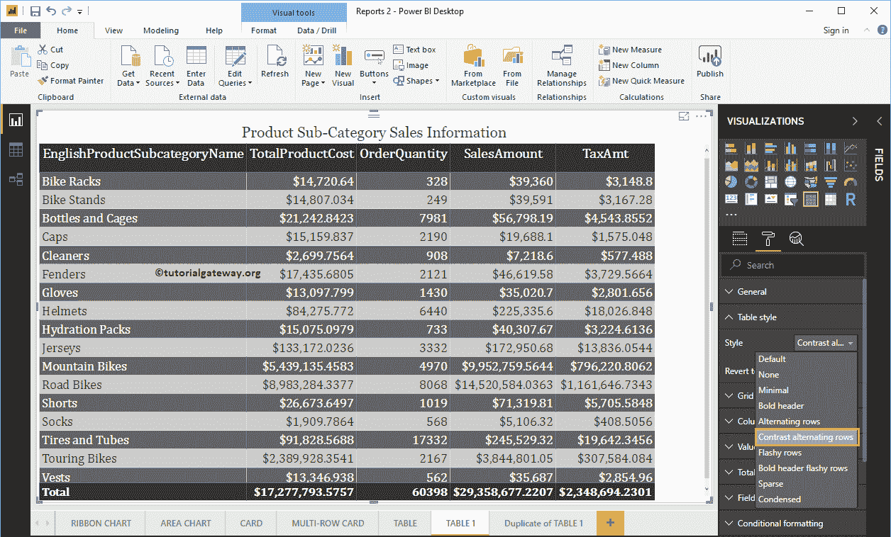
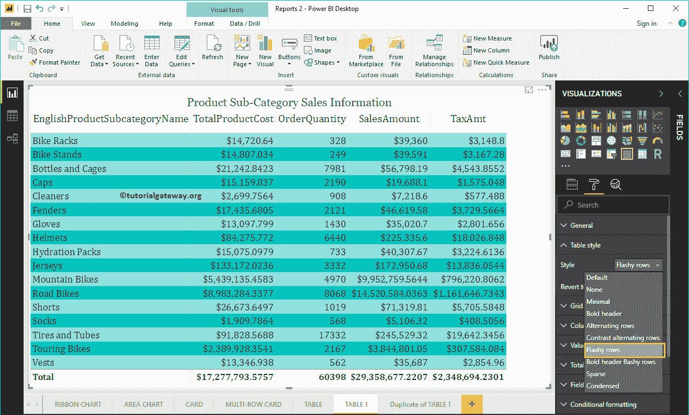
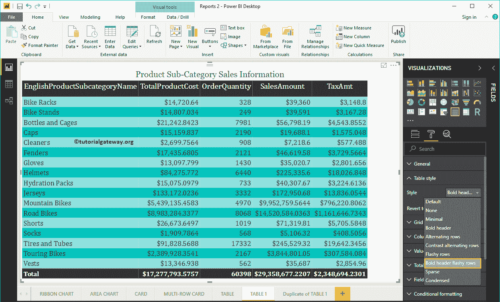
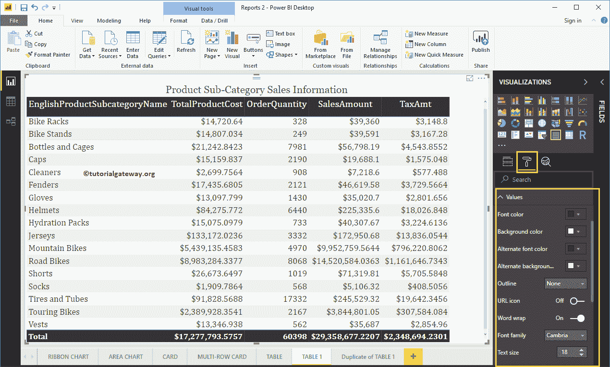
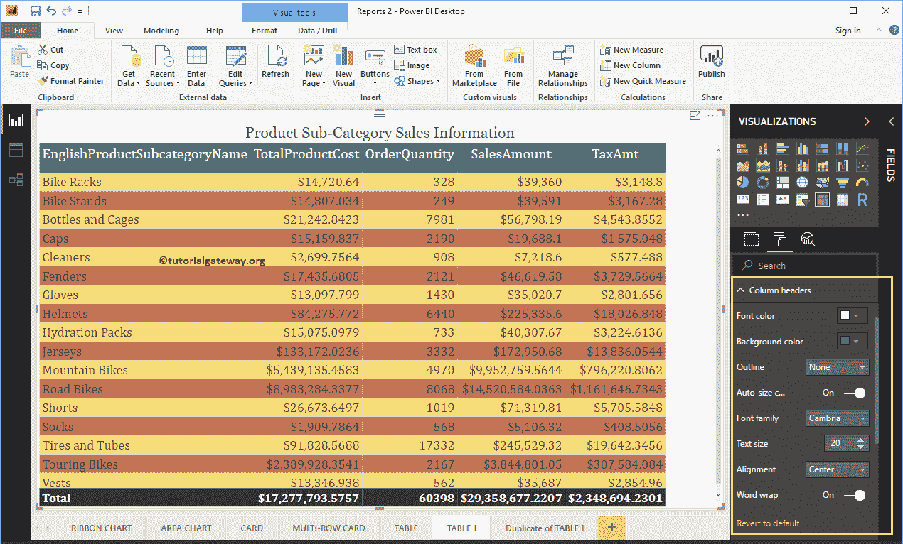
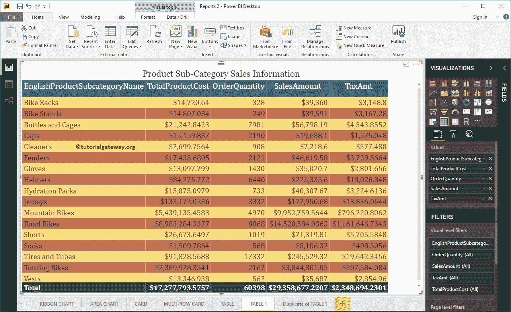

# 向PowerBI表添加可选行颜色

> 原文：<https://www.tutorialgateway.org/add-alternative-row-colors-to-power-bi-table/>

让我用一个实际例子向您展示如何向 Power BI 表报告添加可选的行颜色。

在这个向 Power BI 表添加可选行颜色的演示中，我们将使用我们在之前的文章中创建的表。我建议你参考[创建表](https://www.tutorialgateway.org/create-a-table-in-power-bi/)一文来理解。

## 将替代行颜色添加到PowerBI表示例

请单击“格式”按钮查看可用格式选项列表。接下来，导航到“表样式”部分，向表报告添加替代行颜色。

从下面的 [Power BI](https://www.tutorialgateway.org/power-bi-tutorial/) 截图中，你可以看到这个表可以使用的样式列表。

请从下拉列表中选择交替行选项以添加交替行颜色。请记住，这是任何表的默认选项。

让我选择对比交替行选项

如果选择“亮色行”，Power BI 会分配以下颜色。

如果选择粗体标题亮色行，则 Power BI 会为标题指定黑色，为替换行指定亮色绿色。

目前，我们坚持默认(交替行)选项。接下来，转到“值”部分，根据您的要求格式化颜色。

从下面的截图中可以看到，我们更改了偶数行和奇数行的前颜色和后颜色。在这里，我们还将字体系列更改为坎布里亚，并将文本大小更改为 18

接下来，转到列标题以更改标题颜色。

从下面的截图中可以看到，我们将字体颜色改为白色，背景颜色改为绿色。字体系列到坎布里亚，文本大小到 25，标题文本对齐居中。

接下来，转到“总计”部分来更改“总计”的文本和背景颜色。

从下面的截图中可以看到，我们将总计字体颜色更改为白色，背景颜色更改为绿色，字体系列更改为坎布里亚，文本大小更改为 17。

最后，你可以看到另类的颜色

