# 在 Power BI 中向表中添加数据条

> 原文：<https://www.tutorialgateway.org/add-data-bars-to-table-in-power-bi/>

如何在 Power BI 中向表中添加数据条，并举例说明？。向 Power BI 表格报告添加数据条是您将实时面临的常见场景之一。

为了演示如何在 Power BI 中向表中添加数据条，我们将使用之前创建的表。请参考[在 Power BI](https://www.tutorialgateway.org/create-a-table-in-power-bi/) 中创建表一文，了解创建 [Power BI](https://www.tutorialgateway.org/power-bi-tutorial/) 表所涉及的步骤。

## 如何在 Power BI 中向表中添加数据条

在我们开始向 Power BI 表格报告添加数据条之前，让我向您展示一下我们用于创建该表的数据(列)。正如您从下面的截图中看到的，我们在值部分添加了英文产品子类别名称、产品总成本、销售金额和订单数量来创建此表。

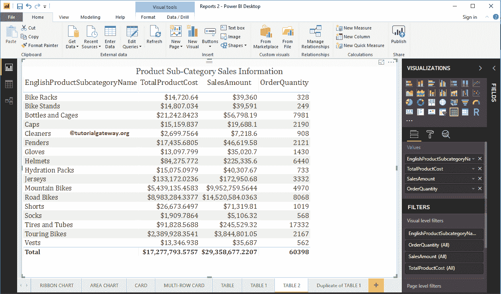

### 在 Power BI 中向表中添加数据条的第一种方法

在本例中，我们使用了桌面中可用的 Power Bi 条件格式选项。

选择要应用数据条的列名(度量值)。在本例中，我们使用“订单数量”列来添加数据条。

首先，单击值部分下订单数量列旁边的向下箭头，打开上下文菜单。请选择条件格式，然后选择数据条，如下所示。

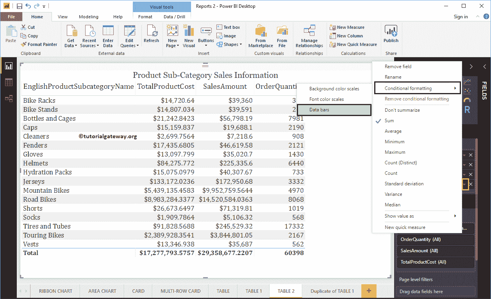

选择数据栏将打开以下窗口。

*   基础值:您选择的列
*   仅显示栏:如果选中此选项，则每行仅显示数据栏；否则，值和数据栏都将显示。
*   最小值:默认情况下，它选择最小值(最小订单数量)。使用下拉列表将最小值更改为数字，并在最小值文本框中指定最小值。
*   最大值:默认情况下，它选择最大值(最大订单数量)。使用下拉列表将最大值更改为数字，并在最大值文本框中指定最大值。
*   正条:请选择正条的颜色。
*   负片条:请选择负片条的颜色。
*   栏方向:将数据栏方向从左向右或从右向左更改。
*   轴:更改数据栏轴颜色

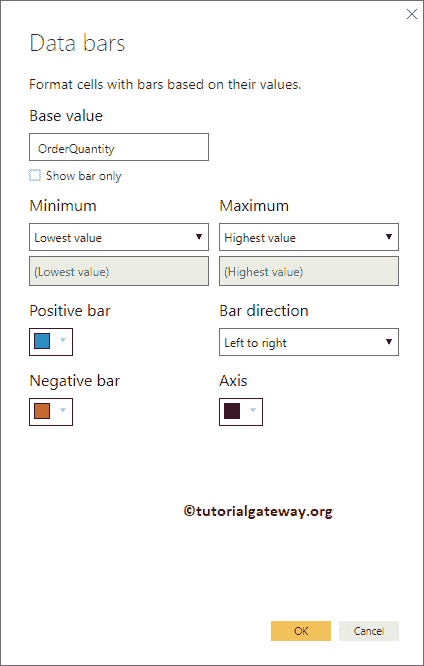

目前，我们保留默认设置

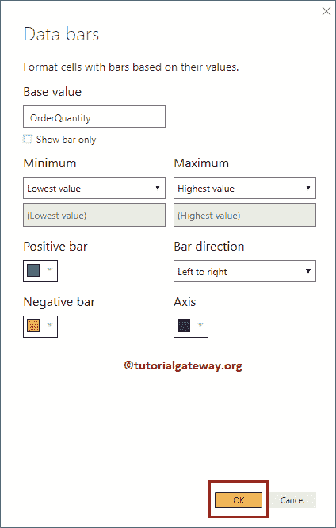

现在，您可以看到订单数量栏

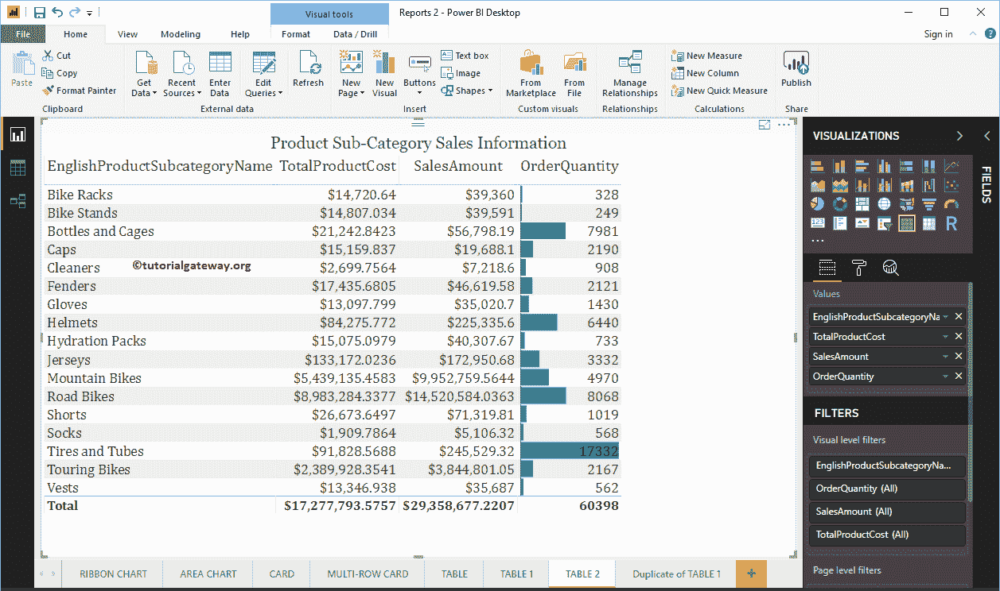

内的数据栏

### 在 Power BI 中从表中删除数据条

选择应用或添加数据栏的列名(度量值)。在上一步中，我们在“订单数量”列上添加了一个数据栏。因此，单击订单数量列旁边的向下箭头，打开上下文菜单。

请选择删除条件格式，然后选择数据条，如下所示。

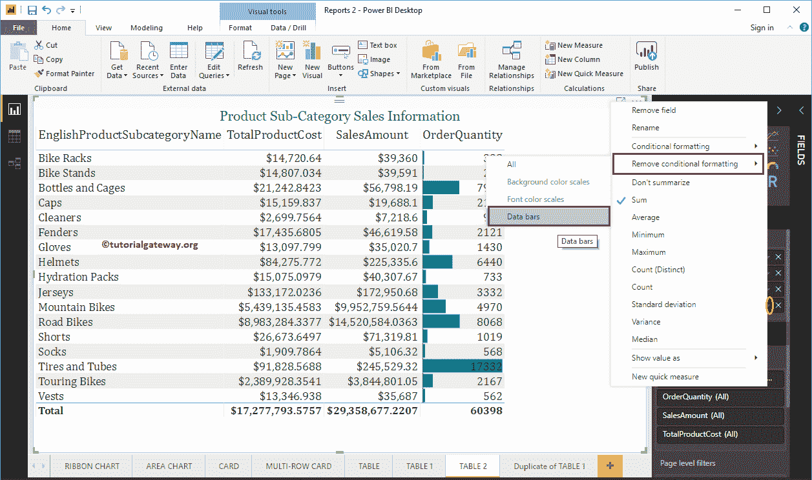

我们成功地从表中移除了数据条。

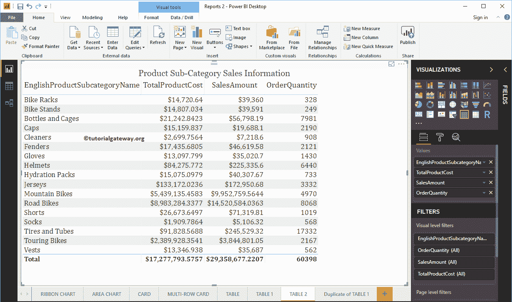

### 在 Power BI 中向表中添加数据条的第二种方法

请点击格式按钮，查看[表格式](https://www.tutorialgateway.org/format-power-bi-table/)选项列表。接下来，转到“条件格式”部分添加数据条。在这个 Power BI 示例中，我们希望将数据条添加到该表的“订单数量”列中。因此，我们使用下拉列表选择该列。

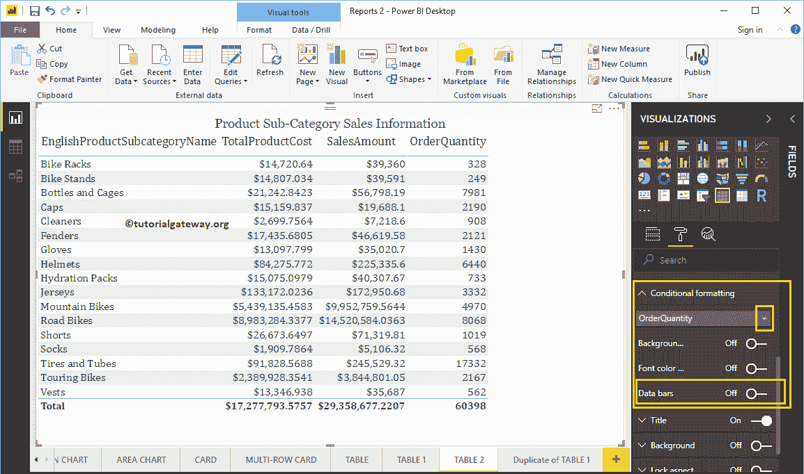

接下来，将数据条属性从关闭切换到打开添加数据条，如下所示。您可以使用“高级控件”超链接来格式化此数据栏。

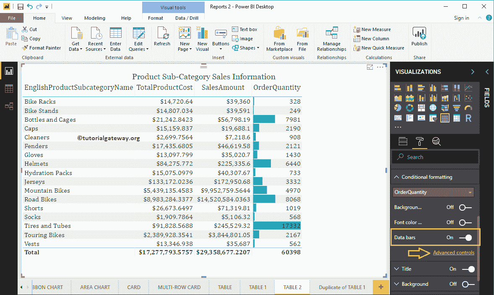

点击高级控制将打开以下窗口。

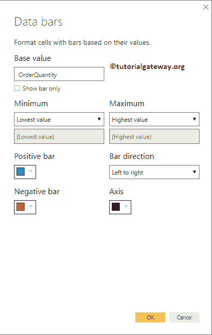

让我把最小值改为 100，最大值改为 19000

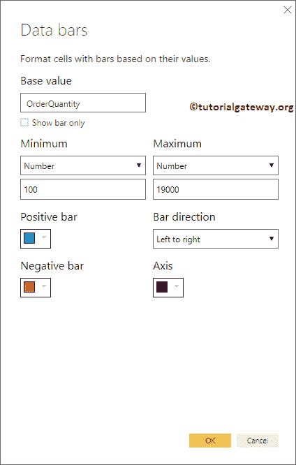

接下来，我们选中“仅显示栏”属性。

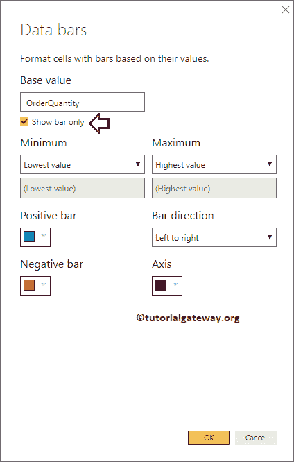

现在您只能看到数据栏(只有数据栏没有数值)。

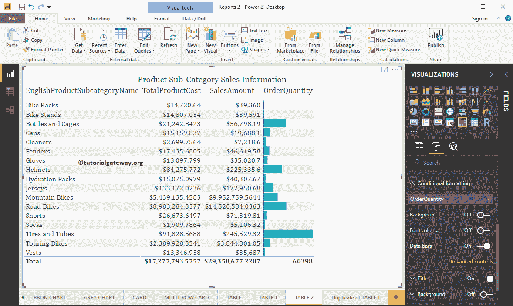