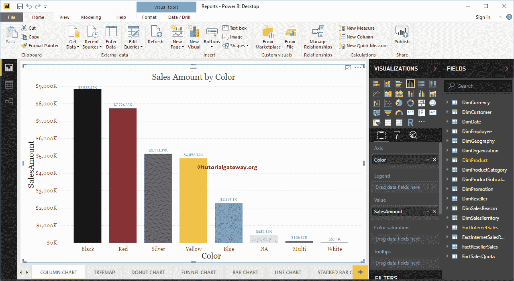

# 如何在 PowerBI 中对图表进行排序

> 原文：<https://www.tutorialgateway.org/how-to-sort-a-chart-in-power-bi/>

如何用例子对 Power BI 中的图表进行排序？。为了演示 Power BI 中的图表排序，我们将使用之前创建的柱形图。

请参考【电力 BI】文章中的[柱状图，了解](https://www.tutorialgateway.org/column-chart-in-power-bi/)[电力 BI](https://www.tutorialgateway.org/power-bi-tutorial/) 柱状图的创建。

## 如何在 PowerBI 示例中对图表进行排序

默认情况下，每个 PowerBI 图表都按度量值(数值)排序。请点击右上角的… (3 个点)查看排序栏。

从下面的截图中，您可以看到销售金额按降序排列图表。

如果要按销售额升序排序，那么点击左上角(我们标注的地方)

现在您可以看到，图表按销售金额升序排序。

如果要使用“维度”字段(或任何其他字段)作为排序选项，请选择该字段。让我选择按颜色排序选项

可以看到，图表是按颜色降序排列的(默认顺序)

您可以点击标记部分，按颜色升序对图表进行排序

例如，如果您的图表有两个以上的字段，那么您可以按这三个字段中的任何一个进行排序。从下面的[折线图](https://www.tutorialgateway.org/create-a-power-bi-line-chart/)中，您可以按州/省名称、销售额或产品总成本进行排序。

