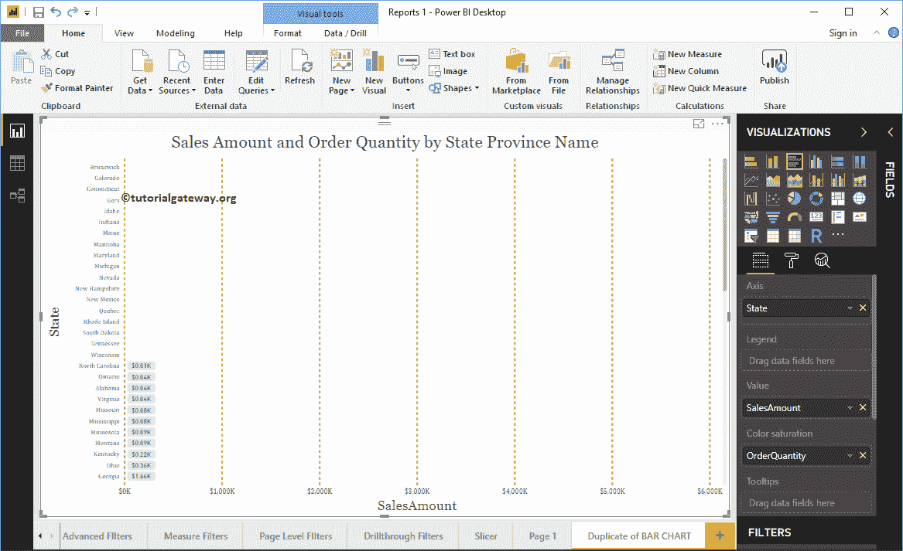

# 在PowerBI报告中显示空记录

> 原文：<https://www.tutorialgateway.org/show-empty-records-in-a-power-bi-report/>

在本节中，我们将通过一个示例向您展示如何在 Power BI 报告中显示空记录。当您创建 Power Bi 报告时，Power BI 会自动隐藏空记录。例如，当您为各州销售额创建报表时，它会隐藏销售额为空的所有州。

## 在PowerBI报告中显示空记录示例 1

在这个例子中，我们将使用我们在之前文章中创建的一个表。我建议你参考[创建表](https://www.tutorialgateway.org/create-a-table-in-power-bi/)一文来理解。如果你看一下 [Power BI](https://www.tutorialgateway.org/power-bi-tutorial/) 表，它没有任何没有销量的产品子类。

单击列(或字段)旁边的向下箭头将打开上下文菜单。

请从上下文菜单中选择“显示没有数据的项目”选项。

现在您可以看到销售为空的产品子类别。

让我滚动到表末尾

## 在PowerBI报告中显示空记录示例 2

在本例中，我们将使用之前创建的条形图。我建议你参考[创建条形图](https://www.tutorialgateway.org/power-bi-bar-chart/)文章来理解。

让我[按销售额升序排列](https://www.tutorialgateway.org/how-to-sort-a-chart-in-power-bi/)图表。如果你看图表，它没有任何州没有销售。

单击“状态列”旁边的向下箭头，并从上下文菜单中选择“显示没有数据的项目”选项。

现在你可以看到销售空的州

