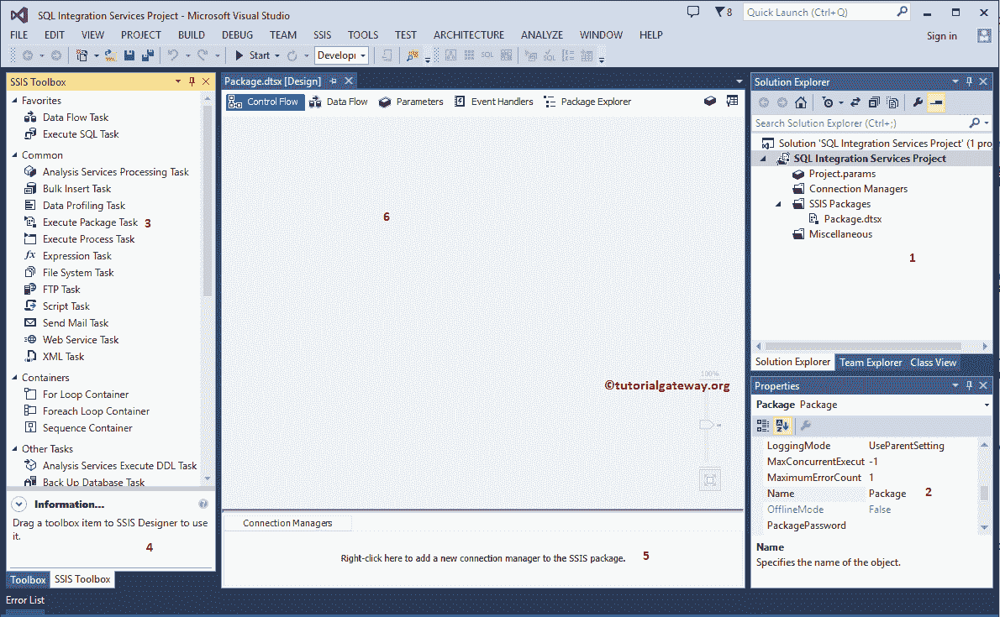

# SSIS 是什么

> 原文：<https://www.tutorialgateway.org/what-is-ssis/>

## SSIS 简介

微软的 SQL Server 集成服务也叫 SQL 集成服务或 SSIS。SSIS 是一个商业智能工具，为各种组织提供数据转换解决方案。

SQL Server 集成服务是一个 ETL(提取、转换和加载)工具。这意味着 SSIS 可以用来从各种各样的来源提取数据，如 Excel 文件，平面文件，XML 文件，关系数据库。此外，根据您的要求对它们进行转换(切片和切割)，最后将数据加载到目的地。

### 什么是 SSIS 工作环境？

下面的截图显示了什么是 [SSIS](https://www.tutorialgateway.org/ssis/) 工作环境，以及如何使用它来创建 SQL 集成服务项目。

从上面的截图中，我们将窗口分成了不同的部分

1.  解决方案资源管理器:这是项目级连接管理器、实际包和项目参数的组合。
2.  属性:使用此窗口更改每个任务的属性。
3.  工具箱:SSIS 工具箱提供了许多内置的任务、容器、转换、源、目标和管理任务来解决复杂的业务问题。通过在工作环境中拖放这些任务来使用这些图形工具。这意味着我们不必编写一行代码来执行大多数操作。
4.  信息:显示工具箱项的信息
5.  连接管理器:此窗口用于创建包级连接管理器
6.  包装设计

## 什么是 SSIS 项目开发

SQL Server 集成服务项目是连接管理器、包和项目参数(可选)的组合。

### 连接管理器

SSIS 致力于从不同来源提取数据，转换数据，并将其加载到完全不同的目的地。我们需要一个连接管理器来建立 SSIS 包和源、包和目的地之间的连接。

在 SQL Server 集成服务中，有两种类型的连接管理器。它们是包级(在第五个窗口中创建)和项目级(在解决方案资源管理器窗口中创建)。参考[连接管理器介绍](https://www.tutorialgateway.org/ssis-connection-managers/)一文了解。

### 包裹

这是我们设计完整数据流的地方。这里是我们执行所有转换的地方。

### 部署

包开发完成后，我们可以将包部署到生产环境中。