# 安装 SQL Server 数据工具

> 原文：<https://www.tutorialgateway.org/install-sql-server-data-tools/>

微软的商业智能开发工作室，简称为 BIDS，并不像以前的版本那样配备最新的 SQL Server。此外，微软已经将 BIDS 更名为微软 SQL Server 数据工具商业智能。

本文将向您展示安装商业智能开发工具或微软 SQL Server 数据工具的分步方法。我们也可以说，安装 SSRS，或者安装 SSIS 等等。

要下载应用，请点击此链接:[Microsoft Business Intelligence for Visual Studio](https://www.microsoft.com/en-us/download/details.aspx?id=42313)并选择语言(默认选择英语)，然后点击下载按钮。

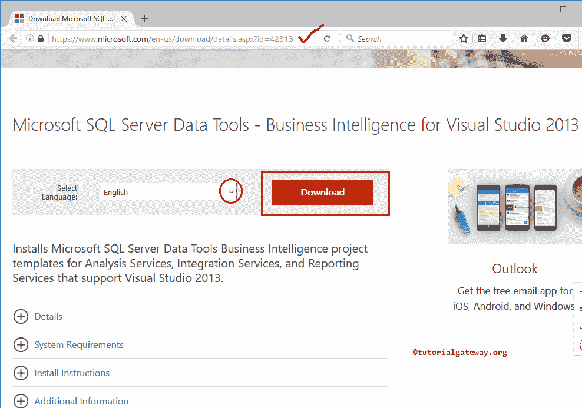

下载完成后，点击设置将打开以下窗口。

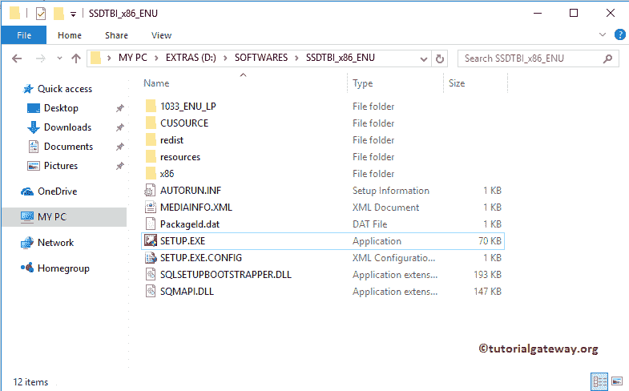

## 如何安装 SQL Server 数据工具

如果您正在从 2005 年、2008 年、2008 年 R2 或 2012 年的 [SQL Server](https://www.tutorialgateway.org/sql/) 升级，请选择第二个选项。

在这个例子中，我们没有任何以前的安装。所以，我们选择第一个选项。我建议你选择第一个选项:新的独立安装或在现有安装上增加功能

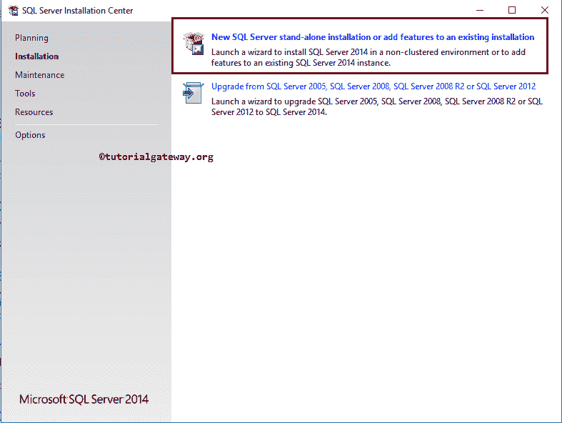

在此页面中，我们必须接受许可条款并点击【下一步】按钮

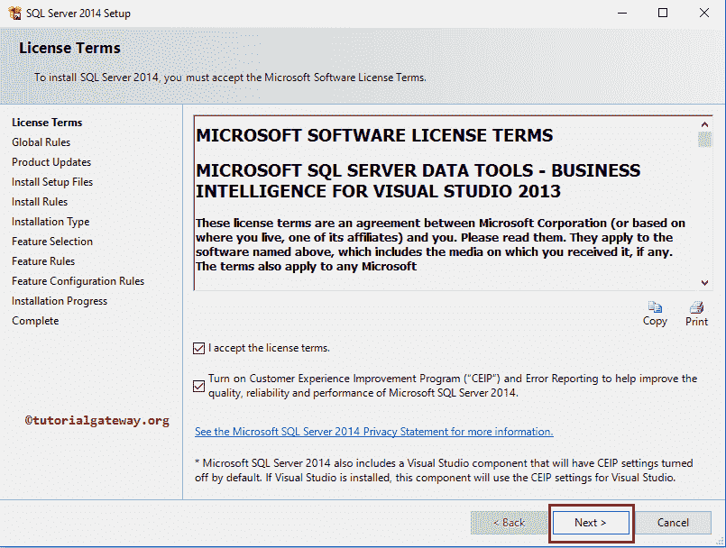

接下来，应用将寻找全局规则。如果您发现任何错误，请尝试重新运行。

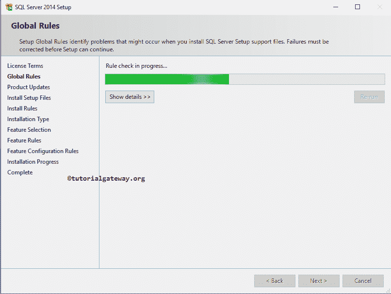

接下来，它将自动检查产品更新(如果有)

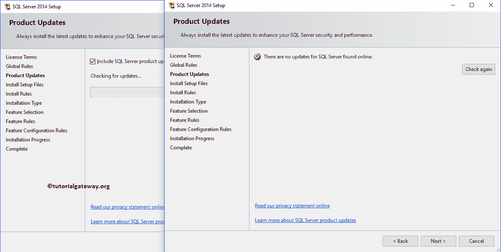

在下一个屏幕中，我们有两个选项:

执行新安装:如果您安装了 64 位，则必须选择此选项。因为微软只发布了 32 位的 SQL Server 数据工具。

这意味着，如果您选择第二个选项，您将向 64 位 SQL Server 添加 32 位组件，这将引发架构问题错误。

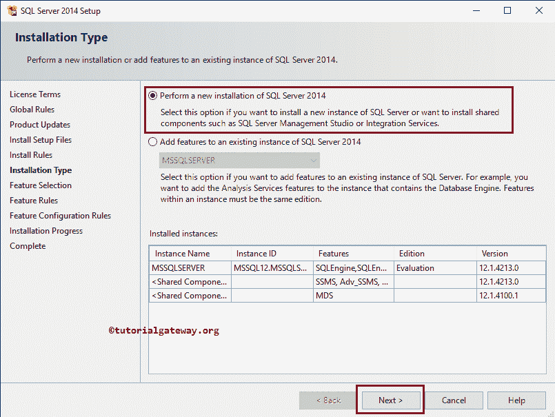

在下一个屏幕中，选择“SQL Server 数据工具 Visual Studio 2013 商业智能”，然后单击“下一步”按钮

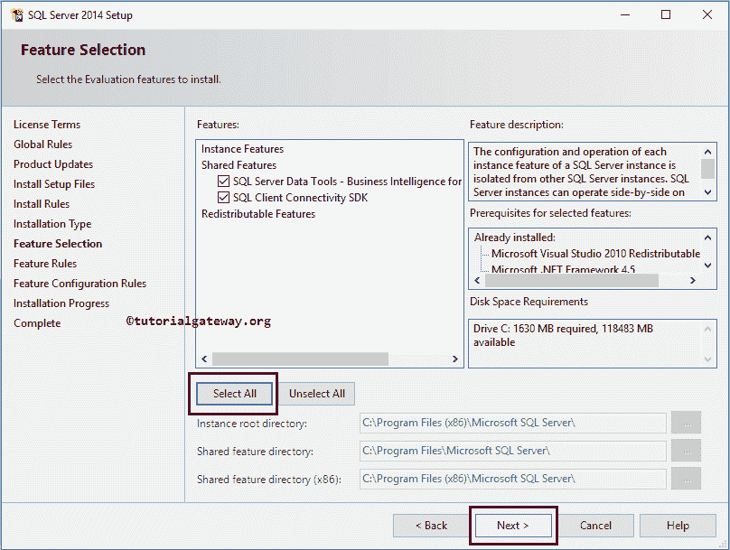

一旦点击下一步按钮，安装过程将开始

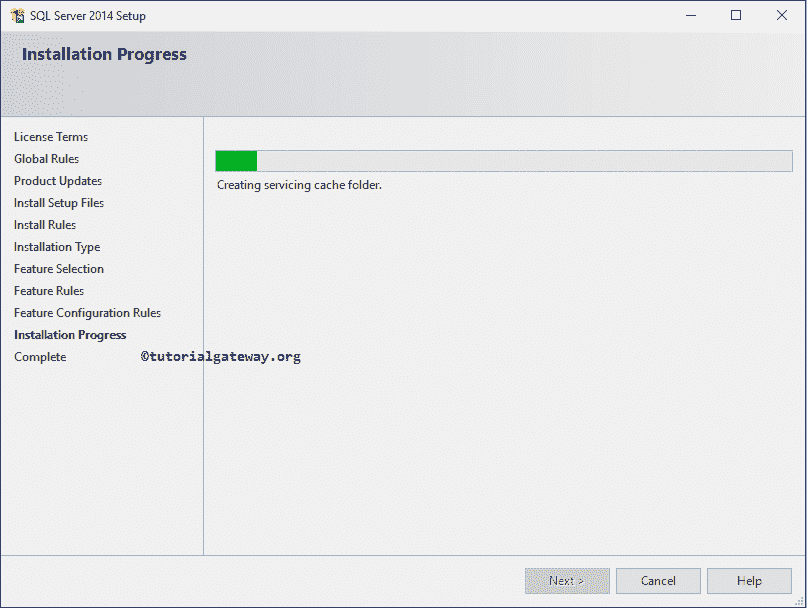

安装过程完成后，将显示“您的 2014 安装已成功完成，产品更新”窗口。请单击关闭按钮并开始使用 SQL Server 数据工具。

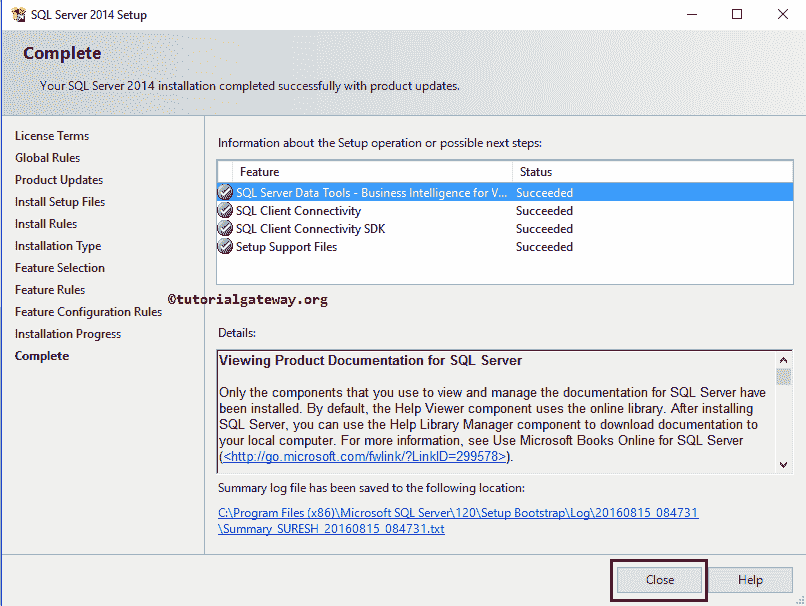

让我通过双击应用来打开应用。

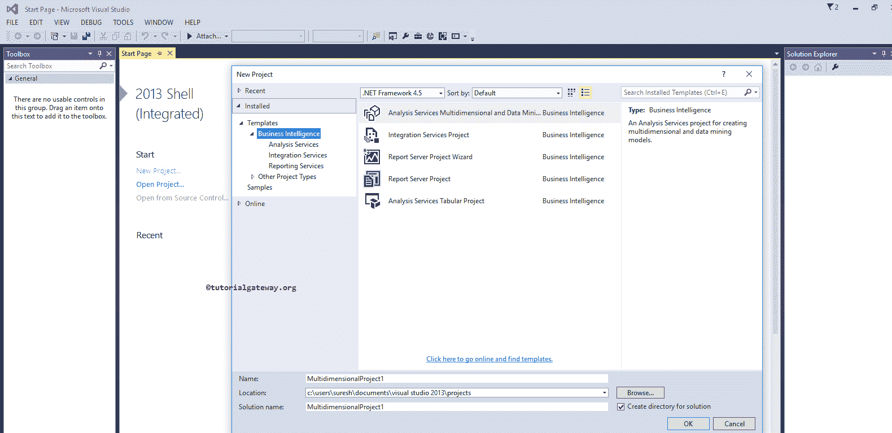