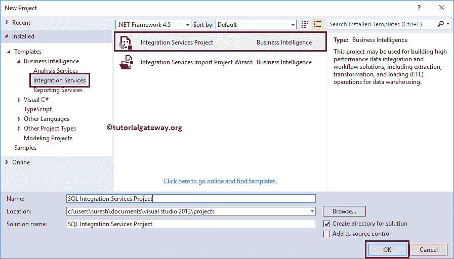

# 创建 SSIS 项目

> 原文：<https://www.tutorialgateway.org/create-a-ssis-project/>

SSIS 项目用于从各种来源提取数据，转换数据，最后将数据加载到目的地。在本文中，我们将通过一个示例展示创建 SSIS 项目的分步方法。

## 如何创建 SSIS 项目？

在本例中，我们将展示在 SSIS 创建新项目(SQL Server 集成服务)所涉及的步骤。为此，首先双击 SQL Server 数据工具或商业智能开发工作室(简称为 BIDS)

首先，从菜单项中选择文件选项。接下来，选择新建，然后选择新建项目…选项创建新的 SSIS 项目

一旦我们点击新建项目…选项，一个名为新建项目的新窗口将会打开。使用此窗口从可用的项目模板中选择所需的项目。让我们选择商业智能模板下的集成服务项目。接下来，我们将项目名称更改为 SQL 集成服务项目。

单击“确定”完成创建新的 SQL Server 集成服务项目。

让我们解释一下创建 SSIS 项目后的单个窗口

1.  解决方案资源管理器:使用此窗口创建项目级[连接管理器](https://www.tutorialgateway.org/ssis-connection-managers/)和包。
2.  属性:帮助更改每个任务的属性。
3.  工具箱:拖放任务、容器、转换、源、目的地，设计 [SSIS 包](https://www.tutorialgateway.org/ssis-package-tutorial/)。
4.  信息:单击工具箱项目查看此窗口中的信息
5.  连接管理器:用于创建包级连接管理器
6.  包装:设计包装