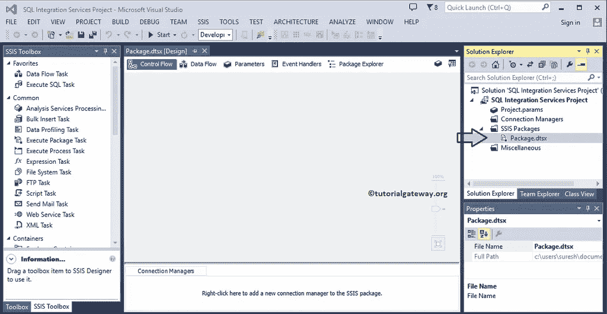
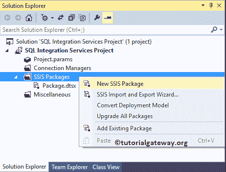
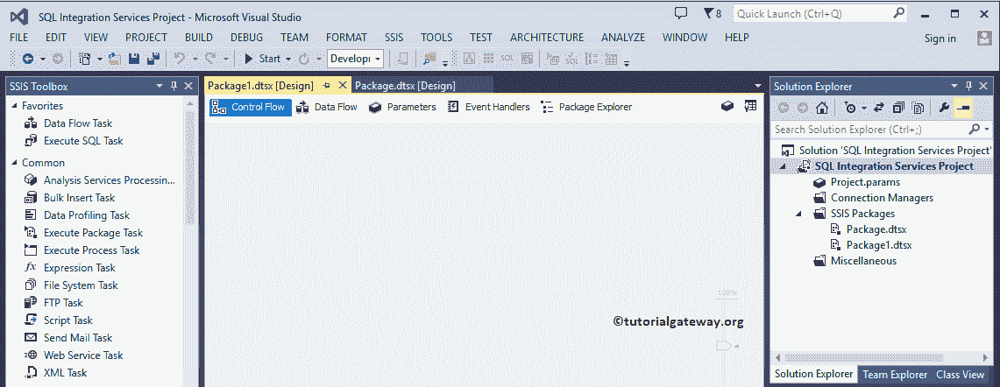
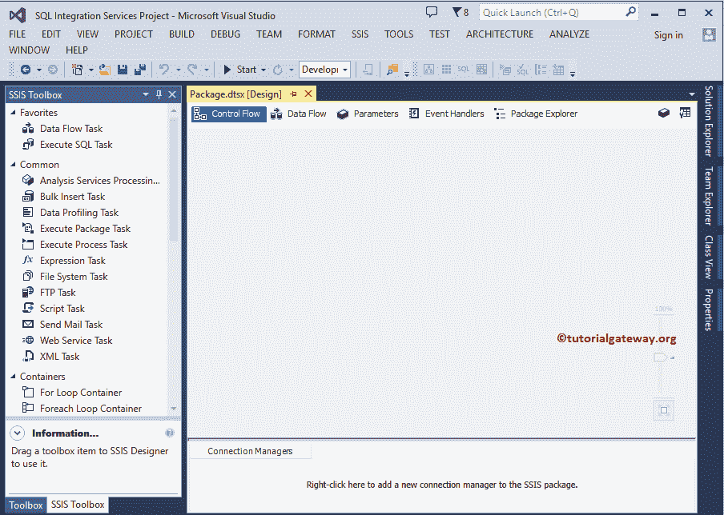
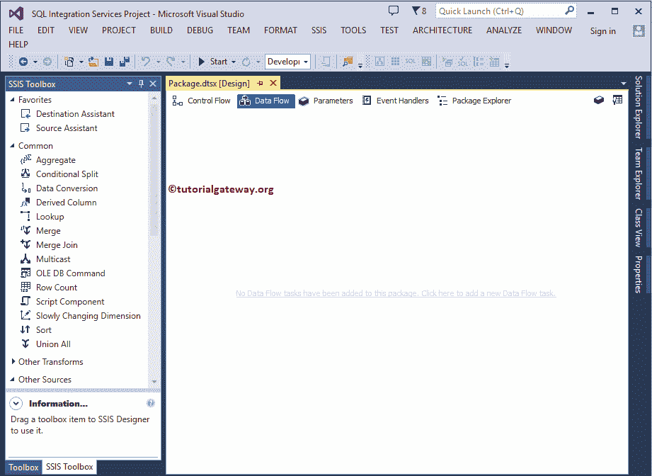
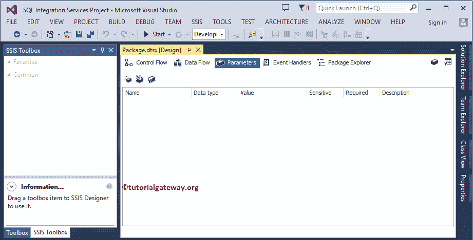
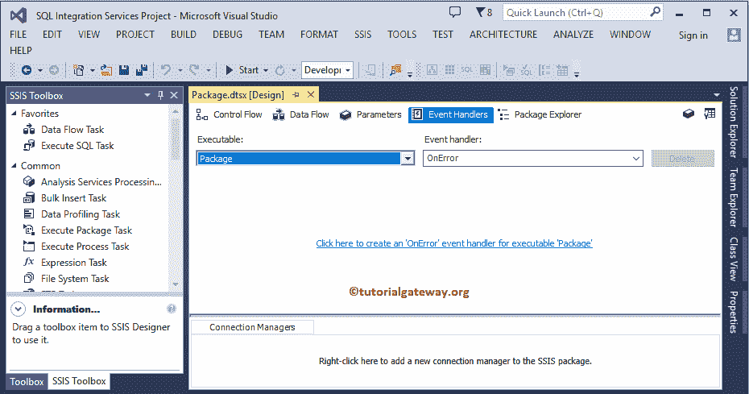
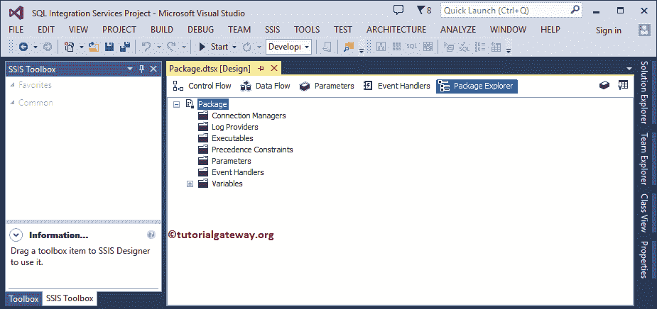

# SSIS 一揽子计划

> 原文：<https://www.tutorialgateway.org/ssis-package-tutorial/>

在 SSIS 包中是连接管理器、控制流任务、数据流元素、参数和事件处理程序的组合，用于执行 ETL 操作。

SSIS 包是关于从各种来源提取数据，转换它，并加载到完全不同的目的地。

## 创建 SSIS 包

当您创建一个[新项目](https://www.tutorialgateway.org/create-a-ssis-project/)时，BIDS 会自动创建一个新项目。但是，您可以选择在 [SSIS](https://www.tutorialgateway.org/ssis/) 创建新套餐。

为此，右键单击 SSIS 软件包文件夹，并从上下文菜单

中选择新 SSIS 软件包选项

它将创建一个新的包，如下图所示

## SSIS 套餐教程

如果你观察下面的截图，每个包有六个不同的标签。

### 连接管理器

我们需要一个连接管理器来建立 SSIS 包与源和目的地之间的连接。建议大家参考[连接管理器介绍](https://www.tutorialgateway.org/ssis-connection-managers/)一文了解一下。

### SSIS 包中的控制流任务

一个包应该包含至少一个控制流元素。控制流是容器、任务和优先约束的组合。

#### 容器

[For 循环](https://www.tutorialgateway.org/loop-container-ssis/)和 [Foreach 循环](https://www.tutorialgateway.org/ssis-foreach-loop-file-enumerator/)容器的工作方式类似于任何编程语言中的 For 循环和 Foreach 循环。序列容器有助于对多个任务进行分组。

#### 任务

控制流任务用于处理本地文件、文件传输协议文件、网络服务、脚本等。您也可以使用这些任务来执行数据库管理任务。

#### 优先约束

使用优先约束来控制任务流。例如，您可以编写在执行任何任务之前必须满足的限定表达式。

### SSIS 包数据流元素

数据流选项卡是源、转换和目标的组合。默认情况下，您不能在“数据流”选项卡中工作。因此，在开始处理“数据流”选项卡之前，必须在“控制流”选项卡中添加数据流任务。

从下面的截图中，您可以看到有三个部分和一个收藏夹部分:

#### 最喜欢的部分

如果不知道连接源或目的地的必要步骤，可以使用[源协助](https://www.tutorialgateway.org/source-assistance-in-ssis/)和目的地协助。这两个提供了一个详细而简单的向导。通过使用此向导，您可以与源和目标建立连接。

#### 来源

源是您想要提取数据的地方。SSIS 软件包支持多种来源，如 Excel 文件、平面文件、XML 文件、关系数据库

#### 转换

本节提供的[转换列表](https://www.tutorialgateway.org/ssis-transformations/)用于根据您的要求转换(切片和切片)数据。例如，您可以透视数据、合并两个表、排序表等。在里面。

#### SSIS 目的地

目的地是我们加载最终数据(转换后)的地方。SSIS 包支持多种目的地，如关系数据库、OLE DB、ODBC 目的地、Excel 目的地、平面文件目的地、XML 目的地等。

### 因素

SSIS 软件包参数帮助您修改它，而不需要更改整个软件包并重新填写它。在 SSIS 有两种类型的参数，它们是项目参数和包参数。建议大家参考 [SSIS 参数](https://www.tutorialgateway.org/ssis-project-parameters-vs-ssis-package-parameters/)文章了解参数的创建。

### 事件处理程序

此选项卡对于管理运行时引发的事件非常有用。例如，如果您希望包在执行后向经理发送电子邮件，那么可以为 onPostExecute 事件创建一个脚本任务。我建议您参考 SSIS 中的[事件处理程序，了解配置事件的过程。](https://www.tutorialgateway.org/event-handlers-in-ssis/)

### SSIS 包浏览器

该选项卡将显示所有元素，包括:连接管理器、任务、参数、事件处理程序、变量等。

