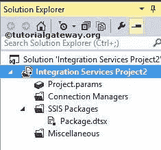
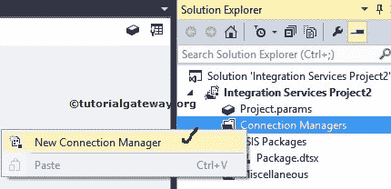
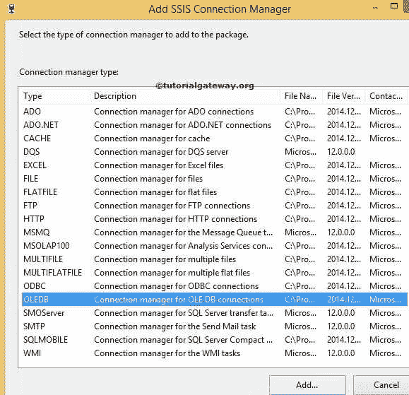
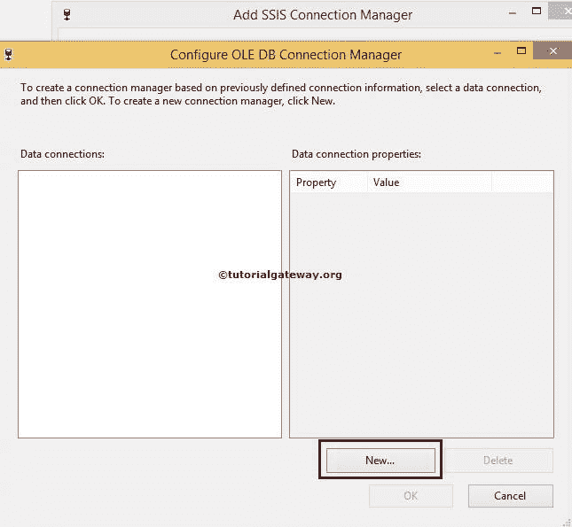
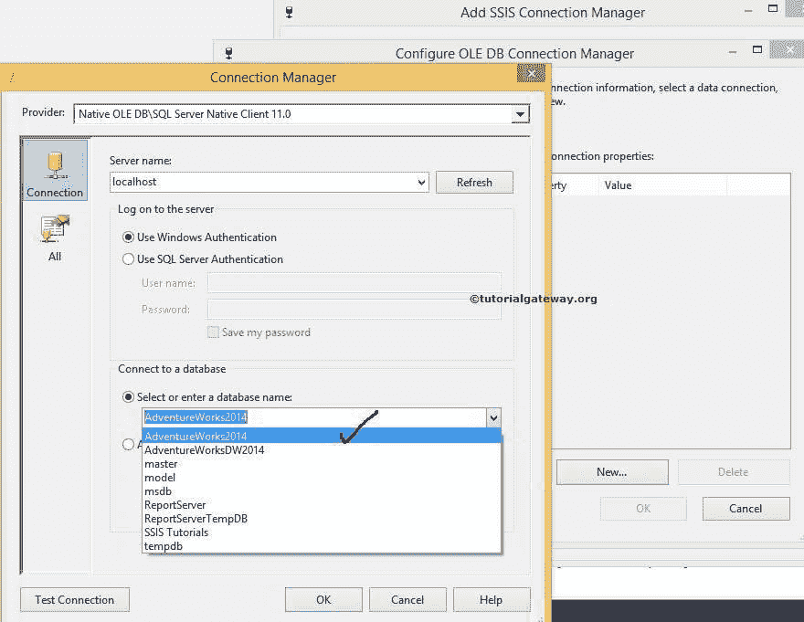
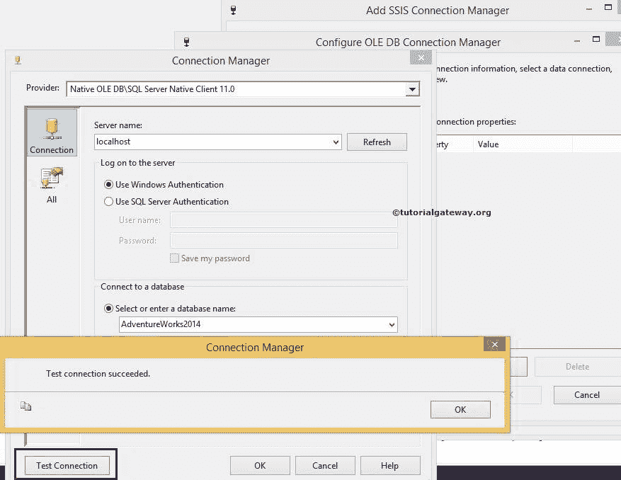
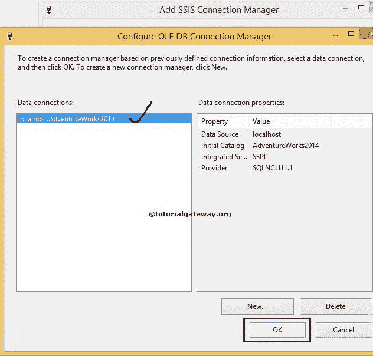
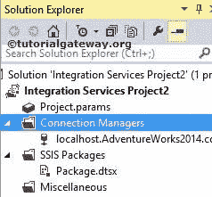
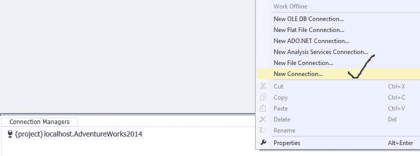
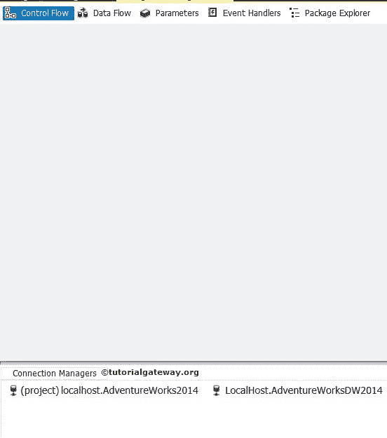

# SSIS 连接管理器

> 原文：<https://www.tutorialgateway.org/ssis-connection-managers/>

众所周知，微软的 SQL Server 集成服务包用于将不同来源的数据传输到不同的目标，如文件、Excel 工作表、SQL 数据库、Oracle 数据库。要提取数据或插入数据，我们需要一个合适的 SSIS 连接管理器。

SSIS 连接管理器包括连接字符串，它是服务器实例名称、数据库名称、提供程序名称和凭据的组合。

## 内置 SSIS 连接管理器

SQL Server 集成服务提供不同类型的内置连接管理器。SSIS 包将使用连接管理器连接到不同类型的数据源，如甲骨文、Access、Excel、文本文件、 [SQL Server](https://www.tutorialgateway.org/sql/) 、SQL Server Analysis Services。下表显示了 [SSIS](https://www.tutorialgateway.org/ssis/) 连接管理器列表

请参考缓存连接管理器文章来了解配置设置。

| 安全信息系统连接管理器 | 描述 |
| 麻烦 | 它用于连接 ActiveX 数据对象。或者可以称为 ADO 对象。请参考 SSIS 文章中 [ADO 连接管理器了解配置设置。](https://www.tutorialgateway.org/ado-connection-manager-in-ssis/) |
| ADO.NET | 这用于通过使用. NET 提供程序连接到数据源。请参考[SSIS ADO.NET 连线经理](https://www.tutorialgateway.org/ado-net-connection-manager-in-ssis/)文章。 |
| 躲藏 | 从数据流或缓存文件()中读取数据。caw ),并且可以将数据保存到缓存文件中。 |
| 德国管理体系认证公司 | 连接到数据质量服务服务器和服务器上的数据质量服务数据库。 |
| 超过 | 连接到 Excel 工作簿文件。请参考 SSIS 的 [Excel 连接管理器了解配置设置。](https://www.tutorialgateway.org/excel-connection-manager-in-ssis/) |
| 文件 | 连接到文件或文件夹。请参见[文件连接管理器](https://www.tutorialgateway.org/file-connection-manager-in-ssis/)了解配置设置。 |
| 扁锉 | 连接到单个平面文件中的数据。 |
| 文件传送协议 | 这将连接到一个 FTP 服务器。请参考 [FTP 连接管理器](https://www.tutorialgateway.org/ssis-ftp-connection-manager/)。 |
| 超文本传送协议 | 连接到网络服务器。 |
| 消息队列 | 连接到消息队列。 |
| MSOLAP100 足球俱乐部 | 连接到 SQL Server 分析服务实例或分析服务项目。 |
| 多个的 | 连接到多个文件和文件夹。 |
| 多平台文件 | 连接到多个数据文件和文件夹。 |
| 成为 DB | 使用 OLE 数据库提供程序连接到数据源。请参考[SSIS OLE DB 连接管理器](https://www.tutorialgateway.org/ole-db-connection-manager-in-ssis/)文章了解配置设置。 |
| 开放式数据库连接性 | 使用 ODBC 连接到数据源。 |
| SMOSERVER | 连接到 SQL Server 管理对象(SMO)服务器。请参考 [SMO 连接管理器](https://www.tutorialgateway.org/smo-connection-manager-in-ssis/)文章了解配置设置。 |
| 简单邮件传输协议 | 连接到 SMTP 邮件服务器。 |
| SQL MOBILE | 连接到一个 SQL Server 压缩数据库。 |
| 理系统构造 | 连接到服务器并指定服务器上 Windows 管理规范(WMI)管理的范围。 |

## 配置 SSIS 连接管理器

在 SQL Server 集成服务中，有两种类型的连接管理器:包级连接管理器和项目级连接管理器

### 在 SSIS 配置项目级连接管理器

如果您配置了项目级 SSIS 连接管理器，那么我们在该项目下创建的所有包都可以使用该连接。如果您需要多个包中的连接，那么在 SSIS 创建项目级连接管理器是一个很好的做法。

提示:在实时中，我们主要使用项目级连接管理器。但是在某些情况下，我们使用包级连接管理器。

此示例显示如何在 SQL Server 集成服务(SSIS)中创建或配置项目级连接管理器

一旦你在 SSIS 领导下创建了一个新项目。如果您查看解决方案资源管理器，我们有几个文件夹。现在，让我们专注于连接管理器文件夹。

右键单击解决方案资源管理器中的连接管理器文件夹，并从菜单中选择新建连接管理器选项。

单击此选项时，将打开添加 SSIS 连接管理器窗口，从列表中选择连接管理器类型。

目前，我们从列表中选择了 OLE DB 连接管理器。一旦我们选择了 OLE 数据库，那么另一个窗口形式的配置 OLE 数据库连接管理器就会打开来配置数据连接。

如果您观察到以上情况，数据连接窗格是空的，因为我们以前没有创建任何连接管理器。如果我们之前创建了任何连接管理器，那么我们可以在这里选择它们，而不是一次又一次地创建它们。

点击上面截图中的新按钮将打开另一个连接管理器窗口。使用此选项选择提供程序、服务器名称和数据库名称。

从上面的截图中，您可以看到我们使用本地主机 windows 帐户作为服务器名称，使用[AdventureWorks2014]作为数据库名称。

注意:实时情况下，您必须选择使用 SQL Server 身份验证选项。接下来，提供您的管理员提供的有效凭据。

单击下面提供的“测试连接”按钮，检查连接是否成功。

完成配置后，OLE 数据库连接管理器的名称将显示在数据连接窗格中。因此，选择创建的连接管理器，然后单击 ok。

我们成功创建了项目级 SSIS 连接管理器。

从上面的截图，可以观察到 SSIS 的项目级连接管理器。

### 在 SSIS 配置包级连接管理器

如果您在 SSIS 配置包级连接管理器，那么该连接将可用于该特定包。你不能在包裹外面取。

提示:如果您只在一个包中需要该连接，而不在另一个包中使用它，那么创建项目级连接管理器就没有意义了。因此，选择包级连接管理器。

在包设计器的底部，右键单击连接管理器窗格。它将弹出上下文菜单来选择连接管理器。

此上下文菜单将显示一些常用的连接管理器(OLE DB、平面文件、ADO.NET、分析服务和文件连接)。如果没有找到所需的连接，请选择“新建连接”选项。

在本例中，我们正在创建 OLE 数据库连接管理器。这意味着我们可以从上下文菜单中选择新建 OLE DB 连接选项。但是如果你从上面的截图观察，我们选择了新连接选项。这有助于您在创建 SSIS 连接管理器时了解相似之处。

当您单击新建连接管理器选项时，将打开添加 SSIS 连接管理器窗口表单，从提供的列表中选择连接管理器。

这里我们选择了 OLEDB 连接管理器。同样，我们必须按照前面提到的步骤进行配置。

从上面的截图可以看到，有一个项目级连接管理器和一个包级 SSIS 连接管理器。