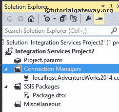

# SSIS 的 OLE 数据库连接管理器

> 原文：<https://www.tutorialgateway.org/ole-db-connection-manager-in-ssis/>

SSIS 的 OLE DB 连接管理器使 SQL Server 集成服务包能够使用 OLE DB 提供程序与数据库连接。例如，一个 OLE DB 连接管理器使用微软的 SQL Server OLE DB 提供程序来连接微软的 SQL Server。

实时地，在设计 SSIS 包时，OLE DB 连接管理器是最常用的连接管理器。以下是我们使用的一些场合:

*   [SSIS 的 OLE DB 源](https://www.tutorialgateway.org/ole-db-source-in-ssis/)使用 OLE DB 连接管理器从 [SSIS](https://www.tutorialgateway.org/ssis/) 的数据库中连接和提取数据
*   [OLE DB 目标](https://www.tutorialgateway.org/ssis-ole-db-destination/)使用 OLE DB 连接管理器连接数据库并将数据写入数据库
*   [术语查找转换](https://www.tutorialgateway.org/term-lookup-transformation-in-ssis/)只支持 OLE DB 连接管理器连接术语查找表(或引用表)。
*   [术语抽取转换](https://www.tutorialgateway.org/term-extraction-transformation-in-ssis/)只支持 SSIS OLE DB 连接管理器添加排除列表。
*   [执行 SQL 任务](https://www.tutorialgateway.org/execute-sql-task-in-ssis/)使用 OLE DB 连接管理器连接数据库并从中提取数据
*   OLE 数据库连接管理器也有助于从非托管代码中访问数据。

## 在 SSIS 配置 OLE 数据库连接管理器

在本例中，我们将展示如何在 SSIS 创建或配置 OLE DB 连接管理器(SQL Server 集成服务)

一旦你在 SSIS 领导下创建了一个新项目。如果您查看解决方案资源管理器，我们有四个文件夹。现在，让我们专注于连接管理器文件夹。

在解决方案资源管理器中，右键单击连接管理器，并从上下文菜单中选择新建连接管理器选项。

当您单击新建连接管理器选项时，将打开添加 SSIS 连接管理器窗口表单，从给定列表中选择连接管理器。

这里我们从列表中选择了 OLE 数据库连接管理器。一旦我们选择了 OLE DB 连接管理器，另一个窗口形式的配置 OLE DB 连接管理器将被打开来配置数据连接。

如果您观察到以上情况，数据连接窗格是空的，因为我们以前没有创建任何连接管理器。如果我们在此之前创建了任何连接管理器，而不是一次又一次地创建它们，我们可以在这里选择它们。

点击上面截图中的新建按钮。它将打开连接管理器的另一个窗口形式，以选择提供程序、服务器名称和数据库名称。

从上面的截图中，您可以看到我们使用本地主机 windows 帐户作为服务器名称，使用[AdventureWorks2014]作为数据库名称。

注意:实时情况下，您必须选择使用 SQL Server 身份验证选项。并提供您的管理员提供的有效凭据。

单击下面提供的“测试连接”按钮，检查连接是否成功。

配置完连接管理器后，OLE 数据库连接管理器的名称将显示在数据连接窗格中。因此，选择创建的连接管理器并单击 ok。

单击“确定”按钮完成 OLE 数据库连接管理器的配置。

从上面的截图可以观察到，我们在 [SQL Server 上成功创建了 SSIS 的 OLE DB 连接管理器。](https://www.tutorialgateway.org/sql/)