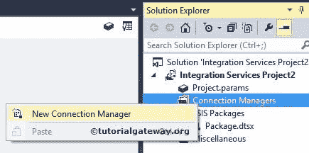

# SSIS 的 ADO 连接管理器

> 原文：<https://www.tutorialgateway.org/ado-connection-manager-in-ssis/>

SSIS 的 ADO 连接管理器支持 SQL Server 集成服务包与 ActiveX 数据对象(简称 ADO 对象)连接。例如，如果我们想连接到以前版本(VB 6)中编写的数据源，那么我们可以使用这个 SSIS ADO 连接管理器。

## 在 SSIS 配置 ADO 连接管理器

在这个例子中，我们将展示如何在 SSIS 创建或配置 ADO 连接管理器(SQL Server 集成服务)

一旦你在 SSIS 领导下创建了一个新项目。如果您查看解决方案资源管理器，我们有四个文件夹。现在，让我们专注于连接管理器文件夹。

右键单击解决方案资源管理器中的 [SSIS](https://www.tutorialgateway.org/ssis/) 连接管理器文件夹，并从上下文菜单中选择新建连接管理器选项。

当您单击新建连接管理器选项时，将打开添加 SSIS 连接管理器窗口表单，从提供的列表中选择连接管理器。

这里我们从列表中选择了 ADO 连接管理器。一旦我们选择了 ADO 连接管理器，另一个窗口形式的配置 OLEDB 连接管理器就打开了。使用它来配置 SSIS ADO 连接管理器的数据连接。

如果您观察到以上情况，“数据连接”窗格不是空的。因为我们之前已经创建了一些连接，这就是它们显示的原因。如果您是第一次创建 ADO 连接管理器，那么“数据连接”窗格将为空。如果需要，可以从列表中选择连接管理器。或者，您可以通过单击新建按钮来创建一个新的 ADO 连接管理器。

点击上面截图中的新建按钮。它将打开另一个窗口形式的连接管理器。使用此窗口选择提供程序、服务器名称和数据库名称。

在这个例子中，我们连接的是 [SQL Server](https://www.tutorialgateway.org/sql/) 。因此，让我们从提供程序下拉列表中选择 SQL Server 本机客户端。

请提供 SQL Server 实例名，然后从下拉列表中选择数据库。

从上面的截图中，您可以观察到我们正在使用我们的 windows 帐户作为服务器名称。和[TRANSFERDBTASKS]作为数据库名称。

注意:实时情况下，您必须选择使用 SQL Server 身份验证选项。并提供您的管理员提供的有效凭据。

单击下面提供的“测试连接”按钮，检查连接是否成功。

完成连接管理器的配置后，ADO 连接管理器的名称将显示在“数据连接”窗格中，选择创建的连接管理器，然后单击“确定”。

单击“确定”按钮完成 SSIS ADO 连接管理器的配置。

从上面的截图中，您可以观察到我们在 SSIS 成功创建了 ADO 连接管理器。