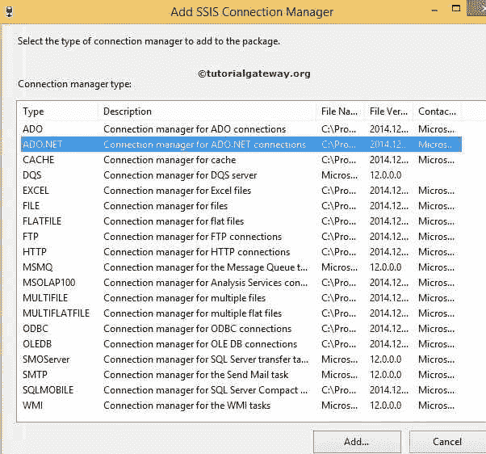
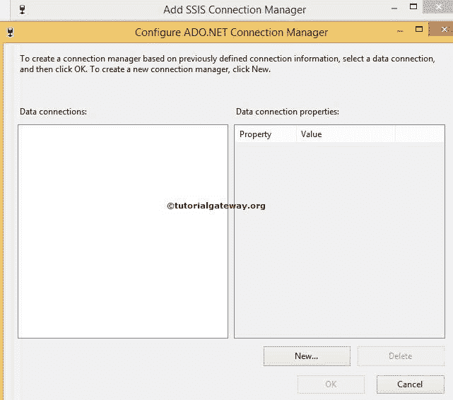
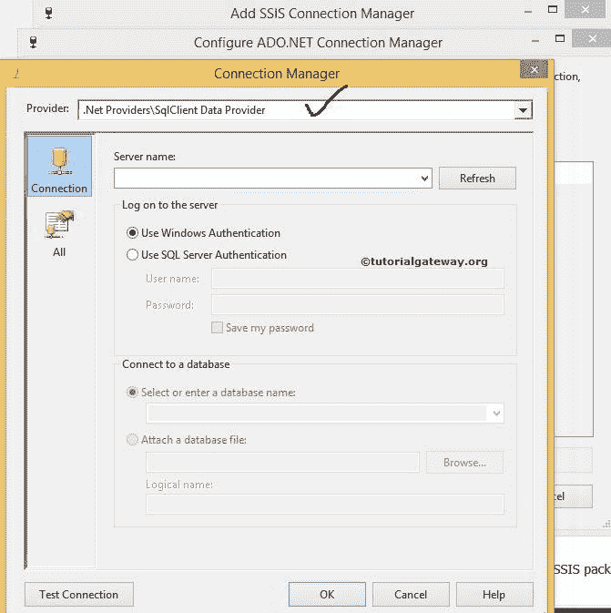
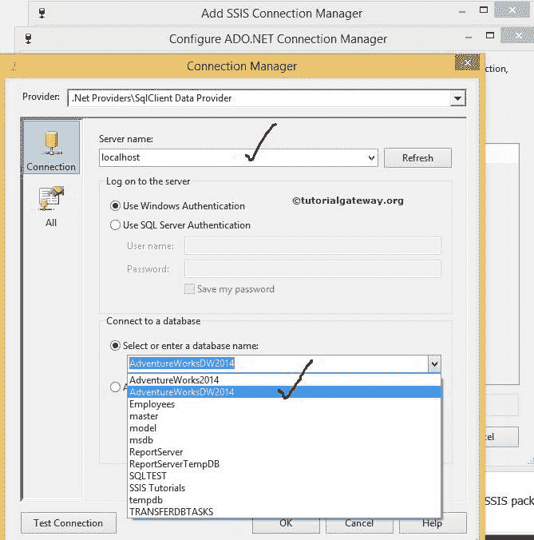
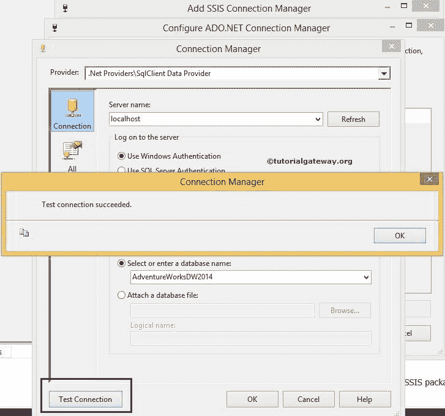
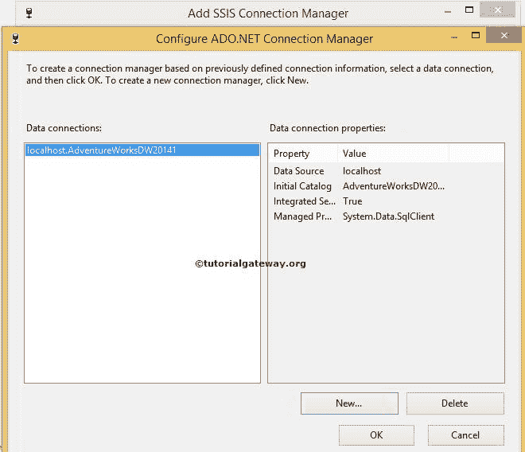
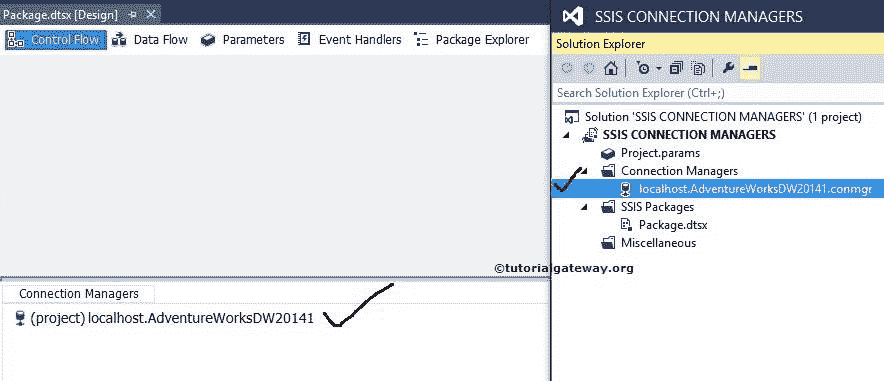

# SSIS ADO.NET 连接经理

> 原文：<https://www.tutorialgateway.org/ado-net-connection-manager-in-ssis/>

SQL Server 集成服务中的 ADO.NET 连接管理器使 SSIS 包能够使用托管。NET 提供程序。例如，SSIS ADO.NET 连接管理器使用 SqlClient 数据提供程序与 Microsoft SQL Server 连接。以下是 ADO.NET 连接管理器的一些重要属性:

*   SSIS ADO.NET 连接管理器使用托管。NET 提供程序来访问数据库。
*   该连接管理器对于访问用托管代码编写的数据源非常有用。
*   SSIS 的 ADO.NET 连接管理器通常用于访问微软的 SQL Server
*   SSIS ADO.NET 连接管理器支持许多托管提供程序，如 SqlClient、ODBC 和 OLE DB。
*   ADO.NET 连接管理器中的 OLE DB 提供程序允许我们访问 OLE DB 支持的数据源。
*   在实时中，最常用的是 SqlClient 数据提供程序。NET 提供程序。

注意:在 ADO.NET 连接管理器中使用 OLE 数据库提供程序将影响性能，因为它必须在 OLE 数据库(非托管提供程序)上添加额外的托管大型对象。

## 在 SSIS 配置 ADO.NET 连接管理器

在本例中，我们将展示如何在 [SSIS](https://www.tutorialgateway.org/ssis/) (SQL Server 集成服务)中创建或配置 ADO.NET 连接管理器

一旦你在 SSIS 领导下创建了一个新项目。如果您查看解决方案资源管理器，我们有三个文件夹。现在，让我们专注于连接管理器文件夹。

右键单击解决方案资源管理器中的连接管理器文件夹，并从上下文菜单中选择新建连接管理器选项。

当您单击新建连接管理器时，将打开添加 SSIS 连接管理器窗口，从列表中选择连接管理器。

这里我们从列表中选择了 ADO.NET 连接管理器。选择 ADO.NET 连接管理器后，将打开配置 ADO.NET 连接管理器窗口来配置数据连接。

如果您观察到以上情况，数据连接窗格是空的，因为我们以前没有创建任何连接管理器。如果我们在此之前创建了任何连接管理器，而不是一次又一次地创建它们，我们可以在这里选择它们。

点击上面截图中的新建按钮。它将打开连接管理器的另一个窗口形式，以选择提供程序、服务器名称和数据库名称。

从上面的截图中，您可以看到我们选择了 SqlClient 数据提供程序。

从上图中，可以看到我们使用本地主机 windows 帐户作为服务器名称，使用[AdventureWorks2014]作为数据库名称。

注意:实时情况下，您必须选择使用 SQL Server 身份验证选项。并提供您的管理员提供的有效凭据。

单击下面提供的“测试连接”按钮，检查连接是否成功。

配置完连接管理器后，SSIS ADO.NET 连接管理器的名称将显示在数据连接窗格中，因此请选择创建的连接管理器，然后单击确定。

单击确定按钮完成 ADO.NET 连接管理器的配置。

从上面的截图可以观察到，我们在 SSIS 成功创建了 above 连接管理器。