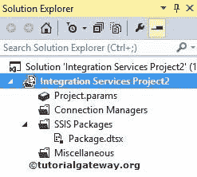
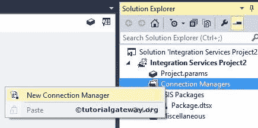
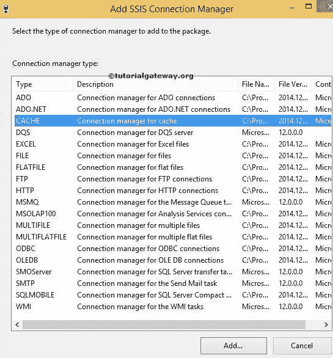
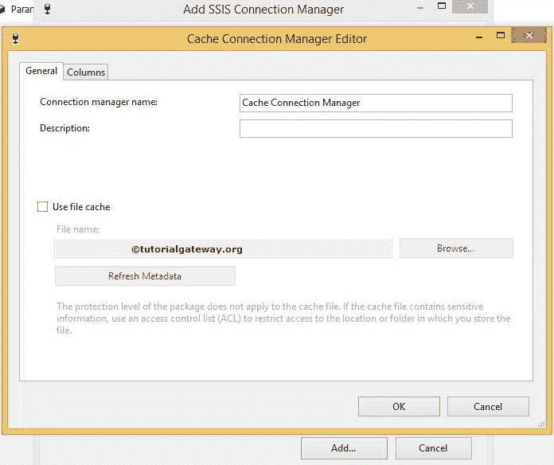
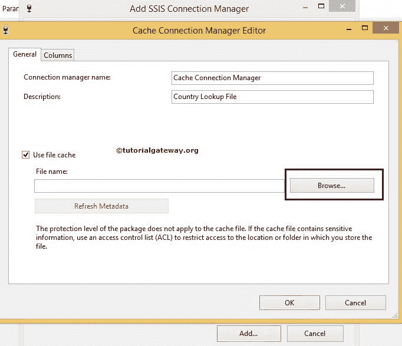
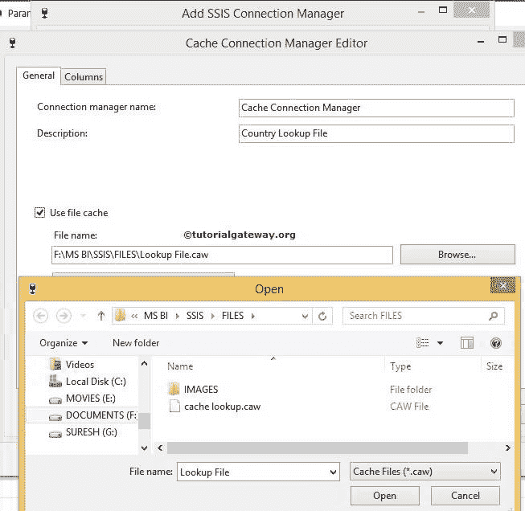
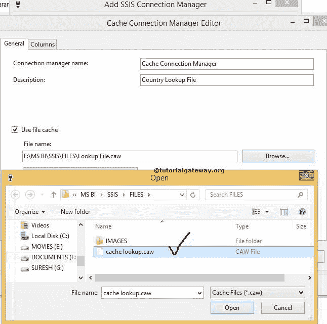
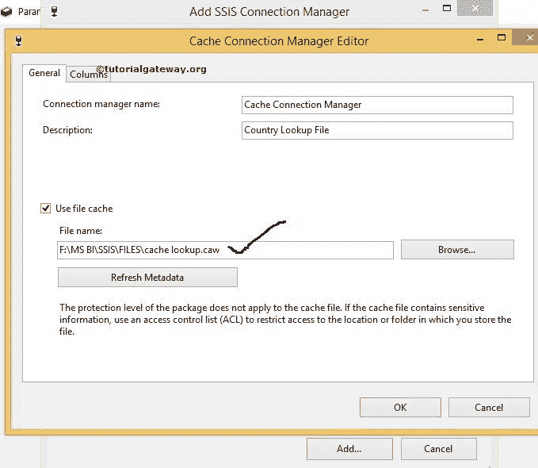
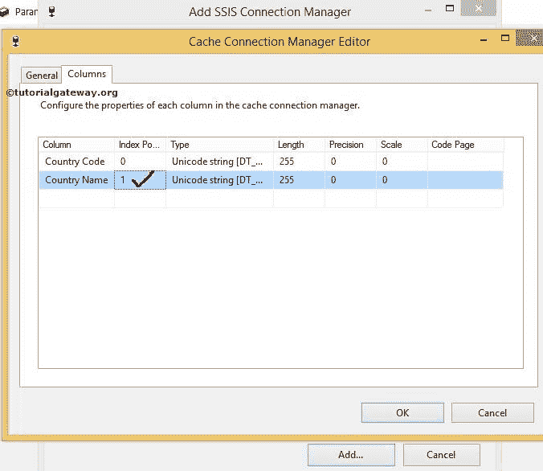
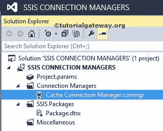

# SSIS 的缓存连接管理器

> 原文：<https://www.tutorialgateway.org/cache-connection-manager-in-ssis/>

缓存转换中使用的 SSIS 缓存连接管理器。查找转换使用此连接管理器使用缓存文件执行查找操作。

SSIS 的缓存连接管理器执行两项操作:

*   缓存连接管理器从缓存转换中读取数据，并将数据保存在扩展名为. caw 的缓存文件中
*   此转换使用缓存连接管理器从缓存文件中读取数据

请参考[全缓存模式下的查找转换](https://www.tutorialgateway.org/ssis-lookup-transformation-in-full-cache-mode/)一文，了解如何在 [SSIS](https://www.tutorialgateway.org/ssis/) 使用查找转换中的缓存文件。

## 在 SSIS 配置缓存连接管理器

在本例中，我们将展示如何在 SQL Server 集成服务(SSIS)中创建或配置缓存连接管理器

一旦你在 SSIS 领导下创建了一个新项目。如果您查看解决方案资源管理器，我们有三个文件夹。现在，让我们专注于连接管理器文件夹。

右键单击解决方案资源管理器中的连接管理器文件夹，并从上下文菜单中选择新建连接管理器选项。

当您单击新建连接管理器选项时，将打开添加 SSIS 连接管理器窗口，从列表中选择连接管理器。

在这里，我们从列表中选择了缓存连接管理器。一旦我们选择了缓存连接管理器，缓存连接管理器编辑器的另一个窗口就会打开，以配置缓存连接管理器。

常规选项卡

缓存连接管理器编辑器框中的常规选项卡提供了一个选项:是否要将数据保存到缓存文件中。或者您想读取缓存文件中的数据。“常规”选项卡中提供了以下选项

*   连接管理器名称:请根据公司要求提供缓存连接管理器的名称。
*   描述:请描述连接。这些信息将有助于其他人理解这个缓存连接的作用
*   使用文件缓存:请选中此选项以使用缓存文件。如果选中此选项，将打开浏览按钮和文件框来浏览所需的文件。
*   文件名:缓存文件路径和文件名将显示在这里。(或缓存文件的地址)
*   浏览:一旦你点击这个按钮，它会打开一个新窗口来选择所需的文件名。您可以选择已经存在的缓存文件，也可以创建新的缓存文件。
*   刷新元数据:删除列的旧元数据，然后重新生成新元数据。

从下面的截图中，您可以看到我们更改了缓存连接管理器的名称和描述。现在，单击浏览按钮选择缓存文件。

单击“浏览”按钮后，将打开一个新窗口来选择现有的缓存文件或创建新文件。

从上面的截图中，我们已经在文件夹中有了一个缓存文件。要创建一个新的，在文件名处输入文件名，就像我们上面做的那样(查找文件)。它将创建一个新的缓存文件。

现在，让我们看看如何选择现有文件

单击打开按钮选择缓存查找. caw 文件。

我们使用缓存连接管理器选择完了现有的缓存文件。现在我们必须配置列选项卡

索引位置:我们必须指定缓存文件中每一列的索引位置。对于所有非索引列，索引位置将为 0。对于所有索引列，索引位置都是正数。

这是查找转换最重要的属性，因为查找转换将对具有正索引的列执行查找。对于本例，“国家/地区名称”列具有唯一的值。因此，我们将该列的索引位置更改为 1。

单击确定按钮完成缓存连接管理器的配置。

从上图中，您可以看到我们在 SSIS 成功创建了缓存连接管理器。