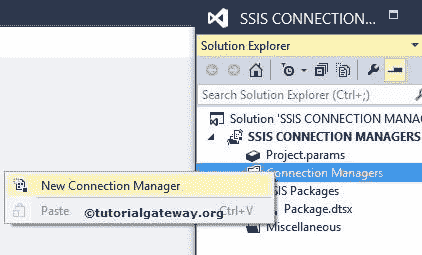
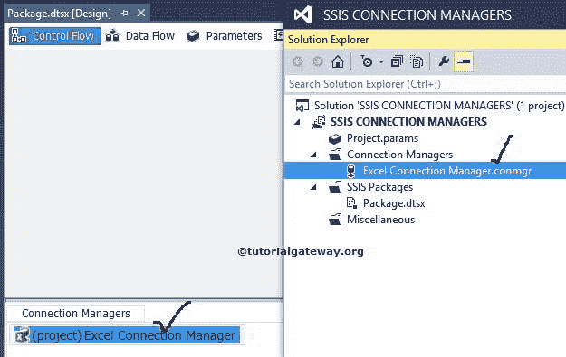

# SSIS 的 Excel 连接管理器

> 原文：<https://www.tutorialgateway.org/excel-connection-manager-in-ssis/>

SSIS 的 Excel 连接管理器用于将 SQL Server 集成服务包与 Excel 文件或 Excel 工作簿连接起来。

## 在 SSIS 配置 Excel 连接管理器

下面的截图显示了 Excel 文件中的数据，我们将在本例中使用相同的数据

一旦你在 SSIS 领导下创建了新项目。让我们专注于连接管理器文件夹。

右键单击解决方案资源管理器中的连接管理器文件夹，并从上下文菜单中选择新建连接管理器选项。

当您单击新建连接管理器选项时，将会打开添加 SSIS 连接管理器窗口。使用此选项从列表中选择连接管理器。

这里我们从列表中选择了 Excel 连接管理器。一旦我们选择了 [SSIS](https://www.tutorialgateway.org/ssis/) EXCEL 连接管理器，就会打开 EXCEL 连接管理器的另一个窗口来配置文件路径。

点击浏览按钮将打开一个新窗口来浏览驱动器。

从上面的截图中，您可以看到我们选择了 COPY PRODUCTS.xls 文件。并且文件是微软 Excel 97-2003 格式。所以我们没有更改 Excel 版本。

如果您观察 COPY PRODUCTS.xls 文件中的数据，它的第一行有像颜色、产品名称和价格这样的列名。因此，请勾选第一行有列名选项。

单击“确定”按钮完成 Excel 连接管理器的配置。

从上图可以看到，我们在 SSIS 成功创建了 Excel 连接管理器。