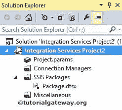

# SSIS 的文件连接管理器

> 原文：<https://www.tutorialgateway.org/file-connection-manager-in-ssis/>

SSIS 的文件连接管理器支持 SQL Server 集成服务包与文件系统中的文件和文件夹连接。SSIS 文件连接管理器不仅允许我们连接现有的文件和文件夹，还可以在运行时创建新的文件和文件夹。

提示:在 SSIS，文件系统任务仅使用文件连接管理器来连接文件和文件夹。

## 在 SSIS 配置文件连接管理器

在本例中，我们将展示如何在 [SSIS](https://www.tutorialgateway.org/ssis/) (SQL Server 集成服务)中创建或配置文件连接管理器

一旦你在 SSIS 领导下创建了一个新项目。如果您查看解决方案资源管理器，我们有三个文件夹。现在，让我们专注于连接管理器文件夹。

右键单击连接管理器文件夹，并从上下文菜单中选择新建连接管理器选项。

当您单击新建连接管理器选项时，将打开添加 SSIS 连接管理器窗口表单。使用此选项从列表中选择连接管理器。

这里我们必须从提供的列表

中选择文件连接管理器

选择文件的连接管理器后，SSIS 文件连接管理器编辑器将在新窗口中打开。使用这个编辑器，我们必须配置文件和文件夹的连接。

*   文件:此文本框将显示选定文件或文件夹的完整路径。
*   浏览:此按钮将用于遍历文件系统以找到所需的文件或文件夹。
*   使用类型:文件连接管理器为我们提供了四种不同的选项来连接文件和文件夹。下表详细解释了它们的功能:

| 使用类型 | 描述 |
| 创建文件 | 该选项在运行时创建一个新文件。例如，如果我们要重命名文件，那么我们必须用新名称创建一个新文件。 |
| 现有文件 | 使用文件系统中已经存在的文件很有帮助。例如，如果我们想将一个文件从一个位置复制或移动到另一个位置，那么我们必须选择这个选项。 |
| 创建文件夹 | 此 SSIS 文件连接管理器选项在运行时创建一个新文件夹。例如，如果我们想将目录内容从一个位置复制或移动到另一个位置，我们可以创建一个名称更好的新文件夹。 |
| 现有文件夹 | 此选项将有助于处理文件系统中已存在的文件夹。例如，如果我们想要将目录从一个位置复制或移动到另一个位置，请使用此选项选择所需的文件夹。 |

如果选择“现有文件”选项，当您单击“浏览”按钮时，它将打开“选择文件”窗口来选择现有文件。

如果选择“现有文件夹”选项，当您单击“浏览”按钮时，它会打开“浏览文件夹”窗口来选择现有文件夹。

选择所需文件后，单击确定按钮

单击确定按钮完成文件连接管理器的配置。

从上面的截图中，您可以看到我们在 SSIS 成功创建了文件连接管理器。