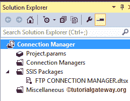
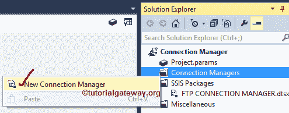
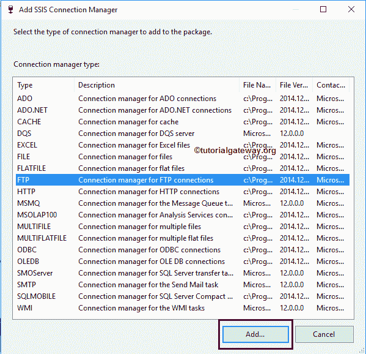
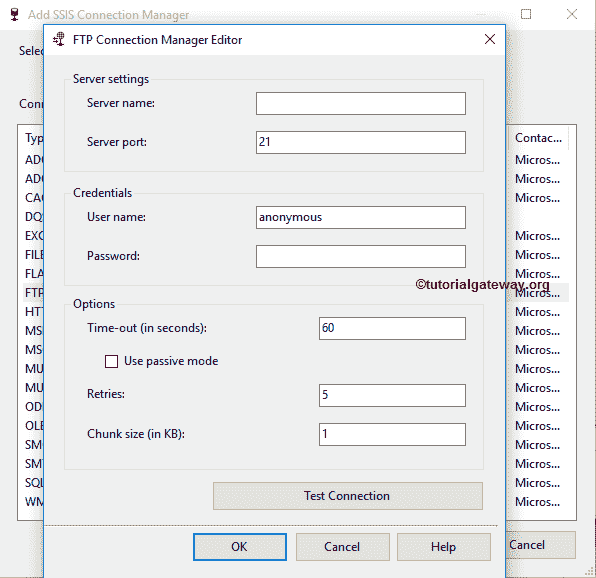
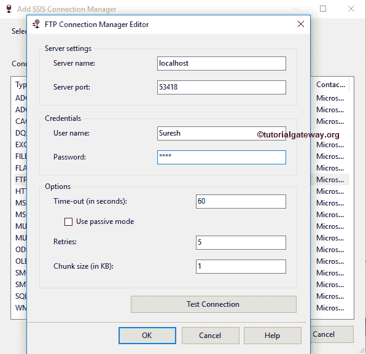
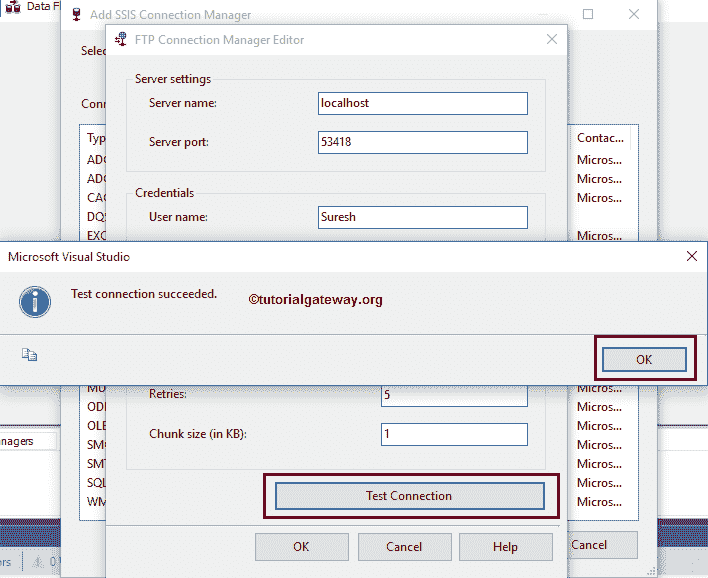
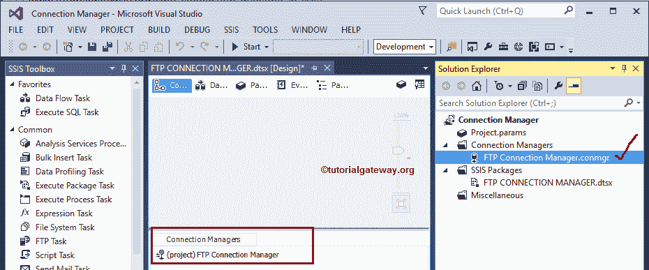

# SSIS FTP连接管理器

> 原文：<https://www.tutorialgateway.org/ssis-ftp-connection-manager/>

SSIS FTP连接管理器用于建立与FTP服务器的连接。这个连接管理器不仅允许我们访问现有的远程文件和文件夹，而且在运行时在 SQL Server 集成服务中创建新的文件和文件夹。

## 配置 SSIS FTP连接管理器

在这个例子中，我们展示了如何创建或配置 SSIS FTP 连接管理器。

一旦您在 [SSIS](https://www.tutorialgateway.org/ssis/) 下创建了一个新项目，如果您查看解决方案资源管理器，我们有三个文件夹。现在，让我们专注于连接管理器文件夹。

右键单击解决方案资源管理器中的连接管理器文件夹，并从上下文菜单中选择新建连接管理器选项。

当您单击新建连接管理器选项时，将打开添加 SSIS 连接管理器窗口表单，从它提供的列表中选择连接管理器。

这里，我们从可用列表中选择了 SSIS FTP 连接管理器。一旦我们选择了 FTP 连接管理器，就会打开另一个名为 FTP 连接管理器编辑器的窗口表单来配置连接。

SSIS FTP连接管理器提供以下选项:

*   服务器名称:请在此指定公司 FTP 服务器名称。例如，它将类似于 ftp.tutorialgateway.org
*   服务器端口:请在此指定端口号。客户端可以使用这个可用端口(应该是开放的)访问您的FTP服务器。默认情况下，它将是 21
*   用户名:请提供访问FTP服务器的用户名。默认情况下，您可以使用匿名凭据，但实时情况下，您的组织将提供这些凭据或使用您在配置 FTP 服务器时指定的凭据。
*   密码:请提供访问FTP服务器的密码。
*   使用被动模式:如果取消选中此选项(默认)，FTP 连接管理器将使用主动模式，否则使用被动模式。
*   重试次数:请提供重试次数。如果达到最大重试次数，连接将失败。
*   测试连接:点击此按钮检查我们的连接是否成功。

注意:如果连接使用活动模式，服务器将启动连接。否则(被动模式)，客户端必须启动连接。

从上面的截图中，您可以观察到我们使用本地主机(我们的本地电脑)作为 FTP 服务器和自定义端口号。实时情况下，您必须选择公司的FTP服务器，并提供您的管理员提供的有效凭据。

让我们通过单击“测试连接”按钮来测试已建立的连接。从下面的截图中，您可以观察到我们的凭据是有效的。

单击“确定”按钮完成 SSIS FTP连接管理器的配置。

从上面的截图可以看到，我们成功创建了 SSIS FTP 连接管理器。