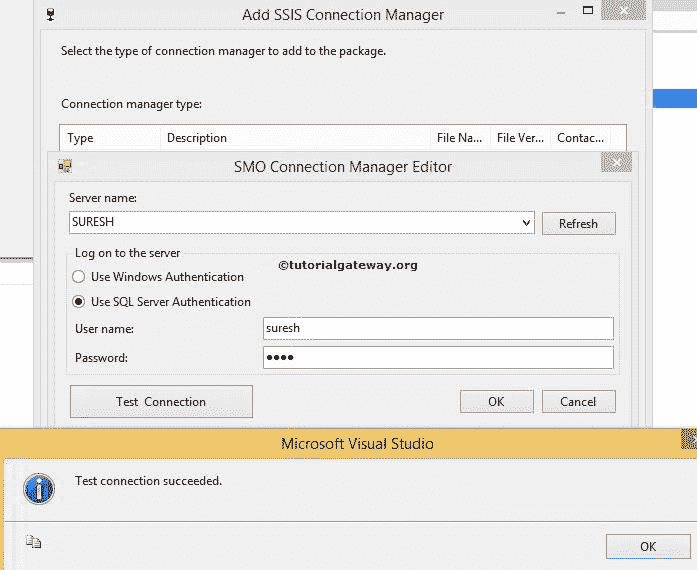

# SSIS SMO 连接管理器

> 原文：<https://www.tutorialgateway.org/smo-connection-manager-in-ssis/>

SMO (SQL Server 管理对象)连接管理器用于建立与 SQL Server 管理对象服务器的连接。在 SQL server 集成服务中，所有与数据库相关的任务都使用 SMO 连接管理器来连接 SQL Server 对象。

例如，[在 SSIS 传输 SQL Server 对象任务](https://www.tutorialgateway.org/transfer-sql-server-objects-task-in-ssis/)使用 SSIS SMO 连接管理器连接服务器。

## 在 SSIS 配置 SMO 连接管理器

在本例中，我们将展示如何在 SQL Server 集成服务( [SSIS](https://www.tutorialgateway.org/ssis/) )中创建或配置 SMO 连接管理器

一旦你在 SSIS 领导下创建了一个新项目。如果您查看解决方案资源管理器，我们有三个文件夹。现在，让我们专注于连接管理器文件夹。

右键单击解决方案资源管理器中的连接管理器文件夹，并从上下文菜单中选择新建连接管理器选项。

当您单击新建连接管理器选项时，将打开添加 SSIS 连接管理器窗口表单，从列表中选择连接管理器。

在这里，我们从列表中选择了 SMOServer 连接管理器。一旦我们选择了 SMO 连接管理器，然后打开 SMO 连接管理器编辑器的另一个窗口来配置连接。

SSIS SMO 连接管理器提供以下选项:

*   服务器名称:请指定 SQL Server 实例名称
*   刷新:单击此按钮将刷新网络中可用的 SQL Server 实例。
*   使用 Windows 身份验证:如果选择此选项，SMO 连接管理器将使用 Windows 身份验证与 SQL Server 实例连接。如果你在家练习或学习，那么选择这个选项。在实时中，我们大多不使用这个选项。
*   使用 SQL Server 身份验证:如果选择此选项，SSIS SMO 连接管理器将使用 SQL Server 身份验证与 SQL Server 实例连接。实时，这是我们使用的选项。如果选择了此选项，请提供用户名和密码。
*   用户名:请提供访问 [SQL Server](https://www.tutorialgateway.org/sql/) 的用户名。您的组织将提供这些凭据。
*   密码:请提供访问 SQL Server 的密码。
*   测试连接:点击此按钮测试我们的连接。

从上面的截图中，您可以看到我们选择了 Windows 身份验证来连接到 SQL Server 实例(SURESH)。实时情况下，您必须选择“使用 SQL Server 身份验证”选项，并提供管理员提供的有效凭据。因此，让我们在这里提供同样的东西来展示它是如何工作的。

单击下面提供的“测试连接”按钮，检查连接是否成功。

单击确定按钮，完成配置 SQL Server 管理对象连接管理器。

从上面的截图可以看到我们在 SSIS 成功创建了 SMO 连接管理器。