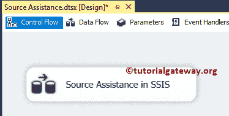
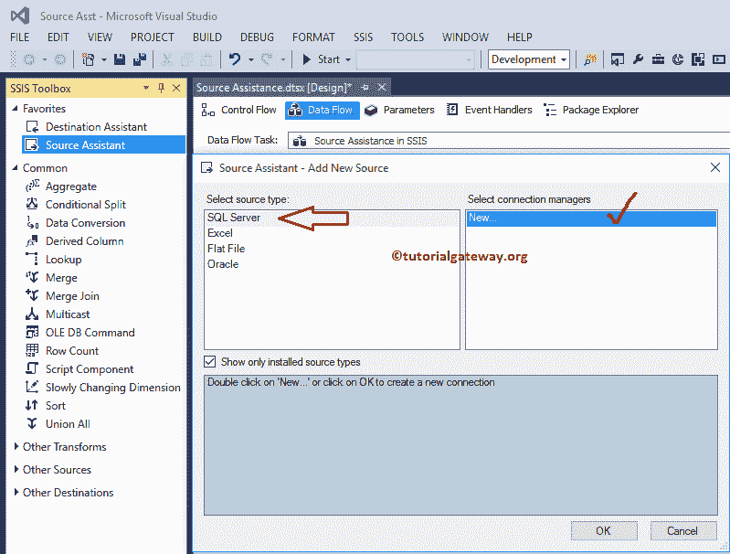
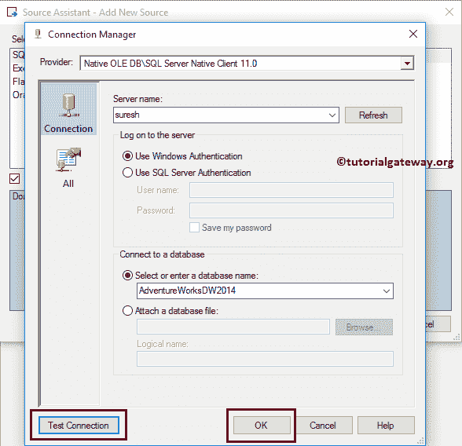
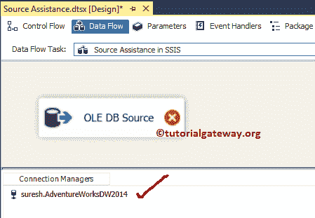
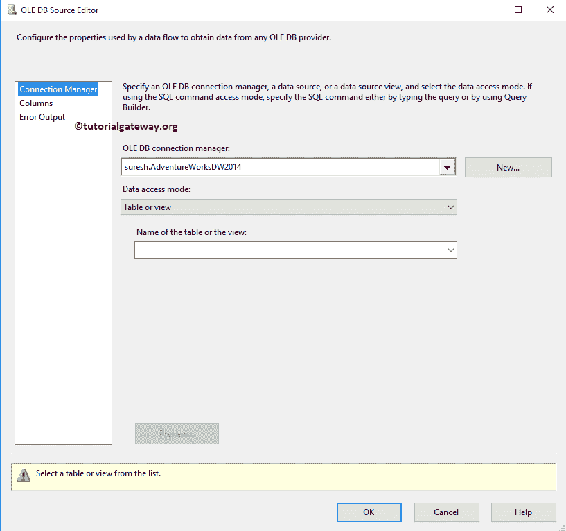
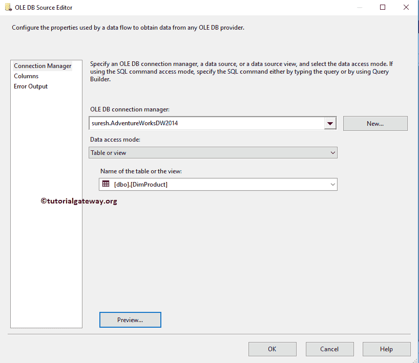
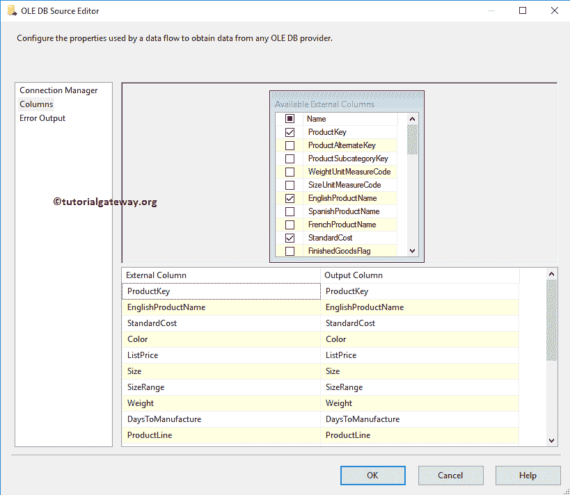
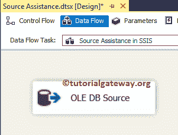
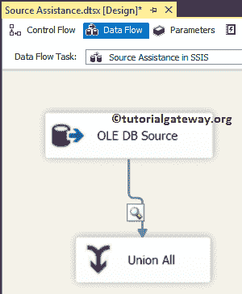
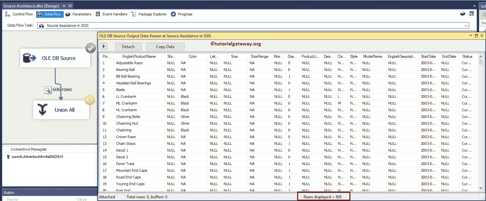

# SSIS 的来源援助

> 原文：<https://www.tutorialgateway.org/source-assistance-in-ssis/>

SSIS 的源协助将帮助您从可用列表中选择源。如果您在选择信号源时感到困惑，或者不知道选择哪一个，信号源帮助可能会有所帮助。

## 在 SSIS 配置源协助

在本例中，我们展示了如何在 SSIS 配置源辅助(SQL Server 集成服务)以从 SQL Server 数据库中提取数据。

首先，将数据流任务从工具箱拖放到控制流中。接下来，将名称更改为 SSIS 的源协助，如下所示。

双击它将打开数据流选项卡。现在，将源辅助从 SSIS 工具箱拖放到数据流区域。一旦您将它放到数据流区域，将显示一个名为“源协助-添加新源”的新窗口。

如果您仔细观察窗口，选择源类型区域会显示四个最常用的源。请根据您的要求选择来源。在这个例子中，我们使用 SQL Server 作为我们的源。因此，我们选择了 SQL Server，然后单击新建连接管理器。

提示:如果已经创建了 [SSIS](https://www.tutorialgateway.org/ssis/) 连接管理器，可以从列表中选择。

单击新建连接管理器后，将显示以下窗口。这里我们从我们的 [SQL Server](https://www.tutorialgateway.org/sql/) 中选择冒险作品 DW 2014 数据库。在我们关闭“连接管理器”窗口之前，请测试连接，如果成功，请单击“确定”按钮。

提示:请参考[SSIS OLE DB 连接管理器](https://www.tutorialgateway.org/ole-db-connection-manager-in-ssis/)文章详细了解属性。

从下面的截图中，您可以观察到我们的 SSIS 源协助在这里创建了一个 OLE DB 源。

双击数据流区域中的 OLE DB 源将打开 OLE DB 源编辑器以及已经创建的 OLE DB 连接管理器。

目前，我们正在从我们的冒险作品 DW 2014 数据库中选择 DimProducts 表。请参考[SSIS OLE DB 源](https://www.tutorialgateway.org/ole-db-source-in-ssis/)文章，了解本 OLE DB 源编辑器

中的每个属性

单击列选项卡验证列。在这里，我们还可以通过取消选中不需要的列来删除它们。这里我们删除了几列用于演示目的

点击【确定】完成在 SSIS

配置源协助

让我们拖放[联合所有转换](https://www.tutorialgateway.org/union-all-transformation-in-ssis/)，并使数据查看器能够看到我们新创建的源中的数据。

从下面的截图可以看到，它正在通过 606 条记录。

