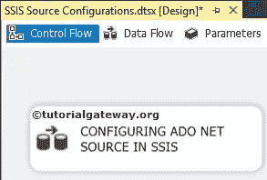
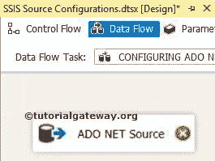
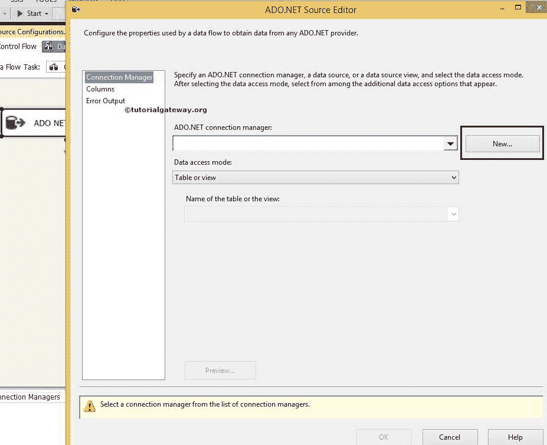
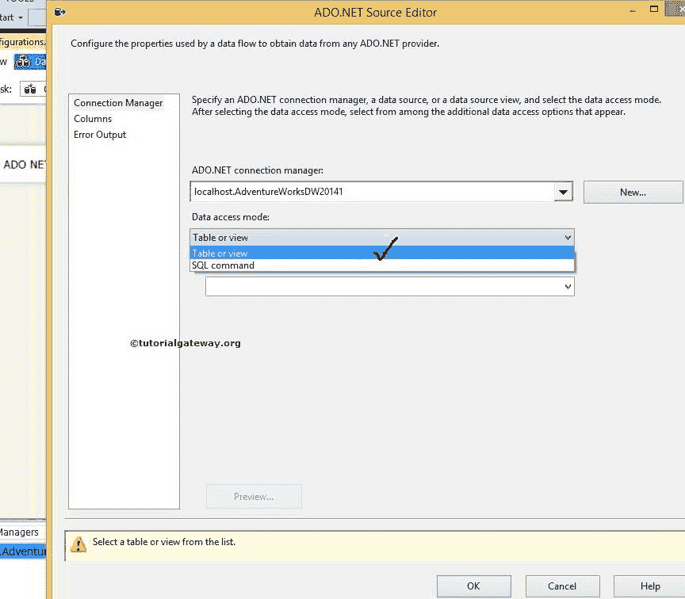
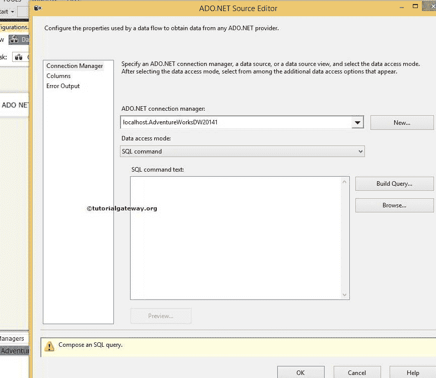
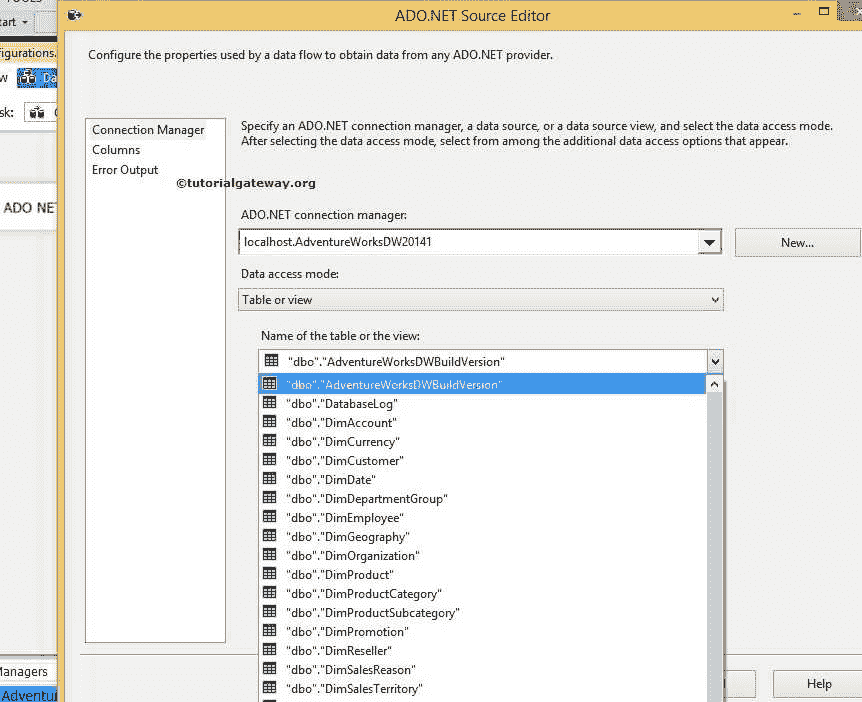
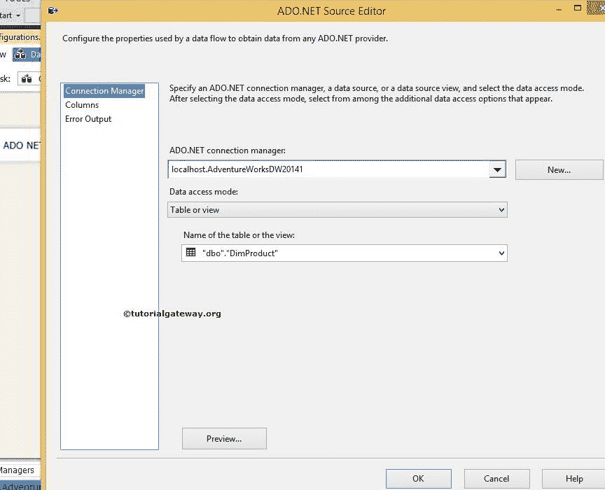
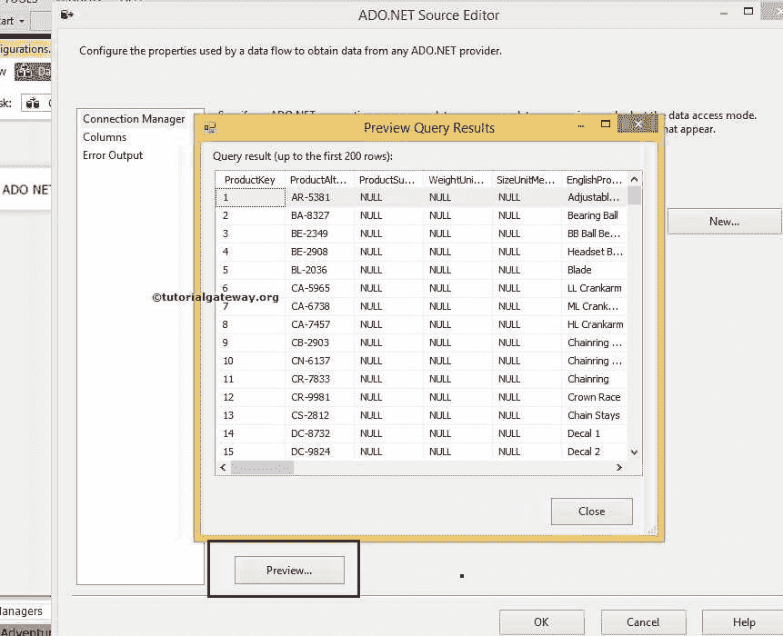
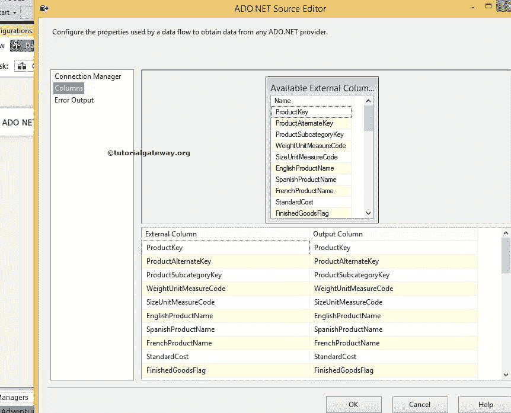
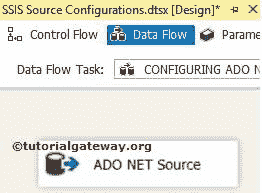

# ADO.NET 来源于 SSIS

> 原文：<https://www.tutorialgateway.org/ado-net-source-in-ssis/>

SSIS 的 ADO.NET 源(SQL Server 集成服务)用于使用从数据库中提取数据。Net 提供程序。SSIS 的 ADO.NET 源使用 ADO.NET 连接管理器与数据库连接。

## 在 SSIS 配置 ADO.NET 信号源

从工具箱中拖放数据流任务以控制流，并将名称更改为在 SSIS 配置 ADO.NET 源。

双击它将打开数据流选项卡。现在，将 ADO.NET 源从 [SSIS](https://www.tutorialgateway.org/ssis/) 工具箱拖放到

T4】数据流区域

双击数据流区域中的 SSIS ADO.NET 源将打开连接管理器设置。如果您之前没有创建 ADO.NET 连接管理器，请单击“新建”按钮并进行配置。

在本例中，我们选择了已经创建的 ADO.NET 连接管理器。请参考[SSIS ADO.NET 连线经理](https://www.tutorialgateway.org/ado-net-connection-manager-in-ssis/)文章

数据访问模式:该属性为我们提供了两个选项:

*   表或视图:如果您选择此选项，它将显示数据库中存在的可用表和视图的列表，我们的工作是选择所需的表或视图。
*   SQL 命令:如果你选择这个选项，那么我们必须自己写 SQL 命令。

“SQL 命令”选项提供了以下选项

*   SQL 命令文本:如果你熟悉 SQL 查询，那么你可以把它写在这个选项提供的空间里。我们通常在 SQL Management Studio 中编写查询，然后复制到 [SQL](https://www.tutorialgateway.org/sql/) 命令文本中。
*   构建查询:如果单击此选项，它将打开查询设计器，使用图形用户界面设计所需的查询。请参考 SSIS 文章中的[查询生成器。](https://www.tutorialgateway.org/query-builder-in-ssis/)
*   浏览:这将允许我们选择文件系统中存在的 SQL 查询。

目前，我们在这里选择表或视图选项。如果选择此选项，表的名称或视图选项将显示当前连接管理器中所有可用的表和视图。

我们正在从上面提到的列表

中选择 DimProduct 表

点击预览按钮查看

表中的数据

单击列选项卡验证列。

单击“确定”完成在 SQL Server 集成服务中配置 ADO.NET 源。

注:SSIS ADO.NET 源将不匹配的数据类型转换为 DT_NTEXT 数据类型。