# Excel 来源

> 原文：<https://www.tutorialgateway.org/excel-source-in-ssis/>

SSIS 的 Excel 源(SQL Server 集成服务)用于从 EXCEL 工作表中提取数据。SSIS Excel 源使用 SSIS 的 Excel 连接管理器来连接 Excel 文件。

## 在 SSIS 配置 EXCEL 源

将数据流任务从工具箱拖放到控制流中。接下来，将名称更改为在 SSIS 配置 EXCEL 源。

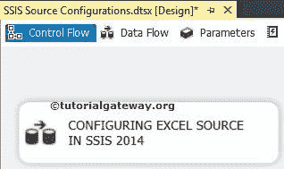

双击它将打开数据流选项卡。现在，将 Excel Source 从 [SSIS](https://www.tutorialgateway.org/ssis/) 工具箱拖放到

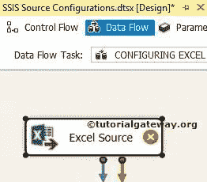T4】数据流区域

双击数据流区域中的 Excel 源将打开连接管理器设置。如果您之前没有创建过 Excel 连接管理器，请单击“新建”按钮并进行配置。

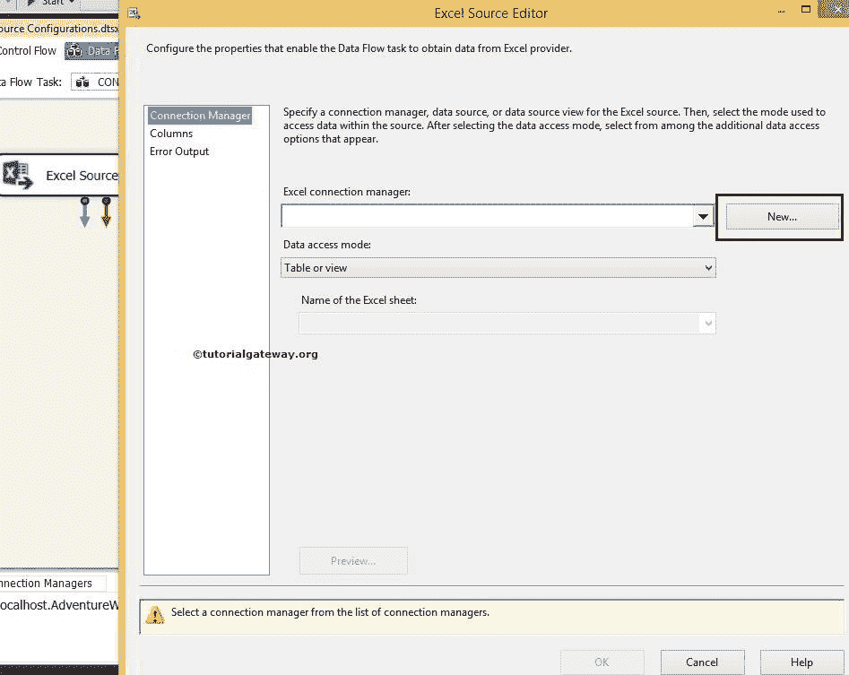

在本例中，我们选择了已经创建的 Excel 连接管理器。请参考[SSIS EXCEL 连接管理器](https://www.tutorialgateway.org/excel-connection-manager-in-ssis/)文章了解，如何配置 EXCEL 连接管理器

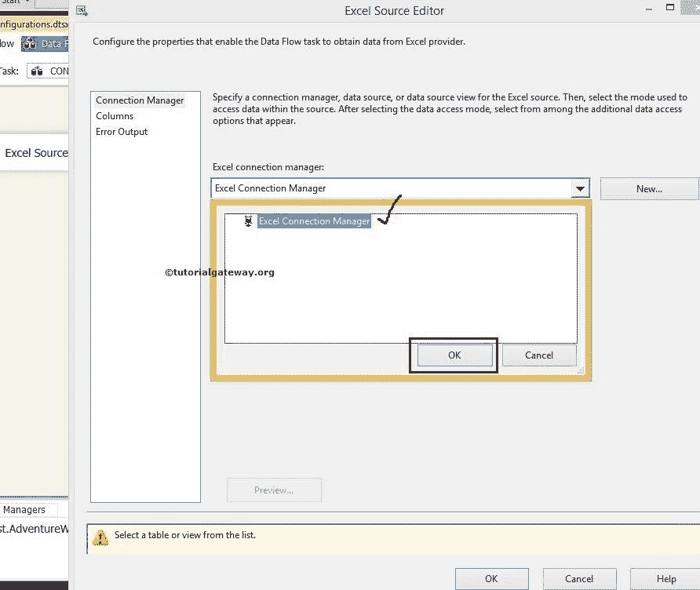

数据访问模式:该属性为我们提供了四个选项:

*   表或视图:如果选择此选项，它将显示 Excel 工作表中可用表的列表。我们的工作是从中选择所需的表。
*   表名或视图名变量:如果选择此选项，我们必须提供保存表名或视图名的变量名。
*   SQL 命令:如果你选择这个选项，那么我们必须自己写 [SQL](https://www.tutorialgateway.org/sql/) 命令。
*   来自变量的 SQL 命令:如果您选择了这个选项，那么我们必须提供保存 SQL 命令的变量名。

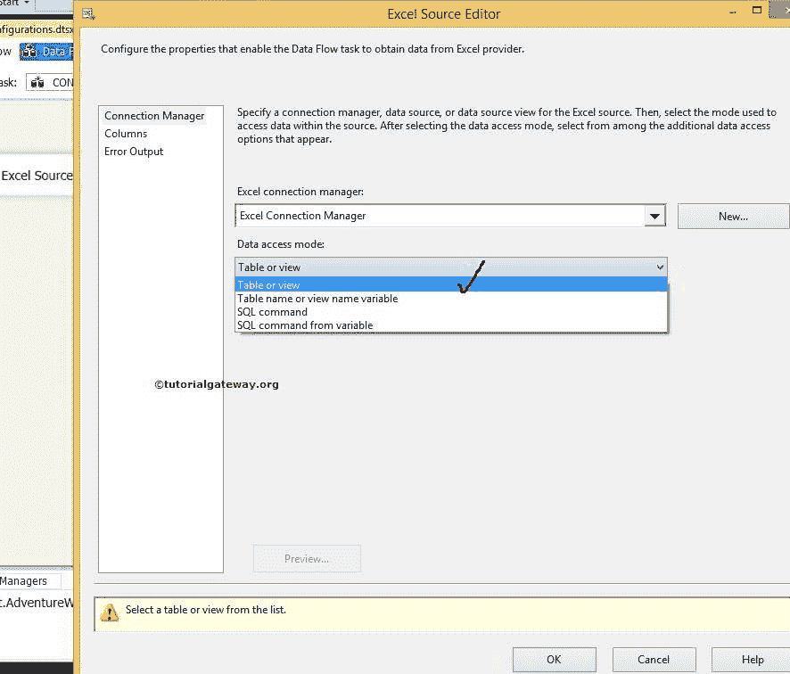

如果选择“SQL 命令”选项，编辑器将显示以下选项

*   SQL 命令文本:如果你熟悉 SQL 查询，那么你可以把它写在这个选项提供的空白处。
*   构建查询:如果单击此选项，它将打开查询设计器，使用图形用户界面设计所需的查询。请参考 SSIS 文章中的[查询生成器。](https://www.tutorialgateway.org/query-builder-in-ssis/)
*   浏览:这将允许我们选择文件系统中存在的 SQL 查询。
*   解析查询:该选项将检查查询是否被成功解析

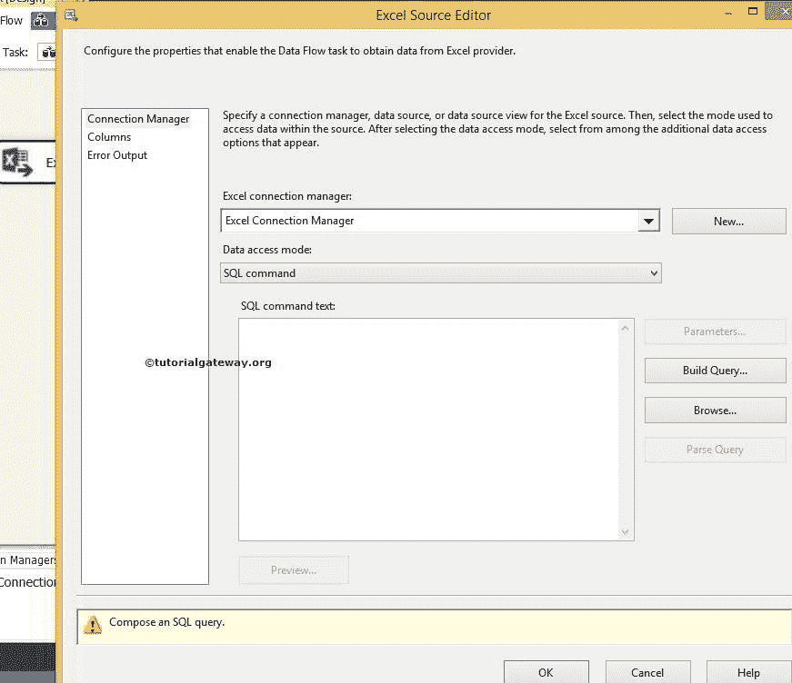

目前，我们在这里选择表或视图选项。如果选择此选项，表的名称或视图选项将显示当前连接管理器中所有可用的表和视图。

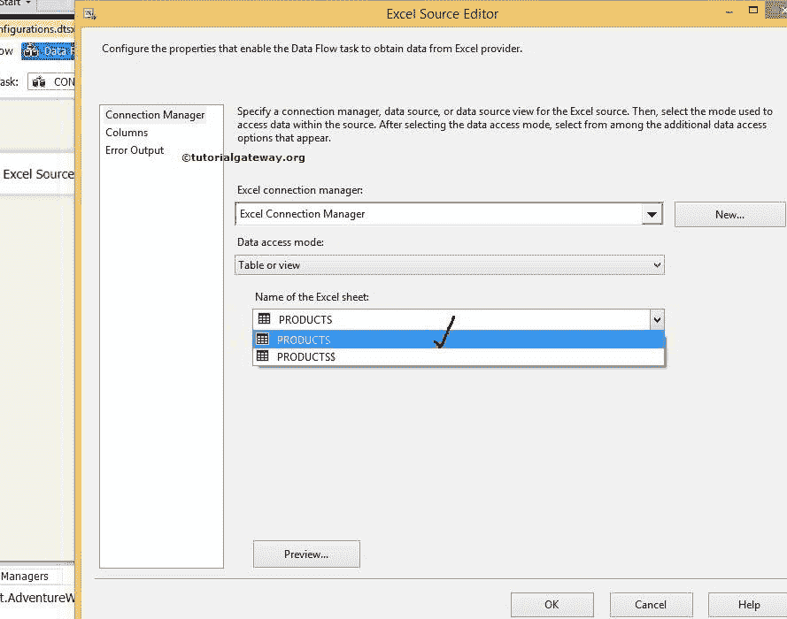

从上面的截图中，您可以看到我们从 Excel 工作表中选择了 PRODUCTS 表。点击预览按钮查看

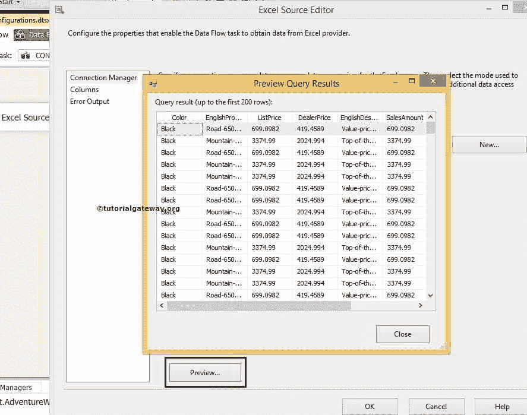

表中的数据

单击列选项卡验证列。我们也可以通过取消选中它们来删除不需要的列。

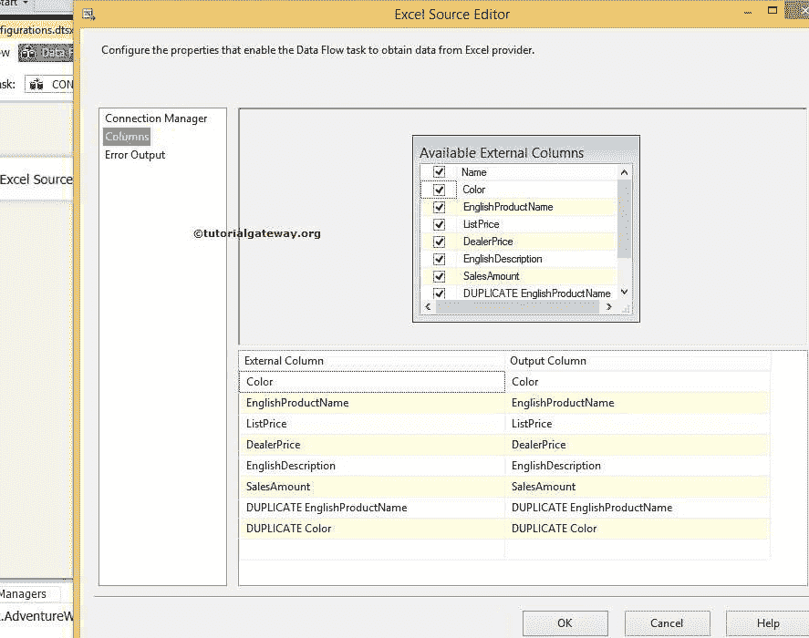

单击“确定”完成在 SSIS 配置 EXCEL Source。

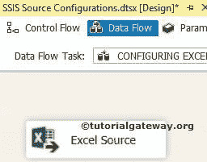

为了显示 Excel 源中的数据，我们只需添加联合所有，然后启用数据查看器。

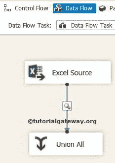

请执行 SSIS 包查看已配置的 Excel Source

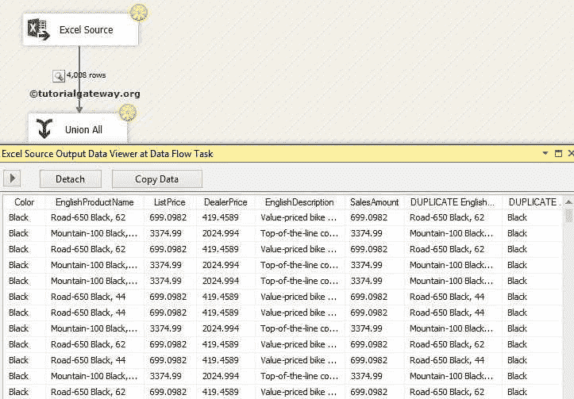

内的数据