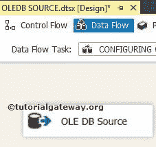

# SSIS 的 OLE 数据库源

> 原文：<https://www.tutorialgateway.org/ole-db-source-in-ssis/>

SSIS 的 OLE 数据库源用于从支持 OLE 数据库连接的各种数据库中提取数据。SSIS OLE DB 源使用 [OLE DB 连接管理器](https://www.tutorialgateway.org/ole-db-connection-manager-in-ssis/)来连接数据库表或视图。

## 在 SSIS 配置 OLE 数据库源

在本文中，我们将向您展示如何在 SSIS 设置 OLE DB Source 来从 SQL Server 数据库中提取数据。为此，请将数据流任务从工具箱拖放到控制流中。并将名称更改为在 SSIS 配置 OLE DB 源。

双击它将打开数据流选项卡。现在，将 OLE DB Source 从 [SSIS](https://www.tutorialgateway.org/ssis/) 工具箱拖放到

T4】数据流区域

双击数据流区域中的 OLE 数据库源将打开连接管理器设置。如果您之前没有创建过 OLE 数据库连接管理器，请单击“新建”按钮并进行配置。

在本例中，我们选择了已经创建的连接管理器。请参考[SSIS OLE DB 连接管理器](https://www.tutorialgateway.org/ole-db-connection-manager-in-ssis/)文章

数据访问模式:SSIS OLE DB Source 的这个属性为我们提供了四个选项:

*   表或视图:如果选择此选项，它将显示数据库中存在的可用表的列表。我们的工作是从中选择所需的表。
*   SQL 命令:如果你选择了这个选项，那么我们必须编写自己的 [SQL](https://www.tutorialgateway.org/sql/) 命令。
*   表名或视图名变量:对于此选项，您必须提供保存表名或视图名的变量名。
*   来自变量的 SQL 命令:如果选择此选项，我们必须提供保存 [SQL](https://www.tutorialgateway.org/sql/) 命令的变量名。

“SQL 命令”选项提供了以下选项

*   SQL 命令文本:如果您熟悉 SQL 查询，请将其写入该选项提供的空白区域。
*   构建查询:它将打开查询设计器，使用图形用户界面设计所需的查询。请参考 SSIS 文章中的[查询生成器。](https://www.tutorialgateway.org/query-builder-in-ssis/)
*   参数:如果您的 SQL 查询是参数化的(用？)，请使用对话框指定适当的参数。
*   浏览:允许我们选择文件系统中存在的查询。
*   解析查询:该选项检查查询是否被成功解析

在这里，我们选择表或视图选项。选择此选项后，表的名称或视图选项将显示当前连接管理器中存在的可用表和视图的列表。

从上面的截图中，您可以看到我们从 Adventure Works 数据库中选择了 table 表。点击预览按钮查看

表中的数据

单击列选项卡验证列。我们也可以通过取消选中它们来删除不需要的列。

点击【确定】完成在 SSIS

配置 OLE DB 源