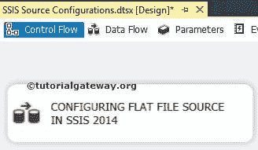
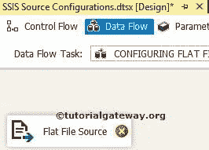
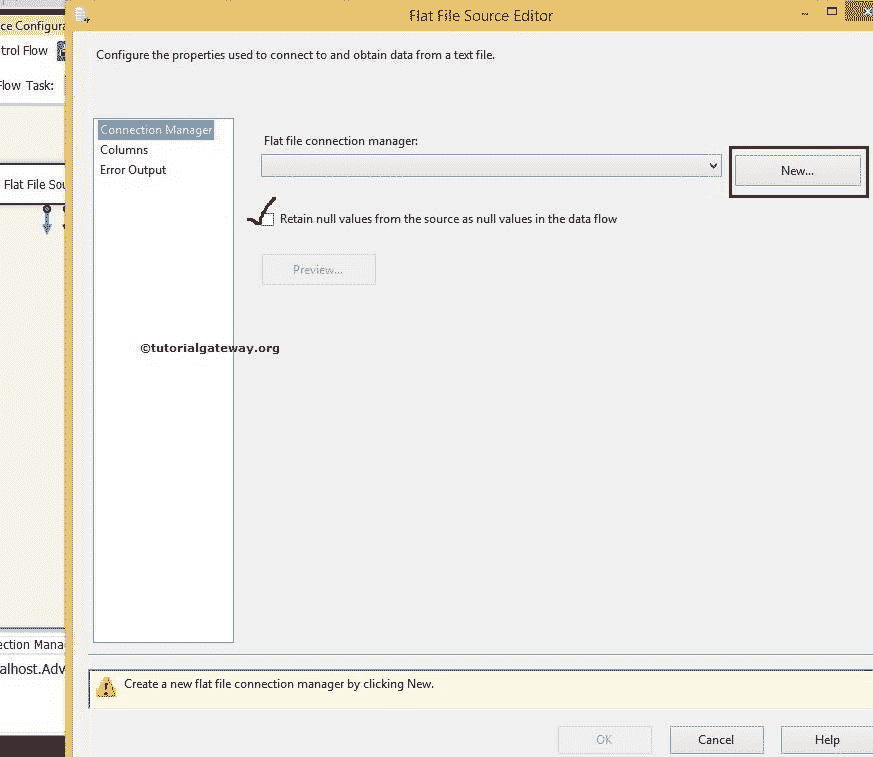
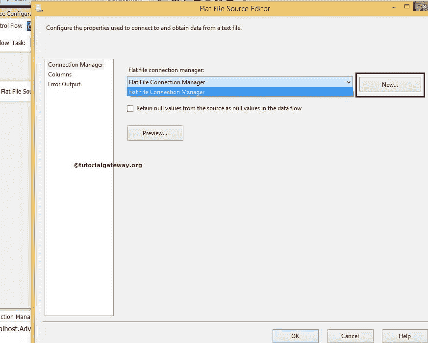
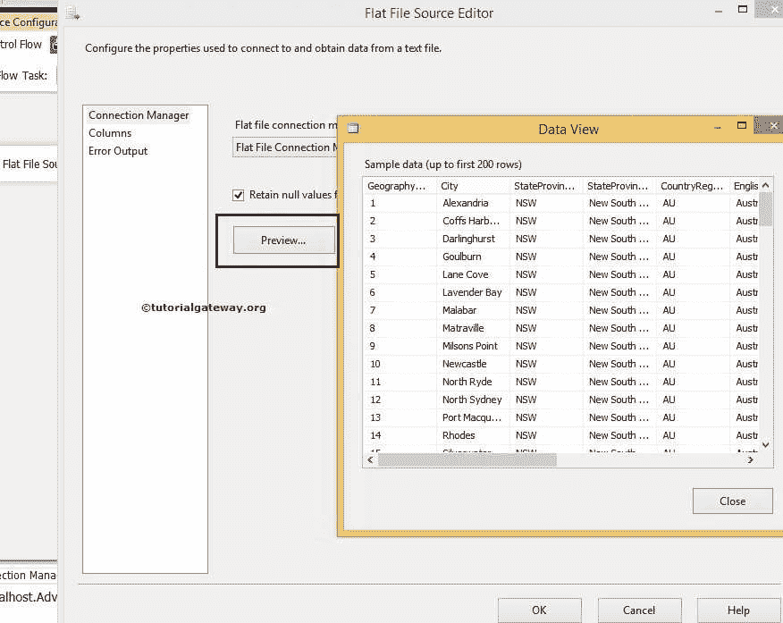
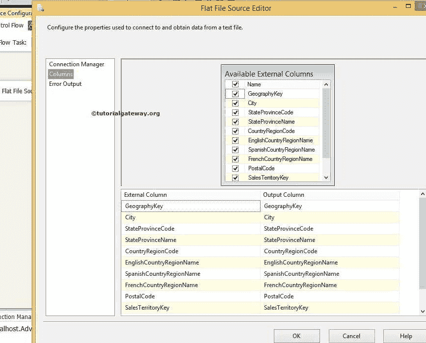
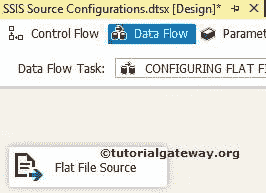

# SSIS 的平面文件源

> 原文：<https://www.tutorialgateway.org/flat-file-source-in-ssis/>

SSIS 的平面文件源用于从文本文件中提取或读取数据。平面文件源使用平面文件连接管理器来连接文本文件。

## 在 SSIS 配置平面文件源

在本文中，我们将向您展示如何在 SQL Server 集成服务中配置平面文件源，以从文本文件中提取数据。

从工具箱中拖放数据流任务以控制流，并将名称更改为在 SSIS 配置平面文件源。

双击它将打开数据流选项卡。现在，将平面文件源从 [SSIS](https://www.tutorialgateway.org/ssis/) 工具箱拖放到

T4】数据流区域

双击数据流区域中的平面文件源将打开平面文件源编辑器来配置连接管理器设置。如果您之前没有创建平面文件连接管理器，请单击新建按钮并进行配置。

将源中的空值保留为数据流中的空值:如果选中此选项，它将把空值保留为空值。如果取消选中它，源中的空值将替换为默认值或空值。

在这个平面文件源示例中，我们选择了已经创建的连接管理器。

从上面的截图中，您可以看到我们选择了已经创建的连接管理器。点击预览按钮，查看文本文件

中的数据

单击列选项卡验证列。我们也可以通过取消选中它们来删除不需要的列。

单击“确定”完成在 SQL Server 集成服务中配置平面文件源。

