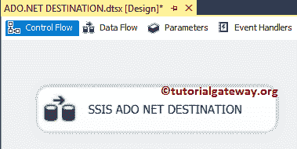

# SSIS ADO.NET 目标

> 原文：<https://www.tutorialgateway.org/ssis-ado-net-destination/>

SSIS ADO.NET 目标用于使用将数据加载到数据库表或视图中。Net 提供程序。SSIS ADO.Net 目标编辑器为我们提供了选择现有表、视图的选项，或者您可以创建一个新表。在本文中，我们将向您展示如何配置 SSIS ADO.Net 目标，以便将数据加载或存储到 SQL Server 数据库中。

注意:[SSIS](https://www.tutorialgateway.org/ssis/)ADO.NET 目标使用[ADO.NET 连接管理器](https://www.tutorialgateway.org/ado-net-connection-manager-in-ssis/)创建与关系数据库的连接

## 配置 SSIS ADO.NET 目标

步骤 1:从工具箱中拖放数据流任务以控制流，并将其重命名为 SSIS ADO.NET 目标。



双击它将打开数据流选项卡。

步骤 2:将 OLE DB 源和 ADO.NET 目标拖放到数据流区域。在这个例子中，我们将只解释 about 的目标。所以，请参考[SSIS OLE DB 源码](https://www.tutorialgateway.org/ole-db-source-in-ssis/)文章。


开始之前，双击 OLE DB 源，查看我们使用的表/ SQL 命令。从下面的截图中你可以看到，我们正在使用【迪姆产品】和【事实互联网销售】表，这些表存在于冒险作品 DW 数据库


[SQL](https://www.tutorialgateway.org/sql/) 我们在上面截图中使用的命令是:

```
USE AdventureWorksDW2014
GO
SELECT PROD.[EnglishProductName]
     ,PROD.[Color]
     ,[SalesOrderNumber]
     ,[UnitPrice]
     ,[ExtendedAmount]
     ,[ProductStandardCost]
     ,[TotalProductCost]
     ,[SalesAmount]
     ,[TaxAmt]
     ,[Freight]
FROM [FactInternetSales]
INNER JOIN
[DimProduct] AS PROD ON
  [FactInternetSales].[ProductKey] = PROD.[ProductKey]
```

步骤 3:双击 SSIS ADO.NET 目标将打开到 ADO.NET 目标编辑器来配置目标数据库。下面的截图将显示连接管理器选项卡中可用选项的列表:

*   连接管理器:这里需要选择已有的[ADO.NET 连接管理器](https://www.tutorialgateway.org/ado-net-connection-manager-in-ssis/)(如果有的话)；否则，单击新建按钮创建一个。
*   使用表或视图:在这里，您必须选择现有的表或视图来存储数据。否则，单击“新建”按钮创建新的目标表。
*   尽可能使用大容量插入:该选项将允许 SQL Server 集成服务在可能的情况下使用大容量插入选项。选择此选项始终是一种好的做法(为了更好的性能)。


步骤 4:在这里，我们选择之前创建的连接管理器。如果之前没有创建[ADO.NET 连接管理器](https://www.tutorialgateway.org/ado-net-connection-manager-in-ssis/)，点击新建按钮进行配置。


第 5 步:如果您单击“使用表或视图”选项旁边的向下箭头按钮，它将显示当前连接管理器中存在的可用表和视图的列表。


目前，我们正在选择名为“SSIS ADO.NET 目标”的现有表表如果您以前没有创建过该表，或者您想为本例创建一个新表，请单击“新建”按钮。它会打开一个新窗口，将您的自定义 SQL 查询写入[创建新表](https://www.tutorialgateway.org/sql-create-table/)。


预览按钮:该按钮将帮助您查看目标表中已经存在的数据。

步骤 6:单击“映射”选项卡，检查源列是否完全映射到目标列。


注意:如果您的输入列名和目标列名相同，智能将自动映射。如果列名(任何别名列或任何计算列)有任何变化，我们必须手动映射它们。

步骤 7:单击确定完成 SSIS ADO.NET 目标软件包的配置。让我们运行包，看看我们是否将数据从 OLE DB 源传输到 ADO.NET 目标


让我们打开 [SQL Server](https://www.tutorialgateway.org/sql/) 预览数据。从下面的截图中，您可以看到我们使用 SSIS ADO.NET 目标成功地将传入的数据加载到了 SQL Server 表中。

