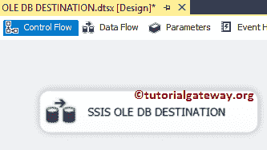
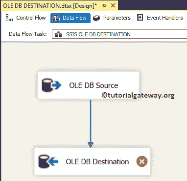
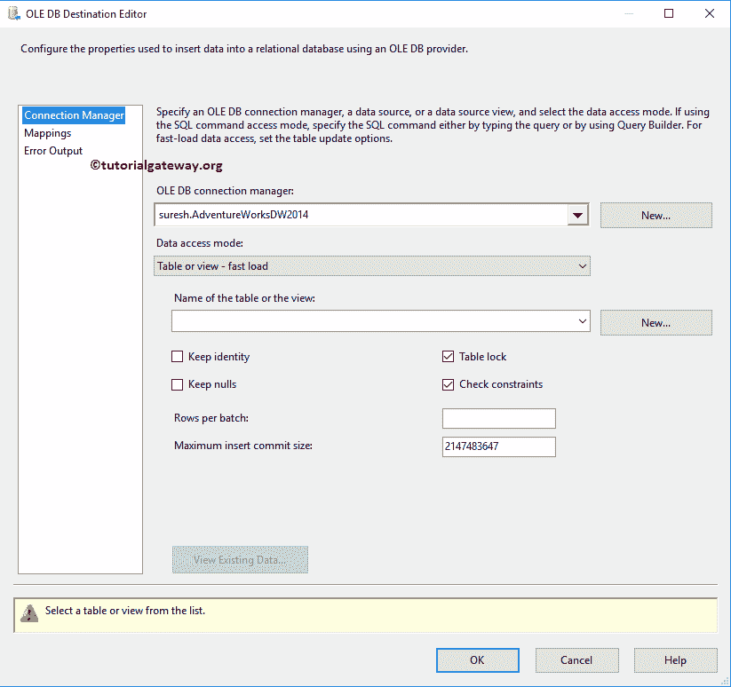
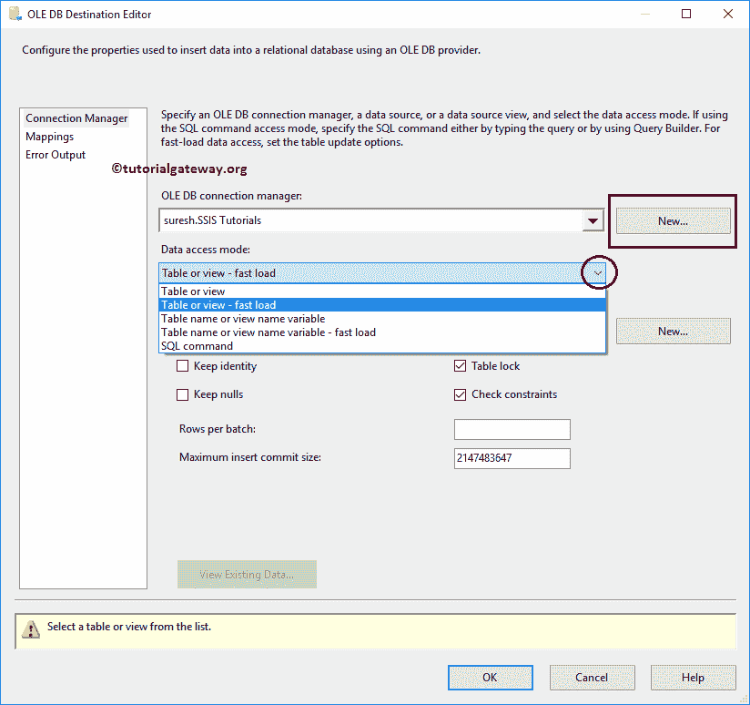
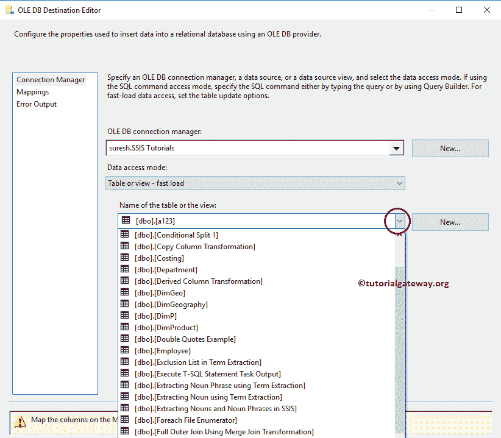
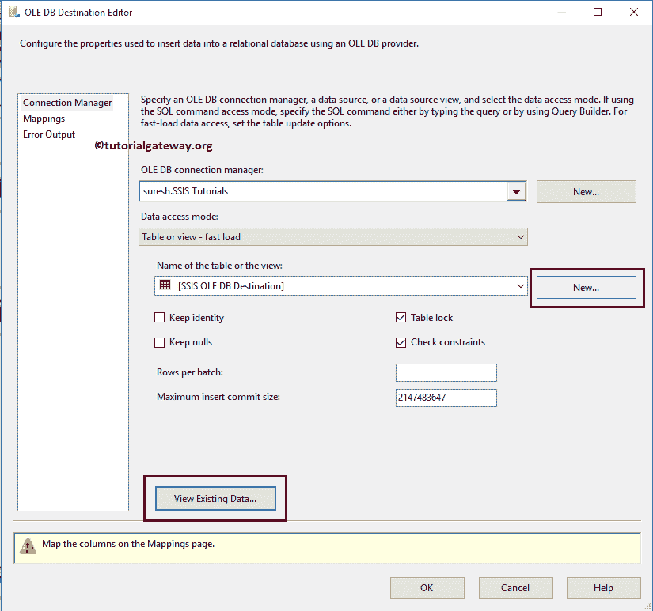
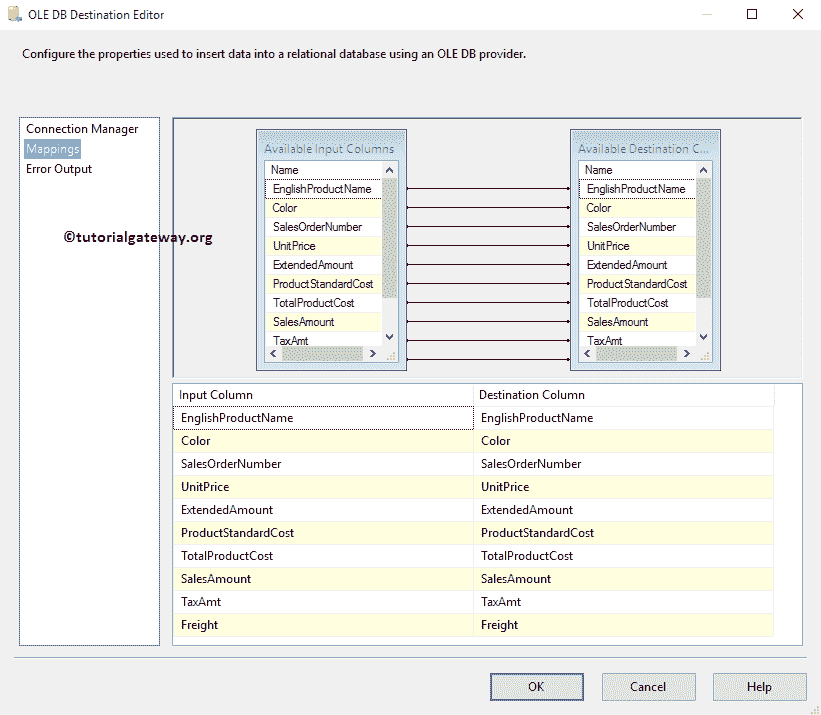
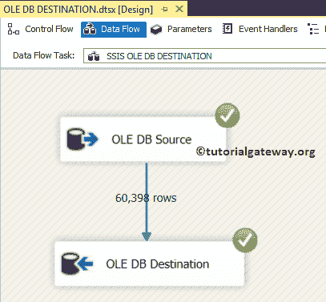
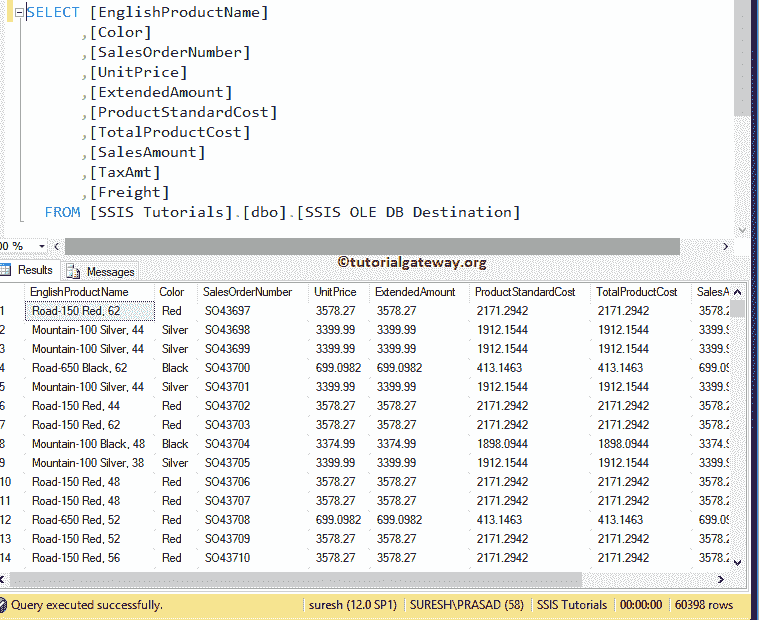

# SSIS OLE 数据库目标

> 原文：<https://www.tutorialgateway.org/ssis-ole-db-destination/>

SSIS OLE DB 目标用于将数据加载到各种数据库表或视图或 SQL 命令中。OLE 数据库目标编辑器为我们提供了选择现有表、视图或创建新表的选项。在本文中，我们将向您展示如何配置 SSIS OLE DB 目标，以便将数据加载或存储到 SQL Server 数据库中。

注意: [SSIS](https://www.tutorialgateway.org/ssis/) OLE DB 目标使用 [OLE DB 连接管理器](https://www.tutorialgateway.org/ole-db-connection-manager-in-ssis/)来创建与关系数据库的连接

## 配置 SSIS OLE 数据库目标

步骤 1:将数据流任务从工具箱拖放到控制流中。接下来，将其重命名为 SSIS OLE DB 目标。



双击它将打开数据流选项卡。

步骤 2:将 OLE DB 源和 OLE DB 目标拖放到数据流区域。在本例中，我们将只解释 OLE 数据库目标。因此，请参考 SSIS 的[OLE DB Source](https://www.tutorialgateway.org/ole-db-source-in-ssis/)文章，了解创建它所涉及的步骤。



在我们开始之前，请双击 OLE 数据库源来查看我们使用的 SQL 命令。从下面的截图可以看到，我们使用的是 Adventure Works DW 2014 数据库


中的【Dim 产品】和【事实互联网销售】表

[SQL](https://www.tutorialgateway.org/sql/) 我们在上面截图中使用的命令是:

```
USE AdventureWorksDW2014
GO
SELECT PROD.[EnglishProductName]
     ,PROD.[Color]
     ,[SalesOrderNumber]
     ,[UnitPrice]
     ,[ExtendedAmount]
     ,[ProductStandardCost]
     ,[TotalProductCost]
     ,[SalesAmount]
     ,[TaxAmt]
     ,[Freight]
FROM [FactInternetSales]
INNER JOIN
[DimProduct] AS PROD ON
  [FactInternetSales].[ProductKey] = PROD.[ProductKey]
```

第三步:双击 SSIS OLE DB 目标将打开到 OLE DB 目标编辑器。使用它来配置目标数据库。下面的截图将显示连接管理器选项卡中可用选项的列表:

*   OLE DB 连接管理器:这里需要选择已有的 [OLE DB 连接管理器](https://www.tutorialgateway.org/ole-db-connection-manager-in-ssis/)(如果有的话)；否则，单击新建按钮创建一个。对于这个例子，我们使用已经创建的连接管理器。
*   表或视图的名称:在这里，您必须选择现有的表或视图来存储数据。否则，单击“新建”按钮创建新的目标表。
*   保留身份:请通过选中此选项来指定是否要将身份值加载到目标表中。此选项仅适用于快速加载，默认情况下未选中。
*   保留空值:请通过选中此选项来指定是否要将空值加载到目标表中。此选项仅适用于快速加载，默认情况下未选中。
*   表锁定:加载数据时，请指定是否要锁定目标表
*   检查约束:加载数据时，请指定目标表是否检查约束。
*   每批行数:请指定每批要发送的行数。在实时情况下，指定值总是明智的，这可以提高您的性能。
*   最大插入提交大小:请在此指定最大批处理大小。



步骤 4:在数据访问模式中，我们有多个选项。在这里，我们必须选择以下选项之一来将数据加载到 OLE DB 目标中:

1.  表或视图:选择此选项可将数据加载到表或视图中。
2.  表或视图–快速加载:选择此 SSIS OLE DB 目标选项，将数据加载到表或视图中，并使用快速加载选项。
3.  表名或视图名变量:如果将目标表名或视图名存储在变量中并使用快速加载选项，请选择此选项。
4.  表名或视图名变量–快速加载:如果您将目标表名或视图名存储在变量中，请选择此选项。
5.  SQL 命令:使用自定义的 SQL 命令将数据加载到 SSIS OLE DB 目标中

请记住，在您的 [OLE DB 连接管理器](https://www.tutorialgateway.org/ole-db-connection-manager-in-ssis/)中

*   如果您使用 Microsoft OLE DB 提供程序访问 SQL Server，请使用快速加载选项，这意味着您可以使用选项 2 或 4。
*   如果使用 SQL Server 本机客户端访问 SQL Server，请使用选项 1 或 3。



第五步:如果您点击表名称或视图选项旁边的向下箭头按钮。它将显示当前连接管理器中存在的可用表和视图的列表。



目前，我们正在选择名为[SSIS OLE DB 目标]的现有表。如果您以前没有创建过该表，或者您想为本例创建一个新表，请单击“新建”按钮。它将打开新窗口，将您的自定义 SQL 查询写入[创建新表](https://www.tutorialgateway.org/sql-create-table/)。



查看现有数据..:此按钮将帮助您查看目标表中已经存在的数据。

步骤 6:单击“映射”选项卡，检查源列是否完全映射到 SSIS OLE DB 目标列。



步骤 7:单击“确定”完成 SSIS OLE DB 目标包的配置。让我们运行这个包，看看我们是否将数据从 [OLE DB 源](https://www.tutorialgateway.org/ole-db-source-in-ssis/)传输到了 OLE DB 目的地



让我们打开 [SQL Server](https://www.tutorialgateway.org/sql/) 管理工作室查询窗口预览数据。从下面的截图中，您可以看到我们使用 SSIS OLE DB Destination 成功地将传入的数据加载到了 SQL Server 表中。

