# SSIS 平面文件目标

> 原文：<https://www.tutorialgateway.org/ssis-flat-file-destination/>

SSIS 平面文件目标用于将数据写入文件系统中的文本文件。文本文件可以是固定宽度、带分隔符、右不齐或带行分隔符的固定宽度。

注意:SSIS 平面文件目标使用平面文件连接管理器来创建与文件的连接。

## 配置 SSIS 平面文件目标

步骤 1:从工具箱中拖放数据流任务来控制流，并将其重命名为 SSIS 平面文件目标。

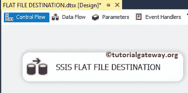

双击它将打开 [SSIS](https://www.tutorialgateway.org/ssis/) 数据流选项卡。

步骤 2:将 OLE 数据库源和平面文件目标拖放到数据流区域。在本例中，我们将只解释平面文件目标，因此，请参考 SSIS 的[OLE DB Source](https://www.tutorialgateway.org/ole-db-source-in-ssis/)文章。

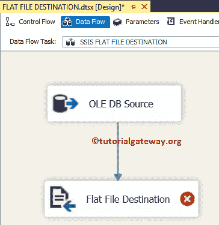

双击数据流区域中的平面文件目标将打开平面文件目标编辑器来配置连接管理器设置。如果您之前没有创建平面文件连接管理器，请单击新建按钮并进行配置。

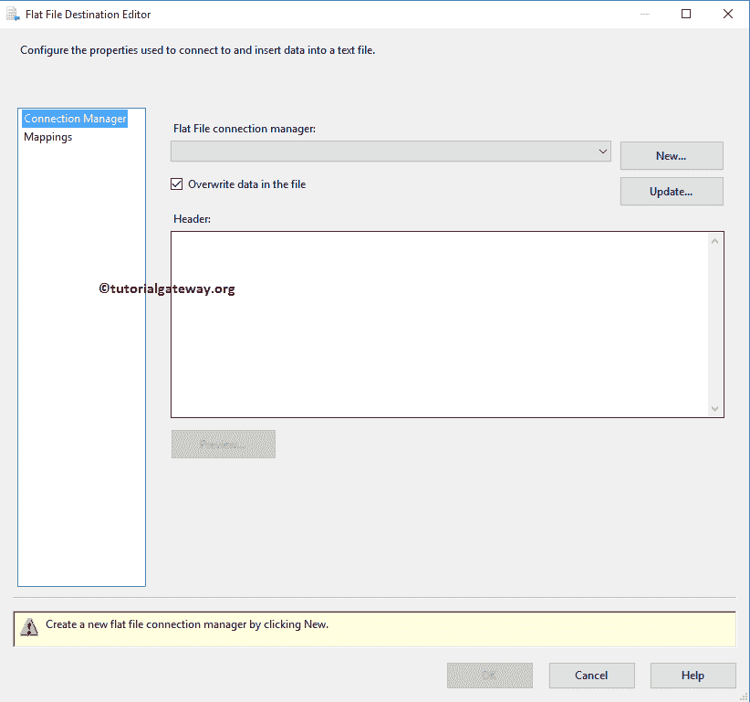

单击新建按钮后，平面文件格式窗口将会打开。它提供了四个选项，如“分隔”、“固定宽度”、“带行分隔符的固定宽度”和“右不齐”。对于本例，我们选择了分隔选项，但请选择您想要使用的选项，然后单击确定按钮。

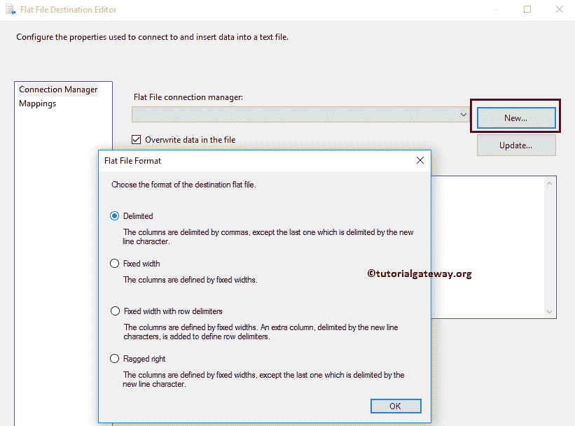

单击“确定”按钮后，将打开一个名为“平面文件连接管理器编辑器”的新窗口。在这里，单击浏览按钮遍历文件系统并找到所需的文件。如果选择现有文件选项，则从文件系统中选择；否则，创建一个。在这里，我们选择现有的文件。

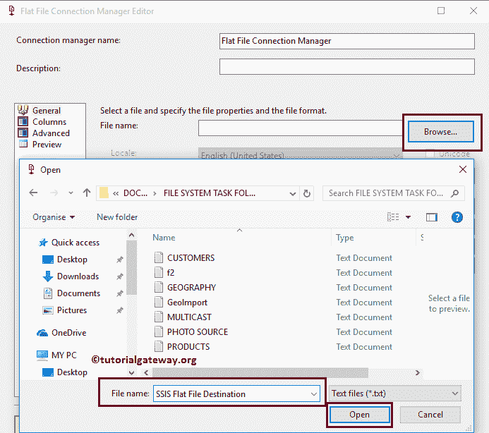

选择文件后，我们必须通过选中第一个数据行选项中的列名来指定文本文件是否在第一行保存列名。由于我们的平面文件包含第一行中的列名，因此我们选中了该选项。如果您的文本文件不同，则不要选择它。

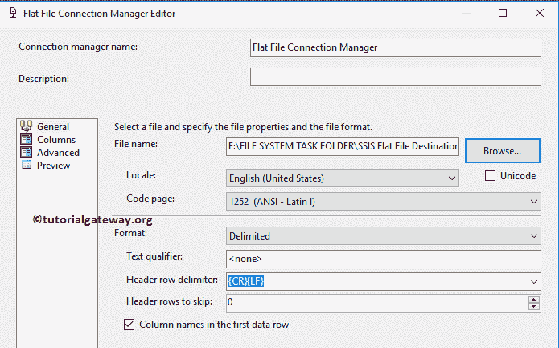

格式:在这里，您可以选择将数据写入文本文件时要使用的格式。

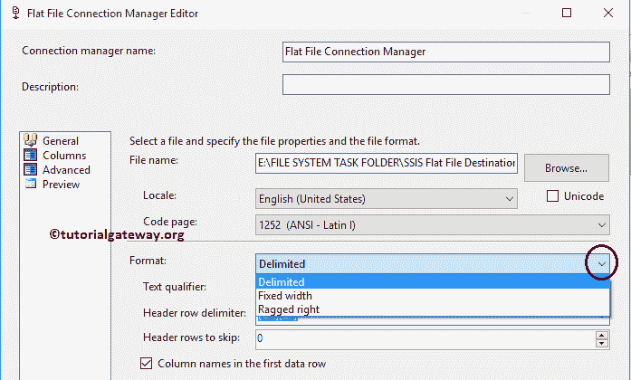

表头行分隔符:请选择表头行分隔符

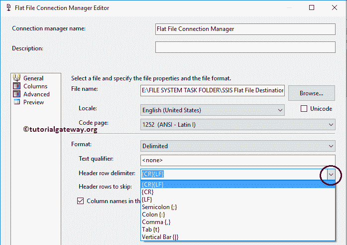

让我们通过访问平面文件连接管理器

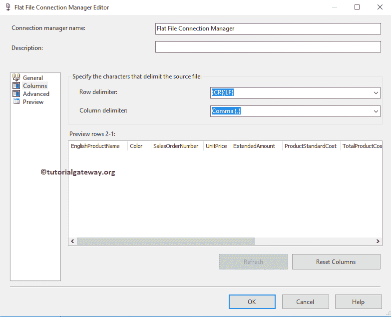

中的列选项卡来检查数据

点击预览按钮查看数据预览。

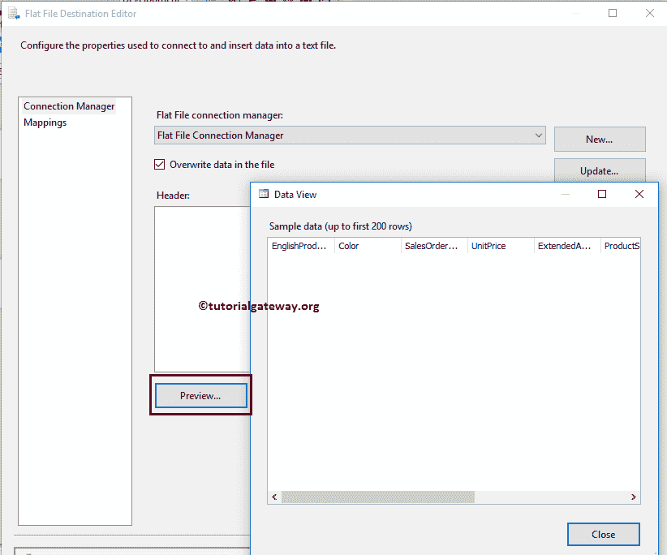

接下来，请单击“映射”选项卡，检查源列是否完全映射到目标列。

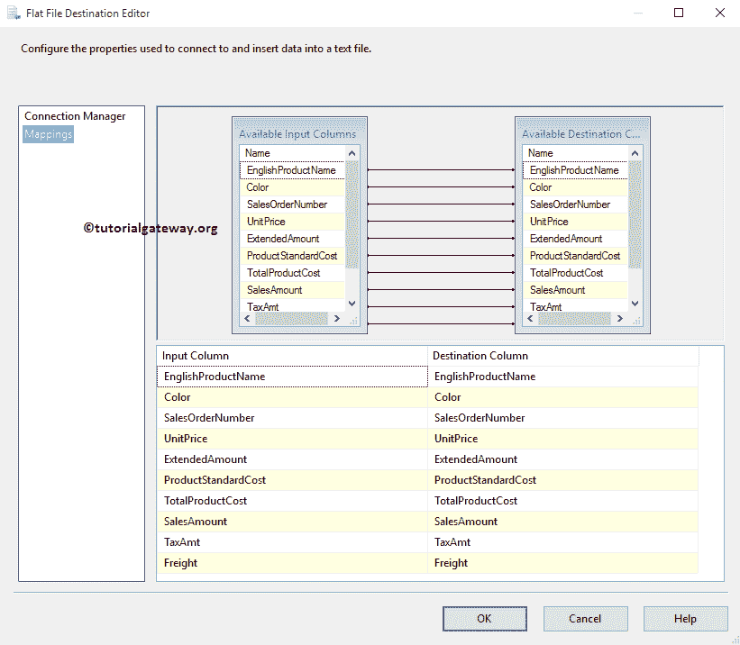

单击“确定”完成 SSIS 平面文件目标包的配置。让我们运行，看看我们是否成功地将 SQL 表行转移到平面文件中。

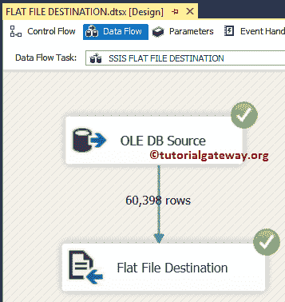

从下面的截图中，您可以看到我们将 SQL 表行转移到了 SSIS 平面文件目标文本文件中。

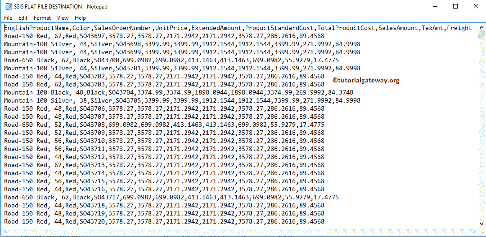