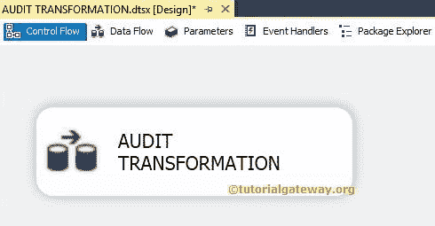
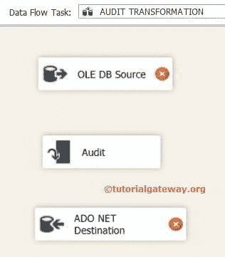
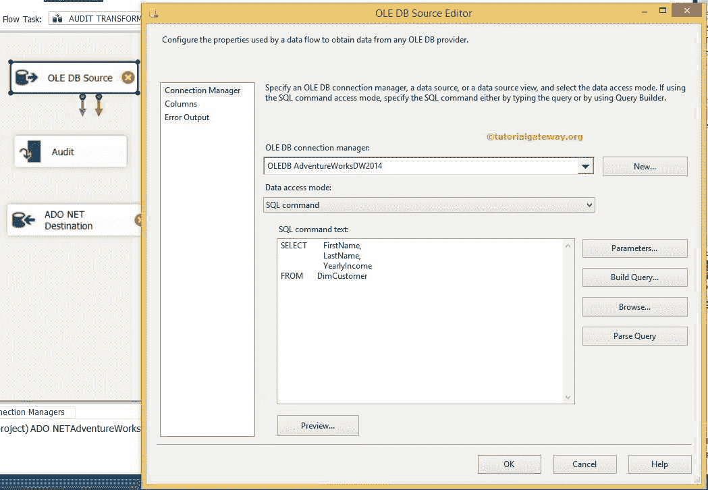
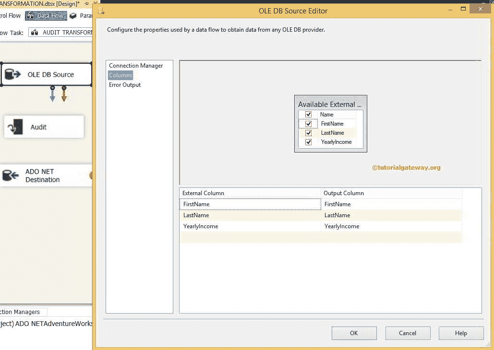
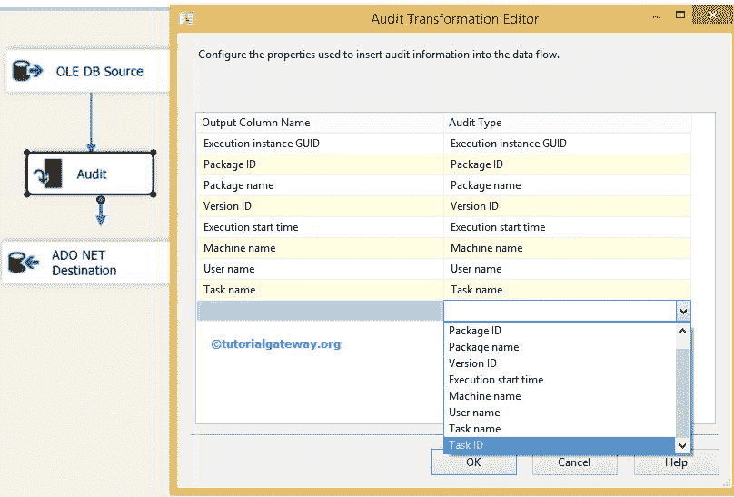
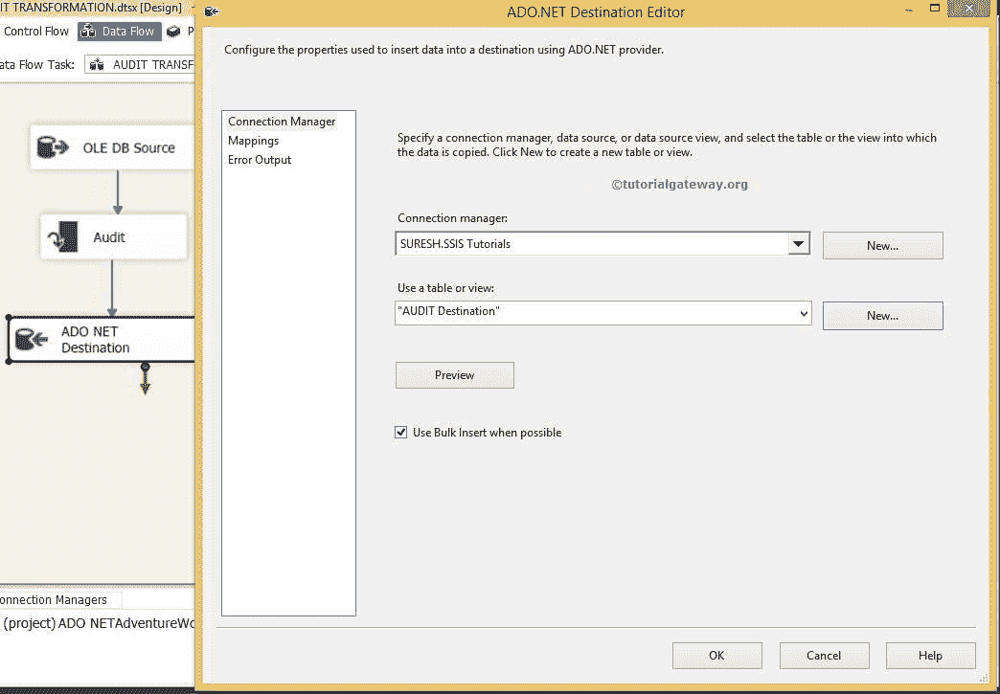
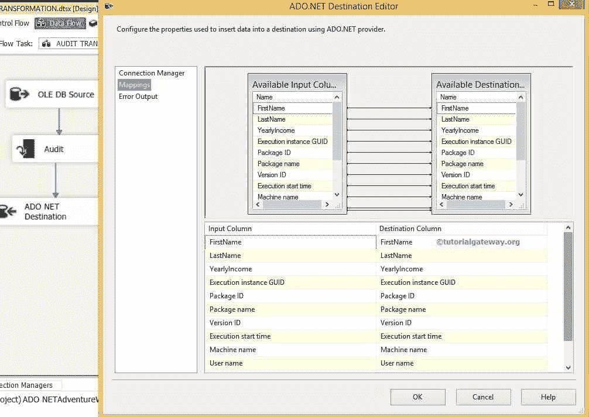
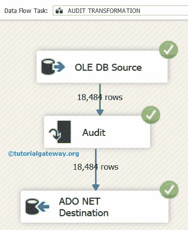
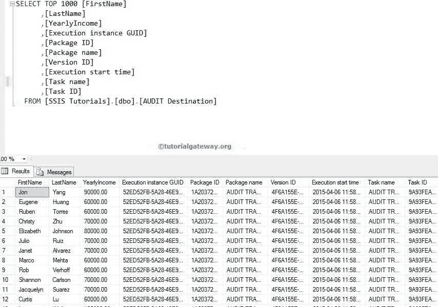

# SSIS 的审计转型

> 原文：<https://www.tutorialgateway.org/audit-transformation-in-ssis/>

SSIS 的审计转换允许您添加带有审计信息的额外列(机器名、包名、id、日期等)。)在审计中是必需的。我们可以使用这个 SSIS 审计转换将信息保存在目标表中。例如，如果我们想调查

*   哪个用户执行了这个包？
*   包的执行时间？
*   他/她从哪台机器上执行的？
*   什么是任务标识、包标识、包名称等。？

SSIS 审计转型可用选项列表:

1.  ExecutionInstanceGUID–标识包的执行实例的 GUID。
2.  包装标识–这是包装的唯一标识符。
3.  包装名称–显示包装的名称。
4.  版本号–包的唯一版本号。
5.  ExecutionStartTime–包开始运行的时间。
6.  机器名称–计算机的名称。
7.  用户名–启动包的人的登录名。
8.  任务名称–与审计转换关联的数据流任务的名称。
9.  任务标识–数据流任务的唯一标识符。

## SSIS 审计转型实例

对于这个 [SSIS](https://www.tutorialgateway.org/ssis/) 的例子，我们在我们的 [SQL Server](https://www.tutorialgateway.org/sql/) 中使用了 Adventure Works DW

步骤 1:将数据流任务从工具箱拖放到控制流中。接下来，将其重命名为审核转换。



双击它打开数据流选项卡。

第二步:将 OLE DB 源、审核转换、ADO.NET 目的地拖放到 SSIS 数据流区域



步骤 3:双击数据流区域中的 OLE DB 源，打开连接管理器设置，并提供空间来编写我们的 SQL 语句。



目前，我们从冒险作品数据库中选择了名、姓、年收入。在这里，我们希望将它与额外的审计信息一起发送到目标表。

我们用于 SSIS 审计转换的 SQL 命令文本是:

```
SELECT FirstName,
       LastName,
      YearlyIncome

FROM   DimCustomer
```

第 4 步:单击列选项卡验证列。在此选项卡中，我们还可以取消选中不需要的列。



提示:如果我们不需要任何用于 SSIS 审计转换的列，那么将它添加到您的 SQL 命令中是没有意义的。

### 在 SSIS 配置审计转型

第五步:点击确定，将 OLE DB 源的绿色箭头连接到审计转换。双击 SSIS 审核转换进行编辑



选择所需的审核类型，然后单击确定。这里，我们选择了所有的审计类型。

注意:您可以通过编辑输出列名字段来更改列名。

步骤 6:接下来，我们必须提供目标的服务器、数据库和表的详细信息。因此双击 ADO.NET 目的地并提供所需信息



从上面的截图中，您可以看到，我们将审计转换数据存储在 SSIS 教程数据库中的[审计目标]表中。

步骤 7:单击映射选项卡，检查源列是否正确映射到目标列。



注意:如果输入列名和目标列名相同，智能会自动映射。如果列名(任何别名或计算列)有任何变化，我们必须手动映射它们。

单击“确定”完成在 SSIS 包中配置审计转换。让我们运行包并查看



让我们打开 [SQL 管理工作室](https://www.tutorialgateway.org/sql-server-management-studio/)查询窗口预览数据



注意:SSIS 的审计转换不支持错误输出。