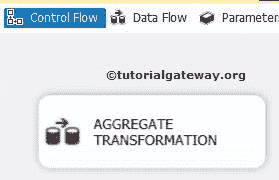
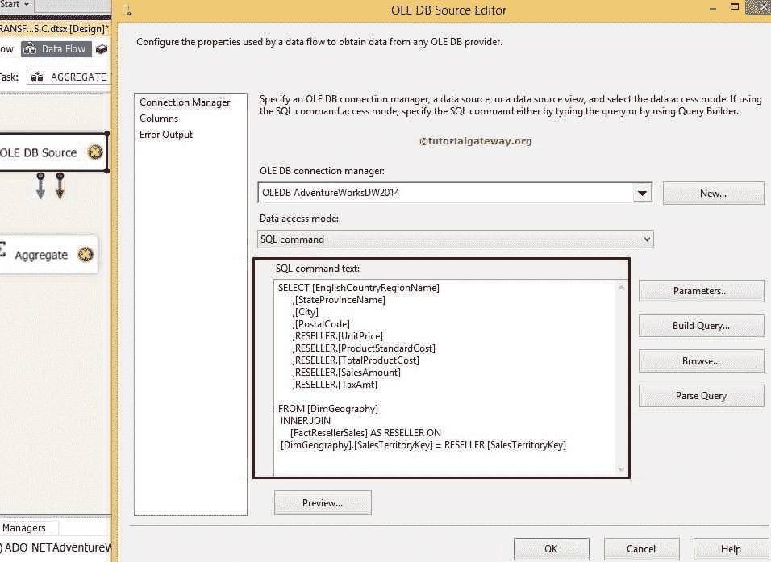
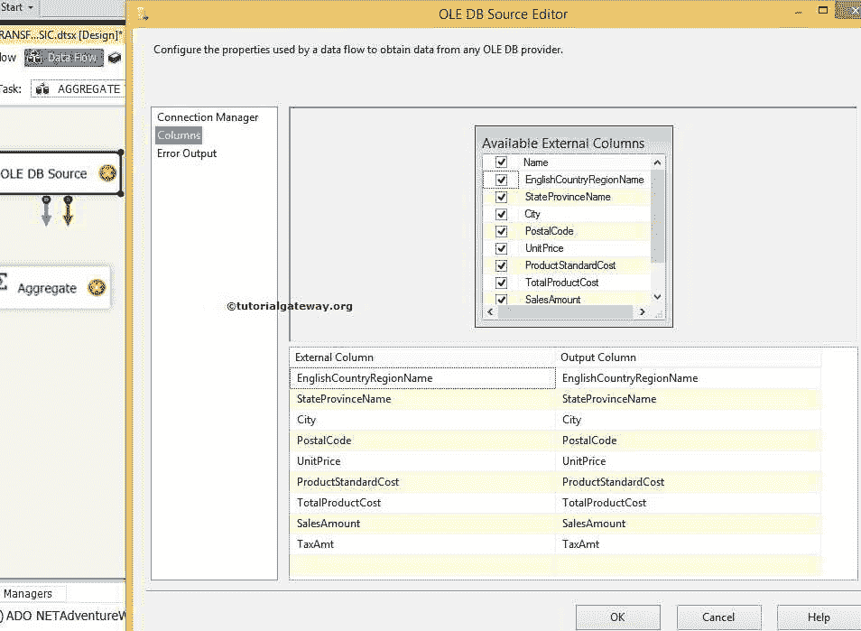

# SSIS 基本模式中的聚合转换

> 原文：<https://www.tutorialgateway.org/aggregate-transformation-in-ssis/>

SSIS 的聚合转换执行两项主要任务:

1.  对输入数据应用聚合操作
2.  它允许您根据输入列中的值对数据进行分组。


SSIS 的聚合转换执行类似于 [SQL Server 聚合函数](https://www.tutorialgateway.org/sql-aggregate-functions/)的功能。操作包括以下内容:

1.  分组依据:就像 SQL [选择](https://www.tutorialgateway.org/sql-select-statement/)查询中的[分组依据子句](https://www.tutorialgateway.org/sql-group-by-clause/)一样。
2.  计数:它将[计数](https://www.tutorialgateway.org/sql-count-function/)该列中的值的数量。如果选择(*)作为输入列，则计数中将包含空值。否则，忽略空值。
3.  计数不同:它将计算该列中[不同](https://www.tutorialgateway.org/sql-select-distinct-statement/)值的数量。
4.  求和:计算列值的[和](https://www.tutorialgateway.org/sql-sum-function/)。
5.  平均值:计算列值的[平均值](https://www.tutorialgateway.org/sql-avg-function/)。
6.  最小值:计算列值的[最小值](https://www.tutorialgateway.org/sql-min-function/)。
7.  最大值:计算列值的[最大值](https://www.tutorialgateway.org/sql-max-function/)。

[SSIS](https://www.tutorialgateway.org/ssis/) 中的聚合转换可以配置为基本模式或高级模式。在基本模式下，聚合转换只有一个输出。在高级模式下，它可以有多个输出，每个输出包含不同聚合的结果。

让我们通过一个例子来看看如何在 SSIS 配置聚合转换来产生单个输出。

提示:请参考[高级模式下的聚合转换](https://www.tutorialgateway.org/aggregate-transformation-in-ssis-advanced-mode/ "Aggregate Transformation in SSIS 2014 Advanced Mode")文章，了解如何在聚合转换中配置多个输出

### IsBig 属性

SSIS 的聚合转换包括 IsBig 属性，该属性用于输出列，以处理大的或高精度的数字。如果任何列值可能超过 40 亿，则 IsBig 应设置为 1。通过将 IsBig 属性设置为 1，聚合转换将:

1.  使用 DT_R8 数据类型而不是 DT_R4 数据类型。
2.  使用 DT_UI8 数据类型存储计数结果。
3.  您可以使用 DT_UI4 数据类型来存储不同的计数结果。

## SSIS 基本模式实例中的聚合转换

例如，如果我们想要找到每种颜色的销售金额的总和，那么我们可以使用这个 SSIS 聚合转换。在本例中，我们将对 AdventureworkDW2014 中的 DimGeography 和 FactResellerSales 表执行所有聚合转换操作。

步骤 1:打开 BIDS，从工具箱中拖放数据流任务来控制流，并将其命名为聚合转换。



双击它将打开数据流选项卡。

步骤 2:拖放 OLE DB 源，从工具箱聚合转换到数据流区域


步骤 3:双击数据流区域中的 OLE DB 源将打开连接管理器设置，并提供空间来编写我们的 SQL 语句。这里我们使用的是 AdventureworkDW2014 中的 DimGeography 和[factresellerssales]

我们用来为 SSIS 聚合转换检索数据的 SQL 命令基本模式是:

```
USE [AdventureWorksDW2014] 
GO 
SELECT [EnglishCountryRegionName]
      ,[StateProvinceName]
      ,[City]
      ,[PostalCode]
      ,RESELLER.[UnitPrice]
      ,RESELLER.[ProductStandardCost]
      ,RESELLER.[TotalProductCost]
      ,RESELLER.[SalesAmount]
      ,RESELLER.[TaxAmt]

FROM [DimGeography]
 INNER JOIN 
     [FactResellerSales] AS RESELLER ON
 [DimGeography].[SalesTerritoryKey] = RESELLER.[SalesTerritoryKey]
```



第 4 步:单击列选项卡验证列。在此选项卡中，我们还可以取消选中不需要的列。



将蓝色箭头从 OLE 数据库源拖放到聚合转换以连接数据。

### SSIS 聚合转换编辑器

第五步:双击 SSIS 聚合转换打开编辑器。接下来，在下窗格中，我们通过在可用输入列中检查来选择执行聚合转换操作所需的列。

选中所需的列后，这些列名将出现在位于下窗格的输入列中。


*   输入列:我们从 OLE 数据库源接收的列。
*   输出别名:这与 [SQL 别名](https://www.tutorialgateway.org/sql-alias/)相同。在这里，我们可以根据项目要求更改列名。
*   操作:我们已经在上面讨论过了。

对于这个 SSIS 聚合转换示例，我们将使用大多数聚合函数，如下面的


从上面的 SSIS 聚合转换截图中，您可以观察到我们测量了单价、产品标准成本、产品总成本最小值、销售额最大值和税额平均值的总和。按英国国家/地区分组，然后按州/省名称分组，然后按城市分组。

注意:如果输入列是字符串类型，您将看不到求和、平均和其他聚合函数，而只能看到分组依据。在将列的数据类型作为输入提供给聚合转换之前，请务必将其转换为正确的数据类型。

单击确定。

第六步:将 [OLE DB 目标](https://www.tutorialgateway.org/ssis-ole-db-destination/)拖放到数据流区域，将蓝色箭头从聚合转换拖动到


步骤 7:现在，我们必须提供目标的服务器、数据库和表细节。因此，双击 OLE 数据库目标并提供所需的信息。


在这里，我们指出我们的目标数据库为[SSIS 教程]。目前，我使用“新建”按钮为我创建了一个目标表，并将其命名为聚合转换基本模式。但实际上，你不应该这样设计你的桌子。

第 8 步:单击 SSIS 聚合转换映射选项卡，检查源列是否完全映射到目标列。


单击“确定”完成我们的 SSIS 聚合转换包设计。让我们运行包


让我们打开 [SQL Server](https://www.tutorialgateway.org/sql/) 管理工作室，写下面的 T-SQL 语句检查结果

```
SELECT [EnglishCountryRegionName]
      ,[StateProvinceName]
      ,[City]
      ,[UnitPrice]
      ,[ProductStandardCost]
      ,[TotalProductCost]
      ,[SalesAmount]
      ,[TaxAmt]

FROM [SSIS Tutorials].[dbo].[Aggrigate Transformation Basic Mode]

```


### 聚合转换高级选项

SSIS 的聚合转换在聚合转换编辑器的高级选项卡中包含一组属性。通过设置这些属性，我们可以提高聚合转换的性能。


键比例:在此选项中，指定聚合可以写入的键的大致数量。默认情况下，该选项的值为“未指定”。

| 价值 | 描述 |
| 未指明的 | 未使用“关键比例”属性。 |
| 低的 | 聚合可以写入近 50 万个键。 |
| 中等 | 聚合可以写近 5，000，000 个键。 |
| 高的 | 聚合可以写入超过 25，000，000 个键。 |

*   键:指定聚合可以写入的键的确切数量。键是指操作预期从组中产生的组的数量。如果同时设置了“关键点比例”和“关键点”属性，则“关键点”的值优先。
*   计数不同比例:我们可以指定聚合可以写入的不同值的大致数量。
*   计算不同的键:在这种情况下，我们可以指定聚合可以写入的不同值的确切数量。如果同时指定了 CountDistinctScale 和 CountDistinctKeys，CountDistinctKeys 优先。
*   自动扩展因子:在这个 SSIS 聚合转换选项中，我们可以指定它在聚合过程中可以扩展的内存百分比。我们可以选择 1 到 100 之间的值。默认情况下，该选项的值为 25%。