# SSIS 先进模式下的总量转化

> 原文：<https://www.tutorialgateway.org/aggregate-transformation-in-ssis-advanced-mode/>

SSIS 的聚合转换支持多种输出。这意味着聚合转换可以一次从源中读取数据。然后，我们可以创建各种输出，每个输出可能有一组不同的聚合。这里，我们通过示例向您展示如何在 SSIS 高级模式下配置聚合转换中的多个输出

提示:请参考 SSIS 文章中的[聚合转换，了解聚合及其功能。](https://www.tutorialgateway.org/aggregate-transformation-in-ssis/)

## SSIS 先进模式下的集群转型

步骤 1:打开 BIDS，从工具箱中拖放数据流任务来控制流，并将其重命名为聚合转换。

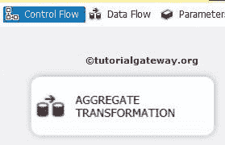

第二步:将 OLE DB 源、聚合转换从工具箱拖放到 [SSIS](https://www.tutorialgateway.org/ssis/) 数据流区域

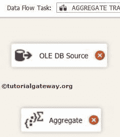T4】

双击数据流区域中的 OLE DB 源将打开连接管理器设置，并为编写我们的 SQL 语句提供空间。这里我们使用的是 AdventureworkDW2014

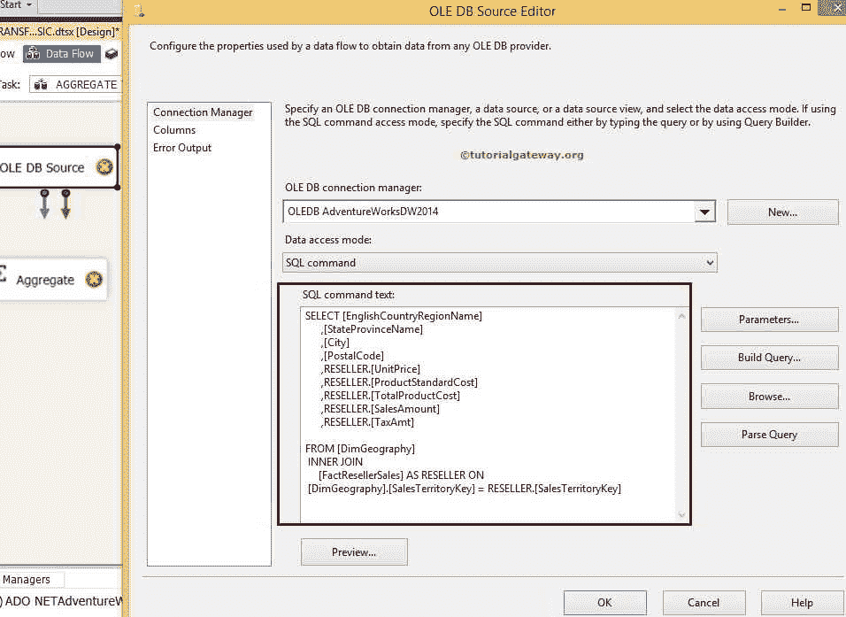

中的 DimGeography 和[factresellerselsales]

我们在上面截图中用来检索数据的 [SQL](https://www.tutorialgateway.org/sql/) 命令是:

```
SELECT [EnglishCountryRegionName]
      ,[StateProvinceName]
      ,[City]
      ,[PostalCode]
      ,RESELLER.[UnitPrice]
      ,RESELLER.[ProductStandardCost]
      ,RESELLER.[TotalProductCost]
      ,RESELLER.[SalesAmount]
      ,RESELLER.[TaxAmt]  
FROM [DimGeography]
  INNER JOIN 
     [FactResellerSales] AS RESELLER ON
 [DimGeography].[SalesTerritoryKey] = RESELLER.[SalesTerritoryKey]
```

第 4 步:单击列选项卡验证列。在此选项卡中，我们还可以取消选中不需要的列。

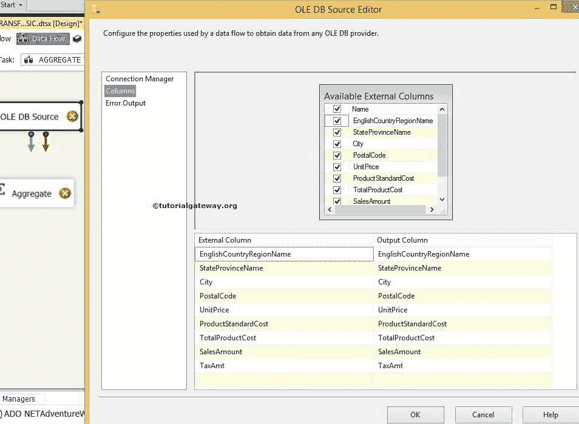

步骤 5:双击聚合转换打开聚合转换编辑器。在上窗格中，我们有一个按钮可以在基本模式和高级模式之间切换。在本例中，我们希望配置多个输出，因此选择高级模式。

单击高级模式按钮后，将打开一个新窗格来配置多个输出。

*   聚合名称:指定聚合名称。
*   按列分组:这里，它显示了我们用于分组的列列表。

接下来，在下窗格中，我们通过在可用输入列中检查来选择执行聚合转换操作所需的列。

一旦你选中了需要的列，那么这些列名就会出现在位于下方窗格的输入列中，如下图所示

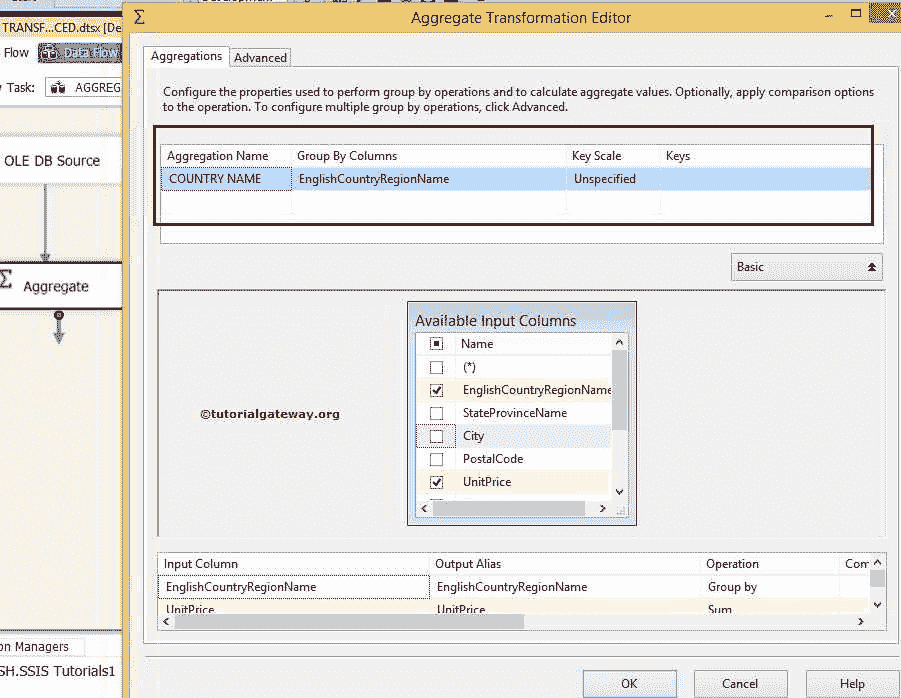

从上面的截图中，您可以看到我们将聚合名称指定为国家/地区名称，将组指定为英国国家/地区名称。

让我们再添加一个聚合，并将名称指定为州名，将分组方式指定为英语国家地区名、州省名。

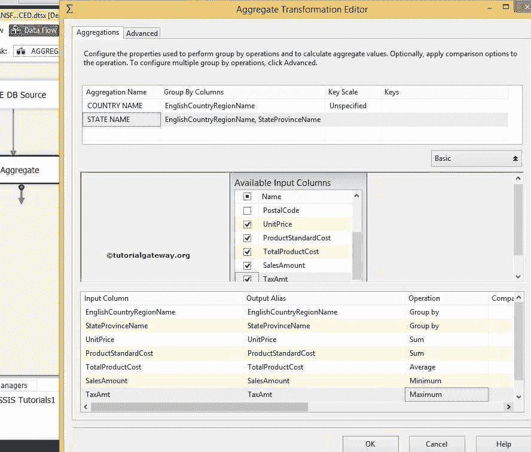

从上面的截图中，我们正在计算单价之和、产品标准成本之和、产品总成本平均值、销售金额最小值和税额最大值。按英语国家/地区分组，然后按州/省名称分组。

让我们再添加一个聚合，并将名称指定为城市，并将分组方式指定为英语国家/地区名称、州/省名称、城市。

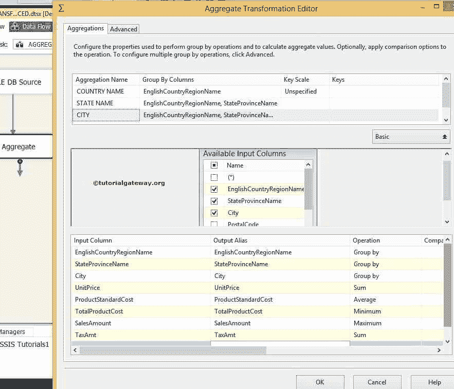

根据以上内容，我们计算了单价之和、产品标准成本平均值、产品总成本最小值、销售额最大值和税额之和。按英国国家/地区分组，然后按州/省名称分组，然后按城市分组。

步骤 6:将 3 个 OLE DB 目标从工具箱拖放到数据流区域，以配置我们从聚合转换中获得的三个输出。

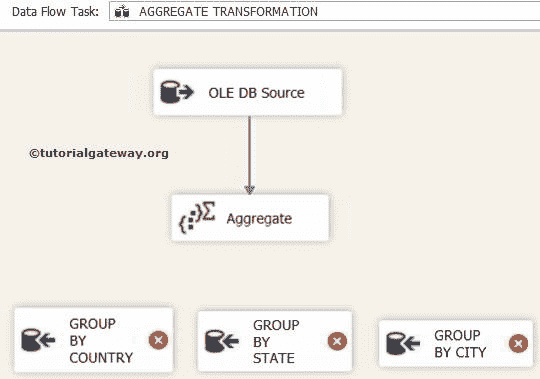

从上面，我们将 OLEDB 目的地重命名为“按国家分组”、“按州分组”和“按城市分组”

第 7 步:当您将聚合转换输出箭头拖动到 OLE DB 目标位置时，将打开一个输入输出选择窗口来选择其中一个输出，这里我们选择国家名称

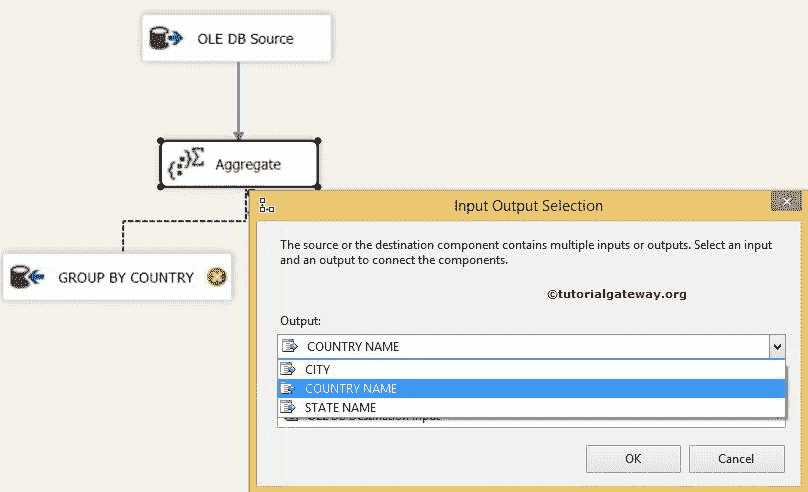

让我们将州名输出分配给第二个 OLE DB 目的地

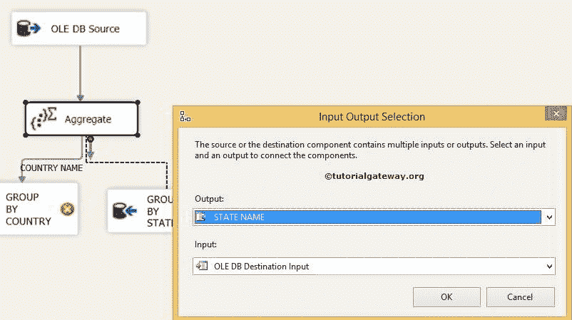

我们还有一个输出(城市)，所以当我们将绿色箭头从聚合转换拖到第三个 OLE 数据库目标时，它会自动分配给城市。

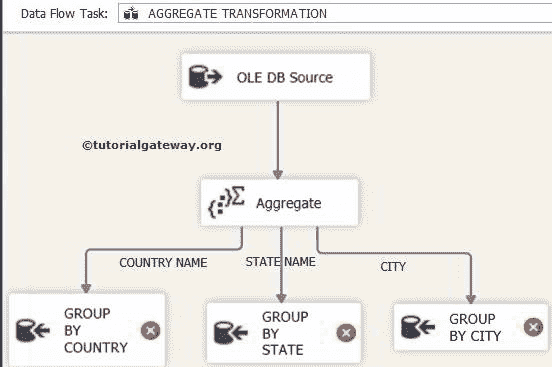

步骤 8:现在，我们必须为国家名称配置 OLE DB 目标。因此，双击 OLE 数据库目标并提供所需的信息。

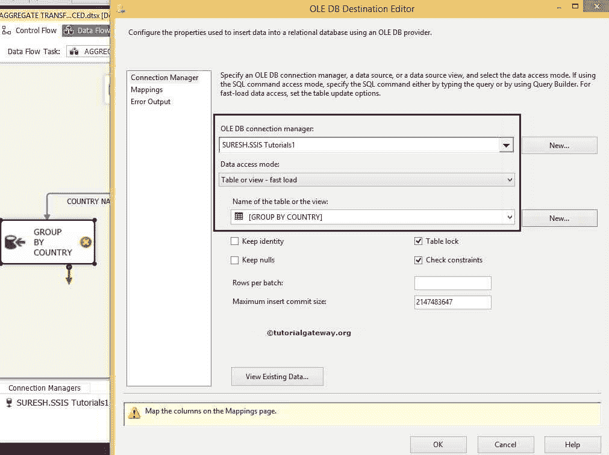

这里我们选择[SSIS 教程]数据库作为目标数据库，选择[按国家分组]表作为目标表

步骤 9:单击“映射”选项卡，检查聚合源列是否完全映射到目标列。

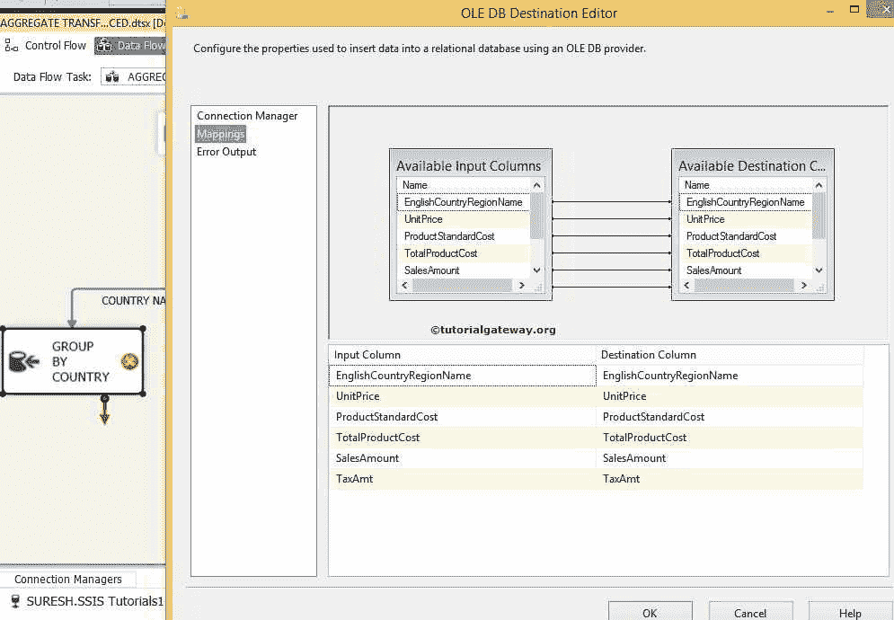

步骤 10:现在，我们必须通过状态聚合输出为组配置 OLE DB 目标。因此，双击 OLE DB 目标并提供所需的信息

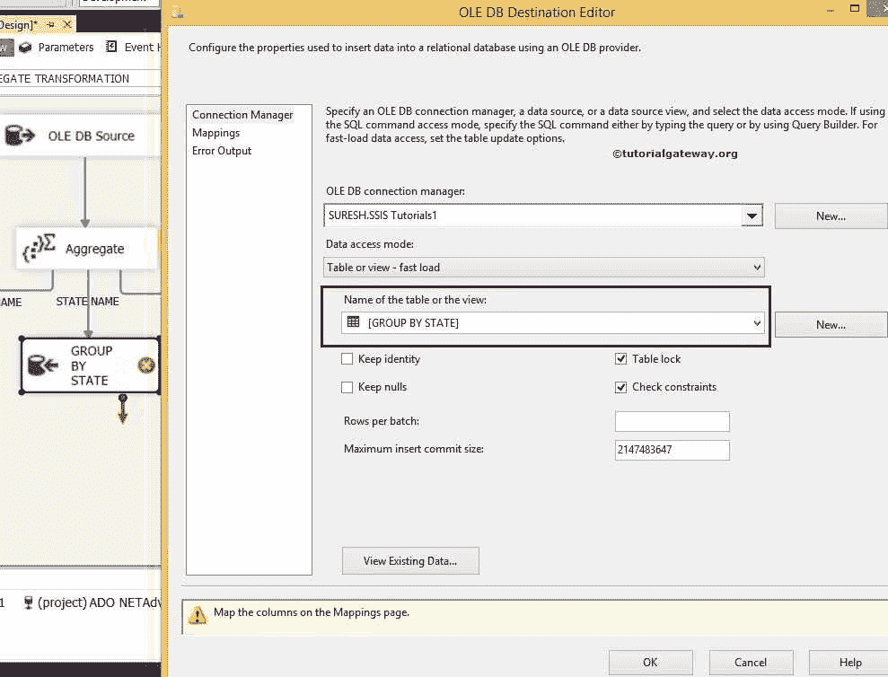

这里我们选择[SSIS 教程]数据库作为目标数据库，选择[按州分组]表作为目标表

重复步骤 9

步骤 12:现在，我们必须为城市输出行配置 OLE DB 目标。因此双击 OLE DB 目的地并提供所需信息

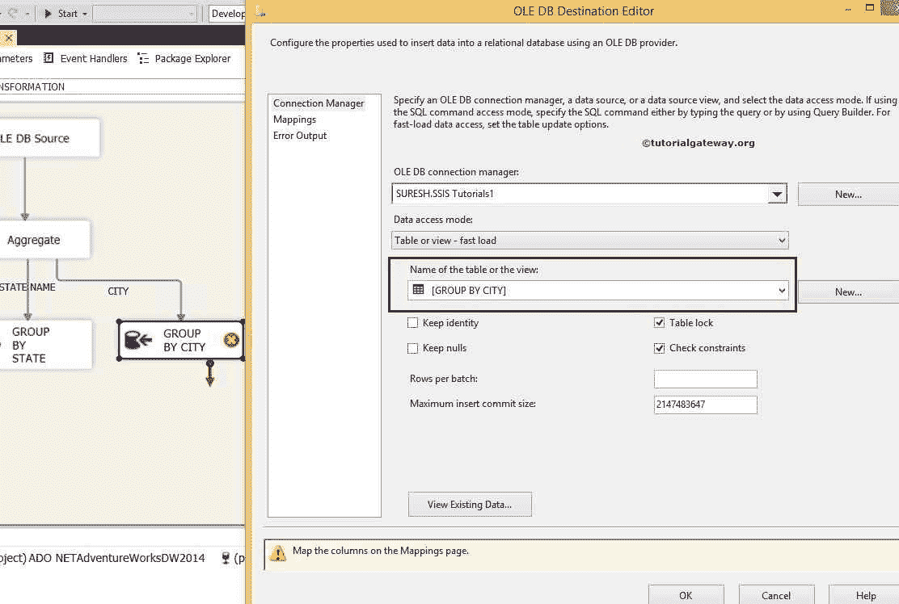

这里我们选择[按城市分组]表作为目标表

重复步骤 9

单击“确定”完成我们的包设计。让我们运行包

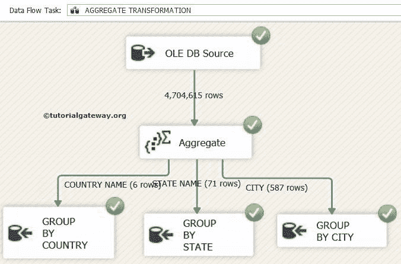

让我们看看按英语国家/地区名称分组的结果。为此，打开 [SQL Server 管理工作室](https://www.tutorialgateway.org/sql-server-management-studio/)并编写以下查询

```
SELECT [EnglishCountryRegionName]
      ,[UnitPrice]
      ,[ProductStandardCost]
      ,[TotalProductCost]
      ,[SalesAmount]
      ,[TaxAmt]
  FROM [SSIS Tutorials].[dbo].[GROUP BY COUNTRY]
```

输出

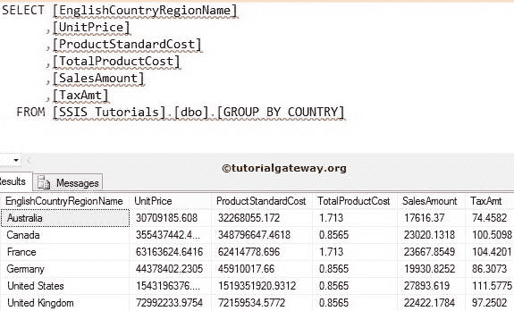

现在，查看按英语国家/地区名称、州/省名称分组的结果

```
SELECT [EnglishCountryRegionName]
      ,[StateProvinceName]
      ,[UnitPrice]
      ,[ProductStandardCost]
      ,[TotalProductCost]
      ,[SalesAmount]
      ,[TaxAmt]
  FROM [SSIS Tutorials].[dbo].[GROUP BY STATE]
```

输出


让我们看看按英语国家/地区名称、州/省名称和城市分组的结果

```
SELECT [EnglishCountryRegionName]
      ,[StateProvinceName]
      ,[City]
      ,[UnitPrice]
      ,[ProductStandardCost]
      ,[TotalProductCost]
      ,[SalesAmount]
      ,[TaxAmt]
  FROM [SSIS Tutorials].[dbo].[GROUP BY CITY]

```

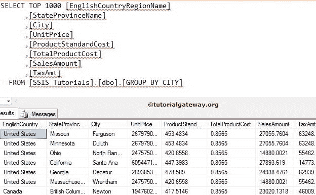