# SSIS 的缓存转换

> 原文：<https://www.tutorialgateway.org/cache-transformation-in-ssis/>

SSIS 的缓存转换用于从平面文件、Excel 工作表和 ADO.NET 数据源等多种来源读取数据。然后将这些数据源中的数据保存在。caw 文件。

默认情况下，SSIS 的查找转换使用 OLE DB 连接管理器作为查找引用表。我们也可以使用其他来源，但它们必须通过 SSIS 缓存转换间接使用。

实时地，我们使用 SSIS 缓存转换来保存引用表。caw 格式。然后使用 [SSIS](https://www.tutorialgateway.org/ssis/) 中的[缓存连接管理器](https://www.tutorialgateway.org/cache-connection-manager-in-ssis/)执行[查找转换](https://www.tutorialgateway.org/lookup-transformation-in-ssis/)。

## SSIS 缓存转换示例

在本例中，我们将使用 SSIS 缓存转换将 Excel 文件中的数据复制到缓存文件(。caw 扩展)。

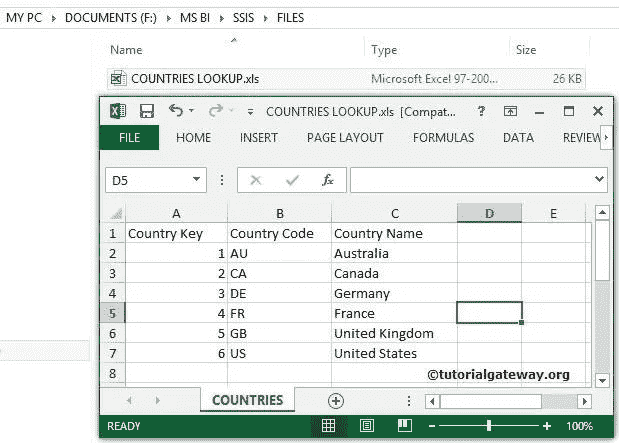

步骤 1:将数据流任务从工具箱拖放到控制流中，并将其重命名为缓存转换。

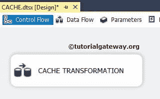

双击它打开数据流选项卡。

第二步:将 Excel 源从工具箱拖放到数据流区域。双击它配置 excel 文件

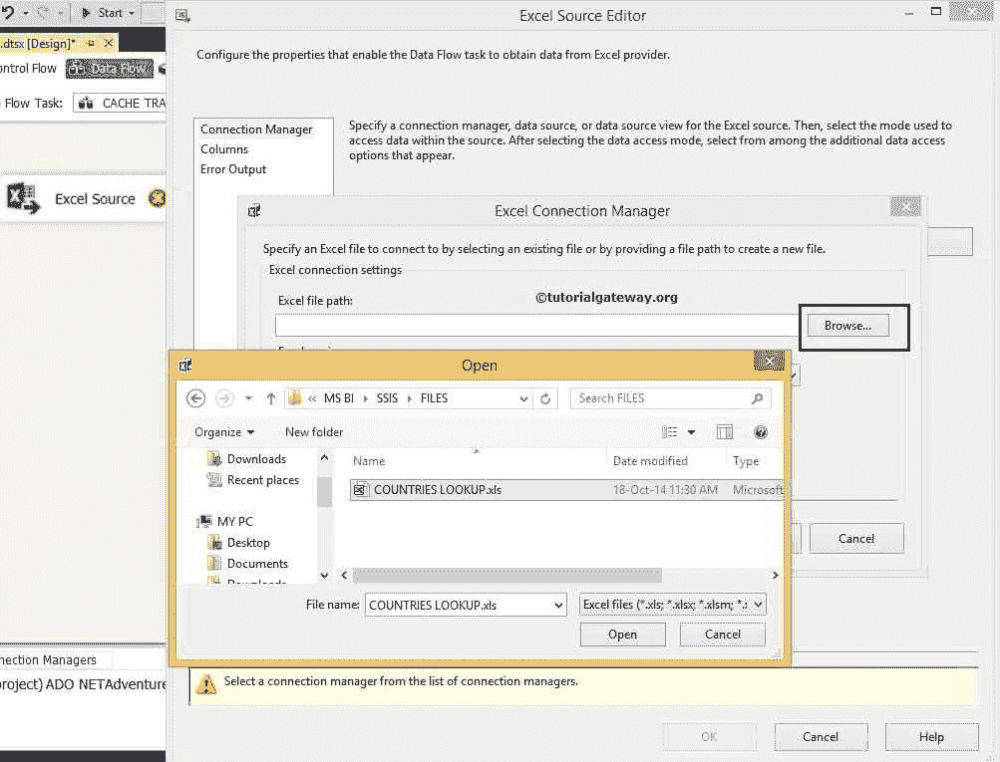

单击浏览按钮从本地硬盘中选择源文件。

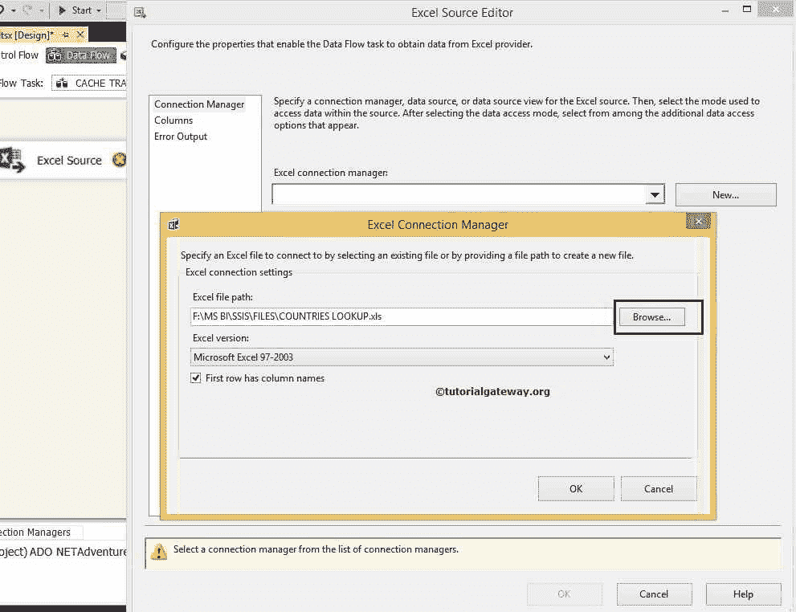

从上面的截图中，您可以看到我们在本地驱动器中选择了 COUNTRIES LOOKUP.xls 文件。

注意:如果 Excel 文件的第一行包含列名，请选中“第一行有列名”选项。

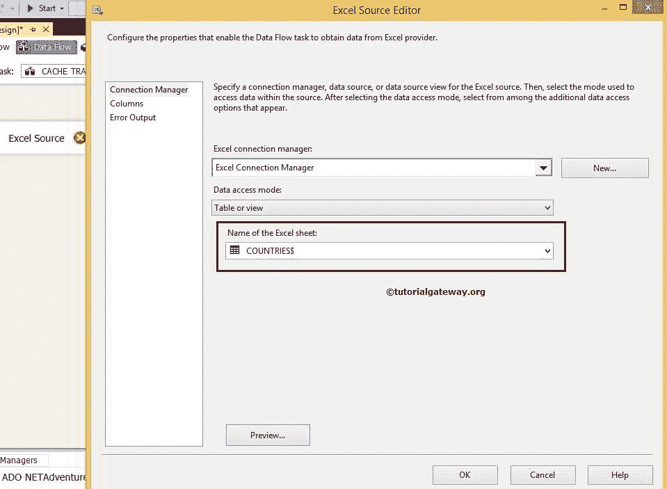

第 3 步:单击列选项卡验证列。在此选项卡中，我们可以取消选中不需要的列。

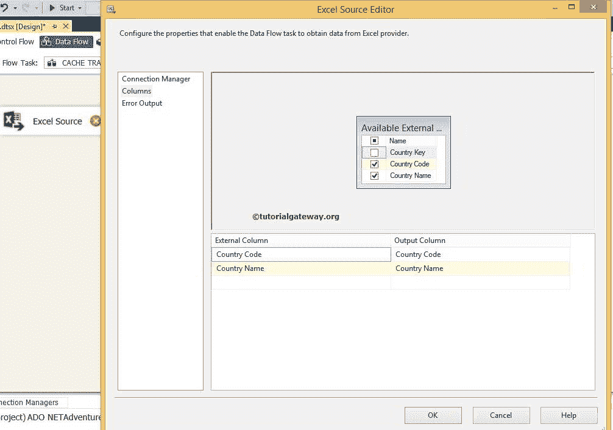

从上面的截图中，可以看到国家/地区键未被选中，因为我们与键列无关。我们只要求国家名称用作查找列，国家代码列用作附加输出列。

将蓝色箭头从 Excel 源拖到缓存转换，对源数据执行转换。

步骤 4:双击 SSIS 缓存转换进行配置。

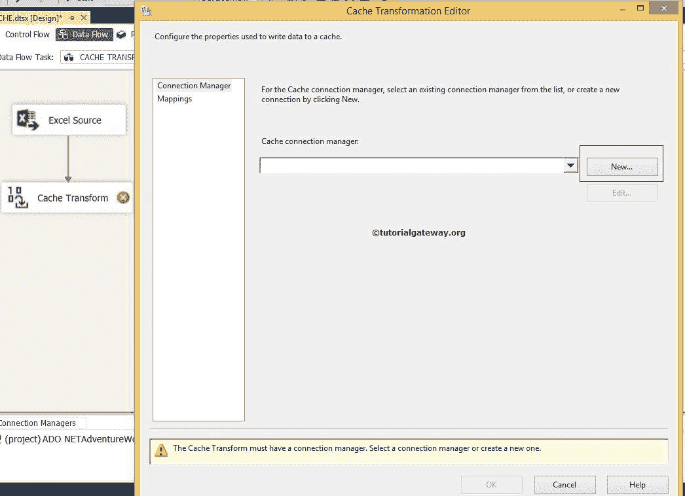

我们之前没有在这个项目中创建过 SSIS 缓存连接管理器，点击新按钮进行配置。

步骤 5:在 SSIS 缓存转换编辑器的常规选项卡上，

*   连接管理器名称:默认值为缓存连接管理器。但是您可以根据项目需求更改连接管理器的名称。
*   描述:为缓存连接管理器提供有效的描述。但目前，我们将违约留在这里。
*   使用文件缓存:如果选中此选项，连接管理器会将缓存的数据写入文件。
*   浏览:此按钮用于浏览现有文件或创建扩展名为的新文件。发出鸦叫声

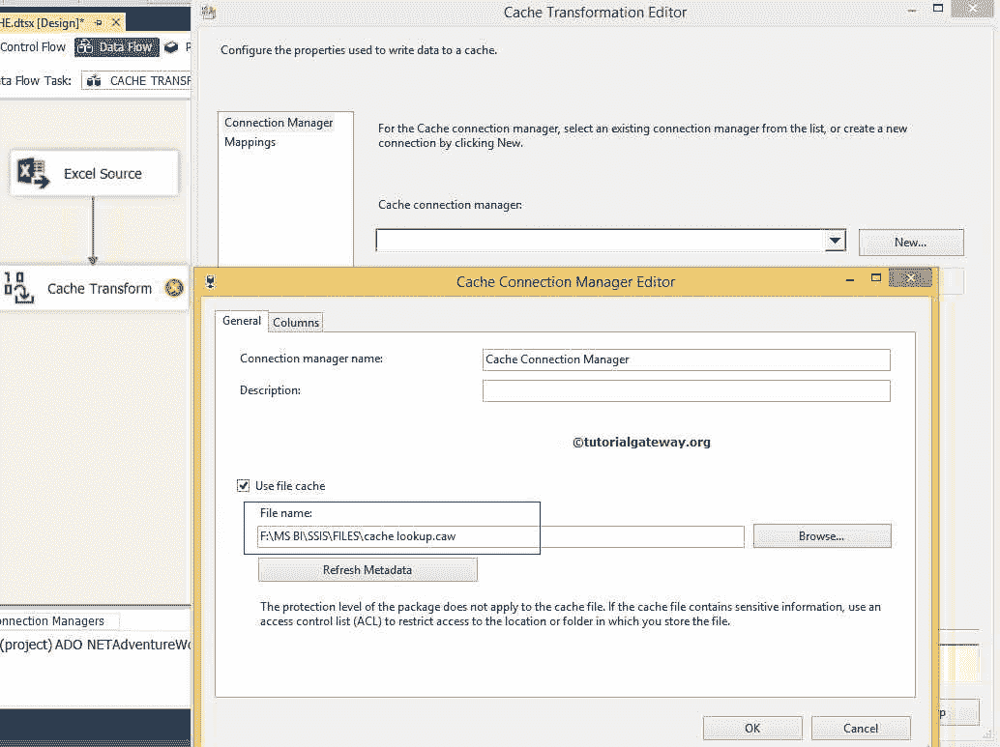

从上面的 SSIS 缓存转换截图中，您可以观察到我们使用了文件缓存选项。接下来，我们选择了位于本地驱动器中的 lookup.caw 文件。

接下来，选择 SSIS 缓存转换列选项卡。

步骤 6:列选项卡将显示来自源数据的可用列列表及其数据类型、长度、精度比例等。除了这些选项，还有一个重要的属性叫做索引位置。

*   对于未用于查找的列，将索引位置设置为 0。对于本例，我们不想对国家代码列执行查找操作。因此，将该列的索引位置设置为 0。
*   对于用于查找的列，将索引位置设置为 1。对于本例，我们希望对“国家/地区名称”列执行查找操作。因此，将该列的索引位置设置为 1。

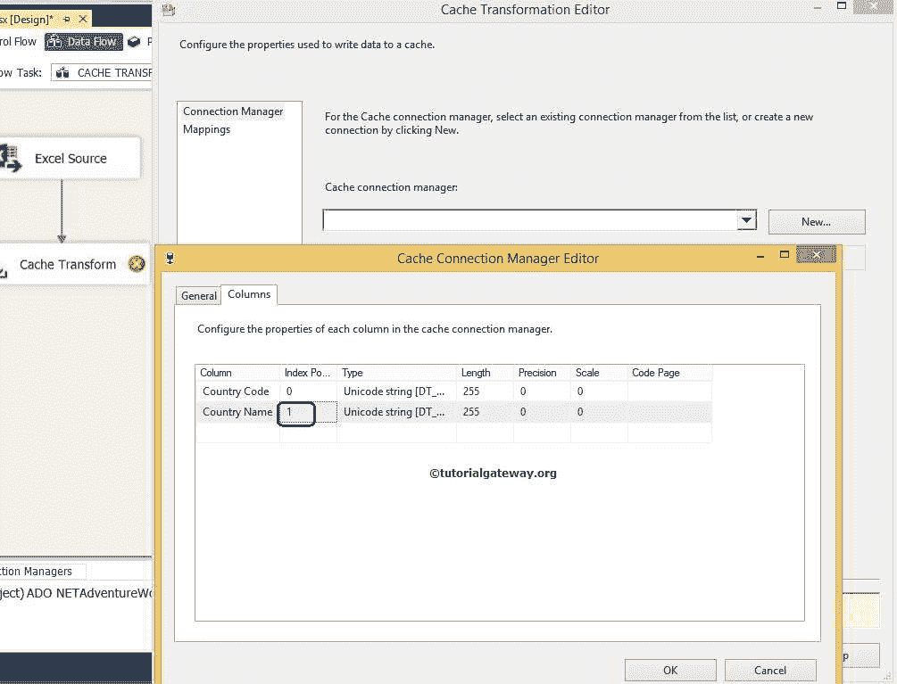

单击确定完成 SSIS 缓存连接管理器的配置。

第 7 步:单击 SSIS 缓存转换列选项卡，验证所有列是否正确映射。如果没有，请将输入列映射到适当的目标列。否则，你会得到错误的数据。

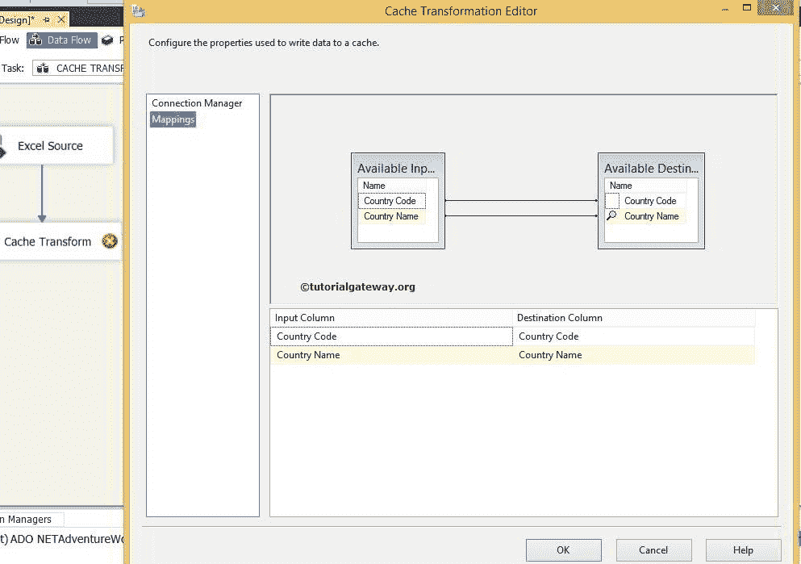

点击确定，运行 SSIS 缓存转换包，在本地驱动器

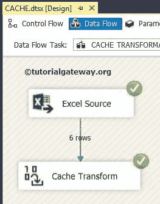

创建缓存文件

检查 SSIS 缓存转换

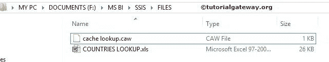

的结果