# SSIS 的字符映射转换

> 原文：<https://www.tutorialgateway.org/character-map-transformation-in-ssis/>

SSIS 的字符映射表转换对于转换输入字符非常有用。如果我们想将字符串列更改为大写、小写、简体中文、片假名、平假名和繁体中文，那么 SSIS 字符映射表转换可以为您提供帮助。它为您提供了选择是要用输出结果覆盖现有列，还是要将其添加为新列的选项。

SSIS 的字符映射表转换支持 10 种操作。操作和描述如下所示。

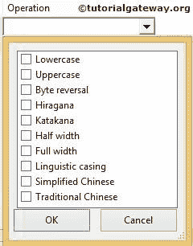

1.  小写:将字符串列字符转换为小写。例如，tutorialgateway 列转换为 TutorialGateway
2.  大写:将字符串列字符转换为大写。例如，TUTORIALGATEWAY 列变成 TutorialGateway
3.  再见反转:这个 SSIS 字符映射转换反转了 Unicode 的字节顺序
4.  平假名:将片假名字符转换为平假名字符。
5.  片假名:将平假名字符转换为片假名字符。
6.  半角:将全角字符转换为半角字符。例如，hello 转换为 hello。
7.  全宽:这个 SSIS 字符映射转换将半宽字符转换为全宽字符。例如，hello 被转换为 hello
8.  语言大小写:一般来说，数据库使用其系统语言将数据存储到列中。例如，我的系统以美国英语格式存储日期，因为这是我的系统的本地语言。要使用其他区域语言，我们可以使用这个语言大小写选项
9.  简体中文:这个 SSIS 字符图转换将繁体中文字符转换为简体中文字符。比如，你的简体中文怎么样你好吗
10.  繁体中文:将简体中文转换为繁体中文。

SSIS 的字符映射转换允许我们为单个列选择多个选项。但是，在选择过程中有一些限制。例如，如果我们选择小写操作，那么选择大写也是没有意义的。下表显示了我们不应该在单个列中选择的 [SSIS](https://www.tutorialgateway.org/ssis/) 动作。

| 选定的操作 | 操作不应选择 |
| 小写字母 | 大写、平假名、片假名、半角和全角 |
| 大写字母 | 小写、平假名、片假名、半角和全角 |
| 平假名 | 片假名、小写、大写 |
| 片假名 | 平假名、小写、大写 |
| 半宽 | 全宽，小写，大写 |
| 全宽 | 半宽，小写，大写 |
| 简体中文 | 繁体中文 |
| 繁体中文 | 简体中文 |

## SSIS 字符映射转换示例

步骤 1:从工具箱中拖放数据流任务来控制流，并将名称更改为 SSIS 字符映射转换。

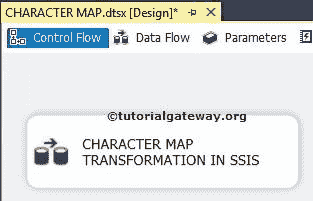

双击它将打开数据流选项卡。

第二步:将 [OLE DB 源](https://www.tutorialgateway.org/ole-db-source-in-ssis/)、人物贴图转换、ADO.NET 目标拖放到数据流区域

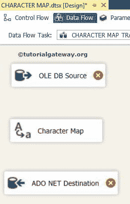

第三步:双击数据流区域的 OLE DB 源将打开连接管理器设置，并提供空间来编写我们的 [SQL](https://www.tutorialgateway.org/sql/) 语句。

目前，我们已经从[冒险工作 DW 2014]数据库中的维度员工表中选择了[名字]、[姓氏]和[电子邮件标识]。

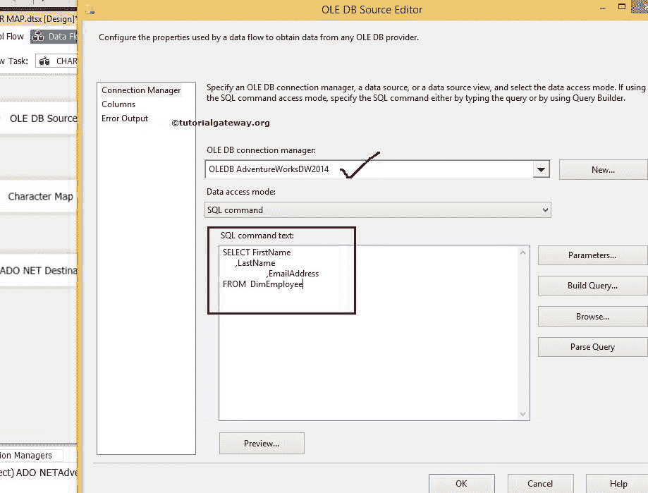

[SQL](https://www.tutorialgateway.org/sql/) 我们在上面截图中使用的命令是:

```
USE AdventureWorksDW2014
GO

SELECT FirstName
      ,LastName
      ,EmailAddress
FROM  DimEmployee

```

第 4 步:单击列选项卡验证列。在此选项卡中，我们还可以取消选中不需要的列。

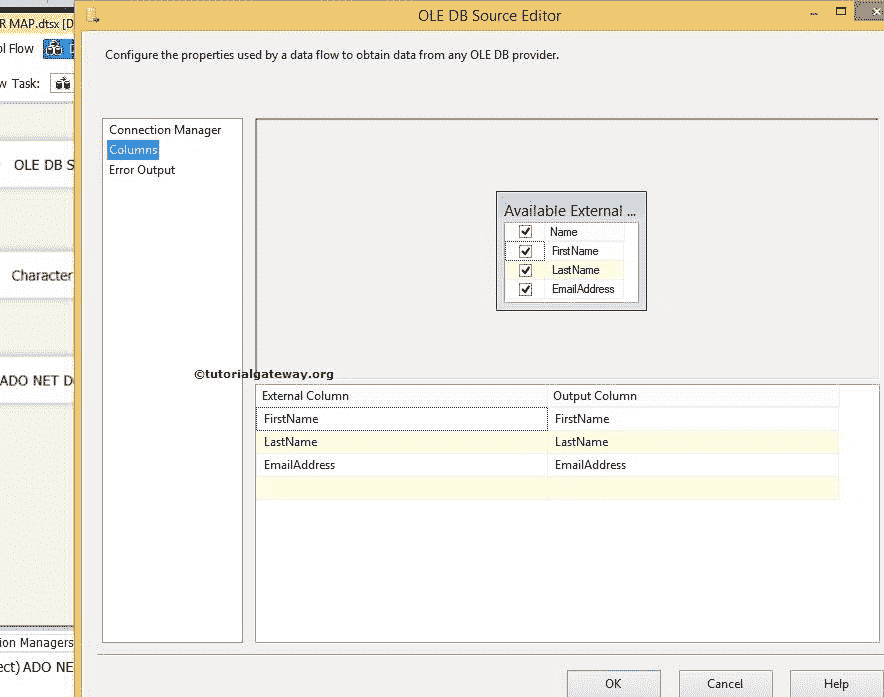

第五步:点击确定，将 OLE DB 源的输出箭头连接到字符映射转换。

双击 SSIS 字符映射转换进行配置

*   输入列:无论我们在“可用输入列”选项中选择了什么，都会自动反映在该选项中。我们也可以在这里直接选择输入列本身。
*   目标:我们可以选择是否要替换原始列。或者我们想把它作为一个新的专栏。在本例中，我们使用了“新建列”选项。
*   操作:我们已经在上面讨论过了
*   输出别名:指定新的列名。它的作用与 [SQL](https://www.tutorialgateway.org/sql/) 中的[别名列](https://www.tutorialgateway.org/sql-alias/)相同

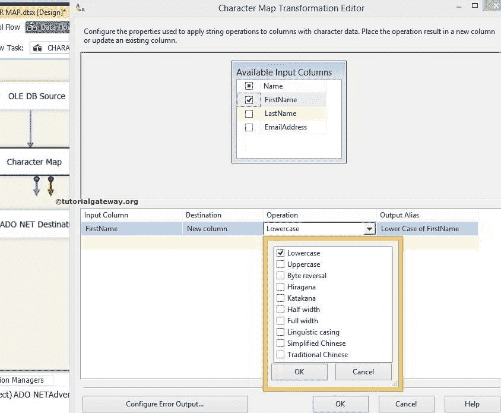

目前，我们只使用上和下。但是，您可以尝试 SSIS 字符映射表转换中的所有可用选项。单击确定。

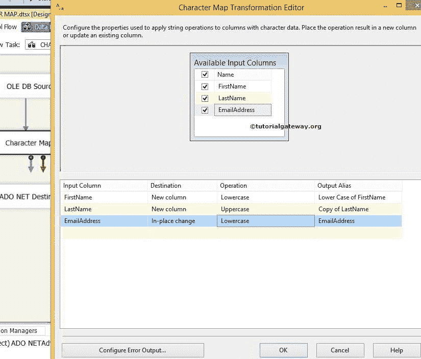

步骤 6:现在，我们必须提供目标的服务器、数据库和表细节。因此双击 ADO.NET 目标并提供所需信息

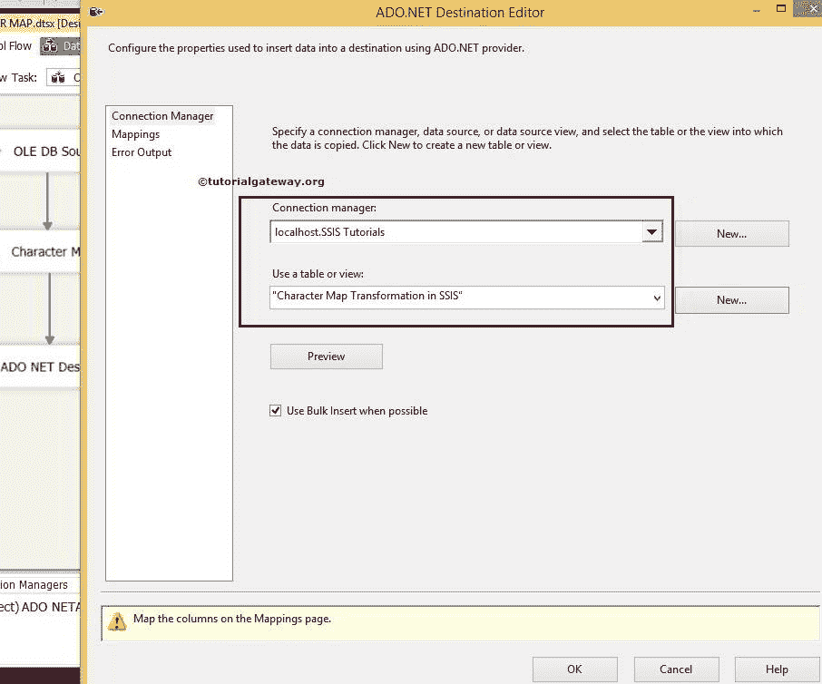

这里，我们从 SSIS 教程数据库中选择 SSIS 表中的字符映射转换

步骤 7:单击映射选项卡，检查 ssis 字符映射源列是否准确映射到目标列。

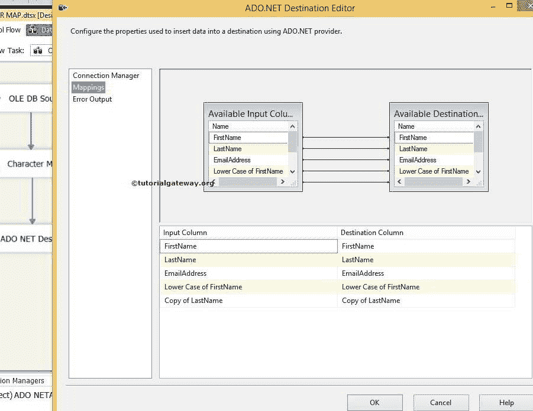

注意:如果输入列名和目标列名相同，智能会自动映射。如果列名(任何别名或计算列)有任何变化，我们必须手动映射它们。

通过点击确定，我们完成了我们的 SSIS 字符映射转换包。让我们运行包

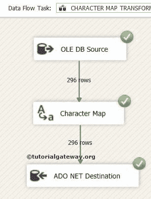

让我们打开 [SQL](https://www.tutorialgateway.org/sql/) 查询窗口预览数据

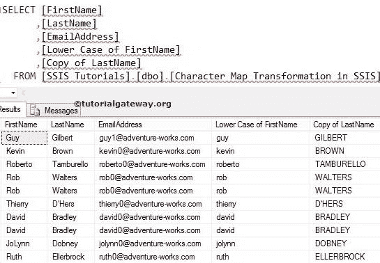