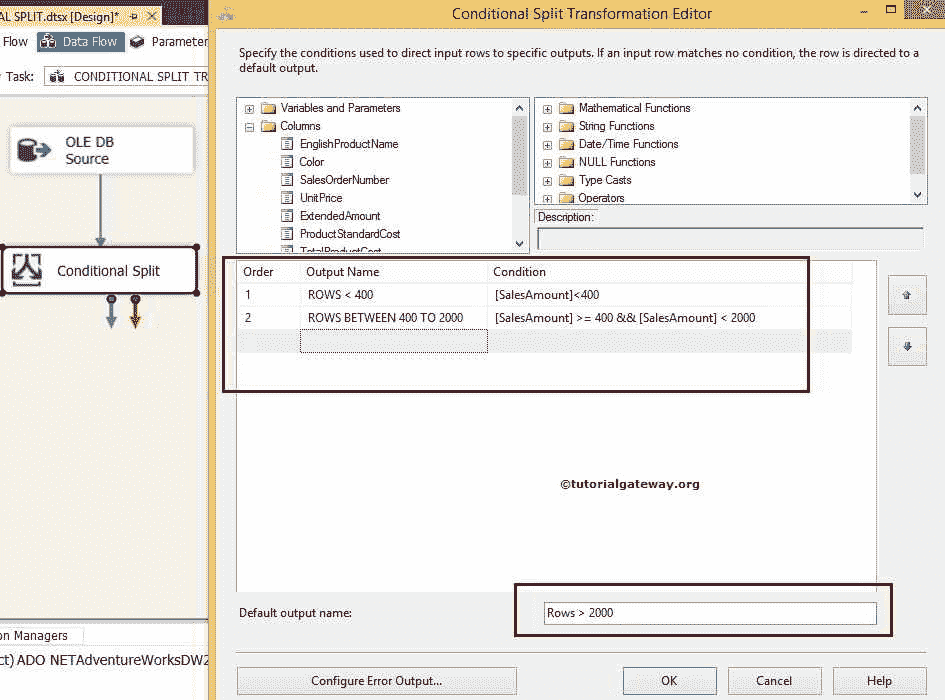
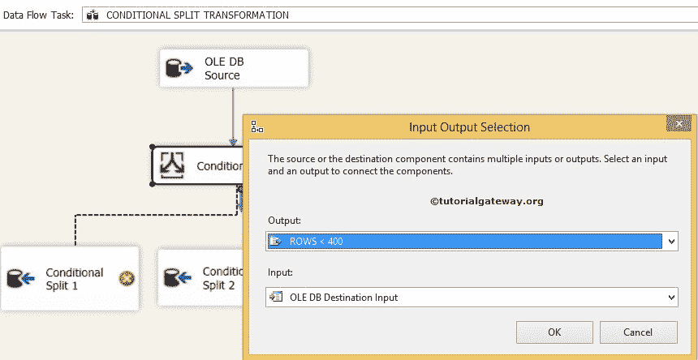
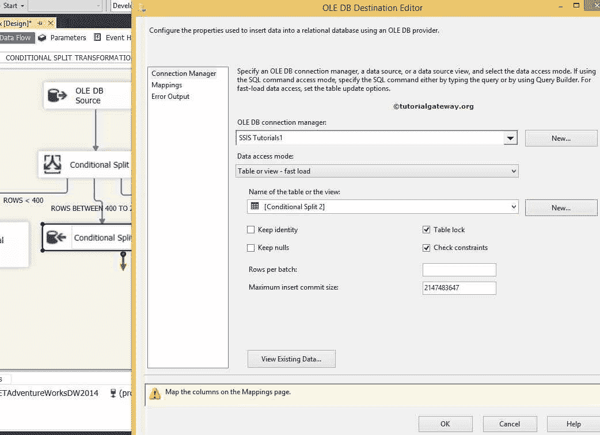

# SSIS 的条件分裂转化

> 原文：<https://www.tutorialgateway.org/conditional-split-transformation-in-ssis/>

SSIS 的条件分割转换就像 IF 条件或 CASE 语句。它检查给定的条件并基于条件结果；输出将发送到适当的目标路径。它有一个输入和多个输出。

例如，如果我们希望将一个班级中分数大于 40 的学生存储在一个表中，分数小于 40 的学生存储在另一个表中，那么我们可以使用这个 SSIS 条件分割转换来使用条件分割数据。请注意，SSIS 条件分割区分大小写。

## SSIS 例子中的条件分裂变换

步骤 1:从工具箱中拖放数据流任务来控制流，并将其命名为 SSIS 条件分割变换。


双击它，将打开 [SSIS](https://www.tutorialgateway.org/ssis/) 数据流选项卡。

步骤 2:将 OLE DB 源从工具箱拖放到数据流区域。双击数据流区域中的 [OLE DB 源](https://www.tutorialgateway.org/ole-db-source-in-ssis/)将打开连接管理器设置，并提供空间来编写我们的 [SQL](https://www.tutorialgateway.org/sql/) 语句。


[用于我们的 ssis 条件分割 OLE DB 源的 SQL](https://www.tutorialgateway.org/sql/) 命令是

```
-- SSIS Conditional Split Example
USE AdventureWorksDW2014
GO

SELECT PROD.[EnglishProductName]
     ,PROD.[Color]
     ,[SalesOrderNumber]
     ,[UnitPrice]
     ,[ExtendedAmount]
     ,[ProductStandardCost]
     ,[TotalProductCost]
     ,[SalesAmount]
     ,[TaxAmt]
     ,[Freight]
FROM [FactInternetSales]
INNER JOIN
[DimProduct] AS PROD ON
  [FactInternetSales].[ProductKey] = PROD.[ProductKey]
ORDER BY PROD.[EnglishProductName]
```

第 3 步:单击列选项卡验证列。在此选项卡中，我们还可以取消选中不需要的列。


单击确定

### 配置 SSIS 条件分割转换

第四步:将条件拆分转换从工具箱拖放到数据流区域，双击它以提供条件。



我们在这个 SSIS 条件分裂变换中使用的条件是:

1.  行 400
2.  400 到 2000 之间的行数：SalesAmount > = 400 和 SalesAmount < 2000
3.  剩余的行将作为默认输出，我们将其命名为[行数> 2000]

从上面可以看到，我们在 SSIS 的条件分割转换中使用了 2 个条件和一个默认输出。所以，我们总共得到三个输出。

第五步:将三个 OLE DB 目标从工具箱拖放到数据流区域，并将其重命名为条件拆分 1、条件拆分 2 和条件拆分 3


步骤 6:将箭头从条件分割转换拖放到 OLE 数据库目标(条件分割 1)将弹出输入输出选择窗口，以选择适当的输出。让我们选择【行<400] output as shown below



单击确定

步骤 7:现在我们必须提供 OLE DB 连接管理器和目标的表细节。因此双击 SSIS 条件分割 1 并提供所需信息


从上面的截图中，您可以看到我们在 SSIS 教程数据库中选择了[条件分割 1]

步骤 8:单击“映射”选项卡，检查源列是否完全映射到目标列。


单击确定

步骤 9:从 SSIS 条件分割转换到 OLE DB 目标(条件分割 2)再拖放一个箭头，弹出输入输出选择窗口选择输出。这次我们要选择【400 到 2000 之间的行】输出如下所示


步骤 10:让我们为第二个输出提供 OLE DB 连接管理器和目标的表细节。为此，双击条件分割 2 并提供所需信息。



从上面的截图中，您可以看到我们在 SSIS 教程数据库中选择了[条件分割 2]

重复步骤 8，然后单击确定

步骤 11:从 SSIS 条件分割转换到 OLE DB 目标(条件分割 3)再拖放一个箭头。这里我们配置默认输出数据。因此，双击 OLE DB 目的地并提供信息


从上面的截图中，你可以看到我们在 SSIS 教程数据库中选择了[条件分割 3]

重复步骤 8，然后单击确定

我们完成了 SSIS 条件分割转换包的开发。是时候运行这个包了


让我们看看 SQL Server 中[条件分割 1]表的结果。打开 SQL Server 管理工作室，写[选择语句](https://www.tutorialgateway.org/sql-select-statement/)检查结果

```
-- Conditional Split Transformation in SSIS Result
SELECT [EnglishProductName] AS NAME
      ,[Color]
      ,[SalesOrderNumber] AS NUMBER
      ,[UnitPrice]
      ,[ExtendedAmount] AS ExtndAmount
      ,[ProductStandardCost] AS standardCost
      ,[TotalProductCost] AS ProductCost
      ,[SalesAmount] AS Amount
      ,[TaxAmt] AS Tax
      ,[Freight]
  FROM [SSIS Tutorials].[dbo].[Conditional Split 1]

```


让我们通过编写下面的 select 语句来检查结果，从而查看[SSIS 条件分割 2]表中的结果

```
-- Result of SSIS Conditional Split
SELECT [EnglishProductName] AS NAME
      ,[Color]
      ,[SalesOrderNumber] AS NUMBER
      ,[UnitPrice]
      ,[ExtendedAmount] AS ExtndAmount
      ,[ProductStandardCost] AS standardCost
      ,[TotalProductCost] AS ProductCost
      ,[SalesAmount] AS Amount
      ,[TaxAmt] AS Tax
      ,[Freight]
  FROM [SSIS Tutorials].[dbo].[Conditional Split 2]

```


接下来，查看 SQL Server 中[条件分割 3]表的结果。打开 [SQL Server 管理工作室](https://www.tutorialgateway.org/sql-server-management-studio/)，写下面的 select 语句检查结果

```
-- SSIS Conditional Split Result
SELECT [EnglishProductName] AS NAME
      ,[Color]
      ,[SalesOrderNumber] AS NUMBER
      ,[UnitPrice]
      ,[ExtendedAmount] AS ExtndAmount
      ,[ProductStandardCost] AS standardCost
      ,[TotalProductCost] AS ProductCost
      ,[SalesAmount] AS Amount
      ,[TaxAmt] AS Tax
      ,[Freight]
  FROM [SSIS Tutorials].[dbo].[Conditional Split 3]

```

