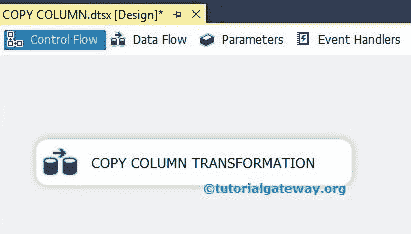
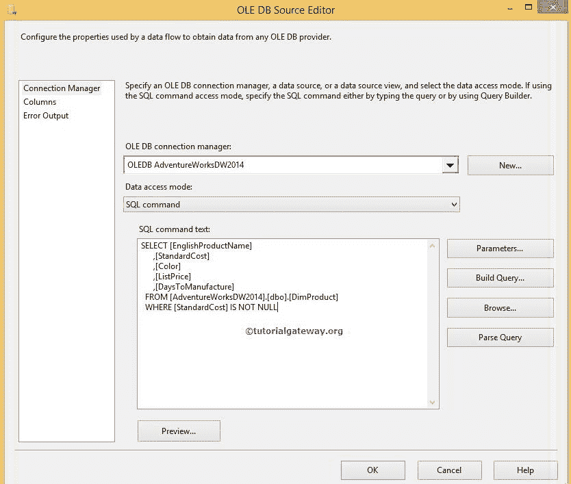
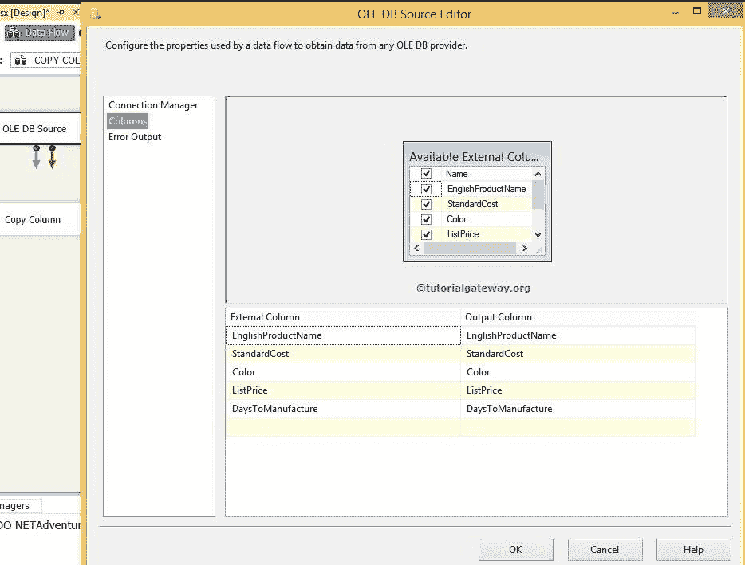
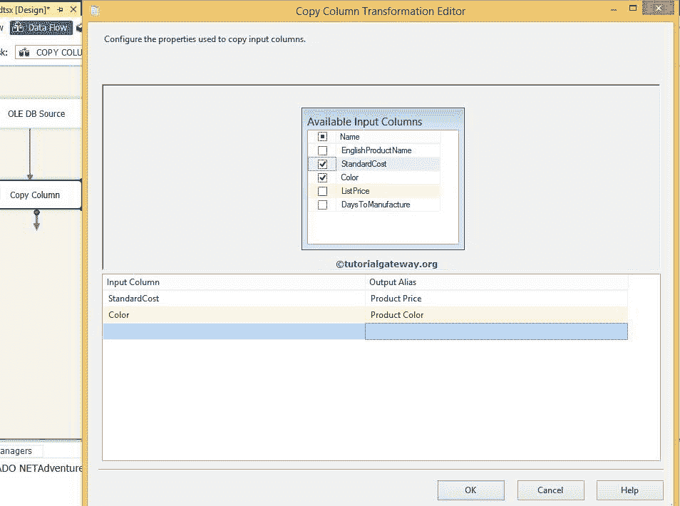
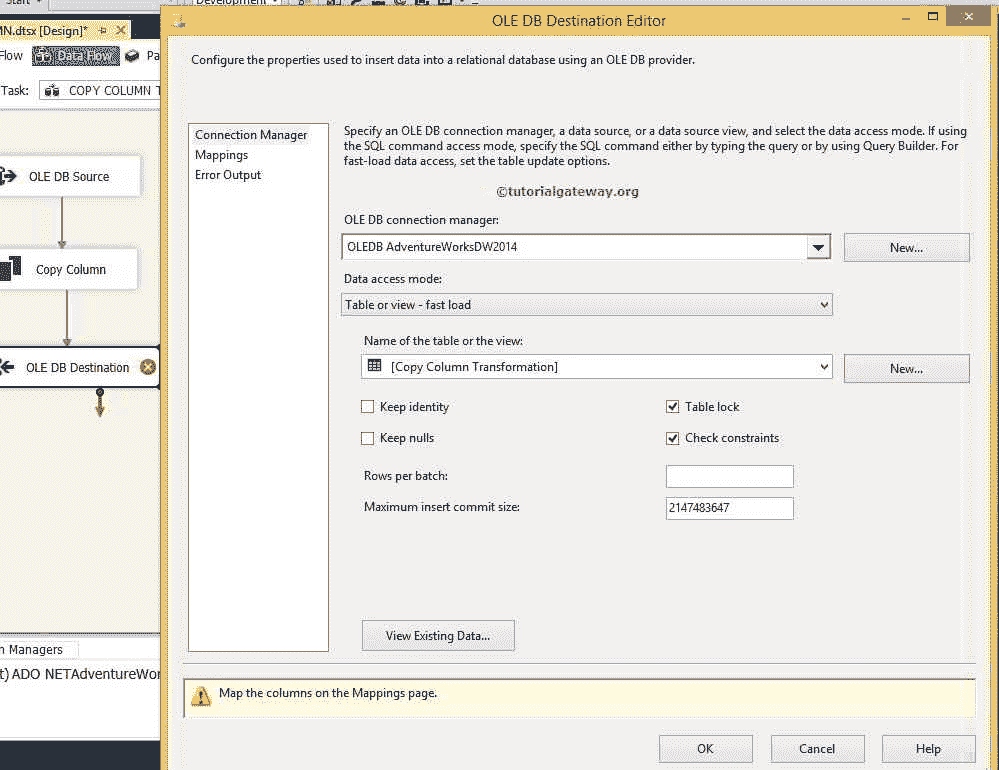
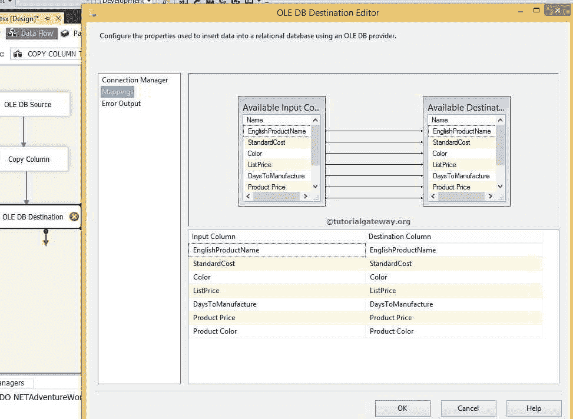
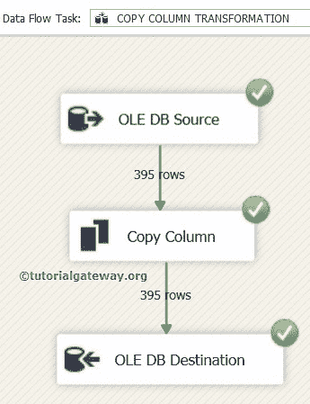
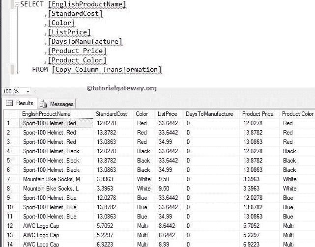

# SSIS 的复制列转换

> 原文：<https://www.tutorialgateway.org/copy-column-transformation-in-ssis/>

SSIS 的复制列转换复制源列。就像复制列数据并将数据粘贴到新列一样。这是一个重大的转变，因为如果我们想对单个列执行多个操作，那么我们可以创建多个副本。稍后，我们可以对一个副本执行一个操作。

例如，我们有列名产品价格，我们想计算经销商价格，经销商价格，价格包括增值税，价格加上损耗成本。现在，我们使用 SSIS 复制列转换为上述需求创建重复的列。然后，我们会计算经销商、分销商、增值税等。，价格个别。

## SSIS 示例中的复制列转换

第一步:将数据流任务从 [SSIS](https://www.tutorialgateway.org/ssis/) 工具箱拖放到控制流区域。



双击数据流任务打开数据流选项卡。

步骤 2:将 OLE DB 源、复制列转换从工具箱拖放到数据流区域。双击数据流区域中的 OLEDB 源，打开连接管理器设置。它还提供了选择包含源数据的表的选项。



[我们在这个 SSIS 复制列转换示例中使用的 SQL](https://www.tutorialgateway.org/sql/) 命令文本是:

```
SELECT [EnglishProductName]
      ,[StandardCost]
      ,[Color]
      ,[ListPrice]
      ,[DaysToManufacture]

FROM [AdventureWorksDW2014].[dbo].[DimProduct]

WHERE [StandardCost] IS NOT NULL
```

第 3 步:单击列选项卡验证列。在此选项卡中，我们还可以取消选中不需要的列。



### 配置 SSIS 复制列转换

第 4 步:单击“确定”，然后将箭头从“OLE DB 源”拖放到“复制列转换”。双击 SSIS 复制列转换，并选择要复制的列。



我们复制了[标准成本]和颜色列，并命名为产品价格和产品颜色。默认情况下，重复的列称为输出别名中的列名副本，但您可以根据需要编辑该名称。

单击确定。接下来，将 OLE 数据库目标拖放到数据流区域。

步骤 5:现在，我们必须提供一个 OLE DB 连接管理器和目标的表细节。因此双击 OLE DB 目的地并提供所需信息



我们将输出存储在冒险作品 DW 2014 数据库中的[在 ssis 中复制列转换]中。

步骤 6:单击 SSIS 拷贝列转换映射选项卡，查看映射到目标列的源列。



单击“确定”完成复制列转换的包设计。让我们运行包



让我们打开 [SQL 管理工作室](https://www.tutorialgateway.org/sql-server-management-studio/)查看结果

```
SELECT [EnglishProductName]
      ,[StandardCost]
      ,[Color]
      ,[ListPrice]
      ,[DaysToManufacture]
      ,[Product Price]
      ,[Product Color]

 FROM [Copy Column Transformation]
```



您可以用与[标准成本]和[颜色]相同的数据观察额外的列[产品价格]和[产品颜色]