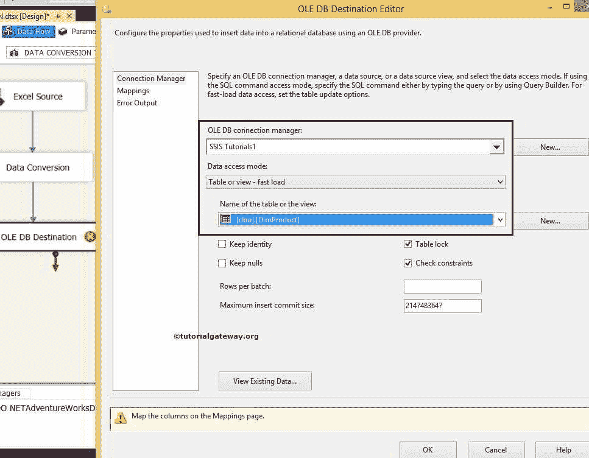

# SSIS 数据转换

> 原文：<https://www.tutorialgateway.org/ssis-data-conversion/>

SSIS 数据转换转换类似于 SQL 函数 CAST 或 CONVERT。如果您希望将数据从一种数据类型转换为另一种数据类型，那么 SSIS 数据转换是最好的选择。但是，请确保列中有兼容的数据，并且不要忘记更改 Varchar、NVarchar 数据类型的列长度。

在这里，我们将通过使用 SSIS 数据转换将数据类型从 NTEXT 转换为 WSTR，将显示在 DimProducts Excel 工作表中的数据导出到 SQL Server 数据库表中。下图显示了 DimProducts Excel 文件中的数据。


## SSIS 数据转换转换示例

第一步:将数据流任务从工具箱中拖放到控制流中，并将其重命名为【SSIS 数据转换转换】


双击它，它将打开数据流选项卡。接下来，将 EXCEL Source，SSIS 数据转换转换从工具箱拖放到数据流区域。请参考 [SQL Server](https://www.tutorialgateway.org/sql/) 中的 [CAST](https://www.tutorialgateway.org/sql-cast-function/) 和 [CONVERT](https://www.tutorialgateway.org/sql-convert/) 。


第三步:双击数据流区域中的 Excel 源将打开连接管理器设置。它还提供了一个选择保存源数据的表的选项。我们正在选择本地硬盘


中的 DimProducts.xls 文件

我们正在选择位于 T2 的产品目标表

单击列选项卡验证列。在此选项卡中，我们还可以取消选中不需要的列。


单击确定，然后将蓝色箭头从 Excel Source 拖到 SSIS 数据转换转换。它将允许转换使用源数据。

步骤 5:双击或右键单击 SSIS 数据转换转换，编辑我们的源列数据类型，并将其转换为所需的长度数据类型。同样，您可以在 ssis 中将 int 转换为 string。


这是我们用于 SSIS 数据转换目标表的表描述

```
USE [SSIS Tutorials]
GO

CREATE TABLE [dbo].[DimProduct]
( 
 [ProductKey] [int] IDENTITY(1,1) NOT NULL, 
 [EnglishProductName] [nvarchar](50) NOT NULL, 
 [Color] [nvarchar](50) NOT NULL, 
 [ListPrice] [money] NULL, 
 [DealerPrice] [money] NULL, 
 [EnglishDescription] [nvarchar](400) NULL, 
 [SalesAmount] [money] NOT NULL, 

 CONSTRAINT [PK_DimProduct_ProductKey] PRIMARY KEY CLUSTERED 
 ( 
  [ProductKey] ASC 
 ) 
) 
GO 
```

在将数据传输到 SQL server 目标表之前，我们必须更改数据类型，以使 Excel 列与目标表相匹配。

注意:在从 Excel 到 SQL server 数据库的传输过程中，总是需要转换数据类型。

步骤 6:将数据类型从 DT_NTEXT 更改为 DT_WSTR，不要忘记更改长度。


大多数时候，智能会自动改变数据类型。然而，有时我们不得不自己去做。单击确定

步骤 7:现在，我们必须提供目标的服务器、数据库和表细节。因此双击 OLE DB 目标并提供所需信息



第八步:点击 [SSIS](https://www.tutorialgateway.org/ssis/) 映射选项卡，检查源列是否精确映射到目标列。


如果您忘记了转换，它将失败，因为从 DT_NTEXT 到 DT_WSTR 的数据转换。让我们映射正确的列，然后单击“确定”完成我们的 SSIS 数据转换包设计。让我们运行包


查看 SSIS 数据转换转换


的结果