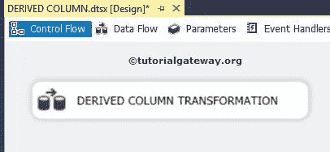
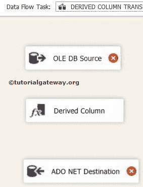
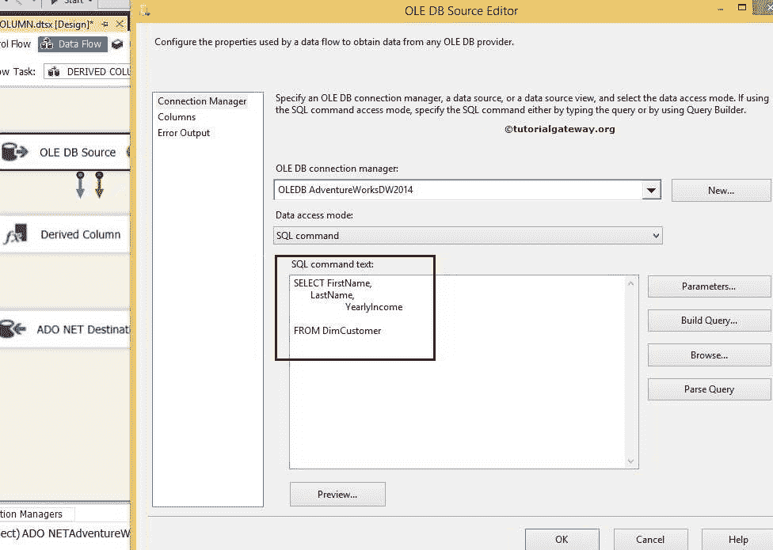
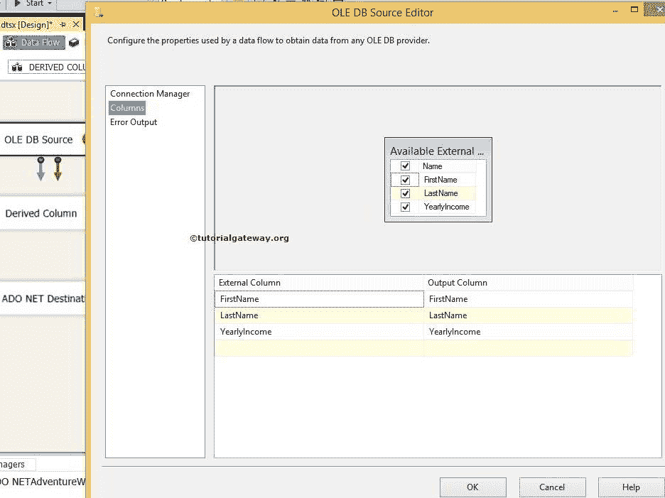
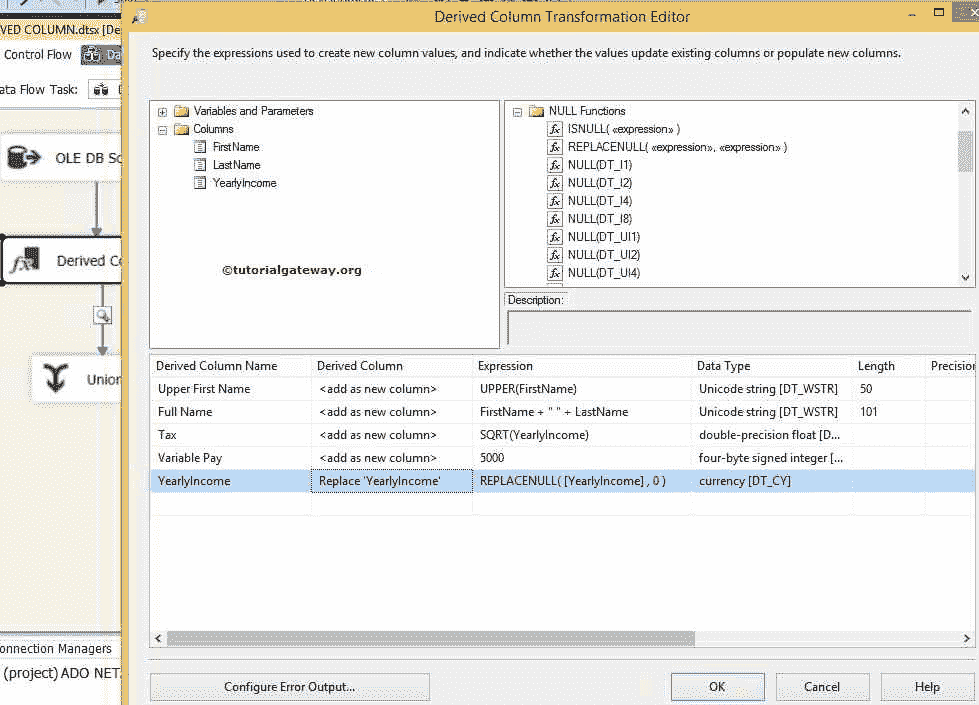
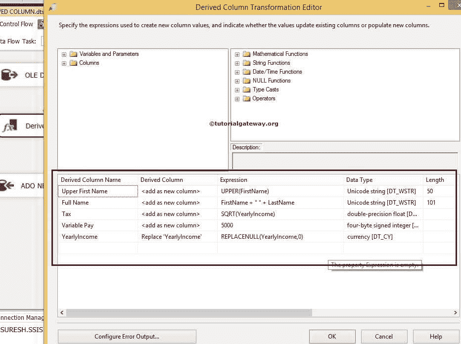
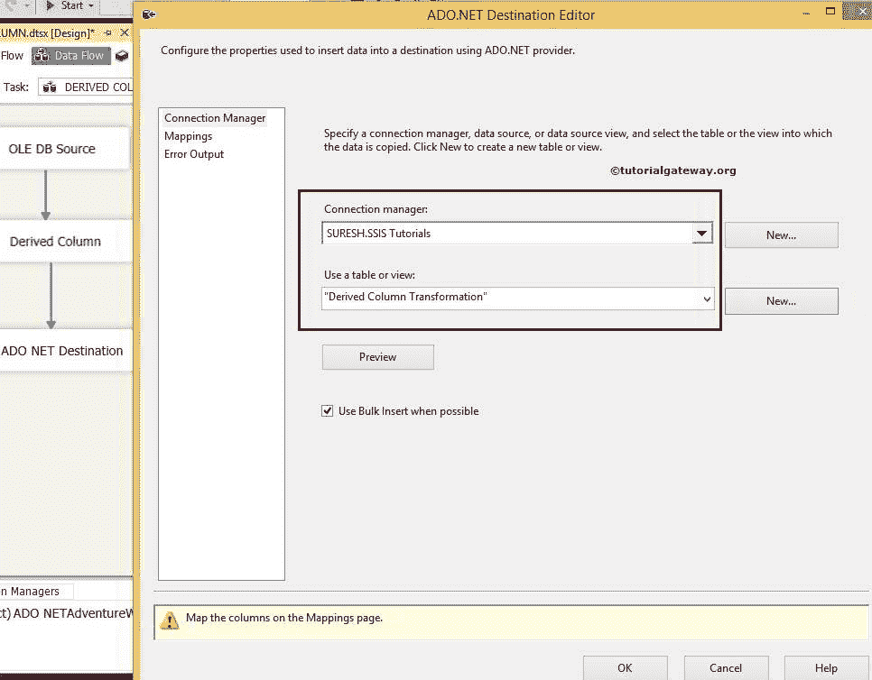
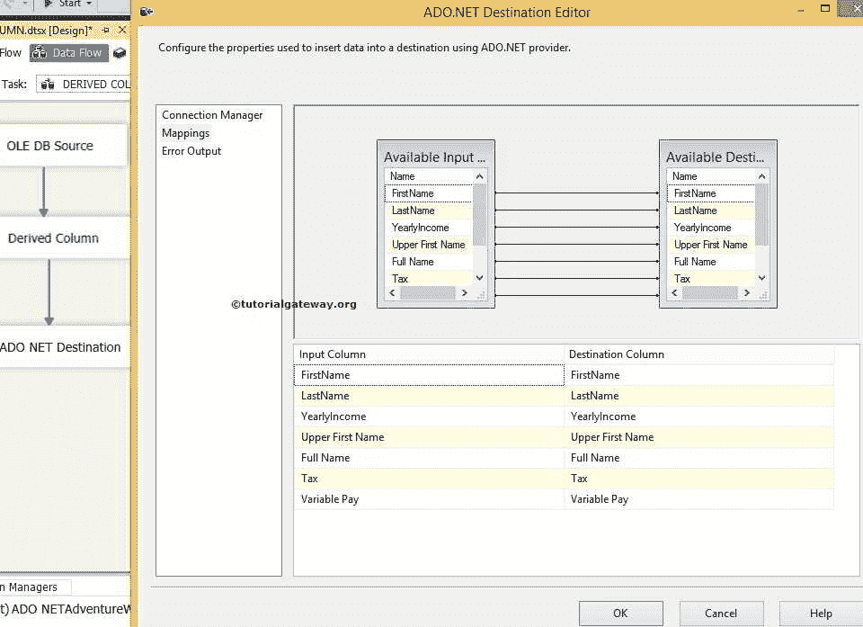
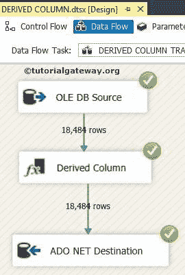
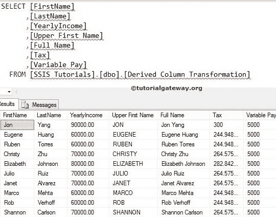

# SSIS 的派生列转换

> 原文：<https://www.tutorialgateway.org/derived-column-transformation-in-ssis/>

SSIS 的派生列转换在处理 SQL Server 集成服务中的表达式时起着至关重要的作用。SSIS 表达式语言具有强大的内置函数，用于字符串操作、数据类型转换、数学函数、条件表达式和处理空值。

使用 SSIS 导出的列转换，我们可以使用这些内置函数、列、运算符和变量创建所需的表达式。SSIS 派生列转换还提供了一个选项，用于选择是创建新列还是用从表达式计算的值替换现有列。

## SSIS 示例中的派生列转换

从工具箱中拖放数据流任务以控制流，并将其重命名为“派生列转换”。



双击它，将打开 [SSIS](https://www.tutorialgateway.org/ssis/) 数据流选项卡。

将 SSIS 工具箱中的 OLE DB 源、ADO.NET 目标和派生列转换拖放到数据流区域



双击数据流区域中的 OLE DB 源将打开连接管理器设置，并为编写我们的 SQL 语句提供空间。



[SQL](https://www.tutorialgateway.org/sql/) 命令我们在上面截图中使用的是:

```
USE [AdventureWorksDW2014]
GO
SELECT FirstName,
       LastName,
       YearlyIncome
FROM DimCustomer

```

单击列选项卡验证列。在此选项卡中，我们还可以取消选中不需要的列。



提示:如果我们不想要任何列，那么没有必要将它添加到您的 SQL 命令中。

单击“确定”并将蓝色箭头从 OLE DB 源拖到 SSIS 的“派生列转换”中。它允许转换使用源数据。

### SSIS 导出列转换表达式

双击或右键点击 ssis 导出列转换编辑



1.  派生列名:提供任何唯一的名称。与 T-SQL 中的别名列相同
2.  派生列:这个 SSIS 派生列提供了两个选项。您是希望将此列添加为新列，还是希望用此列替换任何现有列
3.  表达式:在这里，我们将通过组合内置的 SSIS 函数、变量和列来编写一个自定义表达式。
4.  精度:当我们添加任何新列时，SSIS 的派生列转换会根据数据类型自动设置数值数据的精度。该值是只读的。
5.  比例:当我们添加任何新列时，派生列转换会根据数据类型自动设置数值数据的比例。该值是只读的。
6.  代码页:当我们添加任何新列时，派生列转换会自动为 DT_STR 数据类型设置代码页。
7.  配置错误输出:指定如何处理错误。



1.  大写名字:大写(名字)–它会将[名字]列中的数据转换为大写。
2.  全名:名字+ " " +姓氏–它将结合[名字]和[姓氏]列来显示全名
3.  税:SQRT([yearyancome])–它将计算[yearyancome]列的平方根，并将其分配给税列
4.  可变薪酬:5000–我们将常量值 5000 分配给新列可变薪酬
5.  yearyyncome:REPLACENULL([yearyyncome]，0)–我们使用 SSIS 的 replace NULL 内置函数将 Null 值替换为零

单击“确定”完成在 SSIS 配置派生列转换。接下来，将蓝色箭头拖放到 ADO.NET 目标

现在，我们必须提供目标的服务器、数据库和表的详细信息。因此双击 ADO.NET 目标并提供所需信息



单击“映射”选项卡，检查源列是否完全映射到目标列。



单击“确定”完成 SSIS 派生列转换包设计。让我们运行包



让我们打开 [SQL Server](https://www.tutorialgateway.org/sql/) 管理工作室，查看导出列转换



的结果