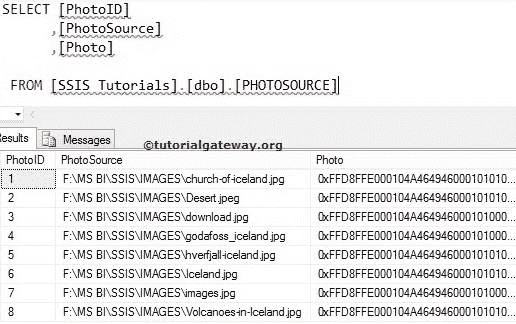
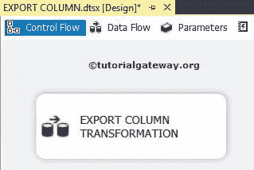
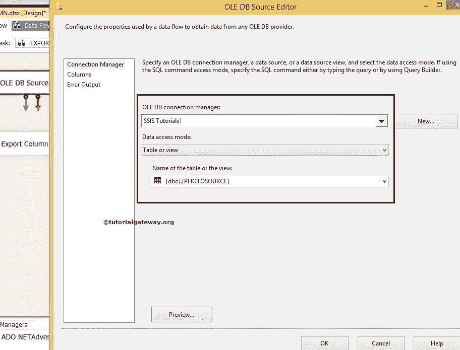
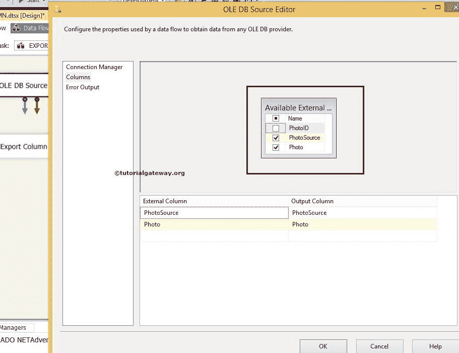
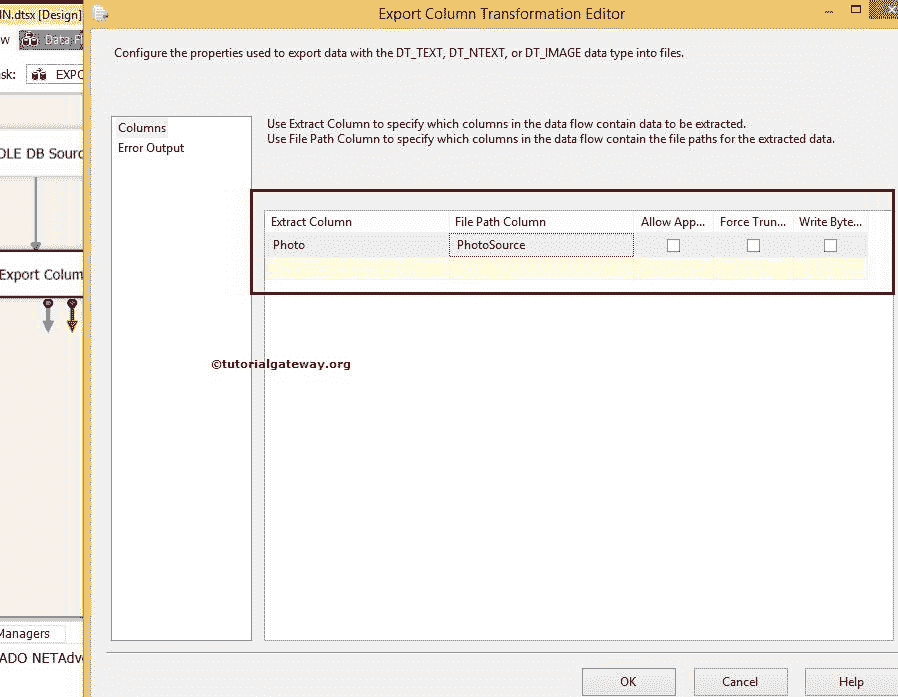
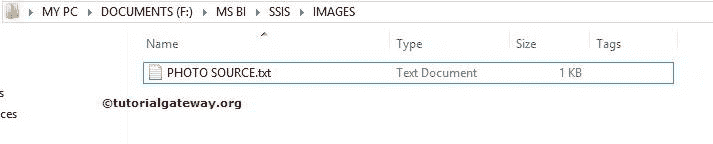
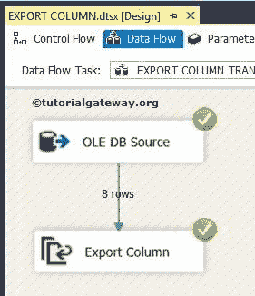
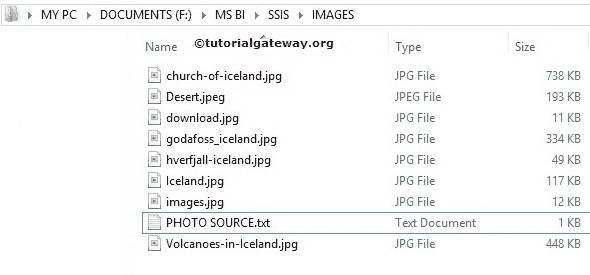

# SSIS 的导出列转换

> 原文：<https://www.tutorialgateway.org/export-column-transformation-in-ssis/>

SSIS 的导出列转换对于将图像、二进制文件、媒体或任何大型文档从 SQL Server 导出到文件系统非常有用。SSIS 导出列转换读取源列中的路径或位置，并将数据传输到该特定路径。

例如，如果我们将产品描述存储在文本文件中，并且文本文件存储在一列中。我们的情况是只向任何特定的商店发送产品描述。然后，我们可以使用 SSIS 导出列转换将这些文本文件传输并保存到我们指定的路径。

SSIS 的导出列转换与导入列转换正好相反。请参考 SSIS 文章中的[导入列转换，了解如何将图像、文本文件或任何大型文件导入到 SQL Server 数据库。](https://www.tutorialgateway.org/import-column-transformation-in-ssis/)

## SSIS 导出列转换示例

在这个 [SSIS](https://www.tutorialgateway.org/ssis/) 的例子中，我们将把图像从 [SQL Server](https://www.tutorialgateway.org/sql/) 表导出到本地硬盘。下面的 SQL 表是我们将在本例中使用的表。

```
SELECT [PhotoID]
      ,[PhotoSource]
      ,[Photo]
FROM [SSIS Tutorials].[dbo].[PHOTOSOURCE]
```



SSIS 的导出列转换将存储照片列中的图像，并将它们存储在[图片来源]列中指定的位置或路径中。

步骤 1:从工具箱中拖放数据流任务以控制流，并将数据流任务命名为导出列转换。



双击数据流任务将打开数据流选项卡。

步骤 2:将 OLE DB 源、导出列转换从工具箱拖放到数据流区域。

双击数据流区域中的 OLE 数据库源将打开连接管理器设置。这里我们选择[SSIS 教程]数据库和图片源表作为 OLE 数据库源。



第 3 步:单击列选项卡验证列。在此选项卡中，我们还可以取消选中不需要的列。

这里我们取消选中 PhotoID 键列。因为此时



将身份列保存为输出没有意义

单击“确定”，将蓝色箭头从 OLE 数据库源拖放到“导出列转换”以对源数据执行转换。

步骤 4:双击 SSIS 导出列转换进行编辑和配置。它会打开窗口，如下图所示。



这里我们可以选择路径所在的列。您也可以在 SSIS 导出列转换的右侧找到复选框。

1.  提取列:从可用输入列列表中选择文本或图像数据列。在本例中，我们选择了照片，因为我们正在将图像从 SQL 导出到本地硬盘。
2.  文件路径列:从可用输入列列表中选择文件路径或文件名。这是保存文件或图像的路径(此处为图像)。
3.  允许附加:指定是否希望导出列转换将数据添加到现有文件中。默认值为 false，如果需要，您可以更改它。
4.  强制截断:指定是否希望导出列转换在写入新数据之前删除任何现有文件。默认值为 false，如果需要，您可以通过选中该选项进行更改。
5.  写入物料清单:指定是否希望导出列转换将字节顺序标记写入文件。仅当数据类型为“NTEXT”或“WSTR”时，才打印物料清单。

在运行 SSIS 出口列转换包



之前，让我们先看看我们的目的地路径

让我们在 SSIS 包



中运行导出列转换

让我们看看目标文件夹，不管我们是否成功。



我们做到了。