# SSIS 的模糊分组变换

> 原文：<https://www.tutorialgateway.org/fuzzy-grouping-transformation-in-ssis/>

SSIS 的模糊分组变换被用来用正确的词代替错误键入的词。例如，如果 98 人将国家名称键入为印度，两人键入为印度，则 SSIS 模糊分组转换会将印度替换为印度。

在我们开始配置 SSIS 模糊分组转换之前，让我们看看它的一些重要属性:

*   这个 SSIS 模糊分组转换使用分组技术将源数据中的错误单词替换为正确的单词。
*   这个转换允许我们只使用 DT_WSTR 和 DT_STR 数据类型列进行模糊匹配，精确匹配可以应用于除 DT_TEXT、DT_NTEXT 和 DT_IMAGE 之外的任何数据类型。
*   它在运行时在 SQL Server 数据库中创建临时表和索引。
*   这个转换将只使用 [OLE DB 连接管理器](https://www.tutorialgateway.org/ole-db-connection-manager-in-ssis/)建立一个连接来存储临时表和索引。
*   要配置转换，必须为输入列选择匹配类型(模糊或精确)

提示:SSIS 的模糊分组变换有一个输入和一个输出。它不支持错误输出。

这个 SSIS 变换与[模糊查找变换](https://www.tutorialgateway.org/fuzzy-lookup-transformation-in-ssis/)相同。然而，SSIS 模糊分组变换不需要任何参考表来校正数据。它将使用分组技术来检查错误键入的单词(键入错误)并纠正它们。

## 模糊分组变换在 SSIS 的应用

在本例中，我们将向您展示如何在 SSIS 配置模糊分组转换来纠正错误键入的单词(错别字)

我们将用于 SSIS 模糊分组转换的数据是:

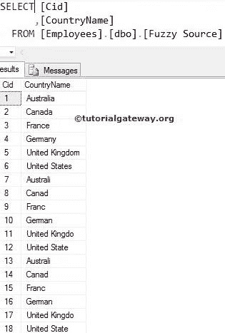

步骤 1:打开 BIDS，从工具箱中拖放数据流任务来控制流，并在 SSIS 将其重命名为模糊分组转换。

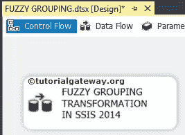

双击 [SSIS](https://www.tutorialgateway.org/ssis/) 将打开数据流选项卡。

第二步:将 OLE DB 源、模糊分组从 SSIS 工具箱拖放到数据流区域

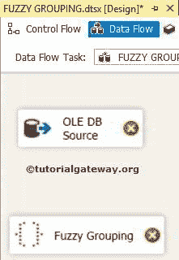

步骤 3:双击数据流区域中的 OLE DB 源将打开连接管理器设置，并提供一个选项来选择 SQL Table 或空间来编写我们的 SQL 语句。

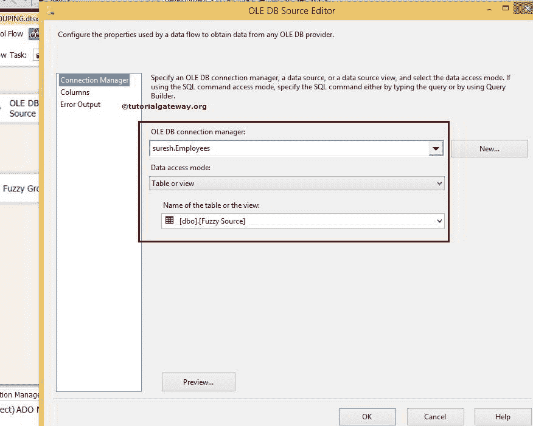

这里我们选择了雇员数据库作为我们的源数据库和[模糊源]作为 SQL 表。

第 4 步:单击列选项卡验证列。在此选项卡中，我们可以取消选中不需要的列。

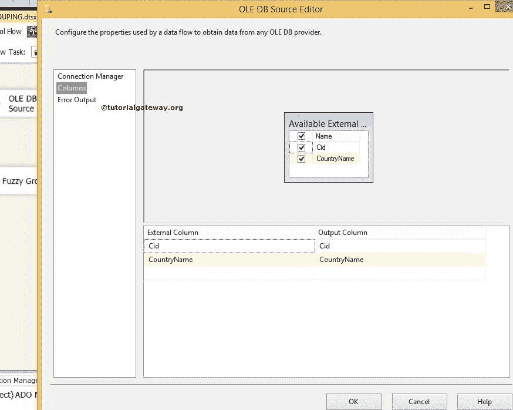

步骤 5:右键单击 SSIS 模糊分组转换将打开模糊分组转换编辑器窗口进行配置。

在连接管理器选项卡中，我们必须配置 OLE DB 连接管理器设置。在这个源中，SSIS 模糊分组转换将创建一个临时表和索引来执行模糊分组操作。

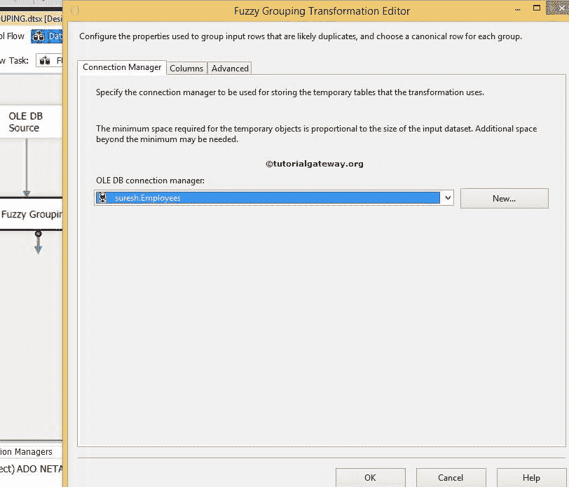

步骤 6:在列选项卡中，我们必须配置匹配类型。您需要选择要分组为模糊匹配类型的列，以及要分组为精确匹配的其他列。对于这个 SSIS 模糊分组转换的例子，国家名称是一个字符串，我们希望在这个列中找到错误的值。因此，将匹配类型更改为 Fuzzy，Cid 是 Int 值，因此匹配类型为 Exact。

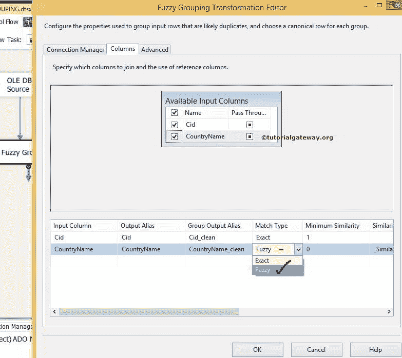

配置模糊分组转换时，两个参数很重要。它们是数字和比较标志。

#### 比较标志

从下面的截图，你可以看到这个可用的选项。

*   忽略案例:如果我们选中此选项，模糊分组将忽略案例。xyz 和 XYZ 都是一样的。
*   忽略假名类型:SSIS 模糊分组的这个选项忽略了日语平假名和片假名之间的区别。
*   忽略非间隔字符:如果我们选中这个选项，那么模糊分组将忽略音调符号和字符之间的区别
*   忽略字符宽度:如果选中此选项，SSIS 模糊分组将忽略单字节字符和双字节字符之间的差异。
*   忽略符号:SSIS 模糊分组将忽略字母和符号(空格、标点符号、货币符号和数学符号)之间的区别。例如，*xy 的处理方式与 xy 相同
*   将标点符号作为符号排序:模糊分组将所有标点符号(除了撇号和连字符)写在字母之前。例如，。xyz 将在 xyz 之前排序

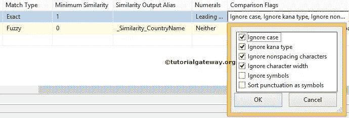

#### 数码

在这个选项中，我们必须在比较列数据时指定开始和结束数字的重要性。例如，如果前导数字有意义，“93 新地街”将不会与“99 新地街”分组

| 价值 | 描述 |
| 也不 | 分组时忽略开始和结束位置的数字。 |
| 主要的 | 分组时，起始位置的数字将被忽略。 |
| 蔓延的 | 分组时忽略结束位置的数字。 |
| 前导和尾随 | 分组时，起始和结束位置的数字不会被忽略。 |

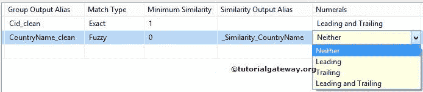

步骤 7:在高级选项卡中，我们必须配置相似性阈值。相似性阈值介于 0 和 1 之间，其中 1 是精确匹配。SSIS 模糊分组变换编辑器提供了一个滑块来调整 0 和 1 之间的相似度。如果相似性阈值接近 1，则源列应该更准确地匹配参考数据。

在这个例子中，我们对国家名称进行模糊分组，并找到模糊匹配。如果我们将相似性阈值设置为 0.76，那么字符串列值应该匹配超过 76%，那么只有它将被视为有效记录。

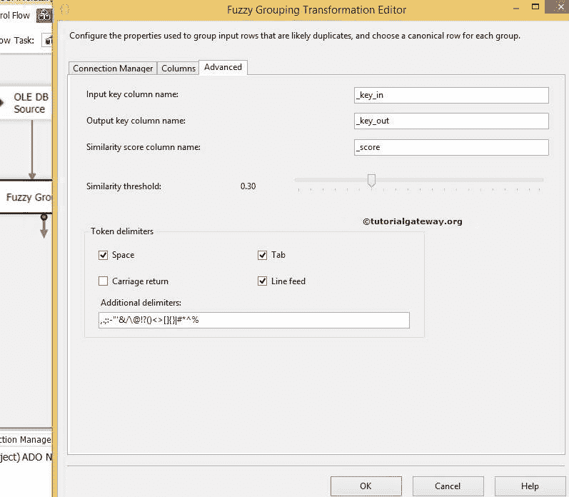

SSIS 模糊分组转换会在现有列的基础上产生额外的列，它们是:

*   输入键列名:为输入键列提供唯一的名称。key _ inis 是默认名称。
*   输出键列名:为输出键列提供唯一的名称。key_Outis 是默认名称。
*   相似性得分列名称:为相似性得分列提供唯一的名称。_score 是介于 0 和 1 之间的值。它将指示输入行与规范行的相似性。

目前，我们将它们保留为默认值，然后单击“确定”完成 SSIS 模糊分组转换的配置。现在将 OLE 数据库目标拖放到数据流区域。

步骤 8:现在，我们必须提供目的地的服务器、数据库和表细节。因此双击 OLE DB 目的地并提供所需信息

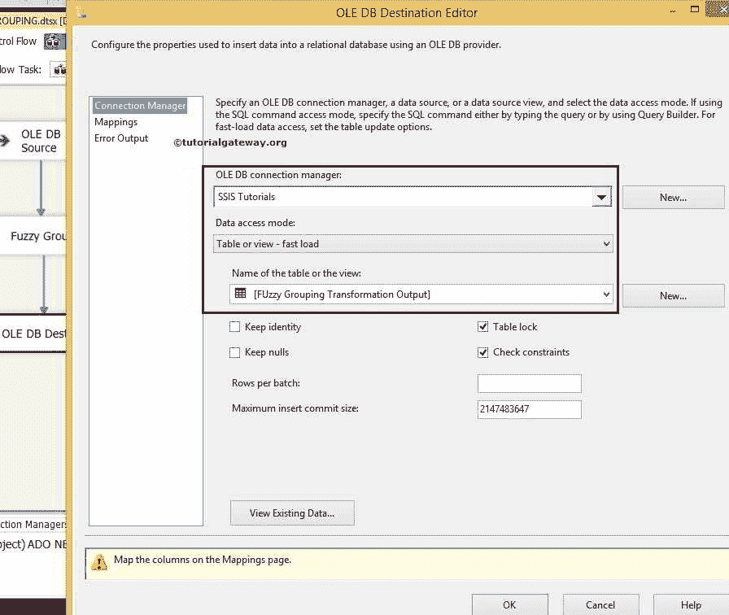

这里我们选择了 [SQL Server](https://www.tutorialgateway.org/sql/) 中的【SSIS 教程】数据库作为我们的目标数据库，选择了【模糊分组转换输出】表作为我们的目标表。

步骤 9:单击“映射”选项卡，检查源列是否完全映射到目标列。

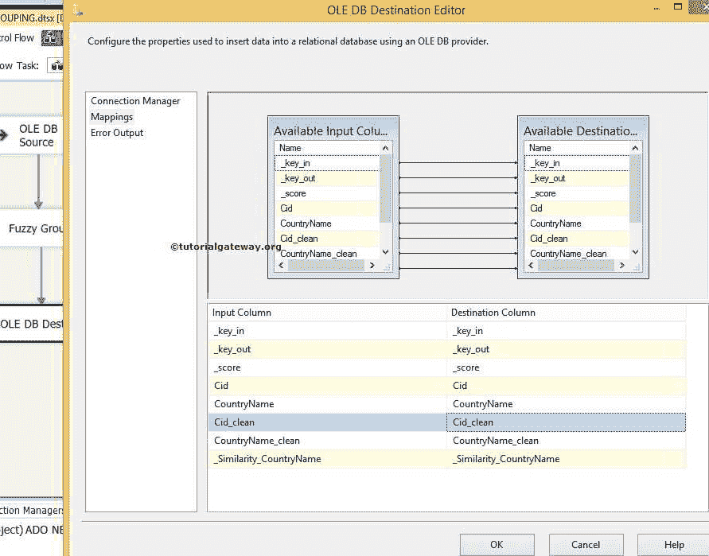

步骤 10:单击“确定”完成 SSIS 模糊分组转换包的设计。让我们运行包

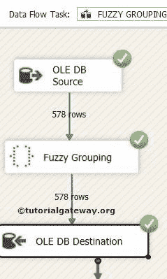