# SSIS 的模糊查找转换

> 原文：<https://www.tutorialgateway.org/fuzzy-lookup-transformation-in-ssis/>

SSIS 的模糊查找转换被用来用正确的单词替换错误键入的单词。与查找转换不同，SSIS 的模糊查找转换使用模糊匹配在引用表中查找一个或多个接近的匹配，并用引用数据替换源数据。

SSIS 的模糊查找转换是一种重要的实时转换。例如，在输入产品信息时，有时我们可能会输入有拼写错误的数据。在进行查找转换时，由于这些错误键入的单词，我们无法将源数据与查找表进行匹配。在这些情况下，SSIS 模糊查找转换将寻找最接近的匹配的正确单词，并用正确的单词替换错误的值。在使用 SSIS 模糊查找之前，请记住以下几点

*   SSIS 模糊查找转换仅使用 OLE DB 连接管理器来建立与引用表的连接
*   此转换使用引用表将源数据中的错误单词与引用表中的正确单词进行比较。
*   SSIS 模糊查找允许我们仅使用 DT_WSTR 和 DT_STR 数据类型列进行模糊匹配。
*   此转换在运行时在 SQL Server 数据库中创建临时表和索引。

提示:请参考[模糊分组转换](https://www.tutorialgateway.org/fuzzy-grouping-transformation-in-ssis/)了解 SQL Server 集成服务中的模糊分组技术

## SSIS 例子中的模糊查找转换

在本例中，我们将展示这个 SSIS 模糊查找转换如何在源数据上工作。下面截图是我们的源数据


模糊变换查找参考表是

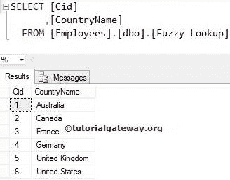

步骤 1:打开 BIDS，从工具箱中拖放数据流任务来控制流。接下来，在 SSIS 将其重命名为模糊查找转换。

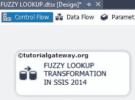

双击它，它将打开数据流选项卡。

步骤 2:将 OLE DB 源从工具箱拖放到数据流区域。双击数据流区域中的 OLE DB 源将打开连接管理器设置，并提供选择 [SQL](https://www.tutorialgateway.org/sql/) 表或 SQL 语句的选项。

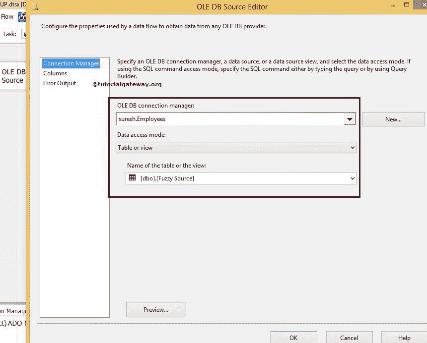

这里我们选择了雇员数据库和之前显示的模糊源表作为我们的 OLE DB 源数据库和表。

第 3 步:单击列选项卡验证列。在此选项卡中，我们还可以取消选中不需要的列。

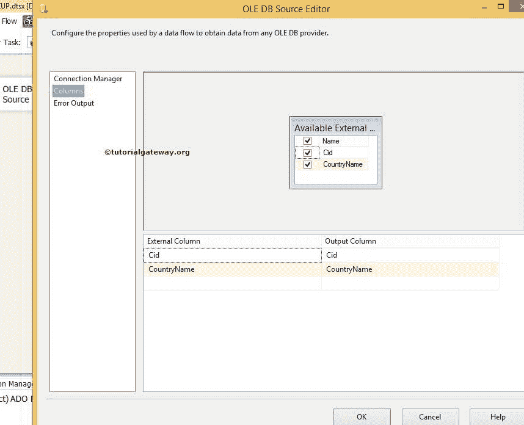

将[【SSIS】](https://www.tutorialgateway.org/ssis/)工具箱中的模糊[查找转换](https://www.tutorialgateway.org/lookup-transformation-in-ssis/)拖放到数据流区域，并将 OLE DB 源输出箭头连接到该区域。

第四步:双击 SSIS 模糊查找转换将打开模糊查找转换编辑器。在引用表选项卡中，我们必须配置连接管理器，并选择模糊查找表。为此，此选项卡有多个选项。

*   OLE DB 连接管理器:SSIS 模糊查找转换只支持 OLE DB 连接管理器与引用表建立连接。因此，使用 [OLE 数据库连接管理器创建一个连接。](https://www.tutorialgateway.org/ole-db-connection-manager-in-ssis/)
*   生成新索引:SSIS 模糊查找转换将在引用的表上生成一个新索引，用于模糊查找。
*   引用表名称:从下拉列表中选择 OLE DB 连接中的引用表
*   存储新索引:如果要将新索引保存在模糊查找表中，请选择此选项。
*   新索引名称:如果您选择了“存储新索引”选项，请在此处写入索引名称。
*   维护存储的索引:如果希望 SQL Server 使用“存储新索引”选项来维护新创建的索引，请选中此选项。
*   使用现有索引:如果要使用模糊查找表中现有的(已创建的)索引，请选择此选项
*   现有索引的名称:请从下拉列表中选择现有索引

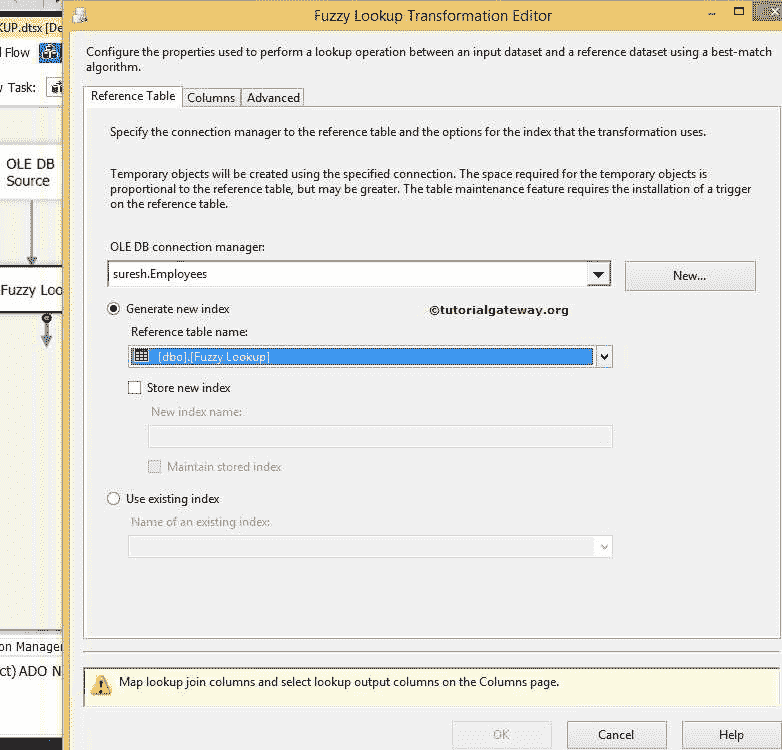

从上面的截图中，您可以看到我们将 OLE DB 连接管理器配置到了 Employees 数据库，然后选择了 SSIS 模糊查找表作为参考表。

第 5 步:如果您希望将源列(国家/地区名称)传递到引用表的列名(在本例中也是国家/地区名称)，请选中这些列。如果你想更改输出列，那么更改别名就像我们在下面截图

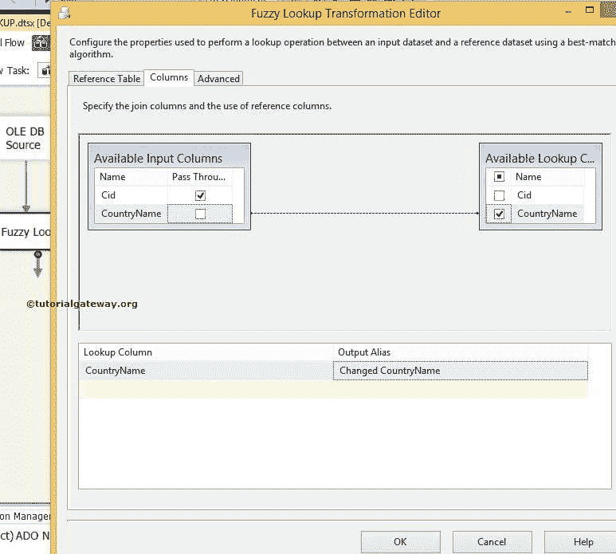

中转的一样

如果您在目标文件夹中要求更改和未更改的国家/地区名称列，请选中传递选项国家/地区名称列

步骤 6:在高级选项卡中，我们可以通过将条形指针拖动到所需的限制来配置相似性阈值。“高级”选项卡中的可用选项如下:

*   每次查找输出的最大匹配数:请指定 SSIS 模糊查找转换可能返回的最大匹配数。默认值为 1。
*   相似性阈值:相似性阈值介于 0 和 1 之间，其中 1 是精确匹配。SSIS 模糊查找转换编辑器提供了一个滑块来调整 0 和 1 之间的相似度。如果相似性阈值接近 1，则源列应该更准确地匹配参考数据。

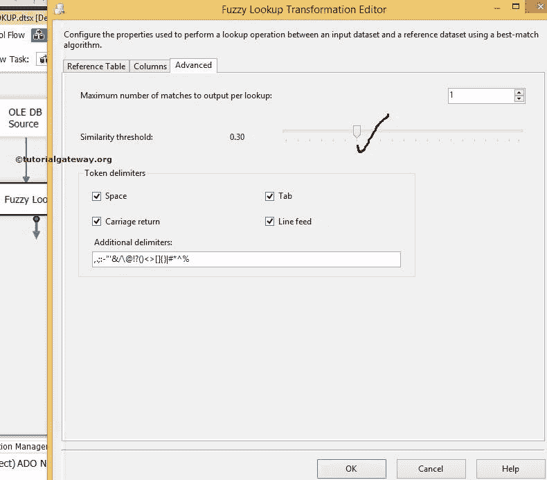

单击“确定”完成在 SSIS 配置模糊查找转换。现在将 OLE 数据库目标拖放到数据流区域。

SSIS 模糊查找转换编辑器在现有列的基础上生成了两个额外的列

*   _ 相似度:相似度得分在 0 到 1 之间。它将显示源数据与模糊查找数据的匹配程度。例如，0.80 表示源数据 80%与目标匹配。
*   _ 置信度:置信度得分显示模糊查找表中关于最佳匹配的模糊查找转换的置信度。例如，0.50 表示模糊查找转换 50%确定澳大利亚是澳大利亚的最佳匹配。

步骤 7:现在，我们必须提供目的地的服务器、数据库和表细节。因此双击 OLE DB 目的地并提供所需信息

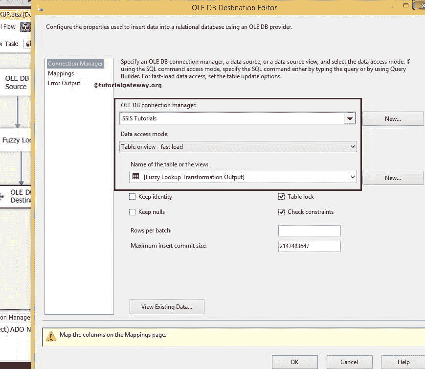

这里我们选择了[SSIS 教程]数据库作为我们的目标数据库，并选择了目标表。

步骤 8:单击“映射”选项卡，检查 SSIS 模糊查找源列是否完全映射到目标列。

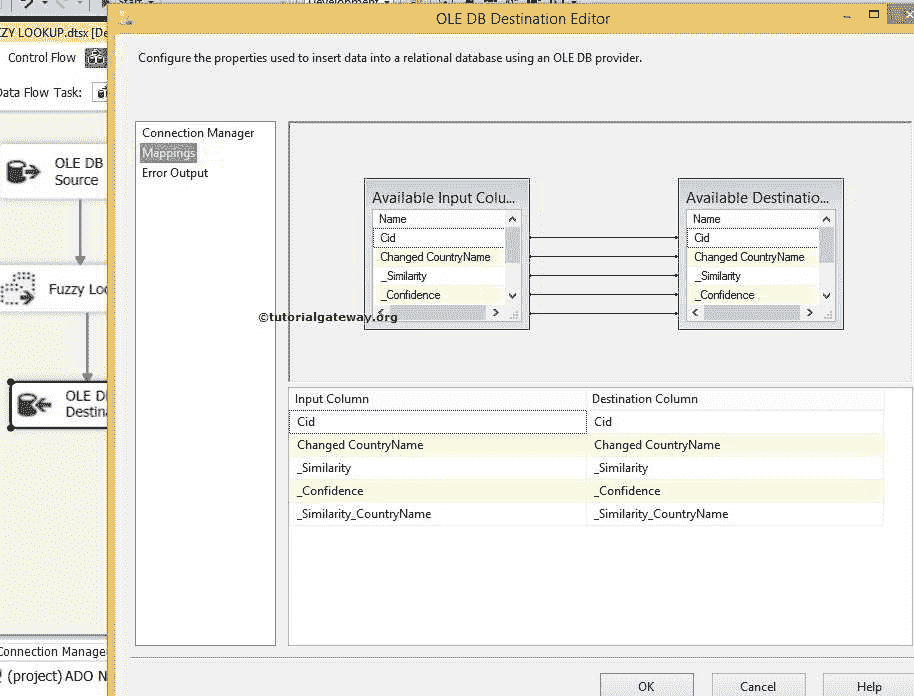

单击“确定”完成 SSIS 包中模糊查找转换的设计。让我们运行包

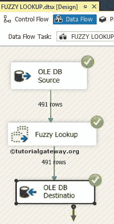

让我们打开 [SQL Server](https://www.tutorialgateway.org/sql/) 管理工作室，选择所需的表来检查 SSIS 模糊查找转换结果

```
SELECT [Cid]
     ,[Changed CountryName]
     ,[_Similarity]
     ,[_Confidence]
     ,[_Similarity_CountryName]
FROM [SSIS Tutorials].[dbo].[Fuzzy Lookup Transformation Output]
```

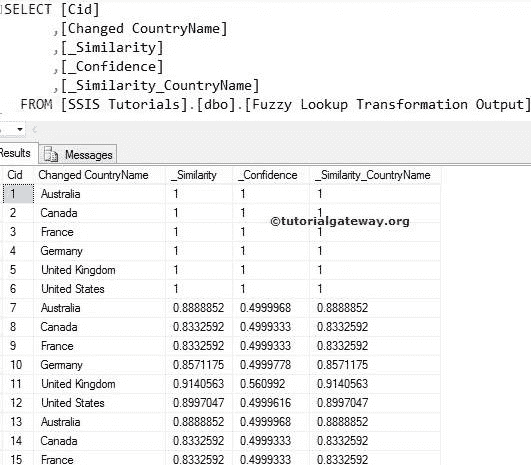