# SSIS 的导入列转换

> 原文：<https://www.tutorialgateway.org/import-column-transformation-in-ssis/>

SSIS 的导入列转换用于将数据从文本文件导入数据流。并做一些操作，然后将数据转发到目的地。这里，数据包括二进制文件、图像、媒体或任何传输量大的文档。SSIS 导入列转换输出列的数据类型必须是 DT_TEXT、DT_NTEXT 或 DT_IMAGE。

例如，我们将产品详细信息填入表。我们在制造部门有产品图片，每个商店都将产品评论放在一个文本文件中。在这种情况下，我们使用 SSIS 导入列转换将图片、评论带入数据流。接下来，将它们与产品详细信息合并，并存储在数据仓库中。为了更好地理解，让我们看一个简单的例子

## SSIS 示例中的导入列转换

在这个 [SSIS](https://www.tutorialgateway.org/ssis/) 的例子中，我们将使用 SSIS 导入列转换将本地硬盘中的一些图像传输到 [SQL Server](https://www.tutorialgateway.org/sql/) 数据库列。

提示:请参考[SSIS 出口栏目转型](https://www.tutorialgateway.org/export-column-transformation-in-ssis/)文章了解。它展示了如何将图像、二进制文件、媒体从 SQL Server 导出到文件系统。

为了将图像导入数据库，我们需要一个保存图像文件和文件路径的表。让我们创建一个名为 PHOTOSOURCE 的表。

```
USE [SSIS Tutorials]
GO

CREATE TABLE PHOTOSOURCE
(
  PhotoID INT NOT NULL IDENTITY (1, 1),
  PhotoSource NVARCHAR (200),
  Photo IMAGE
)
GO

```

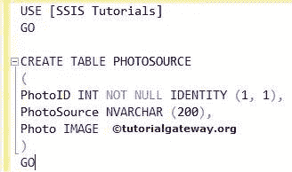

这里我们有一些称为照片源的 JPEG 图像和文件，它有所有的图像路径。

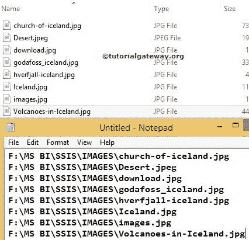

### 在 SSIS 配置导入列转换

步骤 1:让我们启动 BIDS，将数据流任务从工具箱拖放到控制流中。接下来，将其重命名为“导入列转换”。

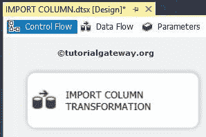

双击它，它将打开数据流选项卡。

步骤 2:将平面文件源从工具箱拖放到数据流区域。双击数据流区域中的平面文件源将打开平面文件源编辑器来选择文本文件数据。

由于我们之前没有创建任何平面文件连接管理器，点击新建按钮创建一个

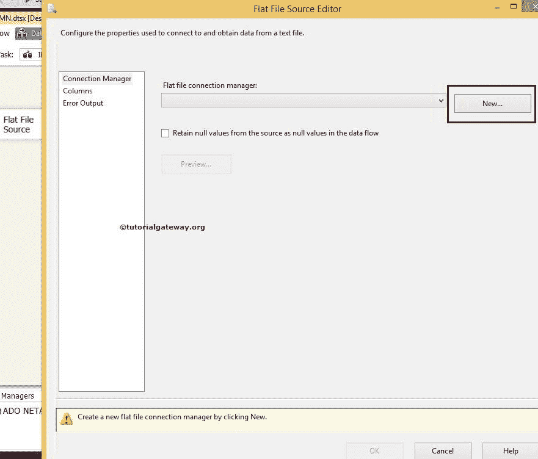

单击新建按钮后，将打开平面文件连接管理器编辑器窗口来配置连接管理器。

单击浏览按钮选择本地硬盘中的文本文件。

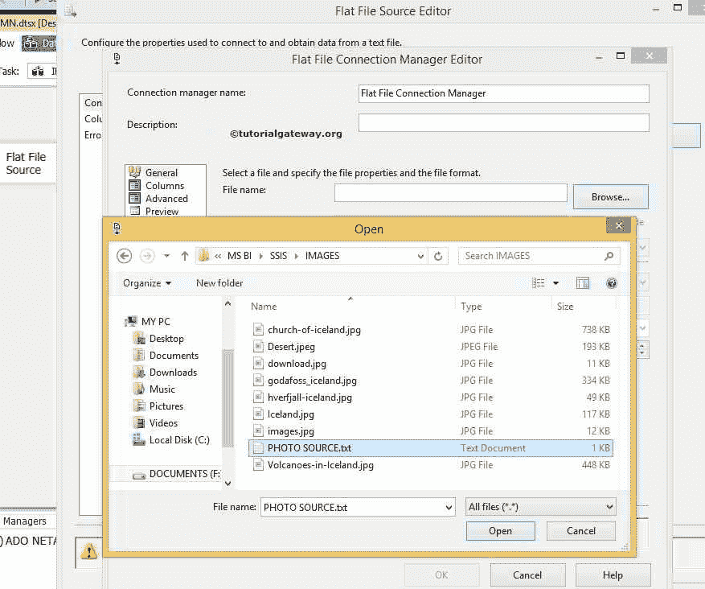

从上面的截图可以观察到，我们选择的是位于我们本地硬盘

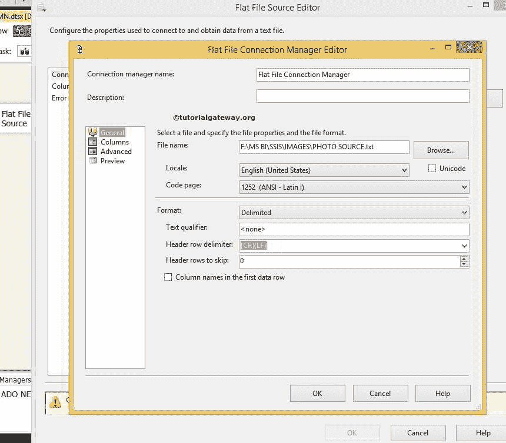

的 PHOTO SOURCE.txt 文件

从上面的截图中，您可以看到我们取消了“第一个数据行中的列名”选项，因为我们在第一行中没有任何列名

第 3 步:单击列选项卡验证列。这里我们只有一列，如下图所示

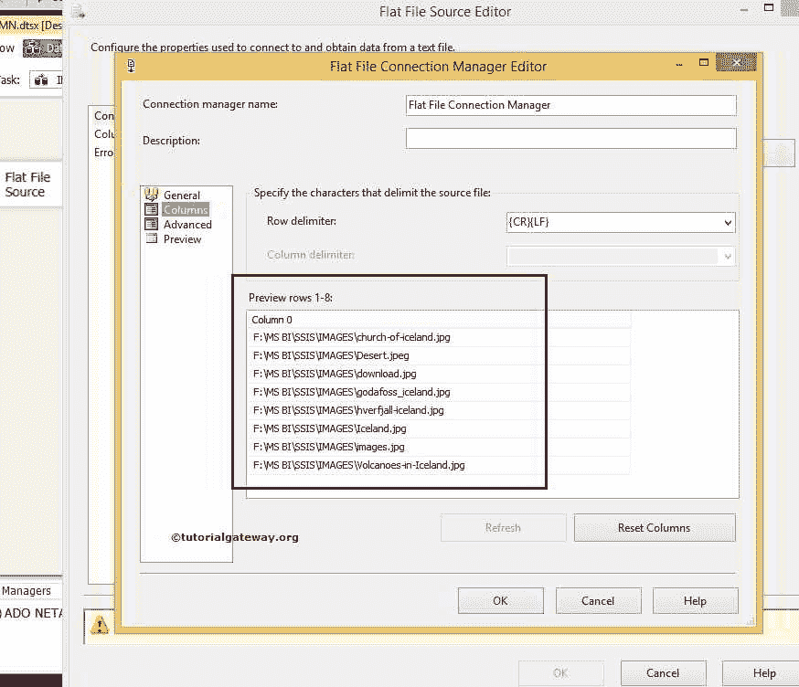

单击确定，然后将 SSIS 工具箱中的导入列转换拖放到数据流区域。

步骤 4:现在将蓝色箭头从平面文件源拖动到导入列转换，对源数据执行转换。双击 SSIS 导入列转换进行配置

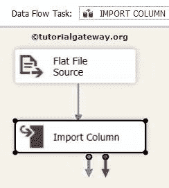

第五步:在第一页，表示组件属性选项卡；你什么都不需要做。如果你愿意，你可以改名字。选择“输入列”选项卡，您将在其中看到可用的源列检查文件路径列。

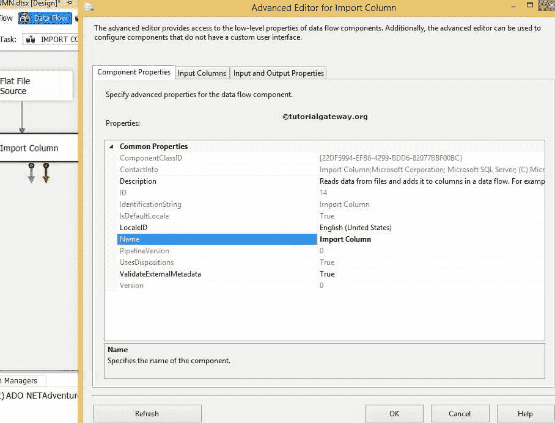

步骤 6:现在选择 SSIS 导入列转换输入列选项卡。导入列输入已经设置为选定的源列输入。

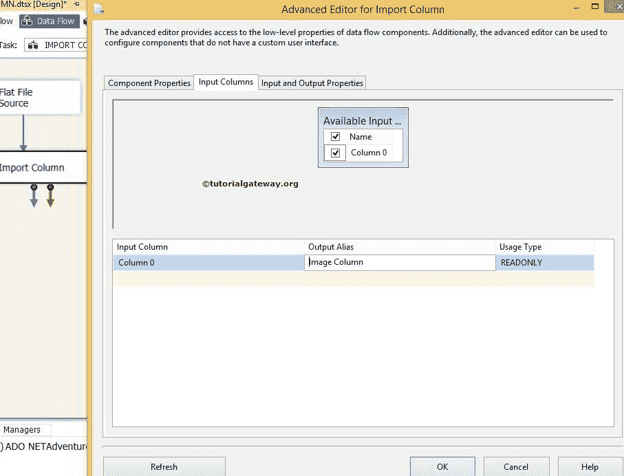

从上面的截图中，您可以看到我们将列 0 的名称重命名为图像列

步骤 7:现在选择 SSIS 导入列转换的输入和输出属性选项卡。

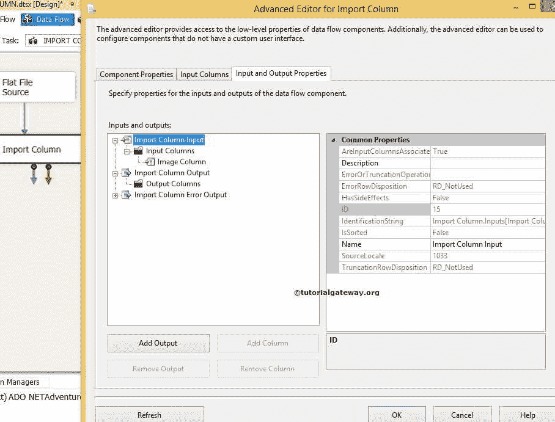

从上面的截图中，您可以观察到在导入列输入中，我们有输入列(图像列)，但没有任何输出列。因此，选择导入列输出，并通过单击添加列来添加一个输出列。

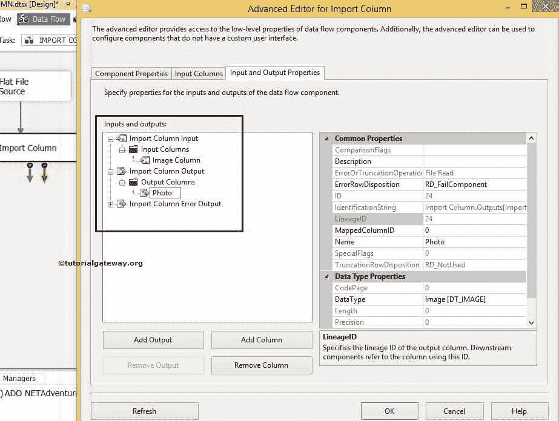

从上面的 SSIS 导入列转换截图可以看到，我们创建了一个名为 Photo 的输出列，数据类型为 DT_IMAGE。

选择新创建的输出列名照片的线性标识(即 24)。对你来说可能是不同的价值别担心

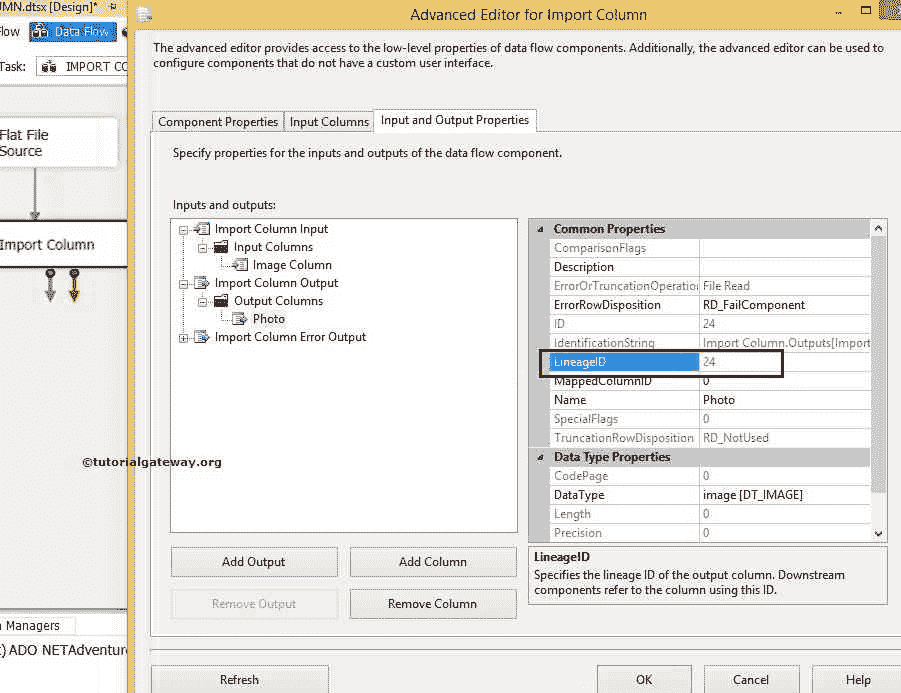T2】

第八步:我们必须为 SSIS 进口栏目转型迈出关键的一步。我们必须复制上面截图中突出显示的 LineageID 24。将该标识值粘贴到图像列中的文件数据列属性中(导入列输入)。现在按 ok。

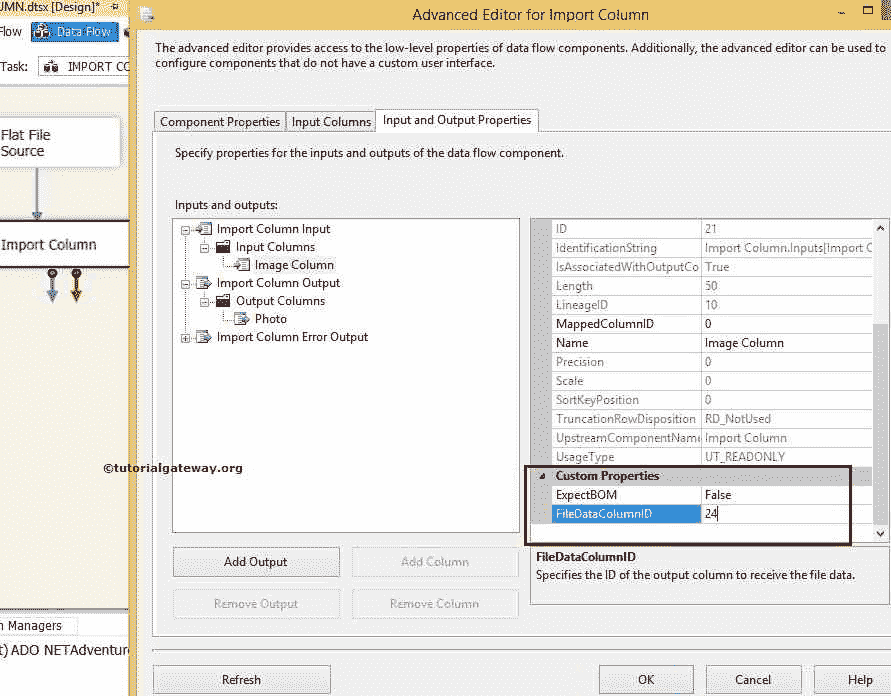

预期物料清单(字节顺序标记):仅当数据具有 DT_NTEXT 时才需要物料清单。

现在，让我们配置 OLE DB 目标，并设置到数据库的连接，在该数据库中，您创建了一个名为 PHOTO SOURCE 的表。

步骤 9:将 OLE DB 目标从工具箱拖放到数据流区域。接下来，将蓝色箭头从“导入列转换”拖到“OLE DB 目标”。

现在，我们必须提供目标的服务器、数据库和表的详细信息。因此双击 OLE DB 目的地并提供所需信息

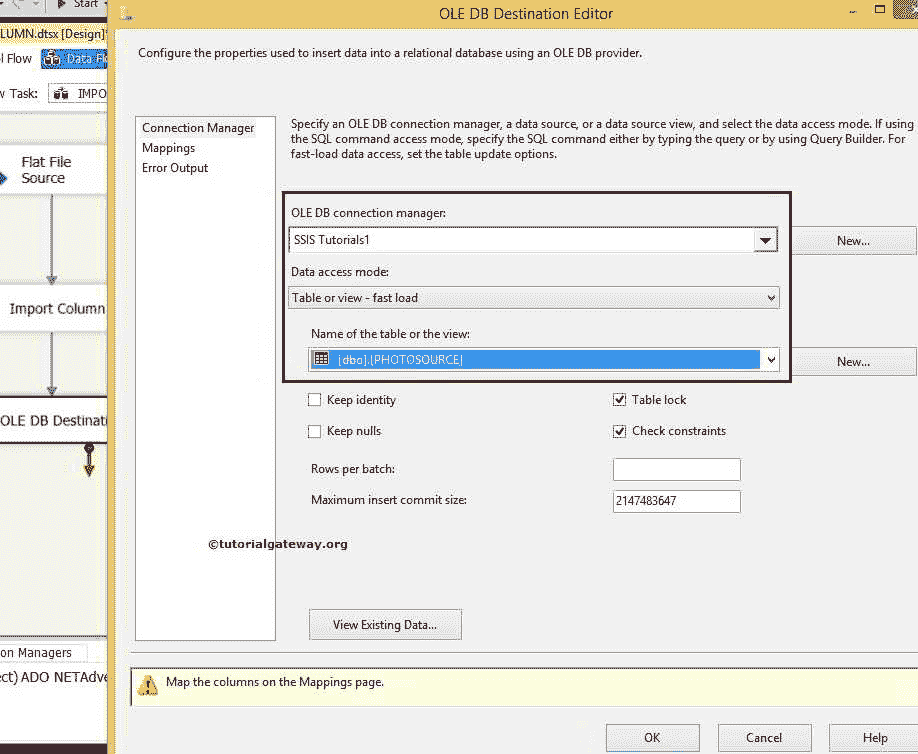

从上面的截图中，您可以看到我们选择了之前创建的表，即[SSIS 教程]数据库中的 PHOTOSOURCE 表

步骤 10:单击映射选项卡，将输入列映射到目标列。

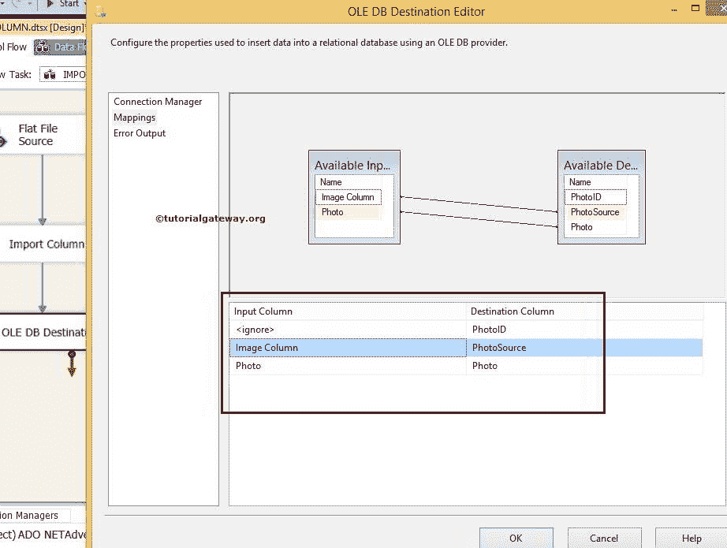

*   PhotoID 是身份列。所以会自动插入。
*   图像列包含图像的路径。所以我们把这个路径的详细信息存储在照片源栏中
*   照片是位于本地硬盘中的图像。因此，我们将其映射到照片列(图像数据类型)

现在让我们执行 SSIS 导入列转换任务。

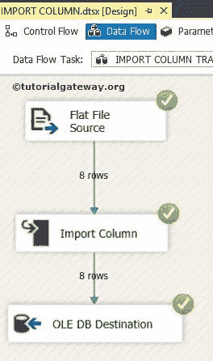

在 SSIS 导入列转换任务已成功执行。

让我们打开 [SQL Server](https://www.tutorialgateway.org/sql/) 管理工作室。接下来，编写下面的 T-SQL 语句来检查结果。

```
SELECT [PhotoID]
      ,[PhotoSource]
      ,[Photo]
 FROM [SSIS Tutorials].[dbo].[PHOTOSOURCE]
```

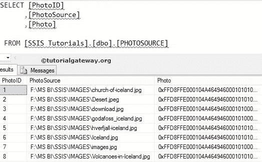